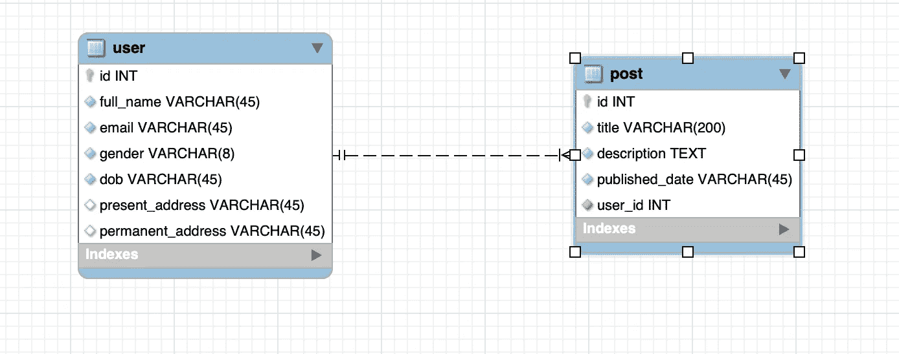
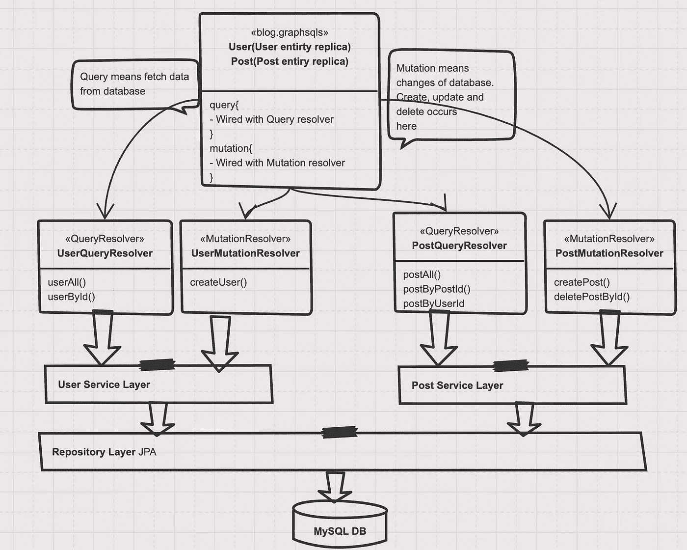
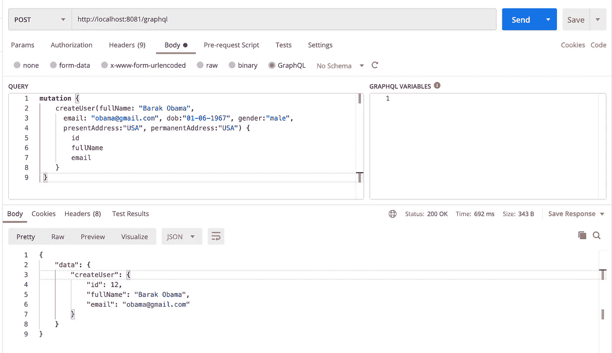
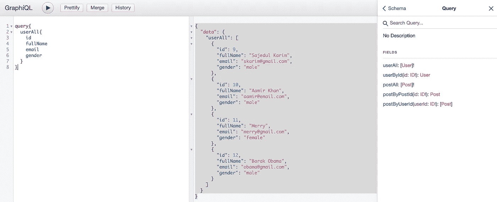

# Java、MySQL 和 JPA 实现的 GraphQL 高级指南

> 原文：<https://betterprogramming.pub/an-advanced-guide-to-graphql-with-java-mysql-and-jpa-implementation-83f791a1f676>

## GraphQL 是脸书在 2012 年开发的，目的是克服 REST APIs 的缺点


迪伦·麦克劳德在 [Unsplash](https://unsplash.com?utm_source=medium&utm_medium=referral) 上的照片

GraphQL 是一种从服务器检索数据的查询语言。在某种程度上，它是 REST、SOAP 或 gRPC 的替代品。

GraphQL 是一种新的 API 标准，为构建数据驱动的应用程序提供了一种革命性的方法。该项目最初是由脸书创建的，当时他们正在将其移动应用从 HTML5 转移到原生移动应用。

GraphQL 遵循与 REST APIs 相同的约束集，但是它使用一个接口将数据组织成一个图。对象由节点表示(使用 GraphQL 模式定义)，节点之间的关系由图中的边表示。每个对象都由一个访问服务器数据的解析器支持。

在本文中，我们将讨论以下主题:

1.  什么是 GraphQL 及其用例？
2.  REST 和 GraphQL 的主要区别。REST API 创建的 GraphQL 解决了哪些类型的问题？
3.  为什么 GraphQL 日渐流行？
4.  博客服务器使用 spring boot、JPA 和 MySQL 数据库的 GraphQL 实现
5.  与资源文件共享代码库

要理解本文，您可能需要预先了解 Spring boot、JPA 和内存数据库。为此，你可以试试[这篇文章](https://mesukcse08.medium.com/spring-data-jpa-a-to-z-6c957ed17a66)。

# 实施细节

今天我们将实现一个典型的博客服务器。其 ER 图如下所示:



图片来源—作者

这里，我们有一个用户表和一个帖子表:

*   用户表包含与用户相关的数据，如全名、电子邮件、性别、出生日期和地址
*   帖子表包含与帖子相关的数据，如标题、描述、发布日期和用户 id。
*   这里，post 表中的`user_id`是来自用户表的外键

**我们将向您展示如何实现下面的测试用例:**

*   使用 GraphQL 创建用户
*   使用变量输出参数查看用户列表。使用相同的 API 查看用户和文章
*   基于用户创建帖子
*   查看带有可变输出参数的帖子。使用相同的 API 查看受尊敬的作者的帖子
*   基于帖子 id 删除用户帖子

## GraphQL 是什么？

GraphQL 是脸书在 2012 年内部开发的，2015 年公开发布。2018 年 11 月 7 日，GraphQL 项目从脸书转移到新成立的 GraphQL 基金会，由非营利的 Linux 基金会托管。自 2012 年以来，GraphQL 的崛起准确地遵循了 GraphQL 的创始人 Lee Byron 设定的采用时间表。

*   GraphQL 是一种用于应用编程接口(API)的查询语言和服务器端运行时，它优先向客户端提供它们所请求的数据，而不是更多。
*   GraphQL 不依赖于任何特定的数据库或存储引擎，而是由现有的代码和数据支持。
*   GraphQL 旨在使 API 快速、灵活且对开发人员友好。它甚至可以部署在名为 [GraphiQL](https://github.com/graphql/graphiql) 的集成开发环境(IDE)中。作为 REST 的替代方案，GraphQL 允许开发人员在一个 API 调用中构造从多个数据源提取数据的请求。
*   GraphQL 为您的 API 中的数据提供了一个完整且可理解的描述，让客户能够准确地要求他们需要的东西，仅此而已。这使得随着时间的推移开发 API 变得更加容易，并支持强大的开发工具。
*   GraphQL 查询不仅可以访问一个资源的属性，还可以平滑地跟踪它们之间的引用。
*   典型的 REST APIs 需要从多个 URL 加载，而 GraphQL APIs 可以在一个请求中获得应用程序需要的所有数据。使用 GraphQL 的应用程序即使在移动网络连接缓慢的情况下也能很快运行。
*   此外，GraphQL 为 API 维护人员提供了在不影响现有查询的情况下添加或删除字段的灵活性。开发人员可以用他们喜欢的任何方法构建 API，GraphQL 规范将确保它们以对客户端可预测的方式运行。

# GraphQL 解决了哪些问题

当脸书开发人员在 2012 年构建他们的移动应用程序时，他们的 REST API 遇到了一些问题，这促使他们创建了 GraphQL。在软件开发中，我们也会遇到相同类型的问题。

GraphQL 的动机就是为了解决这些问题，所以了解这些问题很重要。已知问题如下:

**很多端点**

为了获取 REST API 数据，CRUD 系统运行良好。对于每个资源，我们必须实现 CRUD(创建、读取、更新和删除)端点。

因此，在现实世界的应用程序中，我们最终会有很多资源的很多端点。很难记住或控制这些终点。对于像脸书或 Twitter 这样的大规模应用来说，维护这些端点是非常困难的。

这个大问题可以用 GraphQL 解决。在 GraphQL 中，您可以使用单个端点来完成所有这些工作。你只需要一个类型或突变来控制你的资源。

**数据的上取或下取**

在 REST API 中，过度提取或提取不足是一个性能问题。基本的 REST APIs 总是接受并返回固定的数据结构。我们应该获取我们需要的数据。使用 GraphQL，我们可以最小化数据读取并提高 REST API 的性能，尤其是在网络连接速度较慢的情况下。

还有一个信息提取不足的问题。为了获取关系数据，我们需要在服务器中有太多的请求，或者有不必要数据的大对象。这不仅会损害我们的应用程序性能，还会占用空间。

在这种情况下，GraphQL 可以帮助解决问题。GraphQL 允许客户端指定他们需要的确切数据。因此，我们不会有数据提取不足和提取过多的问题。

**前端与后端紧密耦合**

假设我们正在应用程序中开发一个新页面。当我们分析我们需要什么数据时，我们发现我们必须调用几个 REST API 端点来获取所有数据。

在这里，应用程序开发人员的团队和后端开发人员的团队必须耦合。他们应该与准备文档同步，并且知道端点、请求和响应。

当客户需要来自同一特性的额外数据时，问题就出现了。当这种情况发生时，两个团队必须坐在一起，分析现有 API 中的依赖关系，并创建新的文档。他们要么更新相同的 API，要么提供新的 API。这是最大的问题之一。

有了 GraphQL，这个问题就消失了。客户端可以在任何页面上获得他们需要的数据，而无需在后端进行任何更改。客户端唯一需要知道的是 GraphQL API 的模式。GraphQL 模式定义了 API 提供的数据，客户端可以根据需要使用这些数据。

**API 版本化的困难**

一般来说，REST API 最大的问题之一就是版本控制。出于不同的原因，在添加新功能时，我们可能需要多次更改后端 API。为了保持不可破解的前端和 API 用户，我们需要在 REST API 中进行版本控制。

在 GraphQL 中不需要它，因为您是通过添加新类型或删除旧类型来获取 API 的。由于您正在获取数据，并且知道您需要多少数据，因此在大多数情况下它是不可破解的。
此外，只有一个端点，因此您不需要如下所示的端点:

```
https://api.example.com/v1/users/12312
https://api.example.com/v2/users/12312
```

**文档问题**

REST 不强迫你创建关于 API 的文档。有像 Swagger 这样的工具可以帮助开发人员创建 REST APIs 文档。然而，开发人员需要额外的工作来创建和维护它。因此，有很多 REST APIs 没有文档或者文档已经过时。

另一方面，GraphQL 使用强类型系统，所以根据定义**它是一种文档化语言**。只有通过创建我们的 GraphQL 模式，我们才能生成我们的 API 文档。

**跟踪 API 使用情况**

使用 REST，我们唯一可以跟踪客户端如何使用我们的 API 的是每个端点被调用的频率。

使用 GraphQL，由于每个客户端都精确地指定了他们感兴趣的信息，我们可以了解哪些数据正在被使用，哪些没有被使用。此外，我们可以测量每个请求属性的性能，这提供了关于 API 性能的重要见解。

# GraphQL 如何与 Spring boot 连线？

下图显示了 GraphQL 如何与 Spring boot 连接:



图片来源—作者

在该图中，我们有一些组件，如下所示:

**图形模式文件:blog . Graph SQL**

GraphQL 最好的部分之一是它通过模式提供了 API 中可用数据的清晰定义。该模式描述了您可以查询的类型和字段，还包括这些类型之间的任何关系。

这些文件需要用扩展名“保存。*"并且可以出现在类路径上的任何地方。我们也可以根据需要拥有尽可能多的这些文件，因此我们可以根据需要将方案划分成模块。*

*这个模式文件将与客户端开发人员共享，他们将使用这个模式文件实现他们的客户端。*

*这是 GraphSQL 实现的核心。它包含一个类列表、一个查询列表和一个变异列表。*

*我们的 graphsqls 文件如下所示:*

*以下部分来自此模式文件:*

*   *用户和发布块。这里，用户和帖子包含带有域/实体对象的映射。这里的字段名和类型必须相同。*
*   *在查询块中，它包含查询列表。我们要实现的查询类型必须添加到这里。查询部分将与查询解析器类连接。在查询解析器类中，必须有一个具有相同名称和签名的方法*
*   *在变异块中，它包含带有请求参数的插入、更新、删除查询列表。该块将与变异解析器类连接。在变异解析器类中，必须有一个具有相同名称和签名的方法*

***查询和变异解析器***

*与 REST APIs 相比，解析器类似于控制器。因此，业务逻辑不应该在解析器中实现，而应该在服务层中实现。*

*在 resolver 中，他们调用相关的服务层进行操作。在我们的系统中，我们有四个解析器:*

1.  *用户查询和变异解析器*
2.  *后期查询和变异解析器*

***服务层***

*   *服务层处理应用程序逻辑*
*   *所有数据检查和访问验证都在这里完成*
*   *服务层调用存储库层与数据库层进行交互*
*   *在我们的系统中，我们有两个服务——一个用于用户，一个用于 post*

***储存库层***

*   *存储库层与数据库的交互*
*   *在我们的系统中，我们使用 Java 持久性 API (JPA)来访问数据库*

## *GraphQL 的 Spring Boot 实现*

*以下是 build.gradle 文件:*

*这里，我们为 graphql 添加了 GraphQL 和 graph QL 依赖项。*

*我们还添加了 MySQL 和 JPA 依赖项。*

*实体类别如下所示:*

***为用户实体类***

*这里，*

*   *`id`是主键，这个键作为外键添加到 Post 表中。*
*   *所以，用户表与 post 表是一种一对一的关系，它的 fetch 类型是 Eager*

***岗位实体类***

*这里，*

*   *`id`是主键，自动增量。*
*   *用户 id 是用户表中的外键。*
*   *因此，post 表与用户表是多对一的关系*

*下面给出了**用户服务类别**:*

*这里，*

*   *`createUser`正在根据提供的数据创建用户。对于储蓄用户，调用`User Repository`类*
*   *`findById`根据`id`从表中查找用户*
*   *`findAll`方法从数据库中返回所有用户列表。*
*   *解析器类调用这个服务层*

***邮政服务***

*这里，*

*   *`createPost`方法获取用户和构建对象，然后使用 post repository 类保存数据*
*   *`findByPostId`方法根据帖子`id`搜索帖子*
*   *`findByUserId`方法根据`user-id`查找所有帖子*
*   *`deletePostById`方法根据提供的帖子 id 删除帖子*

***查询解析器***

*这里，我在同一个文件中显示了用户查询解析器和发布查询解析器:*

*这里，*

*   *这两个类都实现了`GraphQLQueryResolver`类。*
*   *`GraphQLQueryResolver`是一个标记接口，告诉底层库使用这个 bean 来解析查询，它会自动匹配`userAll`、`postAll`等。，模式方法。使其成为弹簧`Service`(或`Component`)也很重要。*
*   *它们的方法必须以相同的名称和签名插入到模式文件查询块中*
*   *从这个解析器类，它只是调用负责的服务类。*

***突变解析器类***

*这里，*

*   *这两个类都实现了`GraphQLMutationResolver`类。*
*   *如您所见，这也非常类似于我们的查询解析器。注意，实现了一个不同的标记接口，即`GraphQLMutationResolver`接口。*
*   *它们的方法必须以相同的名称和签名插入到模式文件变异块中*
*   *从这个解析器类，它调用负责的服务类。*

## *测试应用程序*

*我们讨论了足够多的理论。现在是时候展示结果了。*

*您可以使用 postman 或 GraphiQL 工具来测试它。*

*从邮递员，你必须调用以下网址*

> *[http://localhost:8081/graph QL](http://localhost:8081/graphql)*

*对于图形，请在浏览器中输入以下 URL*

> *[http://localhost:8081/graphi QL](http://localhost:8081/graphiql)*

***创建用户***

*请求和响应如下所示:*

*邮递员图像如下所示:*

**

*图片来源—作者*

*这里，*

*   *我们使用带有所有必需参数的方法`createUser`使用变异闭合器保存数据*
*   *还要求`id`、`fullName`和`email`作为响应*

***查看具有特定字段的所有用户***

*请求和响应如下所示:*

***图形 1**请求屏幕如下所示:*

**

*图片来源—作者*

*这里，*

*   *我们用用户的 id、全名、电子邮件和性别字段调用查询块`userAll`方法。*
*   *如果您在这个调用中需要更多的字段，只需添加那个字段名称；它会自动返回*

***通过 ID 获取用户***

*请求和响应如下所示:*

*这里，*

*   *我们正在通过`user-id = 9`获取用户详细信息，并获得用户的所有信息。*
*   *在这里，您可能会注意到 URL 没有改变。*

***创建帖子***

*请求和响应如下所示:*

***得到所有帖子***

*这里*

*   *我们正在获取所有帖子以及作者信息*
*   *此外，我们从客户端控制我们的响应字段*

***使用帖子 id** 删除帖子*

*请求和响应如下所示:*

## *结论*

*你可以从[这个 GitHub 库](https://github.com/mesuk/GraphQlSpringIntegration)中查看源代码*

*我将数据库 SQL 脚本添加到资源文件夹中*

# *资源*

*1.[https://developer.okta.com/blog/2020/01/31/java-graphql](https://developer.okta.com/blog/2020/01/31/java-graphql)
2。[https://piotrminkowski . com/2020/07/31/an-advanced-guide-to-graph QL-with-spring-boot/](https://piotrminkowski.com/2020/07/31/an-advanced-guide-to-graphql-with-spring-boot/)
3 .[https://back4app.medium.com/graphql-vs-rest-62a3d6c2021d](https://back4app.medium.com/graphql-vs-rest-62a3d6c2021d)4。[https://www . howtographql . com/basics/1-graph QL-is-the-better-rest/](https://www.howtographql.com/basics/1-graphql-is-the-better-rest/)
5 .[https://www . rubrik . com/en/blog/technology/19/11/graphql-vs-rest-APIs #。YIp-NqnG-ou . Twitter](https://www.rubrik.com/en/blog/technology/19/11/graphql-vs-rest-apis#.YIp-NqnG-oU.twitter)6。[https://medium . com/@ this dot media/graph QL-is-the-new-rest-part-1-6389 c28f 5026](https://medium.com/@thisdotmedia/graphql-is-the-new-rest-part-1-6389c28f5026)
7 .[https://www.redhat.com/en/topics/api/what-is-graphql](https://www.redhat.com/en/topics/api/what-is-graphql)8。[https://dev . to/Julian sci/graph QL-what-is-it-and-what-it-solve-15p 1](https://dev.to/juliansci/graphql-what-is-it-and-what-does-it-solve-15p1)*

*您可以尝试使用 Java 和网飞堆栈来实现微服务，使用我关于这些技术的文章。*

*感谢阅读。希望你喜欢这篇文章！*