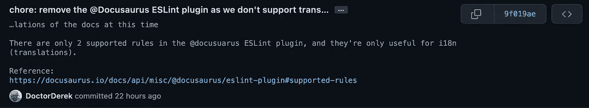
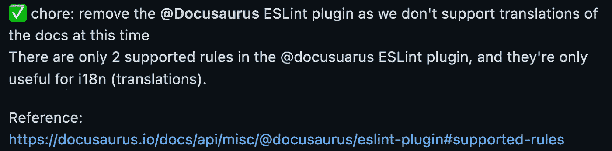
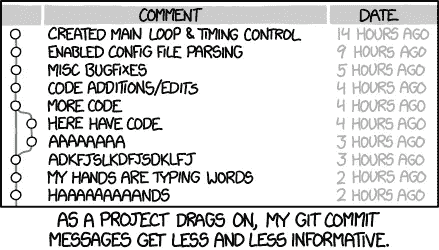

# 给开发者的建议:“伟大的 Git 提交消息不要短于 50 个字符”

> 原文：<https://betterprogramming.pub/an-advice-for-developers-great-git-commit-messages-are-not-shorter-than-50-characters-2becf8fd481a>

## 这个神话来自于 80 列 x 25 行的文本终端时代。这就是为什么你应该写长的提交消息


显然，[我是来自](https://www.urbandictionary.com/define.php?term=Groot) [Unsplash](https://unsplash.com?utm_source=medium&utm_medium=referral) 的 [Praveen Thirumurugan](https://unsplash.com/@praveentcom?utm_source=medium&utm_medium=referral) 拍摄的这张照片中的格鲁特

还记得 Twitter 是一个一次只能发布 140 个字符的平台吗——这是 SMS 短信允许的最大长度。

自 2017 年以来，Twitter 允许 280 个字符——在一条消息中大约 40 到 70 个单词，或者你可以在大约 15 秒内阅读的东西。

但出于某种原因，GitHub 仍然宣扬“伟大的提交摘要只有 50 个字符”的神话——以至于当你使用 GitHub 桌面或在线 GitHub 编辑器提交代码时，会说出这样的话。

50 个字符的 git 提交消息糟透了。说真的，“50 字规则”是一个巨大的，愚蠢的神话，我们需要继续前进。事情是这样开始的。

# 50 个字符提交神话的起源

这个无处不在的神话来自于过去，那时`git`纯粹是一个命令行工具，终端最多有 [80 个字符宽](https://retrocomputing.stackexchange.com/questions/5629/why-did-80x25-become-the-text-monitor-standard)。

虽然许多开发人员仍然更喜欢命令行`git`，但我 99%的时间都在 GUI(通常是 GitHub 桌面)中提交 git 消息，并在线查看它们。只是更容易。

现在，许多终端都是你想要多少字符就有多少字符，许多开发人员在工作中使用超高清(“视网膜”)显示器。

让我们一劳永逸地打破 50 个字符提交的神话。到本文结束时，你将会写出你一生中最好的提交信息。

# 但是可读性呢？

我们来对比一下 50 字的总结。这里有一个 git 提交消息，它被截掉了 50 个字符。这条信息还可以，但它不是超级信息:

```
chore: upgrade the apollo client to the new versio
```

但是如果我们不担心 git 提交消息的长度，而只是添加一些额外的信息呢？我把`...`定为 50 个字符:

```
chore: upgrade the apollo client to version 3.6.8 ... (latest) from 2.6.8, fixing the imports and use of `inMemoryCache`
```

如果我们在扩展描述字段中为下一个开发人员(您自己或其他人)添加一些有用的信息会怎么样呢？

```
chore!: upgrade the apollo client to version 3.6.8 ... (latest) from 2.6.8, fixing the imports and use of `inMemoryCache`BREAKING CHANGE: There are multiple breaking changes in v3.0.0 of @apollo/client. See the upgrade guide at: [https://github.com/apollographql/apollo-client/releases/tag/v3.0.0](https://github.com/apollographql/apollo-client/releases/tag/v3.0.0)
```

但是如何在 GitHub 上查看提交摘要呢？您将能够看到日志中的前 70 个字符，您可以点击`...`查看其余的字符:

```
chore!: upgrade the apollo client to version 3.6.8 (latest) from 2.6.8 ..., fixing the imports and use of `inMemoryCache`BREAKING CHANGE: There are multiple breaking changes in v3.0.0 of @apollo/client. See the upgrade guide at: [https://github.com/apollographql/apollo-client/releases/tag/v3.0.0](https://github.com/apollographql/apollo-client/releases/tag/v3.0.0)
```

# 更好的解决方案:“Git Log”？

这个神话一直存在，因为如果你在 GitHub 上查看提交摘要，它们被限制在(没有明显的原因)70 个字符以内。

但是只需单击一下`...`就可以展开提交消息，查看摘要和完整的描述。

更好的是，您可以使用`git log`命令。下面是`git log`命令本身，准备在命令行运行:

```
git log origin..HEAD --reverse --format="✅ %s%n%b %N%n" > git-log.txt && code git-log.txt
```

这是准备插入到`package.json`文件中与`npm run`或`yarn`一起使用的同一个版本。开 PR 的时候喜欢用`yarn gitlog`。

```
"gitlog": "git log origin..HEAD --reverse --format=\"✅ %s%n%b %N%n\" > git-log.txt && code git-log.txt",
```

这个命令提供了一个列表，可以复制粘贴到您在当前工作分支中所做的所有提交的 pull 请求(PR)中。

每个提交都标有一个✅，并在新的一行中列出摘要(完整长度，而不仅仅是 50 个字符),后跟描述(如果有)。

这意味着您可以编写 100 个字符(14-25 个单词)或任意长度的“普通”提交消息，它仍然会与您包含的描述分开显示。

# 我如何使用 Git 日志来编写有效的 PRs

我利用这一点的方式是在描述中包含到文档或任何代码块的链接(格式为 Markdown，前后各有一行`````)。

然后，当我打开 PR 时，在 PR 的 summary 部分，而不是 commit 部分，我有一个完整的“git 日志”,格式有了很大的改进。

我遇到的唯一缺点是，如果我添加额外的提交，我必须编辑 PR 摘要消息。然而，这总是在您打开 PRs 之后添加代码的一个缺点——新的提交相对隐藏在工作流中。

比较一下下面 GitHub 推荐的方式(50 个字符)和我写的方式。以下是 50 个字符的版本:

```
chore: remove the [@Docusaurus](http://twitter.com/Docusaurus) ESLint plugin as we
```

如您所见，我仍在使用“语义提交”消息(不涉及任何面向用户的代码或特性的“杂务”)，但这很糟糕。

我是一个有着 20 年工作经验的[专业人士](/how-to-set-up-vs-code-like-a-pro-in-just-5-minutes-65aaa5788c0d)(所以你可以称我为[高级开发人员](https://javascript.plainenglish.io/top-10-advanced-vs-code-settings-for-senior-developers-46e348351bd6))，所以下面是我实际写的:

```
chore: remove the @Docusaurus ESLint plugin as we don't support translations of the docs at this timeThere are only 2 supported rules in the @docusuarus ESLint plugin, and they're only useful for i18n (translations).Reference:
[https://docusaurus.io/docs/api/misc/@docusaurus/eslint-plugin#supported-rules](https://docusaurus.io/docs/api/misc/@docusaurus/eslint-plugin#supported-rules)
```



德里克·奥斯丁·🥳博士的截图显示了刚才提到的提交消息是如何在 GitHub 上显示的。

# 不要试图将提交限制在 50 个字符内

如果我没有写一个适当的描述性提交摘要(在本例中，大约 100 个字符)，我应该写什么作为提交消息呢？这里有两个例子，我试图将提交消息强制转换成 50 个字符:

```
chore: rm [@Docusaurus](http://twitter.com/Docusaurus) ESLint plugin as no i18n now
```

这对任何人来说有意义吗？“伟大的提交消息”(GitHub 会这么说)是用晦涩的技术术语写的，使用了两个缩写，并且没有给出我在做什么的上下文。这个怎么样？

```
chore: remove @Docusaurus ESLint plugin no transla
```

希望你能明白我的观点。下面是我实际上写的提交消息摘要，不，它并没有比上面更长的时间。

```
chore: remove the @Docusaurus ESLint plugin as we don't support translations of the docs at this time
```

哇，这个承诺很有道理！我仍然可以在五秒钟之内读完它，但更好的是，我可以在五秒钟之内理解它。

现在，让我们看一个截图，上面显示了我之前描述的`yarn gitlog`命令是如何执行相同的提交的:



我们可以抱怨我的格式——也许我可以在提交消息和描述之间添加一个空行以获得最大的可读性——但是没有人必须像上一个截图那样点击`...`,该截图显示了 GitHub 上 PR 的“提交”部分。

# 50 个字符的提交消息是有害的

总而言之，鼓励短期行为的最大危害是大多数人会走捷径，因为`shorter === better`。

简短胜过了我们在上面看到的漂亮、可读的提交消息，它还包含了到摘要中文档正确部分的精确链接。

有多少次，我们与编写世界上最糟糕的提交消息的超级天才开发人员一起工作？许多 PRs 包含如下信息:

```
fix the thingrefactorit seems like it's working
```

根据 GitHub 的标准，这些都是“很棒的提交消息”:50 个字符或更少，所以它们适合老式的 80 列终端。

即使提交消息是语义性的(常规提交)，一些开发人员也没有给出任何附加信息的习惯:

```
chore: remove Docusaurus ESLint pluginchore: remove unused packageschore: restore ESLint rule I removed
```

这些提交消息能告诉你什么吗？最初的开发人员可能记得他们在做什么，至少在几周内，或者您可以使用代码比较从提交历史中挖掘出来。

我不知道你，但我有比看代码比较更好的事情要做，甚至不是 PR，而是单个提交。

你说真的吗？你真的认为我会因为你懒而去比较你的提交代码吗？



[https://xkcd.com/1296](https://xkcd.com/1296)([CC BY-NC 2.5](https://creativecommons.org/licenses/by-nc/2.5/))的“合并分支‘asdfasjkfdlas/alkdjf’为 sdkjfls-final”

看，我理解那种冲动[“简短的总结更具可读性】](https://www.google.com/search?q="a+short+summary+is+more+readable") [“去掉不必要的文字”](https://www.techscribe.co.uk/techw/remove-unnecessary-words.htm)[“认真的海明威做到了！”](https://medium.com/@dijanaboshkova/how-to-write-content-people-would-actually-read-a0516e116e48)

但事实是，进行“[原子提交](https://www.freshconsulting.com/insights/blog/atomic-commits/)”(一次只更改一件事)的全部目的是为了让您可以弄清楚自己后来到底做了什么，并在必要时撤销或修补它。这需要上下文。

在审查 PR 时，你不会仅仅从 GitHub 的提交屏幕上获得上下文，特别是如果开发人员坚持只编写少于 50 个字符的“伟大的”提交消息。这是不好的做法。

# 为什么我仍然认为您应该尝试 Git Log

仅仅依赖于 GitHub 的 PR 的提交部分，而不使用某种类型的`yarn gitlog`命令的问题是，你不能判断 GitHub 的`...`是否意味着提交消息太长或者描述中写了五段。

这就是为什么我总是使用`yarn gitlog`命令——您可以在 PR 的摘要中更容易地浏览提交历史，而不必单击`...`来展开提交屏幕上的每个提交。

另外，你可以根据自己的需要定制`git log`命令，使它对你和你的团队更有用。如果您需要额外的信息，比如作者或日期，您可以更新`yarn gitlog`脚本。

希望我已经说服你在你的`git commit`消息中写超过 50 个字符。但是，如果我没有，请访问[conventionalcommits.org](https://www.conventionalcommits.org/)——他们大多数的“最佳实践”例子都有> 50 个字符长！

 [## 常规提交

### 为提交消息添加人类和机器可读含义的规范

www.conventionalcommits.org](https://www.conventionalcommits.org/) 

```
feat!(api): introduced concept of writing more than 50 charactersBREAKING CHANGE: don't believe every `ProTip!` you read at GitHub
```

编码快乐！🥳

德里克·奥斯汀博士是《职业规划:如何在 6 个月内成为成功的 6 位数程序员 一书的作者，该书现已在亚马逊上架。