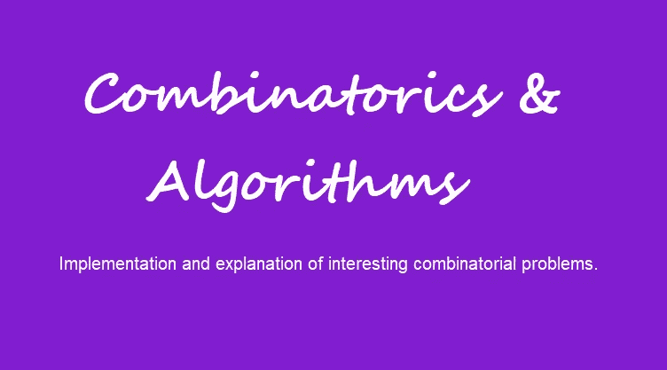

# 用 Rust 算法求解 Peg 纸牌游戏

> 原文：<https://betterprogramming.pub/an-algorithm-to-solve-peg-solitaire-and-an-implementation-in-rust-dbe69831125a>

## 实际实施

[](https://medium.com/@applied-math-coding/membership) [## 通过我的推荐链接加入 Medium-applied . math . coding

### 获得我所有的故事，以及其他作家在媒体上发表的成千上万的故事。我坚信，媒介是…

medium.com](https://medium.com/@applied-math-coding/membership) 

这个故事旨在提供一个基本算法来解决 [Peg 纸牌](https://en.wikipedia.org/wiki/Peg_solitaire)游戏，并在 Rust 中给出一个实现。

如果你尝试过，这个游戏很难用手解决。此外，当过于天真地实现递归求解器时，人们会被它的复杂性所打击，并且依赖于计算机，人们必须等待几个小时才能得到解决方案。

# 算法

最基本的方法是用归纳法解决问题。我们从初始状态开始，除了中心以外的每个位置都被一块石头占据。

1.  验证是否已经解决，也就是说，只有在中心的一块石头被留下。如果是，我们就完成了。
2.  确定所有可能的行动。这些是那些垂直或水平地让一个石头跳过另一个石头进入一个未被占据的位置并移走另一个的石头。如果没有可能的移动可用，停止沿此“路径”的搜索。
3.  一定要应用每一个这样的动作。每次有了新的职业状态，回到第一点。

这种算法是一种典型的方法，可以尝试所有可能的一系列移动，直到找到解决方案。它的复杂性显然是指数级的，因为大多数时候会有不止一个可用的移动。但问题是，对于指数复杂性来说，指数已经有点太高了。我们的场地大约有 50 块石头。为了移除其中的 49 个，我们至少需要 49 次移动。如果我们估计在每一步棋之后还有两次可能的走法，那么这就等于`2^49`条可能的路径。这个数字可能有点高估，但它已经给人一种我们会遇到问题的印象。

事实上，实现上述方法需要几个小时才能解决问题(在我的机器上)。我们能做的是使用一种非常有前途的修剪技术。

这个想法是利用游戏的对称性。

如果你观察石头的任何占据状态，并且你现在绕着它的中心顺时针旋转游戏 90 度，这个状态是否能导致任何解决方案的答案保持不变。类似地，如果你沿着垂直中心轴反映当前的占领状态，如果解决方案仍然可能保持不变，我们将再次期待答案:

```
 O O O
      O O O
  O **X X** O O O O
  O O **X** O O O O
  O O O O O O O
      O O O
      O O Omirrored: O O O
      O O O
  O O O O **X X** O
  O O O O **X** O O
  O O O O O O O
      O O O
      O O O
```

为了看到这一点，通过归纳，我们可以很容易地验证镜像移动在镜像游戏中提供了相同的状态，要么没有移动可用，要么没有解决方案(一个在中间)。

所以，对于每一块石头，我们有八种状态，它们等价于可解性:旋转(0，90，180，270) +镜像(旋转(0，90，180，270))

现在，想法是存储算法已经确定不存在解的每个占用状态。然后在步骤#3，我们将递归调用限制在那些与循环响应不一致的状态。上述存储状态的镜像版本。

这种修剪技术极大地减小了搜索树的大小，并且算法在几秒钟内运行(当然取决于机器)。

## 履行

像往常一样，我不想强制使用任何特定的编程语言。因此，请尝试用您最喜欢的语言实现上述内容。这里的实现是在 Rust 中完成的，如果你需要的话，你可以在这里找到它的介绍[。](https://medium.com/@applied-math-coding/list/an-introduction-into-rust-22c99777c5e5)

首先，我们需要一个数据结构，允许我们存储职业状态并推断可用的移动。这将通过下面的 struct `Field`来完成，我们同时实现所有需要的转换:

`Field`的二维数据数组通过一个`true`值表示相应的位置被石头占据。

占领状态(`Field`，我们知道不会导致解决方案，我们将存储在`HashSet`。为此，我们将提供`Field`的`hash`函数的自定义实现:

通过首先分别产生所有状态等价旋转来计算散列。然后选择这些 w.r.t 字典顺序中的最大值。后者数据的散列随后被用于改变散列状态。通过这种实现，在询问`HashSet`是否已知给定状态不会导致解决方案时，我们不必做太多工作。

一个`Move`，即一个“跳转”，由以下存储相应坐标的结构表示:

```
type Vertex = (usize, usize);#[derive(Hash, PartialEq, Eq, Debug, Clone, Copy)]
pub struct **Move** {
    pub from: Vertex,
    pub to: Vertex,
}
```

我们将使用`Field`结构来存储占领状态，并在`Field`的数据数组中存储石头可能占据的位置。为此，我们有两种相应的初始化方法:

此外，有两种方法，第一种用于确定一个给定的占用状态是一个解决方案，第二种用于将给定的`Move`应用到一个给定的占用状态:

此外，我们需要一种方法来提取给定占领状态下所有可能的移动。这很简单，通过搜索所有未被占用的位置，并从那里分别垂直搜索。成对石头的水平方向:

最后，我们得出与上述描述完全相似的实际算法。注意，`pruning`是用于存储没有解的占用状态的`HashSet`:

根据您的机器，该代码会在几秒钟后返回。你可以在这个[游乐场](https://play.rust-lang.org/?version=stable&mode=release&edition=2021&gist=218537ede90965948a2a1ac262e07717)找到全部代码。但是，由于它的运行时间，它可能无法在那里执行。

感谢阅读！