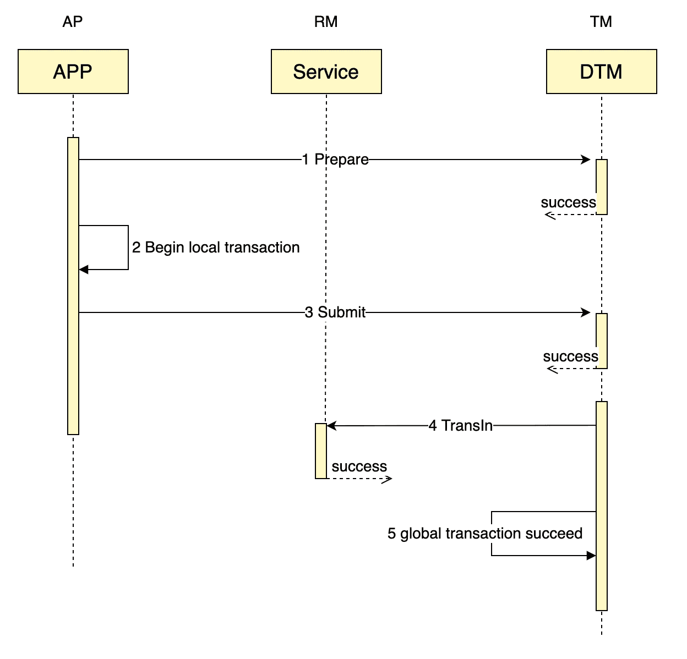
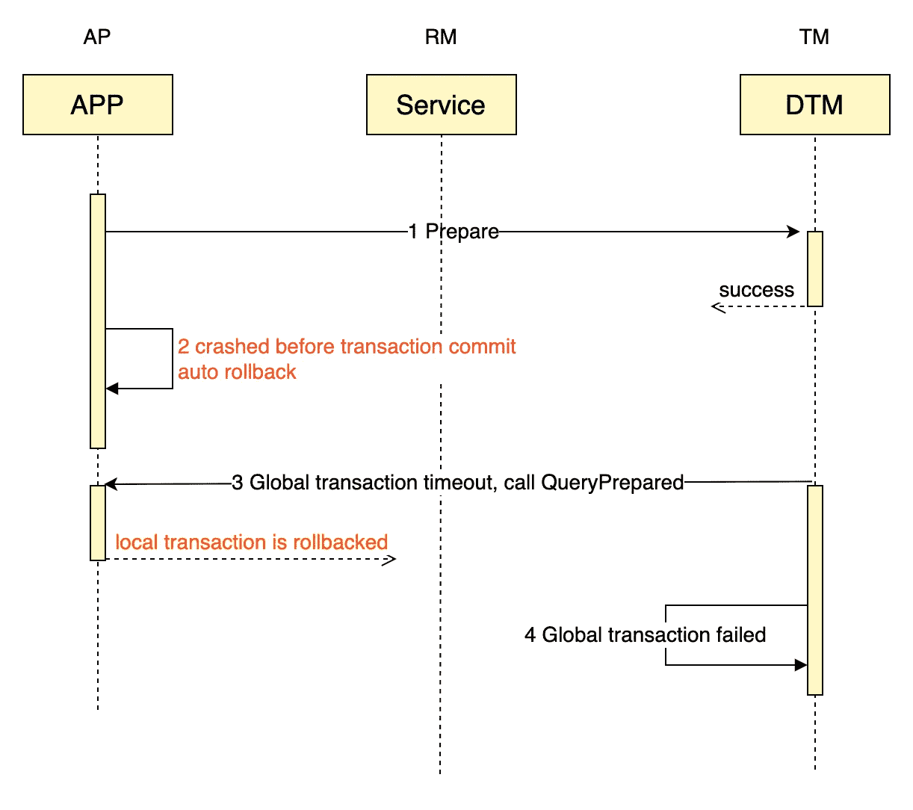

# 微服务架构发件箱模式的替代方案

> 原文：<https://betterprogramming.pub/an-alternative-to-outbox-pattern-7564562843ae>

## 满足两阶段信息


[摄](https://unsplash.com/@jjying?utm_source=medium&utm_medium=referral)在 [Unsplash](https://unsplash.com?utm_source=medium&utm_medium=referral)

本文提出了发件箱的另一种模式:两阶段消息。它不是基于消息队列，而是基于[github.com/dtm-labs/dtm](https://github.com/dtm-labs/dtm)，一个高度可用的分布式事务框架。

银行间转账是典型的分布式交易场景，其中 A 需要通过银行向 B 转账。A 和 B 的余额不在同一家银行，因此它们不存储在单个数据库中。这种转移通常也会跨越微服务。

主要问题是转移必须同时更新两个系统——A’余额的增加和 B’余额的减少。这被称为众所周知的“双重写入”。两次更新之间的进程崩溃会使整个系统处于不一致的状态。

这个“双重写入”问题可以通过发件箱模式来解决。发件箱模式的原理可以在这里找到:[事务型发件箱](https://microservices.io/patterns/data/transactional-outbox.html)

# 两阶段消息

首先，让我们看一下如何使用新模式完成上述传输任务。以下代码在 Go 中，其他语言如 C#，PHP 可以在这里找到:[DTM SDK](https://en.dtm.pub/ref/sdk.html)

```
msg := dtmcli.NewMsg(DtmServer, gid).
	Add(busi.Busi+"/TransIn", &TransReq{Amount: 30})
err := msg.DoAndSubmitDB(busi.Busi+"/QueryPrepared", db, func(tx *sql.Tx) error {
	return AdjustBalance(tx, busi.TransOutUID, -req.Amount)
})
```

在上面的代码中:

*   第一个新的 DTM `msg`全局事务，传递 DTM 服务器地址和全局事务 id
*   向`msg`添加一个分支业务，即转账操作 TransIn，以及需要传递给该服务的数据，金额为 30 美元
*   然后调用`msg`的 DoAndSubmitDB。该功能将确保`msg`的业务和提交的原子执行，要么都成功，要么都失败。该功能有三个参数:

1.  稍后将解释检查返回 URL
2.  DB 是业务的数据库对象
3.  在我们的例子中，业务功能是为 A 的余额借记 30 美元

当 A 的余额递减成功后进程立即崩溃会发生什么？超时之后，DTM 将调用检查返回 URL 来查询递减是成功还是不成功。我们可以通过粘贴以下代码来完成检查返回服务:

```
app.GET(BusiAPI+"/QueryPrepared", dtmutil.WrapHandler2(func(c *gin.Context) interface{} {
		return MustBarrierFromGin(c).QueryPrepared(db)
	}))
```

写完这两段代码后，一个 2 阶段消息就完成了，比发件箱更容易使用。

# 运行它

您可以通过运行以下命令来运行上面的示例。

## 运行 DTM

```
git clone https://github.com/dtm-labs/dtm && cd dtm
go run main.go
```

## 运行示例

```
git clone https://github.com/dtm-labs/dtm-examples && cd dtm-examples
go run main.go http_msg_doAndCommit
```

# 成功的过程

`DoAndSubmitDB`如何保证成功的业务执行和消息提交的原子性？请参见下面的时序图。



通常，时序图中的 5 个步骤将正常完成，并且全局事务完成。这里需要说明一下:`msg`的承诺分两个阶段做，先准备，后提交。

在 DTM 收到准备请求后，它不调用分支事务，而是等待后续的提交。只有当它收到提交请求时，它才开始分支调用，并最终完成全局事务。

# 提交后崩溃

在分布式系统中，需要考虑各种停机和网络异常，所以我们来看看会发生什么。

我们想要实现的最重要的目标是业务执行和消息提交组成一个原子操作。所以我们先来看看，如果在业务执行之后、消息提交之前出现宕机故障，会发生什么，以及新模式将如何确保原子性。

让我们看看这种情况下的时序图。


在这种情况下，DTM 将轮询在某个超时后只准备好而没有提交的消息，并调用消息指定的检查服务来查询业务执行是否成功。

这个检查服务进入消息表，并查询业务的本地事务是否已经提交。

*   Committed:返回成功，dtm 提交全局事务并继续下一个子事务调用
*   回滚:返回失败，dtm 终止全局事务，不再进行子事务调用
*   进行中:该检查将等待最终结果，然后进行到上一个提交/回滚的情况
*   未开始:该检查将插入数据，以确保业务的本地事务最终失败

# 承诺前崩溃

让我们看一下正在回滚的本地事务的时序图。



如果进程在 dtm 收到准备调用之后、事务提交之前立即崩溃，本地数据库将检测到进程的断开，并自动回滚本地事务。

随后，dtm 会轮询已超时的全局事务，即只准备好但未提交和签回的事务。check-back 服务发现本地事务已经回滚，并将结果返回给 dtm。dtm 接收指示 rollbacked 的结果，然后将全局事务标记为失败，最后结束全局事务。

# 两阶段消息与发件箱

发件箱模式还可以确保数据的最终一致性。就使用发件箱模式而言，所需的工作包括

*   执行本地事务中的本地业务逻辑，将消息插入消息表，最后提交。
*   编写轮询任务，从本地消息表中获取消息，并将它们发送到消息队列。该步骤可能使用另一种技术[基于日志的变更数据捕获](https://debezium.io/blog/2018/07/19/advantages-of-log-based-change-data-capture/)，而不是定期执行 SQL 来轮询。
*   消费信息。

与发件箱相比，2 阶段消息具有以下优点。

*   不需要学习或维护任何消息队列
*   没有要处理的轮询任务
*   不需要消耗消息

2-阶段消息只需要 DTM，它比消息队列更容易学习或维护。所有涉及到的技巧都是函数调用和服务调用，这是所有开发者都熟悉的东西。

*   两阶段消息的公开接口完全独立于队列，并且只与实际的业务和服务调用相关，这使得它对开发人员更加友好
*   2 阶段消息不必考虑消息堆叠和其他故障，因为 2 阶段消息只依赖于 dtm。开发者可以把 dtm 想象成和系统中任何其他普通的无状态服务一样，只依赖于背后的存储，Mysql/Redis。
*   消息队列是异步的，而两阶段消息同时支持异步和同步。默认行为是异步的，您可以通过设置`msg.WaitResult=true`来等待下游服务同步完成。
*   两阶段消息还支持同时指定多个下游服务

## 两阶段信息的应用

2-阶段消息可以显著降低最终一致性解决方案的难度并得到广泛应用，这里有两个典型的应用。

*   [闪购系统](https://en.dtm.pub/app/flash.html):这种架构可以在单台机器上轻松承载数万个订单请求，并确保扣除的库存数量与订单数量准确匹配
*   [缓存一致性](https://en.dtm.pub/app/cache.html):这种架构可以通过一个两阶段消息轻松保证数据库和缓存的一致性，这比队列或订阅 bin-log 解决方案要好得多

在 [dtm-examples](https://github.com/dtm-labs/dtm-examples) 中可以找到结合使用 Redis、Mongo 存储引擎和两阶段消息的示例

# 核对原则

check-back 服务出现在前面的时序图以及界面中。这种校验设计首先存在于 RocketMQ 中，实现留给开发人员手工处理。在两阶段消息中，它由复制粘贴代码自动处理。那么自动加工的原理是什么呢？

为了执行检查，我们首先在业务数据库实例中创建一个单独的表，其中存储了`gid`(全局事务 id)。处理业务事务时，Gid 被写入该表。

当我们用 gid 检查时，如果我们在表中找到 gid，那么就意味着本地事务已经提交，所以我们可以向 dtm 返回本地事务已经提交的结果。

当我们用 gid 检查时，如果我们在表中没有找到 gid，那么这意味着本地事务还没有被提交。有三种可能的结果:

1.  交易仍在进行中。
2.  事务已被回滚。
3.  交易尚未开始。

我搜索了很多关于 RocketMQ 的检查返回的信息，但是没有找到一个无错误的解决方案。大多数建议是，如果没有找到 gid，那么什么也不做，在接下来的 10 秒钟内等待下一次检查。如果检查持续了 2 分钟或更长时间，仍然找不到 gid，则认为本地事务已回滚。

以下情况存在问题。

*   在极端情况下，可能会发生数据库故障(如进程暂停或磁盘堵塞)，持续时间超过 2 分钟，最后数据被提交。但是 RocketMQ 假设事务被回滚，并取消全局事务，使数据处于不一致的状态。
*   如果一个本地事务已经被回滚，但是 check-back 服务在两分钟之内，会每 10 秒钟不断地轮询一次，给服务器造成不必要的负载。

dtm 的 2 阶段消息解决方案彻底解决了这些问题。它的工作原理如下。

1.  当处理一个本地事务时，gid 被插入到表`dtm_barrier.barrier`中，插入原因为`COMMITTED`。表`dtm_barrier.barrier`在 gid 上有唯一的索引。
2.  当检查回来时，两阶段消息不直接查询 gid 是否存在，而是插入忽略具有相同 gid 的行，以及原因`ROLLBACKED`。此时，如果表中已经有一条 gid 为的记录，那么新的插入操作将被忽略，否则将插入该行。
3.  用 gid 查询表中的记录，如果记录的原因是`COMMITTED`，则本地事务已经提交；如果记录的原因是`ROLLBACKED`，那么本地事务已经回滚或将回滚。

那么，两阶段消息如何区分进行中的消息和回滚的消息呢？诀窍在于在检查返回期间插入的数据。如果在检查时数据库事务仍在进行中，则插入操作将被进行中的事务阻塞，因为检查中的插入操作将等待进行中的事务持有的行锁。如果插入操作正常返回，那么数据库中的本地事务一定已经结束。

# 普通邮件

两阶段消息不仅可以替换发件箱，还可以替换正常消息模式。如果您直接调用 Submit，那么它类似于普通的消息模式，但是提供了一个更加灵活和简单的接口。

假设一个应用程序场景，其中 UI 上有一个按钮，可以参与授予对两本电子书的永久访问权限的活动。在这种情况下，服务器端可以这样处理:

```
msg := dtmcli.NewMsg(DtmServer, gid).
	Add(busi.Busi+"/AuthBook", &Req{UID: 1, BookID: 5}).
	Add(busi.Busi+"/AuthBook", &Req{UID: 1, BookID: 6})
err := msg.Submit()
```

这种方法还提供了不依赖于消息队列的异步接口。

# 摘要

本文中提出的两阶段消息有一个简单而优雅的接口，它带来了比发件箱更优雅的模式。

欢迎参观 github.com/dtm-labs/dtm。这是一个致力于使微服务中的分布式事务更容易的项目。它支持多种语言和多种模式，如两阶段消息、Saga、Tcc 和 Xa。