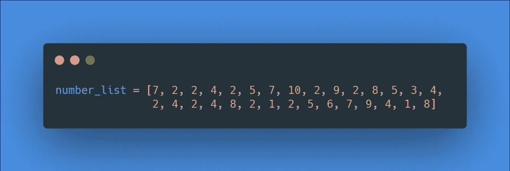
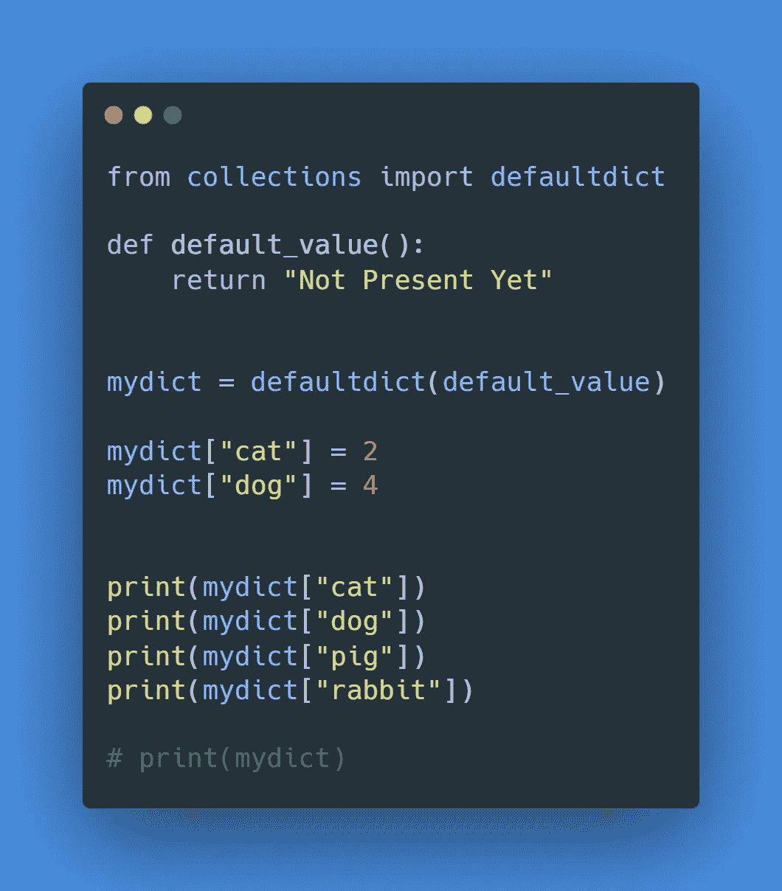
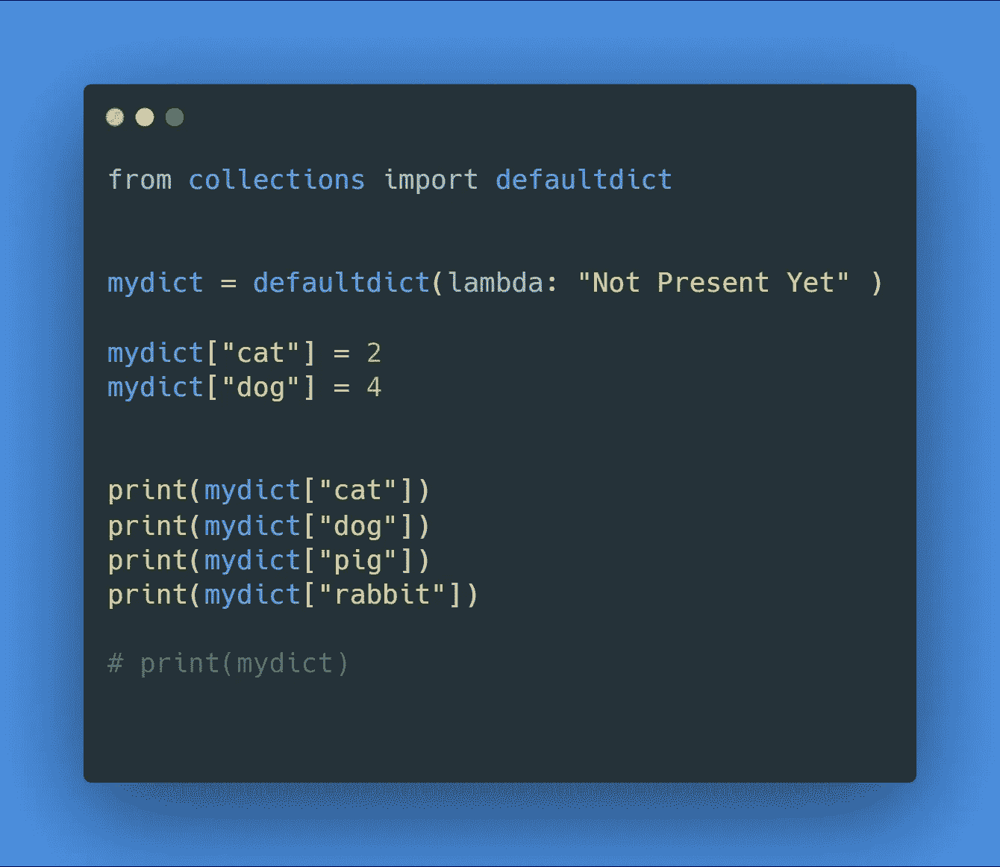
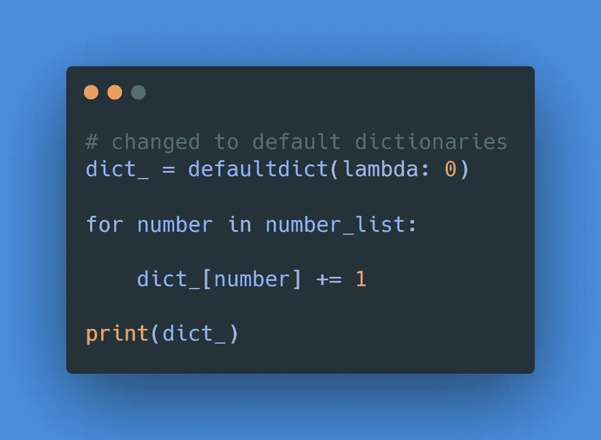

# Python 字典的替代品

> 原文：<https://betterprogramming.pub/an-alternative-to-python-dictionaries-5d54aa4c5a6>

## 为什么应该在 Python 中使用 defaultdict


[Sigmund](https://unsplash.com/@sigmund?utm_source=medium&utm_medium=referral) 在 [Unsplash](https://unsplash.com?utm_source=medium&utm_medium=referral) 上拍照。

情况是这样的:



我们有一个数字列表，我们想找出列表中每个数字出现的次数。

我通常的做法是用包含所有可能数字的键创建一个字典，并将它们都递增。


请密切注意下面的代码片段:

```
if number not in dict_:
    dict_[number] = 0
```

注意，在给它赋值之前，我们必须先检查字典中是否存在这个值。如果我们不采取这一步，我们将会在增加键的数量时得到一个错误。

错误示例:

当字典中不存在相应的键时，就会出现上面的错误。

代码的结果:

```
{7: 3, 2: 9, 4: 5, 5: 3, 10: 1, 9: 2, 8: 3, 3: 1, 1: 2, 6: 1}
```

我们肯定可以做得更好。

# 默认字典

通过在字典的基础上构建来处理我们之前的错误。它不像普通词典那样给出一个`KeyError`。但是，每当您试图访问或“分配”一个不存在的键时，它将创建那个键并给它一个已经指定的默认值。

让我们试一试:

```
from collections import defaultdict
```

`defaultdict`是一个来自藏书包的图书馆。

```
def default_value():return "Not Present Yet"
```

`defaultdict`需要一个函数来告诉它，如果键最初不在那里，该分配什么值。在这种情况下，`Not Present Yet`将是默认值:

```
mydict = defaultdict(default_value)
```

`defaultdict`接受一个参数:返回默认值的函数名。

现在让我们在`defaultdict`中赋值:

```
mydict["cat"] = 2mydict["dog"] = 4
```

让我们试着调用这些键并获取它们相应的值:

```
print(mydict["cat"])print(mydict["dog"])
```

输出:

```
2
4
```

到目前为止，我们看到它与普通字典没有什么不同。

现在，让我们尝试查找未分配的已添加条目:

```
print(mydict["pig"])print(mydict["rabbit"])
```

输出:

```
2
4
Not Present Yet
Not Present Yet
```

我们走吧！对于未赋值的两个(`2`)条目，它返回`Not Present Yet`。

如果我们打印出`mydict`的内容，您会注意到`pig`和`dog`被赋予了值`Not Present Yet`:

```
defaultdict(<function default_value at 0x0000019579608708>, {'cat': 2, 'dog': 4, 'pig': 'Not Present Yet', 'rabbit': 'Not Present Yet'})
```

同样，每当您试图访问或“分配”一个不存在的键时，它将创建那个键并给它一个已经指定的默认值。

默认值为`Not Present Yet`。这将被分配给不在我们的`defaultdict`中的键。

完整代码:



在上面的代码片段中，我只想改变一件事。我不认为像`default_value`这样的功能只使用一次有什么意义。

让我们把它变成一个匿名函数，如下所示:

```
mydict = defaultdict(lambda: "Not Present Yet" )
```



现在我们已经了解了默认字典，我们可以在下面的代码片段中试用它们。

回忆:


现在，使用默认词典:



因为有了默认的字典，我们能够缩短并使上面的实现更容易。

我们不需要检查我们的值是否不存在来避免一个`KeyError`，我们只是让默认的字典做它们的事情。它会自动将`0`分配给任何键。这让我们很容易积累我们的价值观。

*注:* `*defaultdict(lambda: 0)*` *有个简写。可以用* `*defaultdict(int)*` *。这些是可以互换的。*

# 结论

如您所见，`defaultdict`已经被证明是字典的一个有用的替代品——尤其是在累加值的时候。试试上面的例子，自己测试一下。