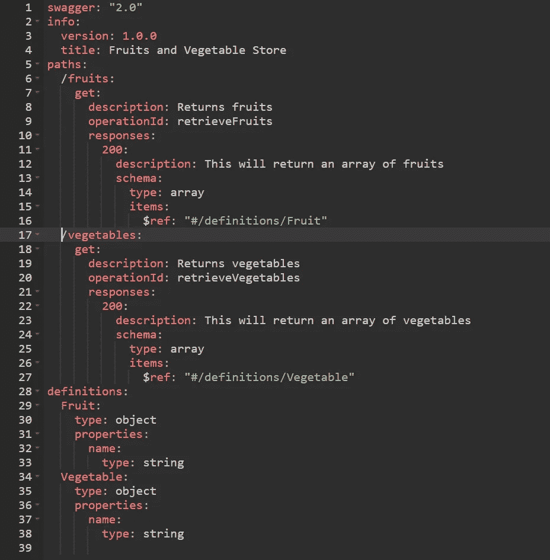
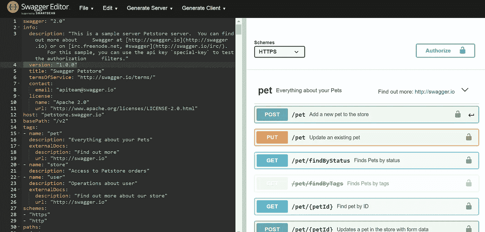
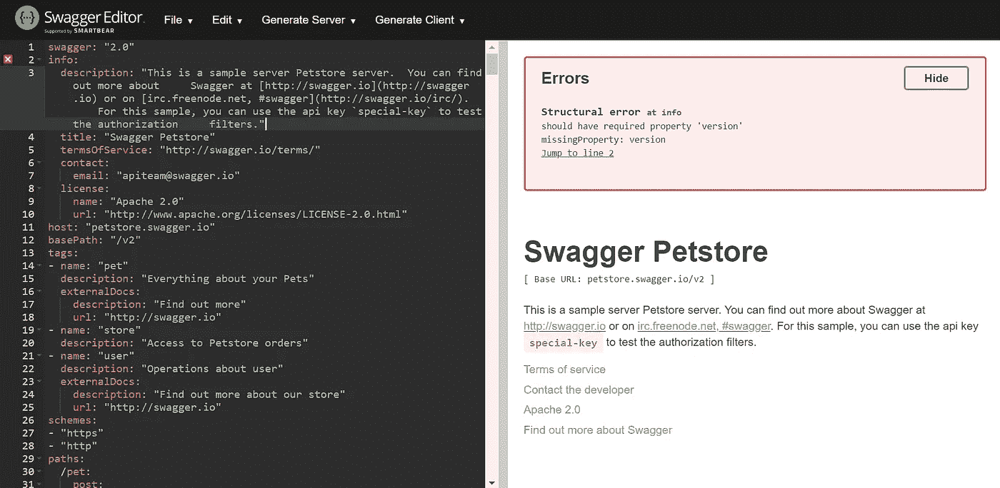

# 一个管理 API 的神奇工具

> 原文：<https://betterprogramming.pub/an-amazing-tool-to-manage-your-apis-7a3933bc9368>

## 使用 OpenAPI/Swagger 维护您的 API

照片由[汉娜·吉布斯](https://unsplash.com/@hannahmgibbs?utm_source=unsplash&utm_medium=referral&utm_content=creditCopyText)在 [Unsplash](https://unsplash.com/s/photos/hammer?utm_source=unsplash&utm_medium=referral&utm_content=creditCopyText) 拍摄

如果你是一名程序员，你可能听说过术语 API，或应用程序编程接口。如果您使用过 API，您可能知道使用 API 的目的、如何向 API 发出请求、必须使用什么数据格式和约定，等等。

我写这篇文章的目的是让你了解一个可以用来维护 API 的工具，减少维护和使用 API 的麻烦。

# 什么是 OpenAPI/Swagger？

在我对 OpenAPI 的解释是之前，先阅读以下内容，摘自官方 [OpenAPI 规范](https://swagger.io/specification/):

> OpenAPI 规范(OAS)为 RESTful APIs 定义了一个标准的、与语言无关的接口，允许人类和计算机在不访问源代码、文档或通过网络流量检查的情况下发现和理解服务的功能。正确定义后，消费者可以用最少的实现逻辑理解远程服务并与之交互。

正如 OpenAPI 的官方文档中所述，OpenAPI 也称为 Swagger(版本 1 和 2 称为 Swagger，从版本 3 开始称为 open API)，是一种广泛使用的行业标准，用于描述任何 API 的规范。

OpenAPI 允许精确地描述 RESTful APIs 的规范，它可以用 JSON 或 YAML 格式来描述。基本上，OpenAPI 允许你使用 OpenAPI 文档中定义的通用标准来描述你的整个 API。

以下是 OpenAPI 让您描述的一些基本内容:

*   API 中的端点
*   `GET`、`POST`、`DELETE`等操作。
*   每个操作的参数以及这些参数是否是强制的
*   每个操作的响应是什么
*   许可、使用条款、联系信息等等

下面是一个水果和蔬菜商店的 API 示例。该 API 由两个端点组成——一个返回蔬菜数组，另一个返回水果数组。`Swagger`属性表示这个 OpenAPI 规范符合 Swagger 2.0 版本。`Info`是用来定义 API 细节的属性，比如标题、API 版本、API 描述等等。`paths`属性，顾名思义，用来定义端点。而这里使用的`definitions`属性定义了每个端点中`$ref`引用的返回类型。

*注意:在本文中，我不会关注如何使用 OpenAPI 规范定义您的 API。你可以参考 OpenAPI* *的* [*官方文档了解更多关于如何定义你的 API 的信息。*](https://swagger.io/specification/)

作者[截图](https://medium.com/@rshafi2127):定义符合 OpenAPI 标准的 API 的示例 YAML

# 为什么要用 OpenAPI/Swagger？

我希望你现在已经对 OpenAPI 有了一个基本的概念。但是为什么要花时间定义 API 呢？难道你自己的文档不能用来描述你的 API 吗？简单来说，*为什么是 OpenAPI* ？

好吧，OpenAPI 附带的惊人工具如 [Swagger Editor](https://editor.swagger.io/?_ga=2.98628567.837088276.1594456762-266310137.1594456762) 、 [Swagger UI](https://swagger.io/tools/swagger-ui/) 、 [Swagger Codegen](https://github.com/swagger-api/swagger-codegen) ，都是显而易见的原因。但是在谈论这些工具之前，让我分享一些证明 OpenAPI 价值的其他东西。

如果您以前从事过 REST API 的构建工作，那么您可能会同意构建 API 已经变得容易得多，现在有许多不同语言的框架。对现有 API 进行更改或添加新功能只需编写所需的代码并进行一些测试即可——如果通过了这些测试，就可以投入生产了。

但是这是否在所有情况下都是正确的呢？

当然，如果你的 API 不是一个行业级的 API，没有很多人参与其中，或者如果 API 的消费者是一个小团体，或者它只是在一个团队内部使用，这都没问题。

但是下面这些情况呢？

# 1.OpenAPI 允许您使用设计优先的方法来构建 API

我们来谈谈更广泛的方面。

如果你是开发 API 的团队中的一员，那该怎么办？或者可能有多个团队或个人在一个 API 上工作。在这种情况下，常见的做法是在构建 API 或对其进行任何更改时遵守一些设定的标准，以便确保其平稳运行。

在这种情况下，有时您所做的更改不符合您的团队所定义的标准。花这么长时间来实现它，然后你的团队回顾并说你没有遵守设定的标准，这是多么令人畏惧的事情。这种 API 描述格式被称为代码优先方法——通过编码直接开始实现 API。

劳伦·曼克在 [Unsplash](https://unsplash.com/s/photos/fruit?utm_source=unsplash&utm_medium=referral&utm_content=creditCopyText) 上的照片

另一种常见的 API 描述格式是设计优先的方法。这就是 OpenAPI 发挥作用的地方，它可以解决开发人员前面提到的问题。

这个想法是为你的 API 开发一个蓝图，包含一些人类和机器都能读懂的标准。也就是说，在实际实现 API 之前，使用 OpenAPI 标准定义 API。因此，这个 OpenAPI 规范是对 API 实际实现的一种建议，可以与 API 的相关方共享。因此，任何差异都可以通过检查来解决，然后您就可以继续进行 API 的实际实现了。

# 2.OpenAPI 是一个处理突发变化的伟大工具

如果你是构建 API 的团队的一员，你会知道 API 经常被修改。例如，添加新的端点或者修改请求体或响应体的结构可以被认为是对 API 的修改。这种修改必须传达给所有使用您的 API 的客户端/客户端库，以确保您的 API 的不间断服务。当您的 API 的消费者是未知方，或者您无法控制使用您的 API 的应用程序的实现时，这种情况就变得具有挑战性。

照片由[乔纳森·加莱戈斯](https://unsplash.com/@jonathangallegos?utm_source=unsplash&utm_medium=referral&utm_content=creditCopyText)在 [Unsplash](https://unsplash.com/s/photos/egg?utm_source=unsplash&utm_medium=referral&utm_content=creditCopyText) 上拍摄

这些对 API 的修改被分类为*非破坏性变更*或*破坏性变更*。一个不间断的变化是你的 API 的消费者不会受到对你的 API 所做的修改的影响。即使对 API 进行了更改，API 的用户仍然可以毫无困难地使用 API。一个突破性的变化是当对你的 API *的修改要求使用你的 API 的应用程序的实现发生变化——也就是说，你的 API 不能像以前一样被使用。*

现在，随着不同版本的 API 频繁发布，这些突破性的变化会经常发生。因此，您的 API 的消费者需要正确地了解这些变化，以确保他们可以毫无问题地使用 API。一个很好的方法是使用 Swagger UI——一种让客户尝试 API 演示的可视化文档。这对 OpenAPI 来说是一个巨大的加分点。我将在下面详细讨论 Swagger UI。

此外，还有一些工具将您的 API 的两个不同版本(如 JSON/YAML)作为输入，比较这两个文件，并分别输出突破性更改和非突破性更改。您甚至可以构建自己的工具来检测与您的 API 相关的重大更改。这是一个强有力的理由，证明了使用 OpenAPI 定义 API 的价值。

接下来是 Swagger 编辑器，Swagger UI 和 Swagger Codegen。

# 招摇的编辑

这是一个开源编辑器，允许您基于 OpenAPI 规范设计、描述和记录您的 API。你可以在本地运行或者使用[在线编辑器](https://editor.swagger.io/)。

下面是在线 Swagger 编辑器的主页截图。在左边你可以看到一个宠物店 API 的 YAML 文件的例子。屏幕的右半部分是您定义的 OpenAPI 的可视化表示。一旦您对 YAML 文件进行了更改，屏幕的右侧就会反映出更改。

[在线招摇编辑器首页截图](https://editor.swagger.io/)

Swagger 编辑器提供的一个很棒的特性是*实时验证*，如果你的文档不符合 OpenAPI 文档设定的[标准，它会通知你。在下面的截图中，我特意删除了`version`属性，按照 OpenAPI 文档，这是强制性的。正如您所看到的，有一个警告将这一遗漏称为一个错误:](https://swagger.io/specification/)

[省略版本字段的在线 Swagger 编辑器示例宠物店示例截图](https://editor.swagger.io/)

点击[这里](https://swagger.io/tools/swagger-editor/download/)运行本地下载的 Swagger 编辑器。

# Swagger UI

这是我之前提到的工具，在设计优先的方法中很有帮助。Swagger UI 根据您创建的 OpenAPI 规范创建 API 的可视化表示。这对对你的 API 感兴趣的任何一方都有帮助。从客户端的角度来看，他们不需要编写任何实现逻辑来使用 API 进行测试。另一方面，当实现后端时，这对您自己的 API 开发团队可能是有用的。

# 斯瓦格代码根

一旦你开发了一个 API，就会有许多应用程序依赖于它。对于开发人员来说，一个困难的任务是必须投入时间和精力来理解和开始使用 API。这就是客户端库的用武之地。

客户端库基本上是一些代码块，完成应用程序与 API 集成的任务。为了确保您的 API 是用户友好的，最好提供客户端库，以及 API，这反过来将减轻依赖您的 API 的应用程序开发人员的任务。但是有大量的语言，所以为所有这些语言提供客户端库对于 API 开发团队来说是一项巨大的任务。

这就是斯瓦格·科德根前来救援的地方。Swagger Codegen 是一个能够为任何使用 OpenAPI 定义的 API 生成客户端库/SDK 的工具。令人惊讶的是，它可以生成超过 40 种语言的客户端库！

# 结论

本文是对 OpenAPI/Swagger 的一个小介绍。与其谈论如何使用 OpenAPI 定义你的 API，我的重点是分享我对*为什么*一个 API 开发者应该使用 OpenAPI 定义 API 的想法。

请参考我在本文中提到的各种工具的相应文档，以获得更多参考。除此之外，你还可以在这里找到更多的工具——也可以参考这些工具。

我希望您对这篇文章感兴趣——祝您编码愉快并度过愉快的一天！

# **参考文献**

*   [OpenAPI 规范](https://swagger.io/specification/)
*   [霸气 Codegen](https://swagger.io/tools/swagger-codegen/)
*   [Swagger UI](https://swagger.io/tools/swagger-ui/)
*   [招摇编辑](https://editor.swagger.io/)
*   [设计优先还是代码优先:API 开发的最佳方法是什么？](https://swagger.io/blog/api-design/design-first-or-code-first-api-development/)