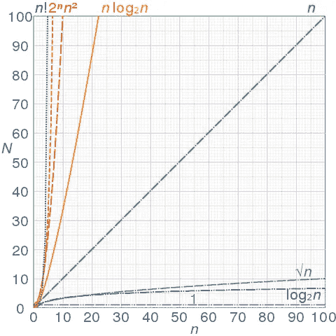

# 一个亚马逊面试问题:评估哪个任务需要先完成

> 原文：<https://betterprogramming.pub/an-amazon-interview-question-evaluate-which-task-needs-to-finish-first-413eff1a3aed>

## “依赖”亚马逊 JavaScript 代码挑战


Christian Wiediger 在 [Unsplash](https://unsplash.com/s/photos/amazon?utm_source=unsplash&utm_medium=referral&utm_content=creditCopyText) 上拍摄的照片。

我最近检查了我以前的开发项目，遇到了我为亚马逊做的 JavaScript 代码挑战。我有大约半个小时的时间来做这件事，虽然当时我不能在这个时间范围内完成，但我决定再试一次。

这个挑战需要一个函数，它接受一组任务对象，并根据每个对象中的`depends`属性来评估每个任务。下面是原始数组:

对于这种情况，该函数需要遍历并记录`Task #n is complete`，其中`n`是对象的`id`。该列表的预期结果如下所示:

```
Task #2 is complete.
Task #4 is complete.
Task #3 is complete.
Task #1 is complete.
```

这样记录的原因是第一个对象(任务 1)依赖于任务 2 和任务 3。这意味着在任务 2 和任务 3 完成之前，它无法完成。所以我们跳过任务 1，然后任务 2 就没有依赖关系了。它不是等待其他任务完成后才能完成。所以首先记录任务 2。我们需要遵循这个逻辑，直到所有的任务都完成。有道理吗？

以下是我的解决方案:

在上面的代码中，我们根据每个任务的`depends`属性的长度对`tasks`数组进行排序，以确保已完成的任务位于数组的前面。然后，这个函数利用[递归](https://www.geeksforgeeks.org/recursion/)，如果任务的`depends`属性是一个空数组，就将任务的 ID 添加到一个指向值`true`的映射中。如果`depends`属性是一个空数组，记录该任务 ID 并从数组中删除该任务。

如果`depends`属性为*而非*空，那么我们将`depends`值重新分配给`t.depends.filter(x=>!map[x.id])`。通过这种方式，我们过滤掉了所有已经完成的任务，减小了`t.depends`的大小。然后我们检查传递的数组中是否还有条目。如果是，再次递归运行该函数(这一次，使用一个短数组和数组中任务的相关`depends`的短列表)。这样做，直到数组中不再有任何任务。

有用吗？

是的。

这是最好的解决方案吗？

大概不会。

这个函数的当前时间复杂度被认为是二次的，这意味着随着数据集的增长，我的函数运行的处理时间也会以指数形式增长…*。这是因为我的递归函数内部有一个`forEach`循环。这意味着当在原来的`forEach`中递归调用函数时，它是在循环中执行循环。如果我在`tasks`列表中再添加一项，我将不得不在当前循环中执行另一次完整的迭代。*

**

*图片来自[维基百科](https://en.wikipedia.org/wiki/Time_complexity)。*

*另一件要考虑的事情是`depends`数组的长度。鉴于`depends`数组是我需要迭代的另一个数组，我需要在我的时间复杂性逻辑中考虑这个变量。这个函数的时间复杂度的更新表达式实际上是 *O(n^2 + m)* 其中 *n* 是任务的数量， *m* 是`depends`数组的长度。*

*我没能花太多时间去寻找更好的解决方案，但是我恳请任何读者给我指出其他资源的方向，甚至提供一个更有效的解决方案！我肯定我的不会是最有效率的。*

*请在评论中告诉我你认为哪些地方可以做得更好！*

*点击此处，将你的免费媒体会员升级为付费会员，每月只需 5 美元，你就可以获得数千位作家的无限量无广告故事。这是一个附属链接，你的会员资格的一部分帮助我为我创造的内容获得奖励。谢谢大家！*

# *参考*

*[](https://www.geeksforgeeks.org/recursion/) [## 递归-极客 forGeeks

### 什么是递归？函数直接或间接调用自己的过程称为递归，而函数调用自己的过程称为递归

www.geeksforgeeks.org](https://www.geeksforgeeks.org/recursion/) [](https://en.wikipedia.org/wiki/Time_complexity) [## 时间复杂度

### 在计算机科学中，时间复杂度是计算复杂度，它描述了计算时间的总量

en.wikipedia.org](https://en.wikipedia.org/wiki/Time_complexity)*