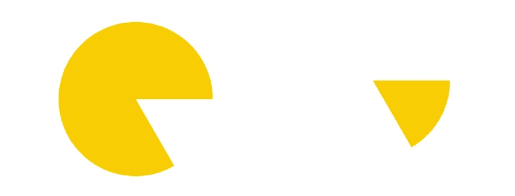
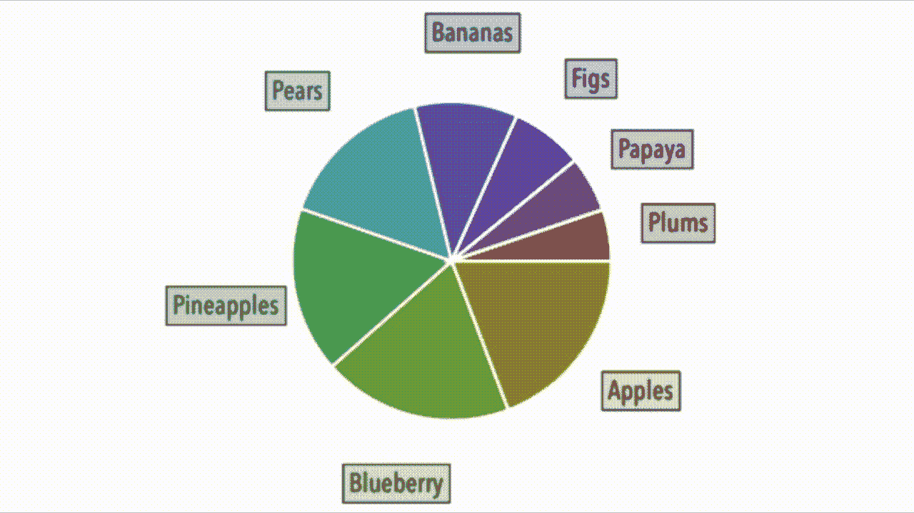

# SwiftUI 2.0 中的一个动画的、自动排序的饼图

> 原文：<https://betterprogramming.pub/an-animated-self-sorting-pie-chart-in-swiftui-2-0-24db465f9413>

## 我的图表系列的第 4 部分


一个自动排序、自动上色的动画饼图

在本文中，我想构建一个动画的、自动着色的饼图，其中包含一个可视化排序。换句话说，我想构建条形图比赛的饼图版本，这在第 3 部分中已经介绍过了。

[](https://medium.com/better-programming/linking-animations-together-to-build-bar-charts-in-swiftui-6a51e3c9bb94) [## 在 SwiftUI 中将动画链接在一起以构建条形图

### SwiftUI 2 中的条形图

medium.com](https://medium.com/better-programming/linking-animations-together-to-build-bar-charts-in-swiftui-6a51e3c9bb94) [](https://medium.com/better-programming/animating-your-bar-chart-with-combine-messages-d703c4266273) [## 用组合消息制作条形图动画

### “在 SwiftUI 中将动画链接在一起以构建条形图”的第 2 部分

medium.com](https://medium.com/better-programming/animating-your-bar-chart-with-combine-messages-d703c4266273) [](https://medium.com/better-programming/a-bar-chart-race-using-swiftui-2-0-ef84dc68b678) [## 使用 SwiftUI 2.0 的条形图竞赛

### 我的图表系列的第 3 部分

medium.com](https://medium.com/better-programming/a-bar-chart-race-using-swiftui-2-0-ef84dc68b678) 

现在为了节省时间，让我们从前面提到的文章中吸取一些教训。我将使用一个`observedObject`来存储变化数据集的记录和我为它绘制的着色函数。我还想使用一些我为该结构开发的其他实用函数。

现在要画一个饼图，你需要一些比萨饼块，或者用数学术语来说是*弧线*。在 SwiftUI 中，您有一个专用的视图类型来构建这些。这个视图被称为`Shape`，这里显示的几行代码说明了语法。

```
**struct** PieSlice: **Shape** {
**func** path(in rect: CGRect) -> Path {
  **var** arc = Path()
  arc.**addArc**(center: CGPoint(x: rect.midX, y: rect.midY), radius: radius, startAngle: .degrees(startAngle), endAngle: .degrees(endAngle), clockwise: false)
  arc.**addLine**(to: CGPoint(x: rect.midX, y: rect.midY))
  arc.**closeSubpath**()
  **return** arc
}
```

与我不久前在这篇关于 3D 绘图的文章[中提到的`rotate`命令不同，`addArc`原语有时会让人有点困惑。因为参数是相互关联的，所以很混乱。](https://medium.com/better-programming/how-to-draw-in-3d-with-swiftui-7989cfcd35fc)



合成图像:' startAngle' > 'endAngle' +逆时针或' startAngle' < 'endAngle' +逆时针

构建弧的代码调用如下所示。我不是故意创造一个吃豆人——这是`addArc`的默认行为。

```
PieSlice(startAngle: 60, endAngle: 0, radius: 100)
  .fill(Color.yellow)
  .frame(width: 64, height: 64)
```

这里有几个重要的注意事项。画画的起点在吃豆人嘴巴的顶端。如果方向不是顺时针，并且开始角度大于结束角度，您将得到您在左边看到的结果。如果我们改变方向，你会看到右边显示的结果。这是一个会让你困惑的重要特性——请注意。想想吃豆人，你就知道了。

好的，所以一个饼图包含了许多切片。这个数字取决于元素的数量，这意味着我们需要对我们的数字做一些数学运算，使它们成比例地适合 360 度，一个完整的圆，也就是我们的馅饼。为此，我们需要将所需的角度预填充到我们的结构中。结构本身现在看起来像这样:

```
**struct** Chart: **Identifiable** {
  **var** id = **UUID**()
  **var** text: **String**
  **var** numbers: **Int**
  **var** position: **Int**
  **var** color: **Color**
  **var** ba: **Double //** begin angle
  **var** ea: **Double //** end angle **var** ta**: Double //** text angle}
```

我添加了一些额外的字段，即角度值`ba`、`ea`和`ta`。我们将提前从`number`字段计算它们。我提前计算它们，因为如果我在绘制图表时这样做，会导致它在我计算每个切片的值时一次又一次地重新绘制。

我还使用原始值来显示原则图像中饼图切片的高度。这些数字需要呈现它们相对于彼此的值，不像我在这里展示的条形图。这是我用来计算`ba`、`ea`和`ta`角度的函数。

```
**func** percent(text: String) -> **Double** {
  **if** **let** i = slices.**firstIndex**(**where**: { $0.text == text }) {
    **let** calc = ((**Double**(slices[i].numbers) / sumUp()) * 360)
    **return** calc
  }
  **return** 0
}
```

函数本身也引用了这个代码片段。`observableObject`类中的两个函数都使用前面定义的结构。

```
**func** sumUp() -> **Double** {
  **var** slicesCount = 0
  **for** index **in** 0..<slices.**count** {
  slicesCount = slicesCount + slices[index].numbers
  }
  **return** **Double**(slicesCount)
}
```

我调用我创建的名为`random`的函数来更新我的结构中的值，然后用这个函数重新调整饼图切片。(注:这个我发现了一个 bug。请继续阅读。)

在绘制饼图的各个部分时，我还为每个部分添加了边框和标签。我们都很好——除了当一个切片发生变化时，我需要重新绘制至少三个切片，以使事情符合在一起。理论上，我可能需要更多的改变。

我用简单的方法解决了这个问题，最后把它们都画了出来。最终的结果是你在这里看到的颤动的图表。



带有动画值的自动着色饼图

这是可以的。我认为总的来说我更喜欢条形图，在上面我可以重画单个的条形。看起来没那么紧张了。

这是我用来构建你在本文顶部看到的图表的代码。它基本上和我用来创建上面那个颤抖的代码一样，只是做了一些小的修改。

SwiftUI 2.0 饼图绘制代码

结构背后的代码在这里:

管理 pie 结构的 Swift 代码

这让我想到了这篇文章的结尾。

保持冷静，继续编码。