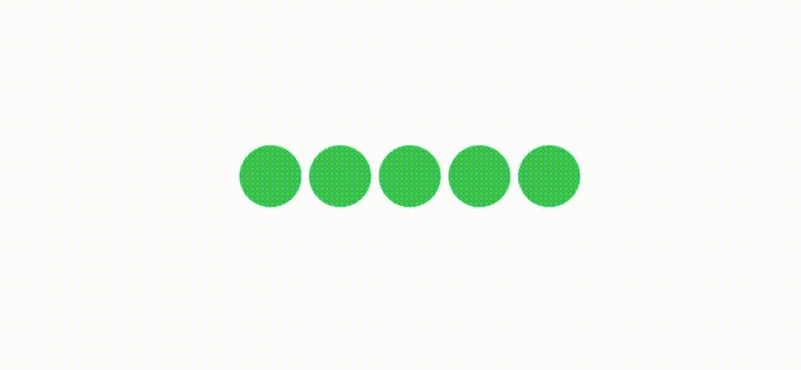
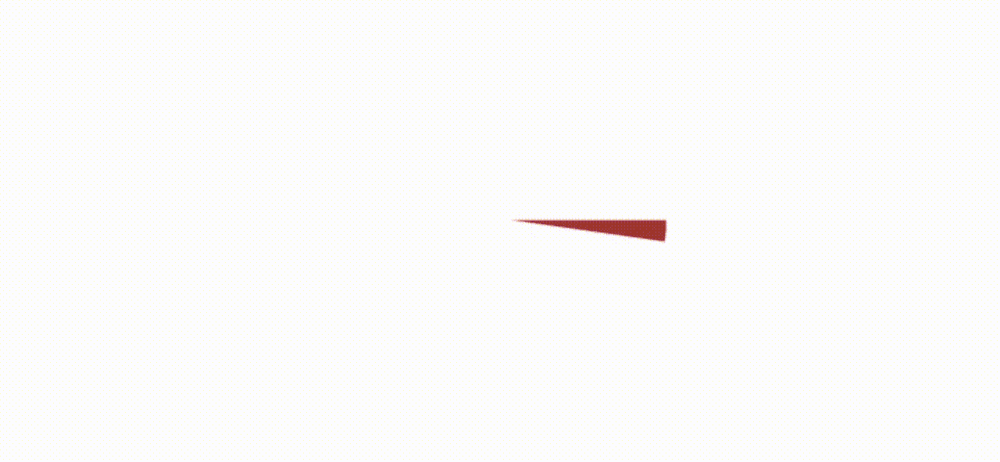

# SwiftUI 2 中动画饼图的更高效实现

> 原文：<https://betterprogramming.pub/an-animated-self-sorting-pie-chart-in-swiftui-2-0-final-revision-1a9038996322>

## 我的图表系列的第 6 部分

SwiftUI 2.0 动画饼图

我对我吃的最后一个馅饼很满意。这是一个很大的改进，有一个迷人的外观，但我仍然觉得还有改进的空间。想到我做过的另一个项目，我突然意识到我应该使用[组合](https://developer.apple.com/documentation/combine)框架作为主要驱动程序。考虑到这一点，我想出了这个解决方案。尽管等等——在你读这篇文章之前，你应该快速浏览一下前两篇。

 [## SwiftUI 2.0 修订版中的动画自动排序饼图

### 那么我们在这里得到了什么呢？我从版本 1 后退了一步，非常仔细地思考了一下，也许这是一个…

medium.com](https://medium.com/better-programming/an-animated-self-sorting-pie-chart-in-swiftui-2-0-revised-f3c277f3118e)  [## SwiftUI 2.0 中的一个动画的、自动排序的饼图

### 在这篇文章中，我想建立一个动画自动着色饼图，其中有一个可视化排序。换句话说，我…

medium.com](https://medium.com/better-programming/an-animated-self-sorting-pie-chart-in-swiftui-2-0-24db465f9413) 

在我开始之前，这里有一份简单的沙拉来说明我要去哪里。下面是一张 GIF 图，显示了屏幕上的五个绿点。这是一个通过使用 Combine 框架发送的消息进行外部管理的转换。

SwiftUI 中使用 Combine 和 DispatchQueues 的颜色远程动画

代码的工作方式是画五个圆，并在每个圆上添加可寻址的标签。然后，我可以将一条组合信息聚焦在一个圆圈上——在我们的例子中，这条信息会改变颜色。

一个简单的解决办法，不是吗？好的，这是总体规划。我像以前一样把圆画成一系列馅饼，每个馅饼都是可寻址的。画完圆后，我会指示各个部分按照预先计算好的百分比改变颜色。它看起来很像上一篇文章，除了我不会不断地重画屏幕。我只会改变已经绘制好的饼图中各部分的颜色。这是一个将这一概念应用于饼图的动画 GIF，在整个色谱中使用 2 度切片——一个有 180 个切片的饼图。显然这里没有标签的空间。

包含 180 个切片的 SwiftUI2.0 饼图

事实上，它不清除屏幕和重画自己是一个很大的奖励。这种差异应该意味着我们最终可以建立一个饼图，看起来就像条形图比赛一样，可以平滑地改变其中的分段。

虽然我必须承认我正在重画白色的切片和文字，这就是为什么你会看到它们出现在屏幕上。也许还有改进的余地。

下面是这篇文章开头的代码。请注意，被注释掉的订户例程是我用来构建上述多色圆圈的方法。我把它留在这里是因为它是一个很好的例子，说明了如何在您的纯 Swift 代码(相对于 SwiftUI 代码)中捕获一个组合发布者。

关于开头的动画 GIF，我应该承认这不是完整的代码。我随后添加了这个例程，因为我想要更多的标签。

增加了一些小功能，以在饼图中获得更多标签

整个 app 是怎么运作的？我借用了以前 pie 版本的数据结构，以及一些更新它的函数。这些功能在很大程度上没有什么变化。我使用所述数据结构应用一些数学计算出他们可以声称的每个饼的大小。我用这些数据完成了一个 360 个盒子的矩阵，一个绘图程序随后会引用它。

当我调用 Combine 框架来重画馅饼和改变所用的颜色时，它就出现了。它使用的是 360 度的数据结构。它没有我希望的那么快，也没有我希望的那么平滑，但感觉比以前的版本好一点，白色闪光更少。

所有这些也把我带到了这篇文章的结尾。我希望你和我写这篇文章时一样喜欢阅读，并且确实学到了一些东西。

保持冷静，继续编码。