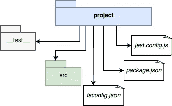
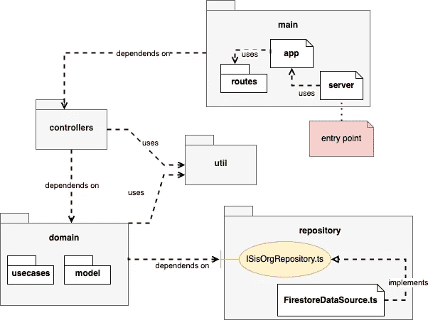
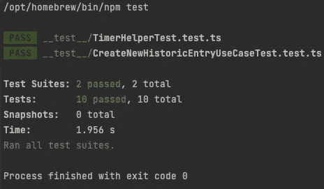

# 从一个 Android 开发者的角度看一个 API 项目

> 原文：<https://betterprogramming.pub/an-api-project-from-an-android-developers-perspective-97ae5d9f110b>

## 启动 API 的指南

照片由[纳丁·沙巴娜](https://unsplash.com/@nadineshaabana)——[Unsplash](https://unsplash.com/photos/UBvF7tGcLdg)拍摄

据我的后端开发朋友说，对我来说最简单的方法是使用 [TypeScript](https://www.typescriptlang.org) 在 [NodeJS](https://nodejs.org) 中开始编写服务器应用程序。

奇怪的是，NodeJS 没有运行类型脚本代码的方法，只有 JavaScript，所以我们需要将类型脚本代码转换为 JavaScript，这被称为“ [Transpiling](https://stackoverflow.com/questions/44931479/compiling-vs-transpiling) ”

关于 IDE，我试了两个工具: [Visual Studio Code](https://code.visualstudio.com) 和 [WebStorm](https://www.jetbrains.com/webstorm) 。网络风暴是我的最爱。用起来方便很多，因为我习惯了 Android Studio。两者都是 JetBrains 的产品，所以有相似的开发者体验。

# 项目结构

在服务器应用程序中有很多方法来组织你的文件，我将向你展示一种我发现更类似于 Android 项目的方法。

项目结构图

我们可以在我们作为 Android 开发人员的知识和之前的图片之间建立联系:

*   从 Android 开发者的角度来看,`package.json`是`build.gradle`和`AndroidManifest.xml`的融合。我们需要在这个文件中定义:应用程序名称、应用程序版本、应用程序启动的主文件、一些脚本(如 Gradle tasks)、依赖项、开发依赖项等。
*   `__test__`是我们放置单元测试的目录。在服务器端，我使用 Jest 作为框架。这是 Android 开发者眼中的 JUnit
*   `jest.config.js`是我们定义测试配置和运行方式的地方
*   src 是我们对代码进行分组的地方，类似于我们的主应用程序模块

# 体系结构

架构图

# 入口点

在服务器端，我们有路由，而不是活动或片段作为入口点。我们没有用户可以触摸的 UI，但是应用程序(在本例中是我们的用户)将调用路线。我们有不同的路径:GET、POST、PUT 和其他。我将展示一个路线示例:

将 Express 与自定义路由器对象一起使用的基本配置。

[Express](https://expressjs.com) 是一个框架，允许我们简单地创建路线。如您所见，`app.ts`文件正在导入已经由`historic.routes.ts`文件定义的`historyRoutes`(下一个代码)。我们有一个委托给特定控制器的 POST 方法的例子，控制器将请求转发给特定的用例。

处理 POST 请求的特定控制器对象。

# 依赖注入

如果你喜欢 Android 世界里的 [Koin](https://insert-koin.io) 或者 [Kodein](https://github.com/kosi-libs/Kodein) ，用 [TSyringe](https://github.com/microsoft/tsyringe) 做依赖注入库会非常容易。

下面的代码显示了一个`server.ts`文件，我们在其中为实现`ISisOrgRepository`接口的`FirestoreDataSource`注册了一个单例引用。这个文件就像我们的`Application`类。这个文件是我们应用程序的入口点。

添加应用程序存储库的实例(它将可用于整个应用程序)。

`TSyringe`知道某人是否需要`ISisOrgRepository`的引用，应该提供`FirestoreDataSource`实例。在这种情况下，类`CreateNewHistoricEntryController`需要创建`CreateNewHistoricEntryUseCase`，但是为此，需要请求`TSyringe`来解析依赖关系(`ISisOrgRepository`构造函数参数)。

带有一些注释的 UseCase 有助于依赖注入库。

在我们的`CreateNewHistoricEntryController`中，我们可以请求依赖注入库来帮助创建我们的`CreateNewHistoricEntryUseCase`对象。

控制器要求使用容器用例引用。

# 试验

我试了两个库:[茉莉](https://jasmine.github.io)和 [Jest](https://jestjs.io) 。他们非常相似。由于漂亮的输出报告，我最终使用了 Jest。

截图 Jest execution 的精彩报道。

语法与使用 Kotlin 的 JUnit 测试非常不同，但是如果您将“describe”作为测试套件名称，将“it”作为单元测试名称，这一点就很清楚了。断言部分是直观的，似乎我们在使用[真值](https://truth.dev)库。

在 TypeScript 中使用 Jest 的测试示例— TimeHelper 类

# 最终提示

*   Heroku 是举办 API 的好地方。CLI 很容易使用，如果您的`package.json`状态良好，CLI 将在您每次推送代码时自动为您运行脚本(传输文件、安装依赖项、启动服务器)
*   [失眠](https://insomnia.rest)是测试你路线的绝佳工具。您还可以创建不同的环境(开发、生产……)
*   Swagger 允许我们创建丰富的文档。您可以运行文档中的路线(此处的示例[为](https://petstore.swagger.io))。

# 结论

如果你开始使用新技术，与有经验的人进行技术讨论会很有帮助，因为热门技巧可以节省大量时间，缩短学习曲线🤗。