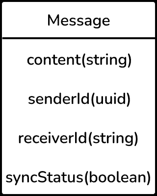

# 移动系统设计面试应用开发者指南

> 原文：<https://betterprogramming.pub/an-app-developers-guide-to-mobile-system-design-interviews-74cd552bd963>

## 作为一名 Android 或 iOS 开发人员，知道如何在下一次面试中胜出

克里斯托夫·高尔在 [Unsplash](https://unsplash.com?utm_source=medium&utm_medium=referral) 上拍摄的照片

每当您在互联网上搜索移动系统设计资源时，都会收到大量文章的轰炸。但是，唉，一旦你打开它们，你会发现它们只是一个骗局。原来是后端系统设计相关的文章，而不是移动系统设计。

缺乏针对移动设备的系统设计文章令人震惊！

在本文中，我将尝试解决您在移动系统设计面试中可能面临的一般问题。在这篇文章中，我将尽可能地涉及更多的内容。

本文不是关于如何解决一个具体的系统设计问题的文章，比如构建一个像 WhatsApp 这样的消息应用程序，因为对于一个系统设计问题没有唯一正确的答案，而且，每个问题可能会占用一篇文章。相反，这是给你配备一套工具和心态，以确保你能顺利通过面试。

# 系统设计面试的组成部分

我通常把整个面试分成四个部分:

1.  问题陈述和功能说明
2.  高层系统设计方案
3.  低层设计决策
4.  履行

## 在移动系统设计面试中要记住的事情

就代码而言，移动系统设计面试与后端系统设计面试略有相似，但就解决方案而言，差别不大。

以下是为移动应用程序设计解决方案时，你必须牢记的一些事情:

*   通用 API 通信设计
*   互联网连接问题，即应用程序连接不良或离线
*   离线存储
*   处理应用生命周期回调
*   通知
*   安全性
*   关于代码的实际实现细节(我已经在实现部分讨论过了)

## 沟通:显而易见但不常用的关键

面试的三个最重要的方面是你对问题陈述的清晰，你的解决方案，以及你如何有效地向主持面试的人传达你的解决方案。在这个过程的每一步，确保你和面试官谈论了你的想法。对于任何面试来说，沟通似乎都是一个非常明显的关键，但是你会震惊地发现有多少人因为任何原因而忘记了沟通。

花几秒钟理解你面前的问题陈述，然后思考你将如何处理它。这可能是你想到的最简单的答案，可能有一些逻辑上的不一致，但是继续和你的面试官交流。如果你对自己的答案有把握，并且已经想到了边缘案例，那么这绝对是一个加分项，但即使你的解决方案不能解决所有的案例，也要让面试官知道你无法解决的边缘案例，并思考一下，也许他们会帮你解决问题，或者给你一些提示。

在回答问题之前，你思考解决方案的时间是在这里找到正确的平衡。不要想都没想就胡乱回答，但也不要想太多，不让面试官看到你的思维过程。把它想象成把你的代码提交给 Git。你不想让你的代码长时间处于未提交状态，是吗？

无论如何，面试官会根据你的经验设定他们的期望，所以如果你是这个行业的新手，没人会指望你每次开口都会脱口而出正确的答案。

既然我们已经解决了沟通部分，让我们继续实际的流程。

# 问题陈述

在进行这些系统设计访谈时，我遇到了一般和特殊类型的问题陈述。一些示例问题包括:

*   设计一个图像下载库——有点特别，但仍然非常开放。
*   设计一个网络库——非常开放。
*   设计一个产品分析事件跟踪系统——同样有点开放性。
*   设计一个产品分析事件跟踪系统，做 X 和 Y(其中 X 和 Y 是具体的特征)——非常具体。
*   设计一些著名的应用程序，比如优步/Twitter/Spotify/WhatsApp。

即使你没有听说过某个特定的应用程序也没关系。一般的问题陈述无论如何都会被分解成有形的需求，例如，我想构建一个拼车服务或一个管理和下载歌曲的应用程序。

## 问题陈述的澄清

在这个过程中，第一个重要的步骤是将问题陈述澄清为你可以构建的具体需求。像“设计一个消息应用程序或拼车应用程序”这样非常笼统的说法不会帮助你前进。你必须向面试官询问更多具体的特征，你也可以提出这些特征。

这里的目标是能够弄清楚面试官希望你实际实现的具体特征是什么。他们将检查你是否熟悉手头的问题，是否能提出与问题陈述相关的核心工程问题。请记住，向他们询问他们想要实现的特定功能总是没问题的，即使您无法弄清楚。

然后，面试官和你可以最终确定你一定要建立的某些功能，如果你还有时间，也许可以提出一些你可以探索的功能。

出于本文的目的，让我们以构建一个消息应用程序为例。可以提出来解决的几个特征是:

*   特定用户的在线/离线状态
*   一对一聊天功能——可能是必须实现的最基本的功能，因为问题陈述是构建一个消息应用程序。
*   群聊功能
*   图片上传服务

# 高级系统设计提案

现在你已经在澄清过程中列出了一些需求，你将不得不讨论你将如何解决每个特性。

总是尽量把纸和笔放在手边，这样你就可以记下你的观点。如果你能在心里做到，你会更有力量，但是我发现写下来会给你一个更好的思维过程的思维地图。无论如何，写下实际构建该特性所需的步骤。

这说起来容易做起来难，所以让我们以消息应用程序上特定用户的在线/离线状态为例，也许是如何实现两个用户之间的一般聊天。假设，在澄清步骤之后，你和面试官决定两个特征。

**功能 1** —假设 A 在应用程序上上线，B 在手机上打开 A 的个人资料。B 应该能够看到 A 的在线或离线状态。

**功能 2** —用户应该能够互相发送消息。

在这里与面试官澄清不同的案例及其结果，并记录下来。

对于不同的情况，您可以随时查看“需要记住的事项”部分。

例如，如果 A 人在聊天时失去连接，该怎么办？如果用户在线时关闭应用程序或接到电话，会发生什么情况？如果用户在没有活动的互联网连接时发送消息，会发生什么情况？等等。

首先讨论一般的正面/负面案例及其行为，然后继续讨论边缘案例。

# 低层次设计

既然您已经有了需求，那么您需要真正地了解它的底层设计方面。让我们来看一下“需要牢记的部分”以及你的解决方案将如何变成实际可行的东西。

因此，在线/离线状态功能的流程可能如下所示:

人 A(移动应用)->在线->告诉服务器他们在线

人 B(移动应用)->在线->告诉服务器他们在线->打开人 A 的个人资料->向服务器请求人 A 的状态->服务器响应人 A 在线。

让我们试着浏览一下一般的“需要牢记的事情”清单:

## 后端 API 设计

在 API 设计部分，您必须决定您期望在客户机和服务器之间进行什么样的通信，以及如何定义它。

通信会不会是单方面的，简单的 REST APIs 就能满足？或者，他们是否需要某种双向通信，这可能涉及套接字、高频轮询或长时间轮询？根据它的重要性和您希望解决方案的实时性，找出适合您的用例。

一旦决定了通信的类型，就需要确定在这些 API 中实际发送什么参数。

例如，对于在线/离线功能，我们可以看到，当用户在线时，移动应用程序和服务器之间存在通信，传递给它的参数应该明确包括`userId`，以便服务器知道谁在线。

所以你可以给他们一个这样的结构:

POST — `/online`，参数为`userId`，或者可能是标识`userId`的报头

在聊天的情况下，您可能最终会使用套接字连接，因为发送消息需要实时性。

一些面试官并不寻找精确的 API 规范，但是如果你知道最佳实践(分页、批量上传等)，这总是一个好的迹象。我认为如果你能和你的面试官交流最基本的东西，你应该很好，但是任何超过这一点的东西肯定会给你加分。如果面试官不需要更多的信息，他会告诉你。

## 互联网连接+离线存储

这两者通常是相互关联的，尽管离线存储本身也可以解决问题。这里再举几个例子:

对于在线/离线功能，如果用户 A 上线，正在使用应用程序，然后设备的互联网突然被切断，该怎么办？在这一点上，面试官可能会说，如果互联网关闭，该人的状态应该说离线。现在，解决这个问题的唯一方法是，当用户的互联网连接被切断时，服务器需要推断用户不在线(因为客户端无论如何都无法与服务器通信)。那么，你可以建议一种心跳机制来解决这个问题。客户端需要每隔`X`秒持续点击`online`端点。如果互联网连接被切断，服务器将不会在`userId`的`online`端点上接收到呼叫，并且服务器可以将该用户的状态更新为离线。

离线存储的一般用例是在应用启动时保存数据。对于离线存储，您首先需要弄清楚的是，您的离线存储是基于文件还是基于记录。例如，存储文件或图像可能不需要数据库。您可以将它们保存在设备文件系统中。

对于基于记录的存储，你必须弄清楚你是想使用简单的共享偏好(Android) /用户默认(iOS)类型的存储还是数据库解决方案。在数据库解决方案的情况下，您必须弄清楚表结构和表将容纳的列。您还需要弄清楚它们的数据类型，以及如何查询数据。

例如，在发送消息的情况下，访问者可能会提出一个要求，即即使没有互联网连接，用户也应该能够发送消息。这无疑需要一个基于记录的解决方案。在这种情况下，一种解决方案是将设备未连接到互联网时发送的消息存储在永久存储器中，并使用一个布尔变量来表示该特定消息是否与服务器同步的状态。该结构可能如下所示:

同样，这个变量可以是一个布尔值，也可以是一个字符串，表示消息可以有几个有限的状态，比如`SENT`、`READ`和`UNSYNCED`；这完全取决于要求。

现在，当连接恢复时，您可以通过查询数据库中所有将`syncStatus`作为`false`的消息，并将它们发送到您的服务器，将所有未同步的消息同步到您的服务器。

## 通知

这些可能涉及本地通知和远程推送通知。使用远程通知作为特定问题的解决方案时要小心，因为它们取决于用户的互联网连接以及用户是否允许应用程序接收推送通知。

如果解决方案需要的话，你可以随时使用静默推送通知来进行同步(但话说回来，在没有互联网连接的情况下，你还是要小心)。然后，您的解决方案可以包含某种轮询机制，并结合应用程序生命周期回调，这就引出了我的下一部分。

## 应用生命周期处理

你需要应用生命周期方法处理来应对应用生命周期的变化(废话！).当您希望优化应用程序和服务器之间的数据同步时，尤其需要它。

例如，您可能希望在应用程序进入前台时进行同步，或者您可能希望仅在用户处于后台时进行同步，而不是在应用程序处于前台时进行多次同步。

这有时还涉及到与您的离线存储的一点重叠，当您想要处理用户终止应用程序时的同步问题(而不只是将其推到后台)。

## 安全性

这将涉及到谈论你是否想在设备上存储个人身份信息或一些关键信息。如果您愿意，您可能需要讨论如何安全地存储这些数据，您可能需要实现哪些不同的身份验证机制来存储这些数据，以及您可能会使用哪种加密机制。

# 履行

这个部门本身就是一头野兽。在这一部分，您可能需要给出底层设计的具体实现细节。应用程序的可扩展性问题与使用应用程序的用户数量无关，因为在现实世界中，大多数情况下只是一个人在手机上与应用程序进行交互。这里的可伸缩性问题与以模块化和可持续的方式编写代码有关。

面试的这一部分通常关注的是你如何设计你的内部框架。你应该关注你的类图将会是什么样子，以及每个类将要公开的 API。

现在，在类图和 API 及其内部工作的上下文中，需要注意的是:

*   代码的可重用性——试着将你的代码分解成更多可重用的组件。找出可以用来实现解决方案不同部分的设计模式。
*   用户友好的 API——这里我指的不是后端 API。我说的是你可能会暴露的函数和变量。它们需要是用户友好的和可配置的，以至于 API 的调用者可以很容易地决定他们想要“什么”,但是你的 API 通常不应该期望调用者决定他们想要“如何”完成它。这应该由您的代码根据您可以用来确定解决问题的最佳方法的任何参数来决定。
*   架构和状态管理决策——根据您的观点，对于您正在实现的功能规模，什么是好的架构(例如，MVC 或 MVVM ),对于您的代码库，什么是好的状态管理解决方案(例如，Redux )?
*   应用程序中不同组件之间的通信——是使用委托模式进行一对一的通信，还是必须使用某种广播机制来实现通信？
*   多线程，以及如何实现它——例如，对于涉及多个并行下载/上传的问题，您可能会围绕这个问题进行讨论。
*   缓存和缓存回收策略——当你需要从你的服务器上下载大量的资产，并且可能在对你的应用程序的流畅度影响最小的情况下显示它们时，围绕这一点的讨论就会出现。它们也可能出于不同的原因出现，但这是缓存出现时一个非常常见的用例。不要将其与离线存储混淆。
*   节流和去抖动—您是否需要多次调用后端 API 服务？你的面试官对这些 API 调用的频率太高不满意吗？！开始思考如何降低频率。通常，在这种情况下，节流/去抖会有所帮助。你也可以依靠计时器或应用程序生命周期状态观察来找出调用这些 API 的最佳时机。
*   单元测试——确保您决定的 API 易于单元测试。

# 结论

我希望我已经给了你一个关于系统设计面试方向的大致概念。但是老实说，这些问题是如此的普遍，需求可以以如此多的不同方式形成，以至于你可能永远不会为两个听起来相似的需求使用相同的解决方案。

这些讨论是开放式的，我能给你的最大建议就是练习。你是怎么做到的？只需拿起一个应用程序，并找出他们可能如何实现某个特定的功能。它可以简单到如何在你的 Instagram feed 上赞一个帖子，或者如何在 WhatsApp 上分享实时位置。考虑一下这些特性的实现，以及我们已经讨论过的一般约束，比如失去连接/离线模式等。，铭记在心。

查看不同的开源框架也有助于您编写更好的 API。看看他们通过 API 和通用 API 结构公开的配置类型。查看这些库的内部工作方式，了解底层实现细节(例如:它们使用的设计模式，它们如何管理线程，它们如何管理离线场景等)。).

这将帮助你准备好这些可能会给你的要求。回答问题可能很难，尤其是当你第一次遇到这种问题的时候。练习写下你的解决方案，因为你需要能够恰当地交流你的解决方案。

最后，我想你应该在参加系统设计时玩得开心(再说一遍，说起来容易做起来难)。根据本文，您应该已经具备了解决您的问题所需的一些通用工具(希望如此)。

# 进一步阅读

*   OODesign —一个学习面向对象设计模式的网站
*   坚实的原则
*   缓存和缓存回收
*   应用程序的数据库解决方案(例如，可能是 iOS 的 CoreData 和 Android 的 Room)
*   心跳和静默通知
*   推送通知
*   广播和委派模式
*   iOS 和 Android 上的线程(无论你在哪个平台上接受采访)
*   应用生命周期方法
*   服务器通信策略，如轮询、套接字等。