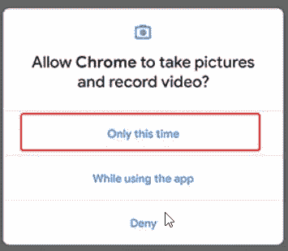
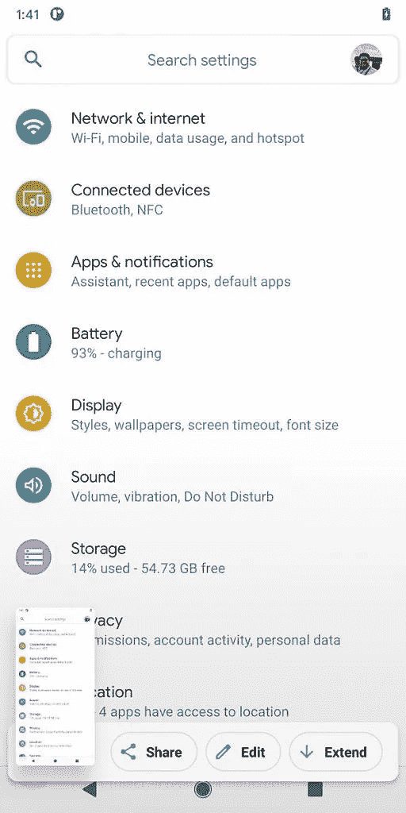
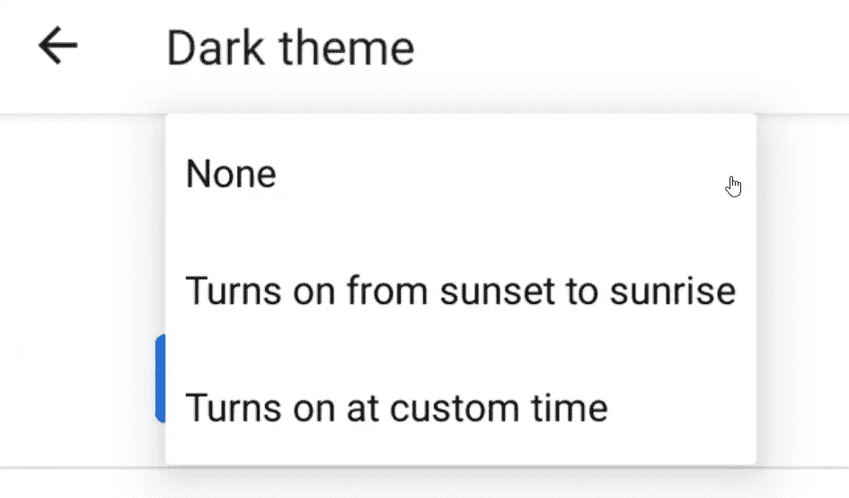

# Android 11 的开发者预览版

> 原文：<https://betterprogramming.pub/an-early-look-at-the-developer-preview-of-android-11-3d5afebb7782>

## 通知气泡、屏幕录制、滚动屏幕截图和改进的隐私设置都在这里

下面就来说说下一版本 Android 最激动人心的功能。

谷歌刚刚发布了 Android 11 开发者预览版，增加了新功能和隐私增强功能。希望你在这里读到的所有内容都可以发布到稳定版本中。

事不宜迟，让我们从通知中的新特性开始。

# 通知更改

1.  会话
2.  粘贴图像
3.  气泡

## 会话

对话是今年我们都没想到谷歌会推出的新功能之一。虽然每个 Android 版本都有通知方面的改进，但这完全是出乎意料的。

通过 conversations，Google 试图让我们在通知的海洋中轻松找到与对话相关的通知。这样，与聊天(WhatsApp、Hangouts、Messenger)相关的通知将被分组到一个单独的部分，并显示在顶部。

## 粘贴图像

毫无疑问，通知面板中的内嵌回复是 Android 中最好的功能之一。

在 Android 11 中，你可以通过复制粘贴选项从通知面板发送图像。没有必要为了发附件而打开任何 app。

## 气泡

聊天气泡是在 Android Q 的早期测试版本中出现的功能，然后在稳定版本中消失了。

有了气泡，消息应用程序可以在浮动布局中显示对话，就像脸书 Messenger 应用程序中花哨的聊天标题一样。现在，你可以在 Android 11 开发者预览版中尝试使用消息应用的通知。

# 一次性权限

谷歌正试图通过每次发布来提高安全性。作为 Android 10 的一部分，我们在权限对话框中看到了新的选项，比如*只允许在使用应用*时使用。

现在，在 Android 11 中，我们有了一个新的选项，对权限有了更多的控制:*，只是这次。*

与之前的版本不同，Android 11 为位置、摄像头和麦克风权限提供了这一选项，这很有意义，因为它们是最重要的隐私相关问题。

谷歌还从权限对话框中移除了 *Allow always* ，这对优步和 Ola 这样的应用来说可能是个问题。由于这是第一个开发者预览版，我们不知道这些变化是否会弥补稳定版本。

# 屏幕记录器

快速设置中的屏幕录制器

终于，原生屏保来了；它最初出现在 Android Q 的早期测试版本中，在稳定版中消失了。现在，它又回来了，有了改进的用户界面。

我们可以在*快速设置*面板下访问该选项。到目前为止，它已经具备了基本功能。还没有录制内部音频或自定义视频分辨率的选项。希望我们能在未来的版本中看到它们。

# 滚动截图

三星、LG 和其他 OEM 厂商是第一批尝试为用户带来新功能的厂商，如果它足够受欢迎，谷歌可能会在现有的 Android 中实现它。

滚动截图是许多 Android 粉丝期待已久的功能之一，它终于来了。

在开发者预览版中，滚动屏幕截图并不是一个开箱即用的选项，但是 XDA 的人们已经试图以他们神秘的方式看到它。看看来自 XDA 的截图。

# 自动黑暗模式

在 Android 11 中安排黑暗模式

自动黑暗模式是去年谷歌在 Android 中引入黑暗模式时被寄予厚望的选项之一。

现在它在这里，我们可以设置自定义计时，或者我们可以选择在日落时打开，在日出时自动关闭。我们不再需要使用第三方应用来自动化库存 Android 中的黑暗模式。

# 其他新功能

## 在共享屏幕中锁定应用程序的选项

在 Android 11 中，将应用程序固定在分享屏幕顶部的选项再次出现。这不是一个新功能，但出于某种原因，它在 Android 10 中被删除了，可能是为了让它更快。

## 拍摄视频时静音通知

Android 11 还在录制视频时静音通知，这很有意义。这可能不是一个非凡的特性，但这是一个很好的特性。

## 通知历史记录

通知历史是 Android 11 中的新功能，可以查看特定应用程序的先前通知，你现在可以通过活动启动器访问它。我希望它能稳定发布。

## 快速设置中的音乐播放器

Android 11 和 iOS 一样在快捷设置里有音乐播放器。我认为把音乐播放器放在快速设置里比放在通知面板里好。

## 改进的蓝牙连接

Android 11 下，开启飞行模式不再断开蓝牙。所以，无论什么时候打开飞行模式都不需要重新连接耳机，这是安卓最讨厌的事情之一。

感谢您的阅读。