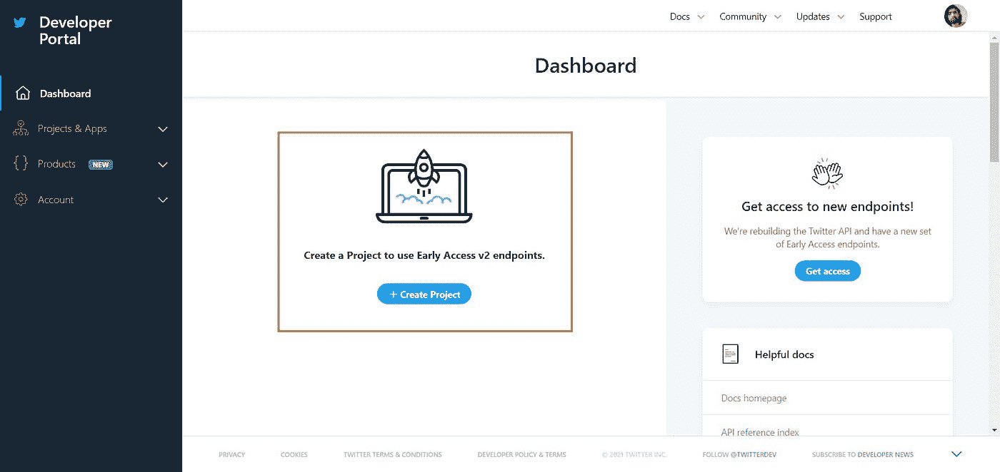
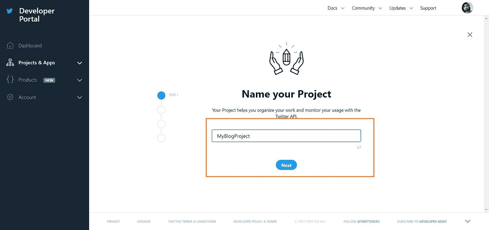
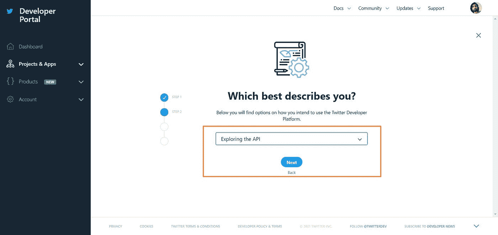
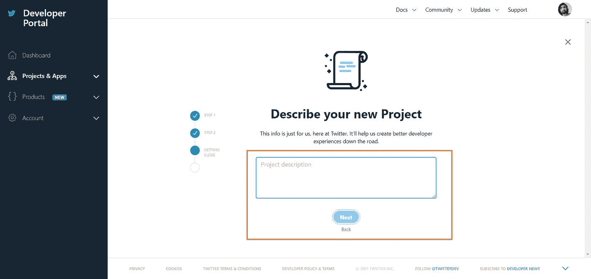
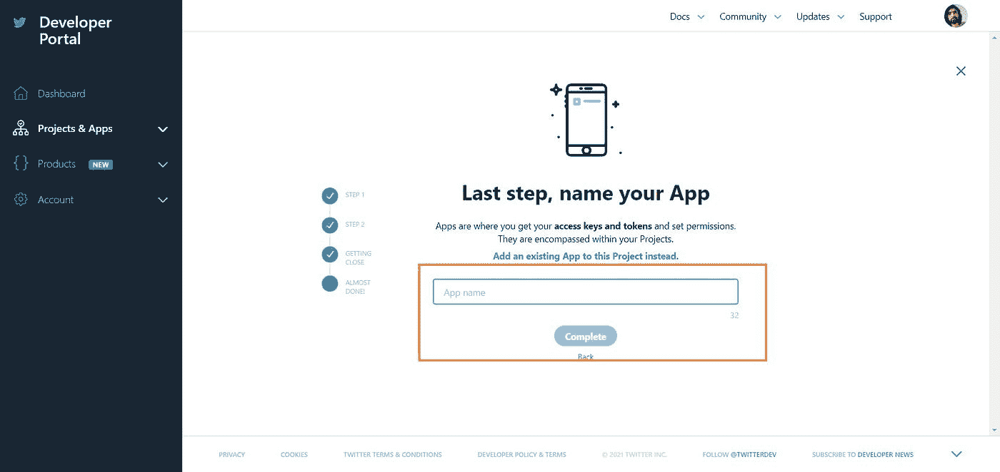
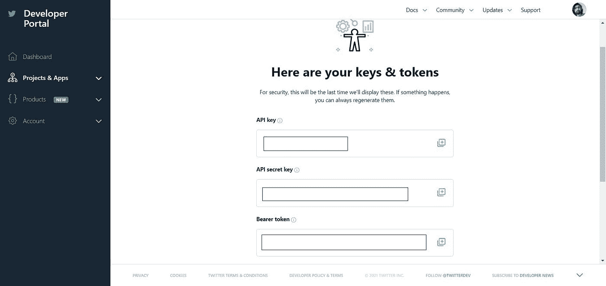
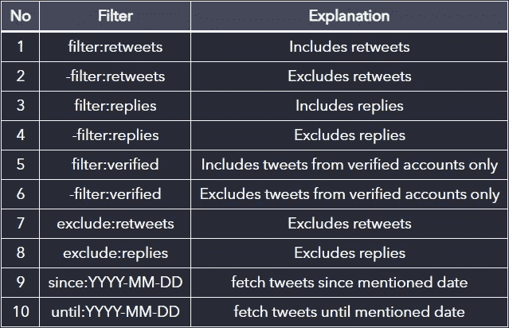
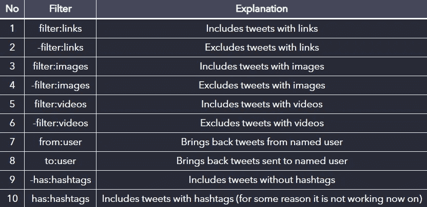

# Twitter 搜索 API 的易用指南

> 原文：<https://betterprogramming.pub/an-easy-to-use-guide-for-twitter-search-api-5e1f4835d841>

## 搜索、过滤等


布雷特·乔丹在 [Unsplash](https://unsplash.com?utm_source=medium&utm_medium=referral) 上的照片

# 介绍

脸书、Instagram 和 Twitter 被认为是顶级的社交媒体平台。根据 [BusinessofApps](https://www.businessofapps.com/data/instagram-statistics/) 的数据，脸书、Instagram 和 Twitter 每月分别拥有 2700、1160 和 3.3 亿估计活跃用户。通过观察这些数字，我们可以说社交媒体已经成为最大的数据来源之一。

尽管脸书和 Instagram 拥有更多活跃用户，Twitter 仍然是学术研究人员和开发者最受欢迎的平台。主要原因可能是 Twitter 提供的数据的可用性和洞察力。

据 Oberlo 称，截至 2018 年，每天有 5 亿条推文被发送。这相当于每秒 5787 条推文。起初，Twitter 只是被用作一个文本平台，但随着越来越受欢迎，它也被用于分享照片和视频。除了分享他们的想法和创意，许多人把 Twitter 作为一个教程和社区平台。

# Twitter 开发者账户

在使用 Twitter API 之前，我们需要设置一个开发人员帐户，并需要创建一个项目来获取 API 密钥。如果您没有 Twitter 账户，您需要创建一个，然后前往 [Twitter 开发者仪表板](https://developer.twitter.com/en/portal/dashboard)并登录。您将看到如下图所示的控制面板:



点击创建项目按钮；它会带你到下面的屏幕。命名您的项目。你可以给它取任何名字，但是它应该是唯一的。我以项目 MyBlogProject 命名。



之后，选择这个项目的原因，写下一些关于这个项目的描述。(我猜，没必要，反正他们就是问这些。)



最后，您只需要给出应用程序的名称。同样，这并不重要，但它应该是唯一的。一旦您按下“完成”,您将获得 API 密钥，如下图所示:



你可以现在复制这些密钥，也可以以后再得到它们。

不要和任何人分享你的钥匙。

现在，如果你点击“项目和应用”，然后从左侧面板概览，你会看到你所有的项目和独立应用。您可以使用“项目”或“独立应用程序”中的两个或任何一个

对于本教程，我们将使用我们在 Project 中创建的应用程序。你可以看到，我有两个项目内的应用程序和一个独立的应用程序。更早的时候，Twitter API 只有一种，那就是 V1.1，但当时我正在写博客，新的 V2 还处于早期接入阶段。因此，对于这个项目，我可以访问两个版本，而对于独立的应用程序，我只能访问 1.1 版。


# 探索 1.1 版

1.1 版 API 中的每个端点都以[api.twitter.com/1.1/search/tweets.json](https://api.twitter.com/1.1/search/tweets.json)开始。我们可以根据需要使用不同的查询参数。在本教程中，我们使用的是标准 API，它对使用有一些限制。根据[官方文件](https://developer.twitter.com/en/docs/twitter-api/v1/tweets/search/api-reference/get-search-tweets)，有多种查询参数可供选择，分别是:

1.  `q`
2.  `geocode`
3.  `lang`
4.  `result_type`
5.  `count`
6.  `include_entities`
7.  `until`
8.  `since_id`和`max_id`
9.  `locale`(目前只有`ja`有效，我们就避开这个。)
10.  `tweet_mode`(这在官方文件中没有记录。)

从上述参数中，只有`q`是必需的查询参数，其他都是可选参数。

# 1.查询参数:q

查询参数`q`用于搜索特定的术语、标签和用户。例如，我们可以使用`#python`来获取所有包含#python 的 tweet，或者我们可以使用`"web development"`作为一个单词来检索所有包含“web development”的 tweet。而且，通过使用`@elonmusk`，我们可以获得用户埃隆·马斯克(Elon Musk)的所有推文和转发。

> *注意:标准 API 将只获取最近七天的数据，如果不使用 count，它将只返回 15 个数据。*

1.  用 hashtag 获取 tweets 的例子:python
    `[https://api.twitter.com/1.1/search/tweets.json?q=%23python](https://api.twitter.com/1.1/search/tweets.json?q=%23python)`
2.  获取包含“web 开发”的推文示例`https://api.twitter.com/1.1/search/tweets.json?q="web development"`
3.  用用户名 elonmusk `[https://api.twitter.com/1.1/search/tweets.json?q=@elonmusk](https://api.twitter.com/1.1/search/tweets.json?q=@elonmusk)`获取 tweets 的例子

在这里，在第一个例子中，你可以看到我们使用了`%23`而不是符号`#`。我们需要使用这样的表示，因为我们不能在我们的 URI 中直接使用一些符号。默认情况下，Twitter API 给出截断的 tweet 数据。因此，要获得完整的 tweets，我们必须传递`tweet_mode=extended`查询参数。

# 2.查询参数:“地理编码”

一旦我们决定了要搜索什么，以及要搜索哪个标签、关键词或用户，我们就可以使用`geocode`参数搜索特定地理位置的推文。这个查询参数是可选的，所以可以根据需要使用它。

现在，如果我想搜索关键字“班加罗尔周围的 python”，我需要传递纬度、经度和半径。因此，我将把查询参数作为`geocode=12.97194,77.59369,1mi`传递。这里，`12.97194,77.59369`和`1mi`分别是纬度、经度和半径。其中 1 英里表示 1 英里。我们也可以用公里。

要获得包含 python 关键字且在 Bangalore 一英里范围内的推文，可以使用以下 URI: `[https://api.twitter.com/1.1/search/tweets.json?q=python&geocode=12.97194,77.59369,1mi](https://api.twitter.com/1.1/search/tweets.json?q=python&geocode=12.97194,77.59369,1mi)`

# 3.查询参数:“郎”

我们可以获得特定语言的推文。例如，我们可以获得包含关键字“印度”且语言为印地语的推文。为了获取这种数据，我们可以使用如下所示的 lang 查询参数:`[https://api.twitter.com/1.1/search/tweets.json?q=India&lang=hi](https://api.twitter.com/1.1/search/tweets.json?q=India&lang=hi)`

人们可以使用下面的[维基百科](https://en.wiktionary.org/wiki/Index:All_languages)页面获得所有语言及其各自代码的列表。

# 4.查询参数:“结果类型”

有些情况下，我们想要最近的推文，而有些情况下，我们想要最流行的推文。在这种情况下，我们可以使用查询参数`result_type`。这个查询参数是可选的，就像`geocode`一样。

我们可以使用 mixed、recent 或 popular 作为`result_type`，其中 mixed 是默认值。

# 5.查询参数:“计数”

当我们想要特定数量的 tweets 时，使用 count 参数。默认情况下，我们将获得 15 条推文，但是在一个请求中，我们最多可以获得 100 条推文。

# 6.查询参数:“包含实体”

通过将查询参数`include_entities`设为 true，可以获得一些额外的数据。

使用下图所示的 URI 给出了额外的`entities`字段数据。


实体数据:

> 这里需要注意的一点是，我用%22 代替了双引号(")，用%20 代替了空格。

# 7.查询参数:“直到”

要获取特定日期之前创建的所有 tweets，我们可以使用 until 查询参数。日期格式应为 YYYY-MM-DD。请记住，搜索索引有七天的限制(对于标准 API)。换句话说，超过一周的日期将找不到推文。

当我写这个博客时，它是`2021-03-28`，所以，我可以请求数据到`2021-03-22`。如果我请求日期`2021-03-21`，它会给我一个空数组。可以使用下面的格式来使用 until 参数:
`https://api.twitter.com/1.1/search/tweets.json?q=python&until=2021-03-22`

# 8.查询参数:“自 _id”和“最大 _id”

说真的，在文档中，我找不到我们如何获取/生成`since_id`和`max_Id`。

根据文档，如果我们`use _since*id*`，它将返回 ID 大于(即比)指定 ID 的结果。另一方面，`_max*id*`将返回 ID 小于(即早于)或等于指定 ID 的结果。

# 布尔语法

我们可以使用布尔运算符和分组机制来获得更具体的 tweets。我们可以使用逻辑 And、OR 和 NOT(-)运算符。我们可以用`use _round`括号对多个关键字和过滤器进行分组。

如果我们想搜索包含 python 和开发者的 tweets，那么我们可以写`q=python%20developer`。这将搜索带有关键词 python 和 developer 的 tweets。这里，注意 python 和开发者不需要走到一起。

如果我们希望它们在一起，我们可以写`q=%22python%20developer%22`或`q="python developer"`。如果我们想要用 python 或者开发者的 tweets，那么我们可以写`q=(python OR developer)`。

如果我们想忽略带有某些关键字的推文，我们可以使用连字符(-)。因此，要获得带有关键字 python 或 Django 的 tweets 并忽略 developer，我们可以编写一个类似于`q=(python OR Django) -developer`的查询。

**注意**:我们可以在查询中使用多个 OR 和 negation。要使用多重否定而不是使用`-(iPhone OR iMac OR MacBook)`，请使用下面的:`-iPhone -iMac -MacBook`。

使用多重操作时可能会有一些不确定性。例如:

*   `apple OR iPhone iPad`将被评估为`apple OR (iPhone iPad)`
*   `iPad iPhone OR android`将被评估为`(iPhone iPad) OR android`

为了消除不确定性并确保您的规则得到预期的评估，请在适当的地方用括号将术语组合在一起。例如:

*   `(apple OR iPhone) iPad`
*   `iPhone (iPad OR android)`

# 更多过滤器

根据其他在线资源和官方文档，我们可以通过回复、转发以及基于帐户验证与否来过滤数据。



Twitter API 的过滤器选项

要使用这些过滤器，我们需要逻辑 AND 和 OR 运算符。顾名思义，它的作用是一样的。要了解更多，我们可以通过一些例子。

1.  获取带有关键词 python 的推文，排除转发:`https://api.twitter.com/1.1/search/tweets.json?q=python AND -filter:retweets`
    或
    `https://api.twitter.com/1.1/search/tweets.json?q=python AND exclude:retweets`
2.  获取带有关键词 python 的推文，排除回复:`https://api.twitter.com/1.1/search/tweets.json?q=python AND -filter:replies`
    或
    `https://api.twitter.com/1.1/search/tweets.json?q=python AND exclude:replies`
3.  获取带有关键词 python 的推文，排除转发和回复:`https://api.twitter.com/1.1/search/tweets.json?q=python AND -filter:retweets AND -filter:replies`
4.  从一个经过验证的账户获取带有关键词“苹果 iPad”的推文:`https://api.twitter.com/1.1/search/tweets.json?q="apple iPad" AND filter:verified`

其他一些文件管理器包括:



Twitter API 的过滤器选项

还有许多其他的过滤器，但是在这里把它们都提到并不是一个好主意。你可以在官方文档中找到所有其他的过滤器。

> ***注:*** *这里，写用户名不用@了*

最后一个例子:假设我们想通过忽略 flask 来获得最近 50 条带有关键字“python developer”和 Django 的 tweets。我们只想要推文和回复(换句话说，我们不想要转发)。我们需要班加罗尔周围的英语(en)语言的完整推文，我们不想要额外的实体。

解决方案:

```
https://api.twitter.com/1.1/search/tweets.json?q=("python developer" AND  django) -flask AND exclude:retweets&tweet_mode=extended&lang=en&count=50&geocode=12.97194,77.59369,10mi
```

# 结论

我尝试解释了使用 Twitter API 获取 tweets 的所有方法和过滤器。我写这篇博客是为了向开发者介绍标准的 Twitter API。可能还有许多其他查询参数和过滤器没有在这里提到。

# 参考

我感谢下面提到的所有资源。这些是帮助我写这篇博客的资源:

1.  [如何掌握 Twitter 搜索:基本布尔运算符和过滤器](http://thesocialchic.com/2013/04/26/how-to-master-twitter-search/)
2.  [堆栈溢出](https://stackoverflow.com/questions/27941940/how-to-exclude-retweets-and-replies-in-a-search-api)
3.  [搜索推文](https://developer.twitter.com/en/docs/twitter-api/v1/tweets/search/api-reference/get-search-tweets)
4.  [规则和过滤:Premium v1.1](https://developer.twitter.com/en/docs/twitter-api/premium/rules-and-filtering/using-premium-operators)

```
**Want to Connect?**Let me know if you need any help or want to discuss something. Reach out to me on [Twitter](https://bit.ly/3KjwgZV) or [LinkedIn](https://bit.ly/3JbsPDm).
```

如果你想知道如何在 JavaScript 中使用 **Twitter 搜索 API，可以看看这个博客👇**

[](https://javascript.plainenglish.io/best-path-to-twitter-api-using-javascript-3-clear-steps-ca3eba503115) [## 使用 JavaScript 通过三个清晰的步骤获得 Twitter API 的最佳途径

### 关于如何用 JavaScript 从 Twitter API 获取数据的初学者指南。

javascript.plainenglish.io](https://javascript.plainenglish.io/best-path-to-twitter-api-using-javascript-3-clear-steps-ca3eba503115) [](https://blog.sahilfruitwala.com/guide-to-extract-tweets-using-tweepy) [## 使用 Tweepy 获取推文的综合指南

### Twitter 是这个人工智能时代最受欢迎的数据来源之一。如今，数据几乎是…

blog.sahilfruitwala.com](https://blog.sahilfruitwala.com/guide-to-extract-tweets-using-tweepy)