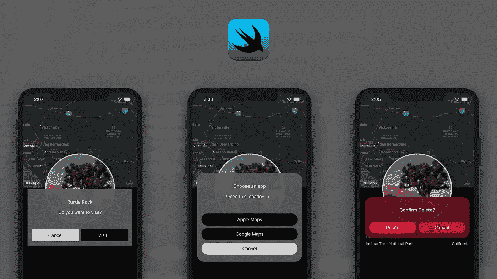
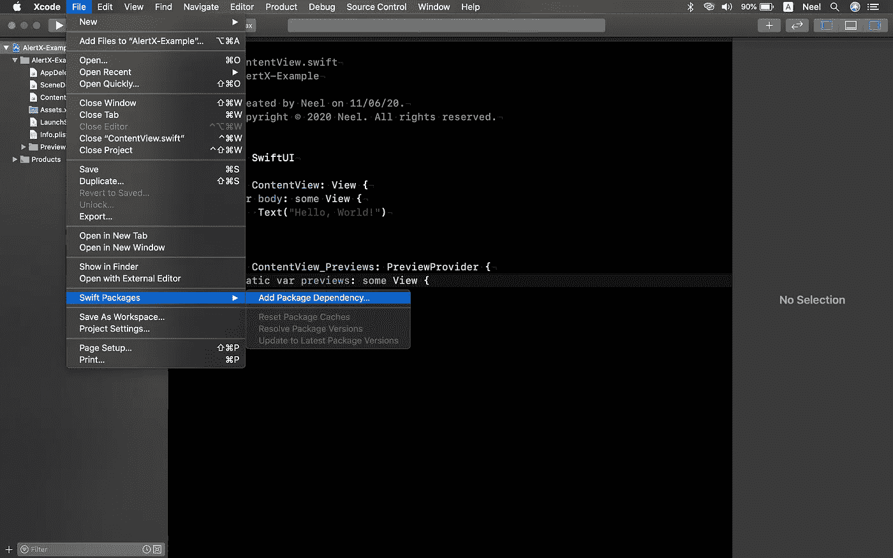
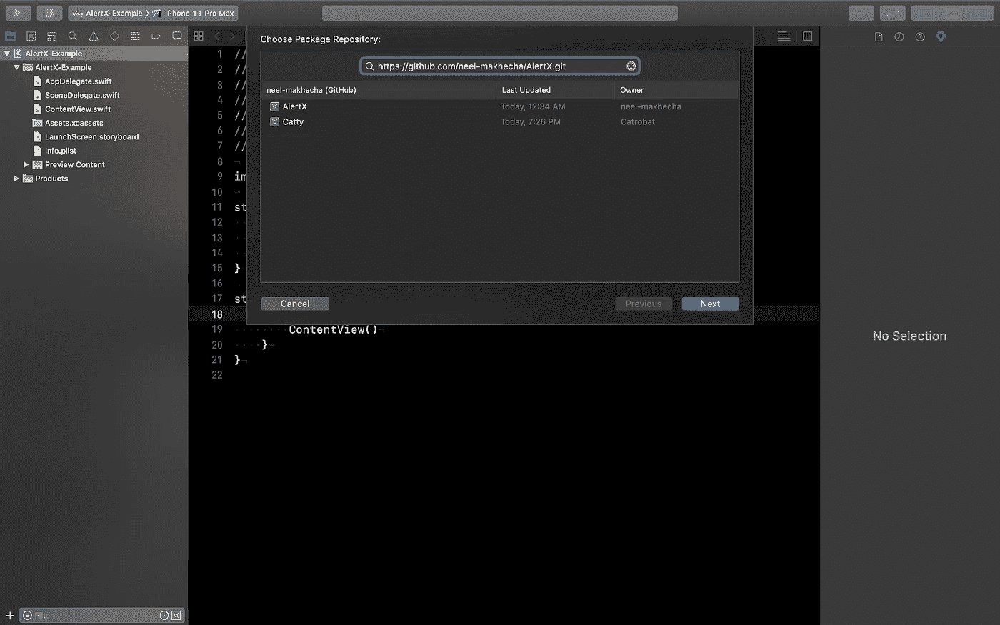
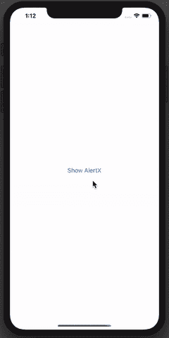
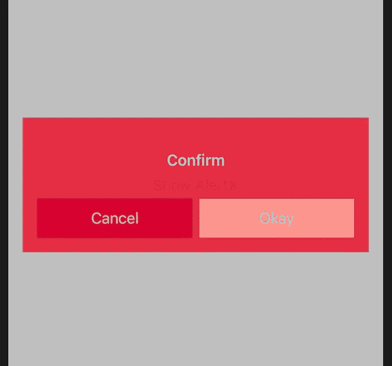
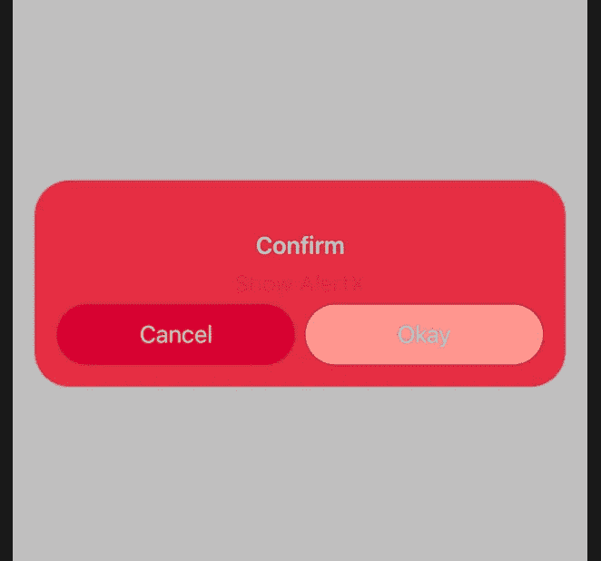

# 在 SwiftUI 中创建自定义提醒的简单方法

> 原文：<https://betterprogramming.pub/an-easy-way-to-create-custom-alerts-in-swiftui-8a6b3dda8633>

## 为您的用户构建和呈现自定义提醒



图片来源:作者

在 SwiftUI 上呈现系统警报非常简单。只需调用一个实例方法`alert`并传递几个参数，就大功告成了。但是出现的系统警告对于不可定制的默认设计来说太基本了。这就是为什么拥有您自己的自定义提醒是一个好方法，更适合您的需求和设计。有各种方法可以实现这一点，但在本文中，我将向您介绍我开发的一个很酷的新开源库，名为 AlertX，使用它可以以一种超级简单的方式实现自定义警报，就像实现那些默认警报一样。

在这篇文章中，我将通过几个例子详细解释这个过程，但是如果你想知道它是如何工作的，可以在它的 [GitHub 页面](https://github.com/neel-makhecha/AlertX)上查看这个库的文档。

# 安装 AlertX

AlertX 基本上是一个 Swift 包，可以使用 Swift 包管理器安装在任何现有的 Xcode 项目上。因此，如果您使用 Xcode 11 或更高版本(您肯定会这样做，因为这个库只用于 SwiftUI ),您可以从那里安装任何 Swift 包依赖项。

因此，让我们首先为 iOS 创建一个新的 SwiftUI Xcode 项目(或者您可以继续使用现有的项目)。

**第一步。**在您的 Xcode 项目中，导航到文件> Swift 包>添加包依赖关系。



第一步

**第二步。**在包存储库 URL 中，输入这个:[https://github.com/neel-makhecha/AlertX.git](https://github.com/neel-makhecha/AlertX.git)。(快速提示:您可以快速查看并添加您在 GitHub 上标记的所有 repos 列表中的依赖项)，然后单击 Next。如果你愿意，你可以制定规则；否则，单击“下一步”，最后确保选中“选择产品和目标包”下的 AlertX，然后单击“完成”。



第二步

成功完成第 2 步后，您将在 Xcode 的项目导航器中看到一个新的部分，上面写着“Swift Package Dependencies”，后面是所有已安装的 Swift 软件包的列表。

# 开始:展示自定义提醒

使用 AlertX 显示自定义警报与显示系统原生警报一样简单。只需在您的文件中导入 AlertX，您将有一个在每个 SwiftUI 视图上调用的新方法。

## **第一步。**设置视图

(这里我用一个按钮来说明，但是它也适用于其他视图，比如使用`onTapGesture`的`Text`

```
import SwiftUIimport AlertXstruct ContentView: View { @State var showAlertX: Bool = false var body: some View { Button(action: { self.showAlertX.toggle() }, label: { Text("Show AlertX") }) }}
```

在上面的代码中，我刚刚导入了 AlertX 并创建了一个布尔类型的变量`showAlertX`，它具有`@State` 属性包装器，将负责我们的自定义警报的显示。我也有一个按钮，它的动作只是切换`showAlertX`的值。我们也可以只写`self.showAlertX = true` 而不使用 toggle，因为我们稍后将把值作为`Binding`传递，所以一旦警报解除，它将被库自动更改为`false`。

## 第二步。新方法 alertX 和相同的旧参数

```
alertX(isPresented: Binding<Bool>, content: () -> AlertX)
```

如上面的方法签名所示，`alertX`接受两个参数:`Binding<Bool>`类型的`isPresented`，它将接受`showAlertX`属性和一个返回类型为`AlertX`的闭包。(该方法与现有方法`alert`非常相似。唯一的区别在于第二个参数，即返回类型为`Alert`的闭包。)

```
Button(action: { self.showAlertX = true}, label: { Text("Show AlertX")}).alertX(isPresented: $showAlertX, content: { AlertX(title: Text("AlertX Title"))})
```

注意:从这里开始，我将只展示相关代码的片段，而不是展示每个示例中的完整代码，以使其更加清晰。

上面的代码片段显示了`alertX`的实现，其中我将`showAlertX`作为`$showAlertX`传递，以访问它的`Binding<Bool>`值。

还传递了一个闭包，其中有一个语句，用一些参数声明 AlertX(还不需要`return`关键字，因为我们只在一个语句中声明了要返回的对象)。

事实上就是这样！只需继续运行项目并点击按钮。您现在将看到一种全新类型的警报，就像这样…



# 按钮和动作

AlertX 的按钮属于`AlertX.Button`类型，与`Alert.Button`非常相似，用静态方法初始化你想要的按钮类型，即默认或取消，带有`AlertX.Button.default()`和`AlertX.Button.cancel()`。

## 主要按钮和次要按钮

您可以使用上述方法创建`AlertX.Button`的实例，并将 AlertX 的初始化器传入名为`primaryButton`和`secondaryButton`的参数中。这些按钮的外观将基于按钮的类型，即默认或取消(这些按钮类型的外观基于警报的主题，这将在本文的下一个主题中讨论)。

下面是一个说明按钮的示例:

```
AlertX(title: Text("Confirm"), primaryButton: .cancel(), secondaryButton: .default(Text("Okay"), action: { //Execute when okay tapped }))
```

## 添加多个按钮

使用 AlertX，您还可以拥有两个以上的按钮。你所要做的就是创建一个包含所有动作的`AlertX.Button`数组，并将其传递给 AlertX 初始化器的`buttonStack`参数。这里有一个例子可以说明这一点:

```
let buttons = [ AlertX.Button.default(Text("Yes"), action: { //Execute this when Yes tapped }), AlertX.Button.default(Text("Unsure"), action: { // Execute this when Unsure tapped }), AlertX.Button.cancel()]return AlertX(title: Text("Are you sure?"), buttonStack: buttons)
```

注意:当您为`buttonStack`传递一个值时，您不能传递`primaryButton`和`secondaryButton`参数。另外，请注意，现在我们已经在闭包的主体中声明了一个数组，我们必须使用`return`关键字。

# 自定义外观

几乎所有 AlertX 组件的外观都可以定制，以更好地适应项目的设计和主题。您可以更改提醒窗口、按钮、按钮上的文本的颜色，以及标题和消息的颜色。此外，还有其他选项来设置圆角以及启用或禁用透明度。通过在 AlertX 初始化器中传递一个类型为`AlertX.Theme`的主题属性，可以应用 AlertX 中不同的外观。

## 使用预定义的主题

类型`AlertX.Theme`的实例存储了上面提到的警报外观的所有属性。为了快速应用和开始，有一些预定义的主题可以使用。

不带参数初始化`AlertX.Theme`的实例将返回一个默认主题，即 graphite。

要获得一个预定义主题的实例，请使用具有各自名称的静态方法。以下是所有预定义主题的列表(也是所有静态方法的名称):

```
graphite (default)
light
dark
sun
cherry
mint
wine
```

所有静态方法都可以在没有参数的情况下调用。但是对于所有这些方法，您也可以传递两个参数来启用或禁用任何预定义主题的透明度和圆角。以下是您可以使用的方法签名:

```
AlertX.Theme.graphite()
AlertX.Theme.graphite(withTransparency: Bool, roundedCorners: Bool)
```

调用不带参数的方法将默认启用透明度并禁用圆角。

这里有一个说明主题的简单例子:

```
Button(action: { self.showAlertX = true}, label: { Text("Show AlertX")}).alertX(isPresented: $showAlertX, content: { AlertX(title: Text("Confirm"), 
           primaryButton: .cancel(), 
           secondaryButton: .default(Text("Okay")), 
           theme: .cherry())})
```

在上面的例子中，我刚刚使用了一个静态方法`cherry`，没有传递任何参数。它看起来会像这样:



```
AlertX(title: Text("Confirm"), 
           primaryButton: .cancel(), 
           secondaryButton: .default(Text("Okay")), 
           theme: .cherry(withTransparency: true, roundedCorners: true))
```

下面是上面的例子在`roundedCorners`被启用时的结果:



## 创建您的自定义主题

类似于预定义的主题，您可以使用名为`custom`的静态方法，并传递每个属性的所有值，以拥有您自己的自定义颜色组合和外观。这是它的方法签名:

```
AlertX.Theme.custom(windowColor: Color,
                   alertTextColor: Color,
                   enableShadow: Bool,
                   enableRoundedCorners: Bool,
                   enableTransparency: Bool,
                   cancelButtonColor: Color,
                   cancelButtonTextColor: Color,
                   defaultButtonColor: Color,
                   defaultButtonTextColor: Color)
```

# 自定义动画

动画属于`AlertX.AnimationX`类型，它只是`AnyTransition`的包装。这意味着在 AlertX 上应用动画类似于在任何 SwiftUI 视图上应用动画。

## 使用预定义的动画

有几个常见的预定义动画，可以像`AlertX.Theme` 一样，通过调用各自的静态方法直接使用。以下是预定义动画的所有方法列表:

```
defaultEffect
classicEffect 
zoomEffect
fadeEffect
slideUpEffect
```

`classicEffect`是一种倒退，有点像更老的 iOS 6 和更早的版本。这里有一个例子:

```
AlertX(title: Text("How's the classic animation?"), animation: .classicEffect())
```


## 创建您的自定义动画

通过传递`AnyTransition`，使用下面的静态方法创建一个`AlertX.AnimationX`的实例:

```
AlertX.AnimationX.custom(withTransition: AnyTransition)
```

# 总结

显示提醒对于几乎所有的应用程序来说都是非常常见的事情，所以如果你喜欢经常使用这个库，可以考虑在 GitHub 上使用它，这样在为任何新项目安装时，它都可以在 Xcode 上快速访问。

AlertX 是一个开源库，因此如果您希望做出贡献，请随时提交请求。文档中的“未来工作”中已经提到了一些要点。你可以从那里学到一些东西，或者提出一个全新的想法。

我希望你喜欢这篇文章，找到你可能正在寻找的问题的答案，或者学到一些新的东西。也请考虑浏览 GitHub 上的 [AlertX 文档页面](https://github.com/neel-makhecha/AlertX) (README ),以防本文中没有提到的任何更新。