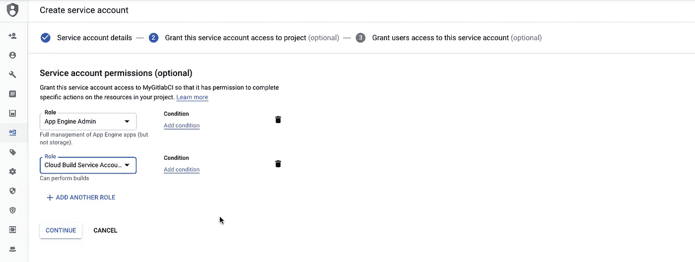
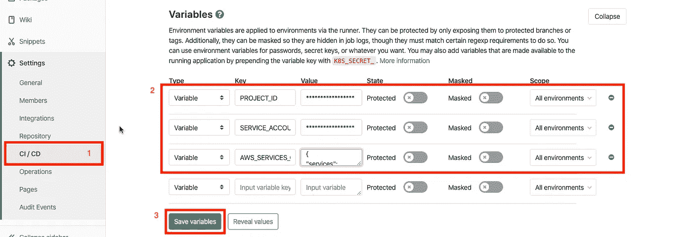

# 如何在项目中存储机密凭据

> 原文：<https://betterprogramming.pub/an-effective-way-to-store-confidential-credentials-in-your-project-8aa1822a733e>

## 构建一个自动化环境，只有真正需要的人才能访问关键信息

图片来自 pixabay.com。

作为开发人员，我们最关心的是让事情顺利进行。但与此同时，我们通常会忘记我们已经在应用程序中存储了像服务帐户 JSON/私钥这样的机密凭证！

理想情况下，建议不要与任何人分享此类任务关键信息。但有时，它被提交给我们的版本控制系统，并对每个有权查看该存储库的人开放。

根据最佳实践，建议我们不要在我们的存储库中提交这样的文件，也不要将它们存储在前端/客户端环境中。

所以问题是“你如何建立这样一个环境，只有真正需要的人才能获得关键信息？”

在这篇文章中，我想提到一种方法，我使用 [CI/CD](https://www.atlassian.com/continuous-delivery/principles/continuous-integration-vs-delivery-vs-deployment) (持续集成，持续开发)*的概念来实现。使用这种方法，您不仅可以保护服务密钥，还可以在部署环境中直接编写关键任务代码/文件，而不会暴露它。只需轻轻一按按钮，您就可以实现整个过程的自动化！*

整个过程可以分为以下几个步骤:

1.  管理服务帐户
2.  设置 GitLab 配置项

# 管理服务帐户

在这一步中，我们建立了授权代码执行所需操作的机制，例如代码部署、存储桶访问等。基于您的云环境，创建一个具有所需权限的服务帐户。

在这里，我使用谷歌云平台的应用引擎来部署和运行我们的代码。

要创建服务帐户:

*   进入我是管理员页面，点击➕“创建服务账户”
*   建议遵循最小特权原则。因此，我选择“App Engine Admin”和“Cloud Build Service Account”角色来创建我们将在下一步中使用的 JSON 密钥。

*   下载 JSON 密匙，进入下一步。

# 设置 GitLab 配置项

现在在 GitLab 中(你可以使用任何版本控制系统)，我们需要设置在部署代码时使用运行时的变量。

配置变量。

在这里，我创建了三个变量:`PROJECT_ID`、`SERVICE_ACCOUNT`和`AWS_SERVICES_CREDENTIALS`。

*   `PROJECT_ID` 包含我要部署代码的项目的名称。
*   `SERVICE_ACCOUNT`包含我们刚刚在前面的步骤中生成的 JSON 字符串。
*   `AWS_SERVICES_CREDENTIALS`包含授权凭证，我的代码将在内部使用这些凭证与部署在 AWS 上的一些服务进行通信。

注意:您可以根据需要创建任意数量的变量。

在这里，`AWS_SERVICES_CREDENTIALS`才是我想要保护的人。

为此，我们需要在项目的根文件夹中创建`[.gitlab-ci.yml](https://docs.gitlab.com/ee/ci/yaml/)` 文件。

在脚本部分，您可以看到 bash 指令来执行所需的操作。安装 Google Cloud SDK 后，它会先创建`MY_AWS_SERVICES_CREDENTIALS.json`文件，并在其中写入`AWS_SERVICES_CREDENTIALS`凭证。

由于这些变量只对存储库维护人员开放，我们可以在某种程度上对公钥/秘密加以限制。

类似地，您也可以直接向部署环境编写一些分类代码，而无需将其提交给版本控制系统。

所有的过程都发生在 Docker 容器中，所以您也可以执行测试和其他操作。关于这方面的更多信息，你可以阅读[这篇精彩的文章](https://medium.com/faun/ci-cd-essentials-from-scratch-with-gitlab-61502acf318e)。也可以为其创建您自己的个性化码头/滑道。也许我会在另一篇文章中写他们。

现在，主分支的一个git push 将自动使用凭证 JSON 文件将代码部署到 app engine 环境。

# 结论

这只是我在工作中发现的 CI/CD 的一个应用。让我知道你正在使用的其他更好的方法。这对其他人也会有帮助。

我希望你喜欢这篇文章，并发现它很有帮助。

感谢阅读。继续自动化。