# 使用 Python 进行自动化测试的轻松指南

> 原文：<https://betterprogramming.pub/an-effortless-guide-to-automation-testing-using-python-2fd387ef4469>

## 想要在您的项目中创建一个安全网吗？

## 通过 GitHub Actions 引入端到端持续集成(CI)实现的单元和文档测试

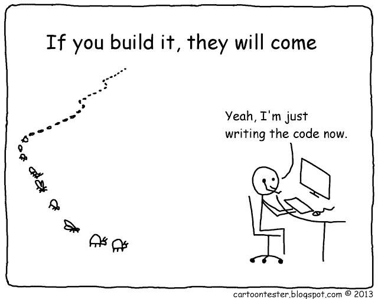

[卡通测试员——安迪·格洛弗](https://cartoontester.blogspot.com/)

让我告诉你一个情况。我们对项目需求有着完美的理解。我们开始相应地开发脚本，并轻松地完成了脚本！万岁现在开始敲定脚本的过程。在这里，我们将变更提交到我们的存储库中。

我们成功地降低了产量！这听起来熟悉吗？当涉及多个开发人员，每个开发人员不断地将他们的脚本提交到存储库中时，也会出现这种情况。我们怎样才能避免这样的不幸呢？唯一的解决办法就是测试。在本文中，我们将深入探讨文档测试和单元测试。我们将演示一些流行的测试，这些测试是任何开发人员都必须包含在脚本中的。

> 除了测试行为，设计测试的行为是已知的最好的错误预防措施之一。

在本文的最后，我们将有一个 GitHub 动作的小演示。我们将在一个验证我们定义的测试用例的存储库中建立持续集成。

> 为了节省时间，我们将直接开始为这两个主题定义测试用例。放心吧！该主题的完整文档位于我的 [GitHub](https://github.com/ginelledsouza/Continuous-Integration) 中。

# **文件测试**

作为开发人员，我们必须在脚本中附上有价值的文档。因此，我们在定义下面的函数/方法时，总是提到它们的用途。如果我们也可以在文档中定义一个测试用例会怎么样。这难道不会让我们的生活变得更好吗？该死，当然会！在这里，文档测试开始发挥作用。Python 有一个名为 doctest 的内置模块。该模块将函数/方法处理的输出与我们在文档中定义的输出进行比较。

对单个输出的测试可以通过互联网获得，但是用熊猫来测试？激动人心！让我们开始吧！

## **测试熊猫数据帧**

某些功能负责预处理`dataframes`，引入增强数据的附加功能。下面的例子是一个接受`dataframe`来分析平板手机设备类型的函数。该函数返回处理后的`dataframe`。

在定义我们的测试用例之前，有一个用于测试的虚拟数据集是非常重要的。让我们仔细看看文档字符串，即下面给出的例子中的`“””________“””`。请注意，在 docstring 的定义之前或之后不能有任何额外的行。

**代码**

## **代码解释**

1.  在 docstring 中，我们需要调用测试函数并提供预期的输出。函数`DeviceType(Data)`由 docstring post > > >调用。
2.  现在，我们将定义预期的输出。输出字符串是`dataframe`的复制品。我必须说，这是一个棘手的部分！所以，让我给你一个建议。

*   始终保持虚拟`dataframe`最多 5 条记录。
*   在单独的脚本中运行带有虚拟参数`DeviceType(Dummy)`的函数`DeviceType()`。
*   我们现在复制并粘贴输出字符串，并在 docstring 中定义它。

3.要运行该脚本，我们必须使用以下命令。

```
python DoctestScript.py -v, 
where v denotes verbose.
```

**输出**

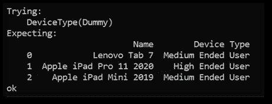

测试熊猫数据帧—输出

## **测试已处理的文本**

我们现在将关注于为函数返回的字符串/文本创建测试用例。这里我们将演示文档测试，其中给定的数据被处理并提供文本输出。

**代码**

## **代码解释**

1.  如上例所述，我们将测试指令放在 docstring 中。我们首先调用`Main(Dummy_final_test)`函数和虚拟参数 post > > >。
2.  在我们的测试 docstring 中，我们将提供一个预期的输出字符串来验证所实现的输出。
3.  与上面的例子类似，我们使用`python DoctestScript.py -v`来执行脚本。

**输出**

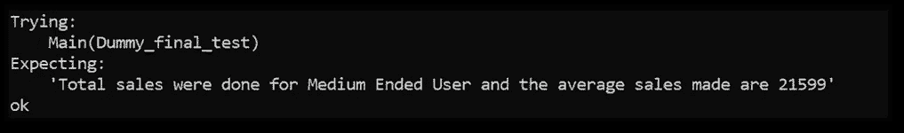

测试已处理的文本—输出

# **单元测试**

在单元测试中，开发人员测试一个模块，以验证该模块是否没有错误。对系统的单个单元进行了分析。如果有错误，开发人员会在将模块投入生产之前纠正它们。我们将使用用于演示单元测试的两种方法。

## **1。assertEqual()**

`assertEqual()`是一个单元测试库函数，用来测试两个值是否相等。该函数接受三个参数作为输入——来自已处理函数的值、期望值和错误消息。它将根据两个值的比较返回一个布尔值。如果两个值相等，该方法将返回 true，否则返回 false。

## **2。pandas . testing . assert _ frame _ equal()**

该函数比较两个数据帧，并提供表示两者之间任何差异的输出。还有一些额外的参数允许开发者增加测试难度。

**代码**

## **代码解释**

1.  与单元测试的文档测试不同，我们需要创建一个专用的 Python 脚本来封装我们想要运行的测试。因此，对于这个例子，我们创建了一个单独的脚本`TestCases.py`
2.  `DummyData and DummyDataResult`:我们现在将验证`dataframe`的神智是否正常。我们需要定义要测试的原始`dataframe`和预期的结果`dataframe`。
3.  `DummyData = test.DataCleaning(DummyData)`:我们需要从测试模块导入函数。
4.  `assertEqual(DummyData.shape, (2, 9), “Data Cleaning Module Check Failed”)`:我们比较`dataframe`的实际尺寸和预期尺寸。如果它们之间有任何不一致，该函数将抛出一条错误消息——“数据清理模块检查失败”
5.  `pd.testing.assert_frame_equal(DummyData.reset_index(drop=True), DummyDataResult.reset_index(drop=True), check_dtype=True)`:验证已处理`dataframe`和预期`dataframe`内的值。如果它们之间有任何不一致，该函数将提供差异。我们将使用`check_dtype`参数来增加测试的难度。`check_dtype`验证两个`dataframes`中的值以及两个值的数据类型。

**输出**

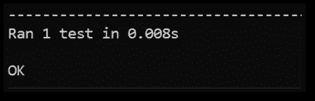

**执行命令:python TestCases.py**

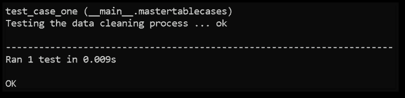

**执行命令:python TestCases.py -v**

# **GitHub 动作**

Github Actions 允许您直接在 Github 存储库中创建工作流。这些工作流是不同的任务，称为操作。某些事件可能会触发动作。持续集成(CI)和持续部署(CD)是 GitHub Actions 最受欢迎的两个特性。

1.  创建新的存储库，并在主分支内上传脚本
2.  GitHub Actions 为我们提供了一台机器来针对所有指定的测试用例执行提交的脚本。我们需要一个 requirements.txt 来指定脚本中使用的库
3.  我们现在开始为持续集成(CI)设置工作流

*   在下图中，我们观察点(1)。一旦我们成功设置了工作流，就会在突出显示的框中看到一个状态符号。因此，让我们从选择点(2)行动开始。

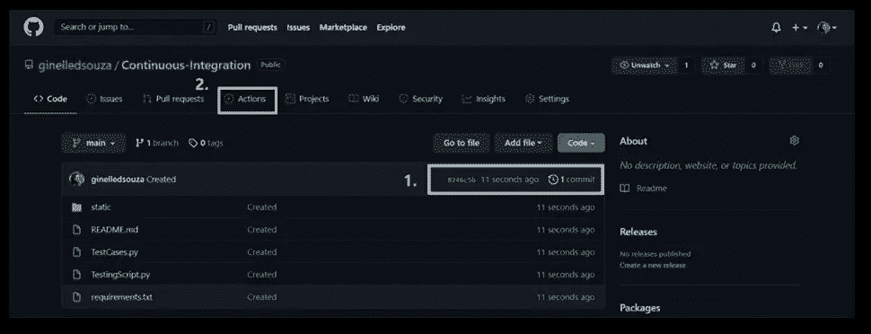

*   基于存储库中提交的脚本，GitHub 推荐各种工作流。我们可以从可用的工作流程中选择任何一个。但是，我们将设置我们的自定义工作流。

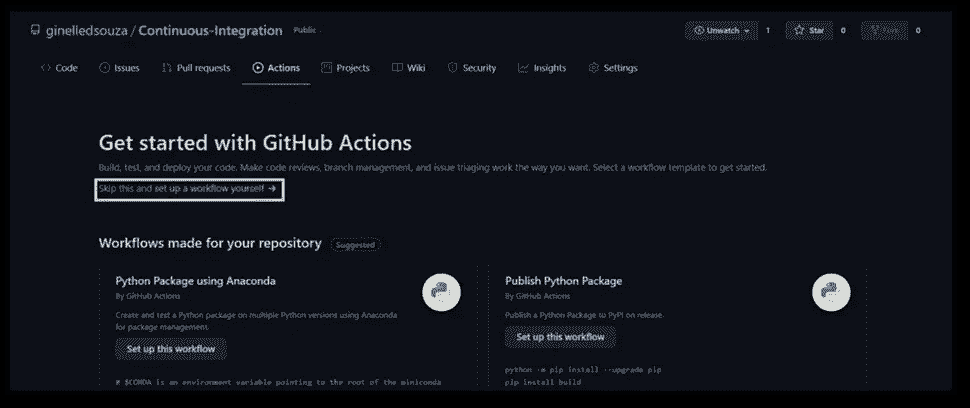

*   我们的工作流文件将驻留在。github\workflows\ <workflow_name>.yml .正如我们所看到的，我们有一个基本动作的框架 yml 文件。我们将修改这些并添加一个命令来安装 requirements.txt 并执行我们的测试用例脚本。</workflow_name>

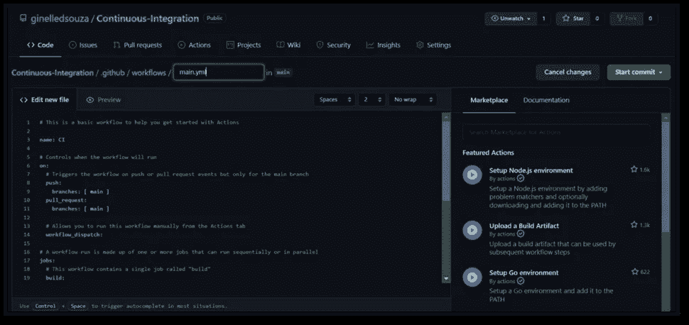

*   一旦我们建立了我们的工作流，我们需要提交变更到主分支。当测试用例被验证时，显示的状态符号是一个小的橙色圆圈。

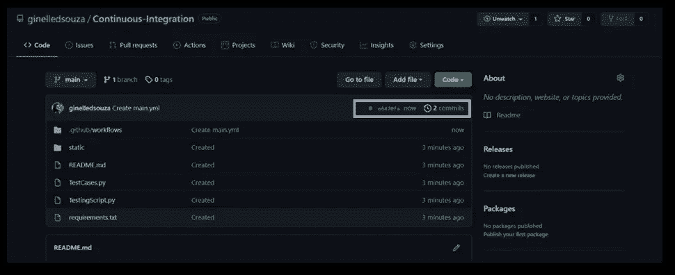

*   我们已经成功设置了我们的工作流，并可以通过检查状态符号(显示为绿色对勾)来验证这一点。

4.如果在更新存储库中的脚本时出现任何错误，可以通过日志来跟踪错误。我们可以看到整体的日志，以及单独的测试用例日志。

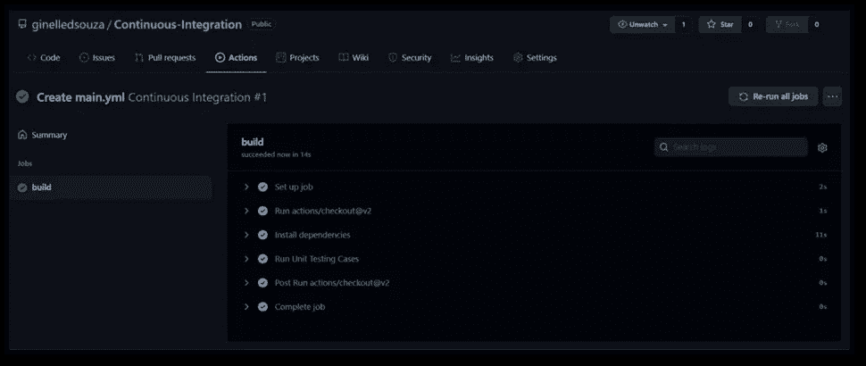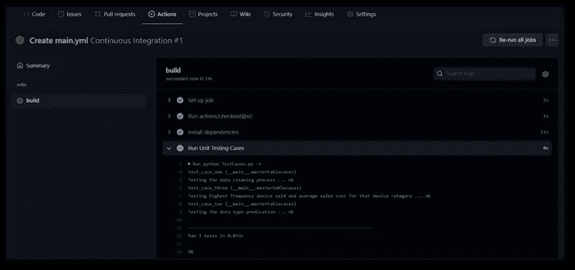

万岁！我们坚持到了这篇文章的结尾。伙计们，这就是我们如何使用测试和持续集成(CI)来验证我们是否总是在正确的轨道上。

我希望这篇文章能为您提供一个方便的方法来保证您的项目的未来性！感谢您的阅读！