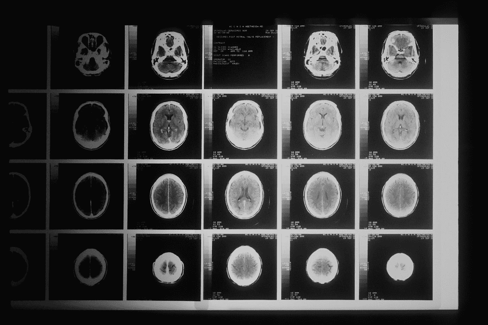
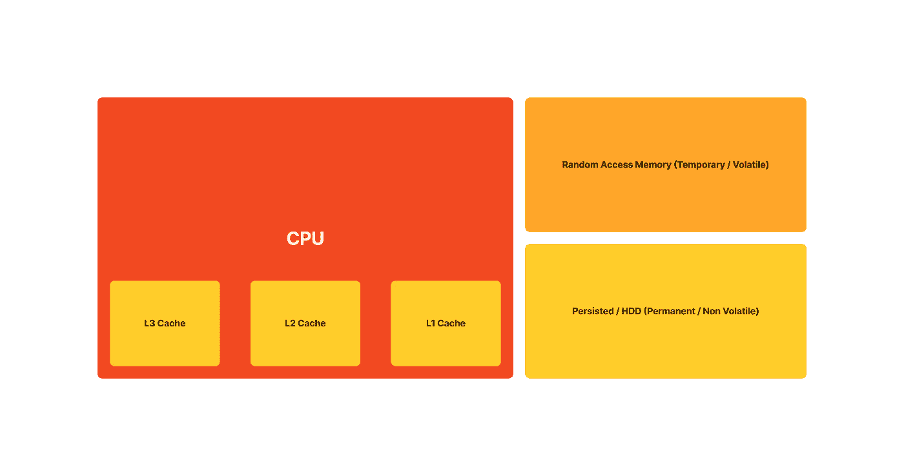

# 工程师对大脑的观点

> 原文：<https://betterprogramming.pub/an-engineers-point-of-view-of-the-brain-a9ae974d8894>

## 试图理解如何

[国家癌症研究所](https://unsplash.com/@nci?utm_source=medium&utm_medium=referral)在 [Unsplash](https://unsplash.com?utm_source=medium&utm_medium=referral) 上拍摄的照片

**免责声明:**本文中的观点是我的，本文仅帮助我描绘出我是如何试图理解大脑的图景。

为了我的学士论文，过去三个月我一直在研究人工智能和机器学习，作为计算机工程专业的学生推动我继续问问题；*“这是怎么回事？”*，一个我怎么强调都不为过的积极因素。

2022 年 12 月 23 日，我和一位[朋友](https://www.linkedin.com/in/jonathan-james-mshelia-ba7162144/)(乔纳森)通电话，我们正在聊天，他提出了一个问题；*“为什么我们通常在对话中说一个完全脱离上下文的词？”*，他接着举了一个简单的例子。

假设你打算说*“我想去停我的车”*，你说*“我想去停我的猫”*，对于听众，你清楚地说*“猫”*，当被提示这个错误时，你可以发誓你说的是*“车”*，所以呢？他的问题是“发生了什么事？是你的大脑出了问题还是别的什么问题？”。

这引发了一场非常有趣的对话和非常有趣的回答，展示了工程师(至少他和我)如何看待大脑。

# 什么是“大脑”？

在我开始之前，我想说的是，对于科学家和非科学家来说，大脑仍然是一个黑匣子，仍然是许多研究和讨论的主题(就像这个)。

在我看来，普通人的大脑是一台 [5.5 x 6.5 x 3.6 英寸](https://www.verywellmind.com/how-big-is-the-brain-2794888#:~:text=5.5%20x%206.5%20x%203.6%20inches%20(140%20x%20167%20x%2093%20mm))的超级计算机，是宇宙中最先进的计算机之一。有些人可能会说这是一个相当严肃的说法，但考虑到这台有点小的计算机的发现和创新的数量，我会说做出这样的说法是安全的。

我们已经能够创造出其他的计算机，这些计算机似乎大大地削弱了我们的处理能力。据说，一个普通人的大脑每秒钟可以处理 [***60 位信息***](https://worldmentalcalculation.com/2019/06/30/fastest-possible-processing-speed-of-the-human-brain/#:~:text=Using%20this%2C%20Psychologists%20recently%20found,IQ%20are%20slightly%20faster%20(E.) ，同样是这个大脑，创造了可以在不到一秒钟内执行数十亿次处理任务的计算机，这使得人脑比今天的计算机大约慢*1000 万倍。*

*这是一个有趣的事实，但是，我不是神经科学家，这不是这篇文章的重点。*

# *一个巨大的 Trie 和一个列表*

*对我来说，这个假设模型是第一个想法，也是最简单的。随着时间的推移，我们的大脑形成了一个文本、图片、感觉、情绪等等的存储树，所有这些都有关系。对于超过 1000 亿个神经元，我们假设(在理想情况下)每个神经元都是这棵树中的一个节点，对于给定的刺激(例如，一碗水中一支笔的图像)，一个神经元(节点)向其最近的邻居神经元伸出手，直到每个信息都被提取出来，每个信息(信号)都被推入一个列表并按顺序读出(想象一个寄存器)。*

*因此，你的大脑正在接受一系列输入(刺激)，在循环中处理每个输入，因为它找到了每条信息，并将处理后的输入存储在一个列表中，以读出作为响应(说话、跳舞、唱歌、恐惧等)。*

*现在，让我们试着用数学方法来表达。给定刺激( ***X*** )，其中 ***X*** 是身体感知到的一组刺激( ***x*** )，大脑对给定的一组刺激 ***X*** (递归地) ***f(X)*** 执行一个动作 ***f*** 其中所有的*映射到一个响应 ***z*** 。**

****

**Trie-List 脑模型的数学表示(理想状态)**

**不管存储的响应可能有多深，这个假设的大脑模型将在**线性时间*****【O(n)】***中寻找这些信息，并且具有数十亿个神经元(节点)和数万亿个突触(互连)，这是一个缓慢的计算。**

**尽管这个假设的模型可能有多慢，但操作看起来相当简单，容易表达，非常容易计算，而且可靠，看起来不像可以复制开始时提出的问题。**

## **不太理想(引入噪声)**

**就像任何其他物理系统、机械系统、机电系统等一样，噪声是一种非常正常的现象，生物系统也不例外。在上一节中，我们讨论了理想条件下的假设模型(没有噪声或干扰)，但更现实的系统会考虑这种非理想条件。**

**噪声以两种方式引入；内部和外部。我们来分解一下。**

**内部噪声是从系统内部引入的，一个常见的例子是；侵入性的想法。**

**外部噪声是通过输入(刺激)引入的，一个常见的例子是；一系列突发事件。**

**通常情况下，这些噪音(事件)并不是分离的，而是同时发生的。考虑到这一点，我们可以得到更现实的表达和更精确的数学表示。**

**现在，数学上我们可以说:给定刺激( ***X，Xφ，Xρ*** )，其中 ***X*** 是刺激的集合( ***x*** )， ***Xφ*** 是内部噪声的集合( ***xφ*** )，而 ***Xρ*** 是外部噪声的集合**

**大脑对给定的一组刺激 ***X，Xφ，Xρ*** 循环执行一个动作***f****【递归】 ***f(X，Xφ，Xρ)*** ，给出一个反应列表 ***Z*** ，这是一组 ***z*** 其中所有***

**

*Trie-List 脑模型的数学表示(非理想条件)*

*这现在复制并解决了本文开头提出的问题；脑子什么的都没有问题。*

*最后，大脑不知道噪音；这里被描述为噪音的只是产生 ***真正非理想状态*** 的刺激。大脑并不是要过滤掉任何东西，我们是要对所有的刺激做出反应，不管是不是不想要的，这就是大脑的工作方式，也是我们如何发展反应储存树的基础。*

# *数据持久性(磁盘)、RAM 和缓存*

*另一个有趣的话题是**“信息丢失”**。我们以前都经历过这种情况；你正在进行一场谈话，突然之间你似乎记不起一个单词，就像这样持续了几秒钟。这就把我们带到了下一个假设模型。*

*一个人的大脑储存了很多；过去的事件，重要的信息，他们认识的人，对自己的了解，语言，各种基本动作，以及许多其他的事情。*

*从这位工程师的角度来看，正如前面提到的，大脑是一台强大而先进的超级计算机。*

*让我们用一个真实的例子来说明 PC 游戏世界。如果你玩过 GTA V(我玩过)，有时候你开得很快或者从飞机上跳下来，你会注意到开放的世界只是一个蓝色的背景，一堆像素化的棕色和绿色的盒子，或者角色可能会直接穿过物体，就像这样；*

**

*世界加载速度不够快，巨大的口吃，以及其他问题——Reddit.com*

*玩开放世界游戏时，这可能是也可能不是新闻；开放的世界不是一下子产生的；如果是这样的话，你的电脑会变得难以想象的热，因为它要努力渲染每一个可以看到和不可以看到的变化像素。*

*因此，开放世界是在一定的门槛上呈现的，或者当你更接近开放世界的那一部分时。*

*CPU 从内存中读取数据并处理这些数据；永久/非易失性存储器(磁盘)和临时/易失性存储器(RAM 和高速缓存)。CPU 的速度比所有这些存储介质单独和组合起来都要快得多，因此对这些数据的读取和评估是结构化的，以确保 CPU 及时得到它需要的东西。*

*让我们试着分解它；磁盘将大量数据传递给速度比磁盘更快的 RAM，然后 RAM 将所需数据传递给速度比 RAM 更快的 CPU 缓存或缓存，后者又将数据传递给 CPU。*

**

*数据持久性、RAM 和缓存*

*这样做是为了减少获取和计算数据所需的成本(速度和功率),而不必总是查找主存储器。*

*高速缓存更接近 CPU，比 RAM 和磁盘快得多，但仍然没有 CPU 快，并且存储容量也较小。高速缓存的大小从 8MB 到 300kB 不等，但它们的超快特性使它们适合向 CPU 提供数据。*

*作为 CPU 的一个明显较慢的组件，有时 CPU 会清空缓存，并且由于 CPU 和缓存之间的时间延迟，CPU 会处于没有数据要处理的状态，这被称为“ [stall](https://en.wikipedia.org/wiki/CPU_cache#:~:text=CPU%20stalls%5B,from%20main%20memory.) ”。*

*我想假设这与我们大脑中发生的事情类似，当我们不能抓住我们正在寻找的单词时，我们的大脑已经清空了缓存，并等待新的数据，我们进入了**“停滞状态”**。*

## *停滞状态和填充字*

*处于停滞状态比我们愿意承认的要经常发生。当处于这种停滞状态时，我们做一些非常有趣的事情来让我们的缓存时间赶上我们的 CPU，我们开始使用“[填充符](https://en.wikipedia.org/wiki/Filler_(linguistics))”。*【嗯】**【呃】**【嗯】**【啊】*等等都是使用的填充语，也叫“犹豫标记”我觉得是比较好的描述语。*

*当我们准备下一组单词时，我们会暂停，或者暂停以填满我们的缓存进行处理。*

# *最后的想法*

*神经科学、物理学、生物学和许多其他领域都试图理解大脑及其内部运作，这也是我一直感兴趣的事情。*

*大脑是一个难以破译的黑匣子，它带来了许多创新；是什么让它如此高效却又容易滞后？*

*与一位朋友的对话促使我们从工程师的角度来看待这两个假设的大脑模型；一个巨大的 trie 和一个链表，还有磁盘、RAM 和缓存。*

*得到的教训是——大脑经历了它必须做出反应的嘈杂输入(刺激)，它不能过滤掉它们，因此可以被标记为一个真正的非理想系统。*

*其次，脑子超级快。我希望思考的速度比人们认为的要快——至少它快得足以出现“停滞状态”。*

*再说一次，大脑是一个黑匣子，但我相信我们谈论得越多，我们就越有可能在基本层面上理解它是如何工作的，甚至可能更深入。*

*感谢你的阅读，如果你喜欢这种试图理解大脑的有点粗糙的尝试，请随时放弃你对大脑的看法。*