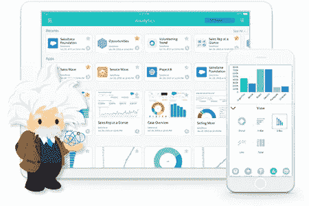

# Python 脚本中的一个错误可能会导致 150 多个研究项目无效

> 原文：<https://betterprogramming.pub/an-error-in-a-python-script-may-have-invalidated-150-research-projects-64fe7cda558c>

## 以及上个月您可能错过的另外三个 Python 故事

照片由 [NeONBRAND](https://unsplash.com/@neonbrand?utm_source=unsplash&utm_medium=referral&utm_content=creditCopyText) 在 [Unsplash](https://unsplash.com/s/photos/mistake?utm_source=unsplash&utm_medium=referral&utm_content=creditCopyText) 拍摄

用于计算分析的一组 Python 脚本中的一个编码错误可能导致 150 项已发表的化学研究无效。

夏威夷大学最近发表的一篇研究文章显示威洛比-侯烨脚本中有一个编程错误。

研究人员试图检查从蓝细菌实验中获得的结果，观察到使用类似的核磁共振光谱(NMR)数据获得的结果有明显的变化。

错误的传播取决于运行脚本的操作系统。这些脚本被发现在 Windows 10 和 macOS Mavericks 上给出了准确的结果，但在 macOS Mojave 和 Ubuntu 上的准确性却差了将近整整一个百分点。

这些变化的来源来自于脚本对 [Python 的](https://www.udemy.com/course/python-for-data-science-and-machine-learning-bootcamp/?LSNPUBID=GjbDpcHcs4w&ranEAID=GjbDpcHcs4w&ranMID=39197&ranSiteID=GjbDpcHcs4w-oTQPlU8ERPBWeVLUUdr1aA) `glob` 模块的使用。

`glob` 模块寻找对应于特定名称模式的文件，并基于`glob`结果，脚本生成要读取的输入文件列表。

但是，这个模块的输出依赖于用于排序和返回这些文件的操作系统。处理文件的顺序会影响这些脚本的计算结果。

这个小细节可能会因为输出不准确而使之前的很多研究论文失效。

菲利普·威廉姆斯和孙芮编写了代码来帮助解决更正排序的问题，现在它保证了一致的结果。虽然这些变化对夏威夷大学团队获得的数据结果没有任何影响，但它可能会对其他已发表的研究项目产生一些实质性影响。

威洛比-侯烨剧本以其作者明尼苏达大学的帕特里克·威洛比和托马斯·侯烨命名。

帕特里克·威洛比现在是里彭学院的化学助理教授，他承认新的发现以及对剧本的新的修正。他在 Twitter 上发布了这一更新:

> 芮和威廉姆斯教授的伟大发现。当我六年前写脚本时，操作系统能够处理排序。Rui 和 Williams 添加了必要的排序代码，并添加了一个函数来确保 calcs 正确对齐。太棒了！”——*帕特里克·威洛比*[*(@ pat _ 威洛比*](https://twitter.com/pat_willoughby/status/1181675189685379072?ref_src=twsrc%5Etfw) *)*

有时，信任外部脚本和库会导致意想不到的结果。

现在，你可能错过了另外三个更新。

# 加入我们的时事通讯

在继续滚动之前，为什么不加入我们团队的时事通讯，了解数据科学、数据工程和技术的最新动态！[在这里了解更多](https://seattledataguy.substack.com/)。

# 故事 1。Salesforce 的“爱因斯坦分析”从 Python 变为 Google 的 Go 语言

[来源](https://silversoftworks.com/einstein-analytics/)

Salesforce 正在为 Einstein Analytics 寻找 Google 的 Go 编程语言来代替 C 和 Python。

随着在分析公司 Tableau 上花费超过 157 亿美元来增强爱因斯坦分析平台，显然 Salesforce 认为分析是其未来的重要组成部分。

2017 年，在推出爱因斯坦分析之前，该公司使用谷歌的 Golang 对其后端进行了检修和重建。

Salesforce 首席架构师 Guillaume Le Stum 提到了数据集创建工具和查询引擎，这些工具和引擎使得 Einstein Analytics 与提供其他功能(如 REST API 服务器、解析查询等)的 [Python](https://www.udemy.com/course/python-for-data-science-and-machine-learning-bootcamp/?LSNPUBID=GjbDpcHcs4w&ranEAID=GjbDpcHcs4w&ranMID=39197&ranSiteID=GjbDpcHcs4w-oTQPlU8ERPBWeVLUUdr1aA) 包装器一起“为了性能”而用 C 语言创建。

在堆栈溢出的一篇[帖子中，Le Stum 说:](https://stackoverflow.blog/2019/10/07/how-salesforce-converted-einstein-analytics-to-go/)

> “从本质上来说，这个产品是为了两者兼得而设计的。
> 
> Python 非常适合快速编写高级应用程序，但并不总能提供企业级所需的高性能。c #创建了高性能的可执行文件，但是添加特性需要更多的时间。"

但在发布之前，Le Stum 表示，由于添加了原本不属于核心查询引擎的新功能，该平台开始出现一些性能下降。因此，即使有能力开发和部署这些新功能，Salesforce 也可能会考虑其长期计划。

Le Stum 补充道:*“Python 并不擅长多线程，所以包装器被要求做的越多，它的表现就越差。”*

相比之下，Go 适合适用于谷歌生产系统的大型应用，这也可以解释从混合 C-Python 到 Go 平台的转变。

Le Stum 进一步强调了 Go 的优势，包括其内置工具、简单的故障排除、快速的编译时间和部署，以及其使编码易于理解的方法。

Le Stum 指出，在企业软件中，工程师花在阅读上的时间比编写代码的时间还多。

尽管如此，随着平台的 Go 版本在 2018 年全面上市，用 Go 编写的概念证明使 Salesforce 能够进一步发展。它最大的好处是 Go 的跨平台特性，这使得代码移植变得容易。

*Le Stum 指出:“如果我们在移动应用程序中需要这些代码，我们可以将它们交叉编译到 iOS 或 Android 上，这样就可以了。”。*

*爱因斯坦分析平台中唯一没有用 Go 编写的部分是它的集群管理器，它是用 Java 编写的。*

# *故事二。微软推出 Python 免费编程课程*

*微软最近在 YouTube 上为初学者推出了一个名为 [*Python 的视频系列*](https://www.youtube.com/playlist?list=PLlrxD0HtieHhS8VzuMCfQD4uJ9yne1mE6) 。新系列的目标是向有抱负的程序员教授 Python 的基础知识。*

*苏珊·伊巴赫和克里斯托弗·哈里森也将主持该系列节目。苏珊是微软人工智能游戏部门的业务开发经理之一，而克里斯托弗目前是微软的高级项目经理。*

*微软表示:*

> **“尽管我们不会在课程中涵盖 Python 的所有知识，但我们希望确保为您提供 Python 编程的基础，从常见的日常代码和场景开始。”**

*该课程分为 44 个部分，将更侧重于 3。x 版本的 [Python](https://www.theseattledataguy.com/4-simple-python-ideas-to-automate-your-workflow/) 面向的是对 JavaScript 有一些基础知识或者参与过某种形式的可视化编程语言的读者。*

*本课程中提供的教程视频长度可能从 3 分钟到 10 分钟不等，将涵盖诸如配置 [Visual Studio 代码](https://code.visualstudio.com/)、处理循环以及执行错误处理等功能。*

*此外，微软还在视频旁边发布了一组[附加资源](https://github.com/microsoft/c9-python-getting-started)。添加的资源将包括幻灯片和编码样本。*

*来自 [ZDNet](https://www.zdnet.com/article/microsoft-we-want-you-to-learn-python-programming-language-for-free/) 的报道强调，微软可能会受益于其更大的有成就的 Python 开发人员库，他们可以在 Azure 机器学习工作室中应用 [Python](https://www.theseattledataguy.com/4-simple-python-ideas-to-automate-your-workflow/) 来构建应用程序。*

# *故事三。带有 Walrus 操作符的 Python 3.8 现已推出，并支持仅定位参数*

*Python 最近发布了它的最新版本，Python 3.8，它有几个新的特性和改进。10 月初，Python 团队公开了 Python 3.8b2 的[版本，这是四个计划测试版中的第二个。](https://hub.packtpub.com/python-3-8-new-features-the-walrus-operator-positional-only-parameters-and-much-more/)*

## *Python 3.8 有哪些新的补充？*

*Python 3.8 的新增功能在各方面都很吸引人。一些值得注意的新增内容包括:*

*   *新的功能参数(PEP 570)。*
*   *新海象运营商(人教版 572)。*
*   *Pickle 协议 5 支持带外数据缓冲区(PEP 574)。*
*   *已验证开放挂钩和审核挂钩(PEP 578)。*
*   *用于配置 Python 初始化的新 C API(pep 587)。*
*   *为 Vectorcall 提供支持(PEP 590)。*

*其他值得一提的新增内容包括:*

*   *格式化字符串(f 字符串)现在有了一个`=`说明符、新的元数据模块(importlib.metadata)和并行文件系统缓存。*

*你可以在 [Python 文档](https://docs.python.org/3/whatsnew/3.8.html#porting-to-python-3-8)中看到新 Python 3.8 中其他改进的模块、添加和删除。另外，完整的细节请查看[变更日志](https://docs.python.org/3/whatsnew/changelog.html#changelog)。*

# *点击此处阅读更多内容*

*感谢阅读！如果您想了解更多关于数据咨询、大数据和数据科学的信息，请点击下面的链接。*

*[成为数据工程师的现实](https://www.youtube.com/watch?v=6RiA_Qur2yo&t=1s)*

*[转行成为数据工程师|成为数据工程师的途径](https://www.youtube.com/watch?v=f9ngBz7wCGE&t=2s)*

*[为小型企业和初创企业开发数据分析战略](https://www.theseattledataguy.com/developing-a-data-analytics-strategy-for-small-businesses-and-start-ups/)*

*[下一次数据科学或数据工程面试前你需要知道的 5 个 SQL 概念](https://www.youtube.com/watch?v=X6-VNKe3XVM&t=6s)*

*[如何改进您的数据驱动战略](https://www.theseattledataguy.com/17-questions-you-need-to-ask-about-your-data-strategy/)*

*[什么是数据仓库，为什么使用它](https://youtu.be/VjlzuUzYJYM)*

*[破坏你的数据驱动战略的错误](https://logitanalytics.com/5-mistakes-that-are-ruining-your-data-driven-strategy-and-costing-you/)*

*[用 Python 管理大数据的 5 大库](https://www.theseattledataguy.com/5-great-libraries-manage-big-data-with-python/)*

*[什么是数据工程师](https://www.youtube.com/watch?v=D1V6t--9tt8&t=7s)*