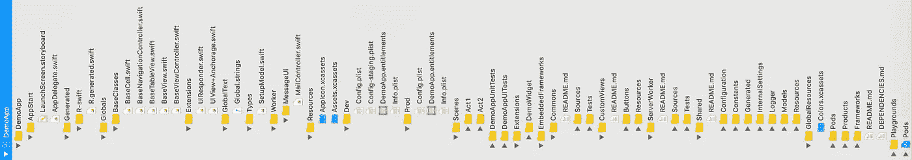

# 一个可扩展 iOS 项目的例子

> 原文：<https://betterprogramming.pub/an-example-of-a-scalable-ios-project-dce56a256106>

## 可扩展 iOS 应用架构的组成部分

## DemoApp 项目(DAP)和一些最佳实践(第 1 部分，共 2 部分)

在我的文章《[完美的 iOS app 架构](https://medium.com/@sven.korset/the-perfect-ios-app-architecture-24259417843f)》中，我介绍了自己的架构，解释了*场景的概念。*我已经在一个更复杂的示例项目的基础上解释了架构的各个参与者。

本文是关于这个更复杂的示例项目:[GitHub 上的 demo app-Project](https://github.com/indieSoftware/DemoArchitecture)。我还解释了一些与基于该体系结构的一般项目设置相关的最佳实践，但也有更广泛的适用性。

顺便说一句，这是一篇来自可扩展的 iOS 应用架构系列的文章。

# 下载演示应用程序项目(DAP)

为了让这篇文章有意义，我强烈推荐把这个项目放在你面前。所以请先从 GitHub 下载 [DemoApp 项目。😉](https://github.com/indieSoftware/DemoArchitecture)

该项目通过“DemoApp”文件夹中的“DemoApp.xcworkspace”打开。因为所有必需的 pod 都已签入，以确保所有依赖项始终可用，所以无需再做什么了。顺便说一下，这已经是我的第一个推荐了:

> 始终将所有 pod 和其他依赖项签入存储库。

pod 是项目的依赖项。如果一个依赖项不再存在，例如，因为一个 pod 项目被删除了，那么您自己的项目就被破坏了。除了豆荚被保存在仓库里。回购中的几兆字节并没有真正推高成本。事实上，**全面失败的风险远大于预防的成本**。

当然，接下来您应该处理一个 pod 故障，并迅速寻找替代品，但至少您仍然可以使用当前状态。拥有这种当前状态通常是有用的，因为客户当然想要一个关键的应用程序更新，只需昨天做一个小的文本更改，并且不理解为什么现在要花一周的时间。🙄

在 DAP 中，我使用 *CocoaPods* ，因为它简单且普遍。我喜欢简单的！😁

当然，你应该经常质疑现状，如果有必要的话，让它适应团队和项目。例如， [Zalando 使用手动解决方案](https://jobs.zalando.com/tech/blog/how-the-zalando-ios-app-abandoned-cocoapods-and-reduced-build-time/?gh_src=4n3gxh1)，因为这对他们来说效果更好。我不确定用自己的脚本从头开始创建依赖管理器是否真的更好，但这是每个团队必须自己决定的事情。

总之，正如[诺亚·特鲁平](https://medium.com/u/c988d69d31ca?source=post_page-----dce56a256106--------------------------------)所描述的，Swift 中存在一个“[包管理困境”。然而，随着 *Swift 包管理器*越来越好地集成到 Xcode 11 中，这会成为新的 *CocoaPods* 吗？🤔](https://medium.com/@ntrupin/pods-carthage-and-spm-swifts-package-management-dilemma-7da4ec87a20c)

# 文件夹结构

如果你在 Xcode 中打开项目，你会发现底层的主要模块，像 app 项目本身，Unit 和 UITest 文件夹，扩展，框架等。在这些模块中，组和文件的树进一步构建了项目。需要注意的是:

> HD 上的文件夹应该与 Xcode 中的组相匹配。

诚然，这并不真的那么重要，因为它不能防止任何合并冲突或类似的事情，但是如果你保持你的文件系统**整洁**，这就是专业的证明。甚至苹果在 WWDC19 上的“[伟大的开发者习惯](https://developer.apple.com/videos/play/wwdc2019/239/)”中也明确推荐了这一点。😎

在任何情况下，您都应该将代码组织成组。几乎没有什么比把 1000 个文件都放在一个文件夹里更糟糕的了。谁想每次都滚动浏览每个文件来找到自己需要的东西呢？😖

如果您打开“DemoApp”文件夹，您会发现这些组:

*   **AppStart** :这里是 AppDelegate 和 start storyboard。
*   **生成的**:由脚本和工具自动创建的一切。
*   **Globals** :一些基类，app 专用扩展，全局文本，特殊 app 类型，不在框架外包工。
*   **资源** : AppIcon，App 专用图片，Info.plist，权限，配置文件。
*   **场景**:所有的行为和场景。不，我们不是在剧院，这也与 SceneKit 或 iOS 13 中引入的新 SceneDelegate 无关。😜

在“场景”中，您可以找到文件夹“Act1”及其子文件夹“场景 0”和“场景 1”，以及“Act2”及其子文件夹“场景 2”。

一幕由几个场景组成。然而，这里的分组标准是某些依赖关系，这些依赖关系只能通过时间来解决。大多数情况下，这可以映射到一个特殊的应用程序阶段。

例如，这里的“Act1”可以重命名为“Onboarding ”,以表示用户尚未完全设置好应用程序的阶段。“场景 0”将被称为“飞溅”，“场景 1”将被称为“登录”。

成功登录后，用户应该已经登录，这样用户对象就可用了，并且可以作为后续场景的另一个依赖项进行解析。这个阶段可以称为“登录”而不是“第二步”，但这当然只是一个例子。

在 DAP 中，这是用用户对象绘制的。在我的文章“[在 Swift](https://medium.com/@sven.korset/resolving-dependencies-easily-in-swift-ee0f8f2dfbe3) 中手动完成的依赖性管理”中解释了更详细的方法和背景。🤓

我的文章“[完美的 iOS 应用架构](https://medium.com/@sven.korset/the-perfect-ios-app-architecture-24259417843f)”中描述了一个场景是如何构建的。值得一提的是:

> 所有*场景相关的*依赖应该在 Xcode 中关闭。

我经常看到按类型组织的文件，也就是一个“VC”文件夹，所有的*视图控制器*都在这里。一个“视图”文件夹用于所有视图，一个文件夹用于所有单元格，等等。然而，这种结构的结果是，您必须不断地在 Xcode 中跳过整个项目树。

当在 *ViewController* 上工作时，你经常会编辑相关的视图、单元格等。如果所有这些属于 *ViewController* 的类都在同一个文件夹或子文件夹中，那就更有意义了。这样你就有了更好的概览和更短的导航所需的一切。

*场景*遵循这个原则。只属于这个*场景*的所有东西都在*场景*文件夹或子文件夹中。如果你不在这个*场景*工作，你就不需要打开这个文件夹。按抑制概述！😋

# Xcode 模板

如果你经常创建新的*场景*，那么手动创建每个文件，一遍又一遍地写所有的骨架代码，会很烦。如果能只做一次，然后自动化就更好了。

这就是为什么在带有 Xcode 模板的 repo 中有一个“Templates”文件夹。附带的*自述文件*解释了如何在 Xcode 中安装和使用模板。

> 当设置自动化和维护它的时候，总是自动化工作，花费比它节省的时间要少。

棘手的是，你得估算一下要花多少时间，能省多少时间。**经验**和好的时间追踪在这里有帮助。🧐

# 开发工具

“自动化”建议还包括某些命令行工具，如“ [R-swift](https://github.com/mac-cain13/R.swift) ”(或“ [SwiftGen](https://github.com/SwiftGen/SwiftGen) ”)、 [SwiftFormat](https://github.com/nicklockwood/SwiftFormat) 和“ [SwiftLint](https://github.com/realm/SwiftLint) ”。在 DAP 中，这些通过*协同包*集成，并在*目标*的相应*构建阶段*中配置。

一旦正确配置，工具将总是在您编译代码时运行。然后，它们会自动创建特定代码，格式化所有 Swift 文件以符合编码指南，并执行额外检查以发现特定漏洞和代码气味。

那就是一下子三个要点！😳

> 使用强类型引用，自动设置代码格式并修复任何警告。

强类型是安全的。格式化代码只是**更漂亮**。谁喜欢他们脸上的黄色警告？修复警告并使代码更加健壮。😅

使用 R-swift，您只需调用`R.string.scene0.title()`从`Scene0.strings`文件中获取带有关键字`Title`的本地化字符串。不安全的是像`NSLocalizedString("Title", tableName: "Scene0", comment: "")`这样的调用，你可能会拼错关键字“Title”或“Scene0”。尝试在任何地方使用强类型引用，从本地化字符串到图像、颜色和任何常量值。

为什么要自动格式化代码？因为我们都是人，并不总是 100%地执行指南，即使我们尽了最大努力，其他人也做了代码审查。此外，一台机器做它最擅长的事情——那么，为什么要自己做呢？😌

编译器和 linter 警告指出了可能的问题。也许这还不是一个问题，但这些是你应该改进的地方，这样它们就不会在某一天变成问题。

在*构建设置中，*你也可以设置*警告*作为*错误*处理，但是我觉得那太尖锐了。如果你正在开发某个东西，它还不干净，但是你仍然希望能够运行代码。然而，你应该最迟在特征完成后消除**所有的**警告。

一般来说，只要把代码做的漂漂亮亮，写出你明天依然热爱的代码就行了！😍

# 模块化

DAP 表明您可以很好地使用嵌入式框架来模块化代码。正如我的文章“[完美的 iOS 应用架构](https://medium.com/@sven.korset/the-perfect-ios-app-architecture-24259417843f)”，**模块化**是合理架构的关键。所以，这是关于将代码分割成更小的单元，将它们结构化，并使它们更易于**维护**。

> 分而治之！

正如我在博客文章“[中所描述的那样，带有枚举](https://medium.com/@sven.korset/structure-constants-in-ios-with-enums-5ca2135dcab0)的 iOS 中的结构常量“*枚举*可以以名称空间的形式使用，以结构化代码。然而，使用框架甚至更进一步。嵌入式框架的优势经常被低估。🤨

你外包给嵌入式框架的代码会自动得到一个更好的界面，因为你不得不考虑它。框架也可以在其他目标中使用，并且通常被大量封装。

此外，部分*单元测试*可以外包给框架。现在在框架中的代码可以在那里进行测试。只有当框架中的代码发生变化时，才需要运行框架测试，而不是每次都要运行。

有了嵌入式框架，心理压力就被简单地外包了。😎

顺便提一下，Xcode 11 刚刚引入了一种使用 *Swift 包管理器的更好的集成方式，*所以这可能会成为嵌入式框架的替代方案。

# 配置

在一个项目中，人们经常在不同的环境中开发。例如，所有的服务器请求都是针对开发服务器的，有时是临时服务器，后来是实时服务器。或者应该使用不同的测试场景，例如，应该在每次应用启动时删除数据库，然后用测试数据填充。为此，您不希望一直更改代码。😫

对于这些环境，如果您不需要更改任何代码，只需要加载一个不同的配置文件就可以了。这可以通过不同的方式完成，一种是在 Xcode 中使用配置文件，如我的文章“[Xcode 中的 Dev/Staging/Prod 配置](https://medium.com/better-programming/how-to-create-development-staging-and-production-configs-in-xcode-ec58b2cc1df4)”中所述。😌

# 证明文件

你打开一个项目，发现没有 *Readme* 的粗略概述或一些细节。代码缺少任何注释。这个方法是做什么的，这个参数是做什么的，那个神秘的行是什么意思？现在你问自己:“我到底在那里做了什么？”😭

> 总是记下上下文，使用简单的英语。

我知道还有其他的观点，像布莱恩·诺兰德(T1)和 T2()宣称“[停止编写代码注释(T4)”，因为每个程序员都应该编写足够有表现力的代码，所以注释变得没有必要。他提出了很好的论点，甚至我们的圣罗伯特·c·马丁也喜欢编写不带注释的代码。](https://blog.usejournal.com/stop-writing-code-comments-28fef5272752)

然而，另一方面，你也有像 [Christopher Laine](https://medium.com/u/760ed5351ab7?source=post_page-----dce56a256106--------------------------------) 这样的人，她解释了为什么“[自文档化代码(大部分)是无意义的](https://medium.com/it-dead-inside/self-documenting-code-is-mostly-nonsense-1de5f593810f)”和 [Cindy S. Cheung](https://medium.com/u/3c84828eca46?source=post_page-----dce56a256106--------------------------------) ，她在她的文章“[please Explain Your Code](https://medium.com/@cindyscheung/pleeeeaase-explain-your-code-e1fdfdf19566)”中更详细地阐述了注释的好处。我相信你已经猜到了，我更倾向于后者的观点。😆

代码注释只是帮助阐明代码做什么。对于名为“title”的参数，只写注释“the title”显然是没有帮助的。这就是为什么你应该写**上下文，而不仅仅是文本**，例如“显示在视图顶部的标题文本”。我真的不想给参数取名`titleTextShownAtTopOfView`。

描述后续代码块功能的行内注释也是如此。你不再需要阅读和理解每一行代码。只需浏览一下评论就可以了。

评论只是比写评论节省了更多的时间。写注释不仅通常很容易，而且对以后阅读你的代码的人(包括你)来说也很容易。评论只写一次(可能会更新几次)，但经常被阅读。它们通常会加快速度，尤其是对于不熟悉您的代码的人。

不相信我？然后简单地浏览一下我的 [DemoApp 项目](https://github.com/indieSoftware/DemoArchitecture)的代码。我相信你不需要阅读任何评论就能明白它是如何工作的，但是阅读它们肯定会更快。😉

长话短说，请总是评论你的代码！🙏

这同样适用于 *Readmes* 或其他类型的文件。花一天时间研究一份文件，解释项目的大致结构、任何关键决策、概念和具体的依赖关系，比花几周时间进行逆向工程要好。

别说这永远不会发生。你知道墨菲定律！😣

文档基本上应该用容易理解的英语编写。这通常是不言自明的。英语只是世界上大多数人理解的一种语言。

你永远不知道公司和项目是如何变化的，也不知道谁最终必须维护这个项目。如果文档是用一种未知的语言编写的，它可能会完全丢失。即使英语不好也比没有帮助好。😤

对于依赖关系的文档，有一些关于如何使用 markdown 文件的有趣建议。文章“[用 DEPENDENCIES.md](http://blog.mazur.me/DEPENDENCIES.md/) 跟踪依赖关系”提供了一个我为 DAP 采用的很好的解决方案。

然而，我发现在单独的文件中记录 pod 容易出错。所有的 pod 依赖项都已经在*pod 文件*中列出来了，那么为什么不在那里记录它们呢？保留一个额外的文件只会导致它不被维护，而不被维护的文件会随着时间的推移而腐烂。

因此， *Podfile* 是记录任何 pod 的地方，而 *DEPENDENCIES.md* 文件是记录任何其他依赖关系的地方。只是在添加非 pod 依赖项时不要忘记记录它们！(我打赌你会的)😜

# 这个应用到底在做什么？

没什么——至少没什么有用的。🤣

该项目的存在只是为了展示架构的某些方面和常见问题的具体解决方案。我将在第 2 部分中对此进行探讨。

 [## 一个可伸缩 iOS 项目的例子，第 2 部分

### 演示项目(DAP)场景说明](https://medium.com/@sven.korset/an-example-of-a-scalable-ios-project-part-2-5c703d41f585)