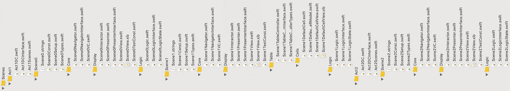
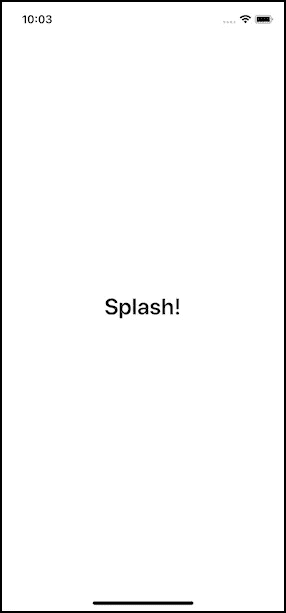
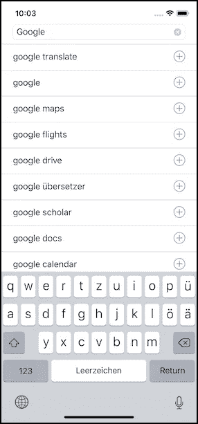
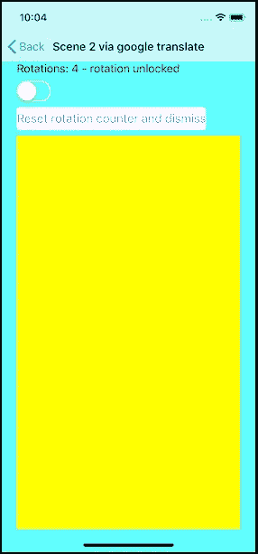

# 一个可伸缩 iOS 项目的例子，第 2 部分

> 原文：<https://betterprogramming.pub/an-example-of-a-scalable-ios-project-part-2-5c703d41f585>

## 可扩展 iOS 应用架构的组成部分

## 演示项目(DAP)场景说明

在我的文章《[完美的 iOS app 架构](https://medium.com/@sven.korset/the-perfect-ios-app-architecture-24259417843f)》中，我介绍了自己的架构，解释了*场景的概念。*在“[一个可扩展 iOS 项目的例子](https://medium.com/@sven.korset/an-example-of-a-scalable-ios-project-dce56a256106)的第 1 部分中，我描述了项目的总体结构。你可能希望在详细描述场景是如何实现的之前，先看看这个。🧐

[DemoApp 项目](https://github.com/indieSoftware/DemoArchitecture) (DAP)的存在只是为了提出某些方面和常见问题的具体解决方案。在我看来，如果代码尽可能的精简，只使用尽可能少的样板代码来简化问题及其解决方案，那就更容易理解了。

以“有用”的应用程序结束的教程会使代码膨胀，并使找到特定的“A-ha*”*时刻变得更加困难。这就是为什么我试图压缩那些时刻，减少 DAP 中的开销。希望我成功了。😅

# 场景 0

首先，当你启动应用程序时，你会进入*场景 0* 。这只是一个带有相应标签的闪屏。

场景 0

*场景 0* 是最简单的场景，展示了一个场景的结构组成，包括*依赖注入*。从研究这个场景开始，对建筑结构有一个很好的概述。

在*场景 0* 中，展示了如何在应用启动时最好地更新任何*内部设置*。对于新的应用程序版本，经常会发生一些内部变化，然后必须更新，例如数据库或核心数据模式或一些内部设置。

*逻辑*不仅要在后台管理更新，还要通过*演示者*在*视图*中启动一个渐变动画，并在自动进入*场景 1* 之前暂停。这个时间可能很棘手，这里提供了一个可能的解决方案。

让我们深入研究代码！🤠

首先，业务逻辑由*场景 0VC* 中的`viewDidAppear`触发。

Scene0VC.swift

*逻辑*负责调用`updateSettings`方法，确保满足闪屏的最小显示时间，然后当前场景随着*场景 1* 导航的启动而消失。

Scene0Logic.swift

为了计时，使用了一个*调度组*，但是，当然，也有解决这个问题的其他可能性。

更有趣的可能是第 18 行和第 29 行，在那里`testFlags`开始发挥作用。这些标志来自 *Config.plist* 文件，而`noSplash`条目显示了如何为测试目的更改逻辑，例如，当运行 UI 测试时，您通常不希望等待几秒钟闪屏消失。因此，只需用这样的配置运行您的 UI 测试来节省一些时间。

*演示器*直接实现。简单地隐藏飞溅，并在完成时通知*逻辑*。所以*逻辑*只启动隐藏进程，但进程本身由*呈现者*管理。

Scene0Presenter.swift

*导航仪*也很简单。它创建*导航控制器*和下一个*场景 1* 并呈现它们。然而，创建*场景 1VC* 是通过`dependencies`访问的*工厂*完成的。

Scene0Navigator.swift

这就是这个特定用例的全部内容。😊

*交互器*什么也不做，因为这个场景不需要将任何用户交互映射到业务逻辑用例。

该视图非常简单，只需设置一个`titleLabel`并在屏幕上居中。然而，值得一提的是，标签是以编程方式创建的，约束也是如此。为了方便创建约束，使用了第三方库“ [Anchorage](https://github.com/Rightpoint/Anchorage) ”。这是一个整洁的小图书馆，我强烈推荐。

Scene0View.swift

编程方式更好的原因可以在我的文章“[iOS 中的显示和逻辑解耦](https://medium.com/@sven.korset/decoupling-display-and-logic-in-ios-4de5a334ffbd)”中读到。然而，在这个例子中，你已经可以看到`let`可以用于`titleLabel`而不是典型的*插座* `var`，这导致了更正确的接口。标签样式和设置可以在一个地方完成，此外还可以使用常量。顺便说一下，正如您所看到的，您可以查看整个视图，因为它是简单快捷的，而不是神秘的 XML。😉

场景设置在*视图控制器*中。所以，我们来仔细看看 *Scene0VC* 。

Scene0VC.swift

第 14 行的 *VC* 的`init`方法需要注入依赖项。经典依赖注入。😄

第一个参数是一个`SetupModel.Scene0`，它是一个场景特定的参数。在这种情况下，它是一个空结构，但其他场景(如*场景 2* )可能需要一些值才能正常运行。

第二个参数是一个`Act1DCInterface`。这是一个依赖关系容器，保存对所有依赖关系的引用，比如*导航器*稍后使用的*内部设置*或*工厂*。

在`init`方法中创建了*导航器*实例。同样，任何依赖项都会被立即注入。

对于*逻辑*来说也是如此，但是这一次用自己的依赖容器包装了其他场景组件。

在 *VC* 对`super.init()`的调用之后，其他组件可以接收对 *ViewController* 的引用。这是通过属性注入实现的。

当*视图*通过第 30 行的`loadView`被加载时，`Scene0View`被创建和分配。演示者也获得了对视图的引用，并且创建了`Interactor`。

这就是幕后的全部魔力。其他场景的工作方式类似。你已经看出模式了吗？😁

# 场景 1

大多数应用程序使用*表格视图*或*集合视图*并发送任何服务器请求。这就是为什么这个应该在*场景 1* 中作为例子展示。

场景 1

在这里，用户可以搜索特定的单词，并通过谷歌的自动补全功能接收建议。

如果用户按下蓝色加号图标，建议将被带入文本字段，这将触发新的搜索。另一方面，如果用户选择一个条目，应用程序将导航到*场景 2* 。

服务器请求由相应的 *ServerWorker* 执行，它位于嵌入式框架中，并作为依赖项注入。

在这个场景中，展示了*显示*和*逻辑*通过*交互器*和*演示器*的交互，以及通过*导航器*的转换和与*工作器*的通信。所以，这实际上整体上展示了一个完整的场景。

*VC* 、*导航器*和*视图*不言自明。相比*场景 0* 没有太大区别。是的，一个*表格视图*是在*视图*中创建的，它的*表格控制器*是在 *VC* 中创建的，但这真的很简单。😪

Scene1VC.swift

*逻辑*有更多的用例。因此，有更多的方法可供调用，但这也没什么特别的。 *LogicState* 可能比较有意思。

Scene1LogicState.swift

它是一个简单的结构，保存一些值，从而为场景的*逻辑*保存状态。它在*场景 1 逻辑*的`init`期间被初始化，然后用例读取并操作这些值。

*逻辑*本身不需要任何进一步的属性来保持状态逻辑。这可以在这个结构中完成。此外，如果需要，您可以通过简单地序列化结构来快速持久化逻辑的状态。数据和逻辑现在更加分离。

*呈现器*除了在视图上显示数据之外，没有做更多的事情。

Scene1Presenter.swift

在`suggestionList(suggestions:)`方法的第一种情况下，`tableController`需要被告知更新它的视图。因此，*工作台控制器*作为*演示者*工作。它负责更新它的视图，在本例中是一个*表视图*。另一方面，*表格控制器*也作为*交互器*工作，因为它将用户动作映射到*逻辑*的方法。然而，它的责任是明确的:只负责*表视图*而不是其他。

让我们回到*呈现器*，它在`serverError`方法中呈现一个警告。你可以在“[iOS](https://medium.com/@sven.korset/decoupling-display-and-logic-in-ios-4de5a334ffbd)中解耦显示和逻辑”中读到为什么可以在这里做。

最后一个方法，`searchText`，也是不言自明的。只需更新输入字段文本。

现在到了*互动者*！🤠

Scene1Interactor.swift

哎呀，Rx！😱

是的，这里用的是 *RxSwift* 和 *RxCocoa* 。当然，您可以编写自己的绑定，比如注册操作，然后调用适当的逻辑方法。然而，Rx 使它更简单，并给你更多的权力。至少大部分时间是这样。你知道，权力和责任等等。😅

我不想进入任何 Rx 的细节。我不是 Rx pro。我认为代码被很好地注释了，足以理解每个调用做了什么。

本质上，第一个块将搜索输入字段中的任何文本更改映射到逻辑的`searchForText`方法，第二个块将任何`tableView`滚动事件映射到逻辑的`dismissKeyboard`指令。我打赌你能猜到这些逻辑方法是做什么的。😊

好了，这场戏就到这里。请随意深入研究 *TableController* 的代码以及如何设置单元格。

# 场景 2

场景 2 是一个典型的细节图，有一些额外的东西。

场景 2

如果用户在*场景 1* 中选择了一个条目，那么这个条目应该被传递给*场景 2* 。向场景传递参数通常相当常见。

如何将值传递回先前的*场景 1* 也与*场景 2* 一起显示。此处汇总了所有*场景 2* 实例中的设备旋转次数。因此，该数字总是被传递给*场景 2* ，被修改后再返回给*场景 1* 。

通常的过渡可以通过*导航栏*中的*后退*按钮完成，也可以通过*视图*中的*复位*按钮手动完成。

开关的作用是防止旋转设备时视图旋转。还有一个来自子控制器的嵌入式视图。那是黄色区域。

为了更好地理解，最好直接在代码中检查各个方面。🧐

先从 *VC* 说起。

设置与其他场景中的相同。对于具体的 *UIKit* 事件， *VC* 要向*逻辑*报告，比如当`viewWillTransition(to:, with:)`在 *VC* 上被调用时，通过`displayRotated`方法通知*逻辑*。

Scene2VC.swift

对于`viewWillDisappear`来说也是如此，其中*逻辑*应该更新父场景，因为该场景即将移回之前的场景。

另一方面，计算属性`shouldAutorotate`需要返回一个状态。 *VC* 不应保持任何状态。那是*逻辑*的责任。然而， *VC* 也不应该只调用*逻辑*上的方法来获取一个值并在这里传播它。因此， *VC* 可以直接访问*逻辑*的`state`结构，定义为:

`private(set) var state = Scene2Model.LogicState()`

这并不理想，但它比通过方法查询所有值更简单，而且这并不是一个真正的问题，因为`state`属性是只读的，不是*逻辑*接口的一部分。因此，除了 *VC* 之外，没有其他组件可以访问它，因为它保存了对*逻辑*本身的引用，而不是对*逻辑接口*的引用。😬

说到*逻辑*，它还是只操纵一些状态值，调用一些 *Presenter* 和 *Navigator* 方法。一种更接近的方法是`updateParentScene`，它用数据更新父场景。

Scene2Logic.swift

这就是如何将值传递回前一个场景。逻辑对之前的场景一无所知。它只知道它必须调用一个带有一些`Scene2Result`值的`callback`方法。

回调方法来自`setupModel`，它是一个`Scene2`类型的结构。那么这看起来像什么？

Scene2Setup.swift

该结构提供了*场景 2* 所需的值。`headline`和`numberOfRotations`是该场景要传递和呈现的值。然而，还有一个`callback`属性，它指向一个闭包，然后调用这个闭包来传回类型`Scene2Result`的值。

`Scene2Result`是一个简单的结构，它只保存要返回的`numberOfRotations`,但也可以更复杂。因此，初始化*场景 2* 的参数之一是一个闭包，用于将值返回到前一个场景。

这是在*场景 1 逻辑*中准备的。

Scene1Logic.swift

这里，*场景 1* 的*逻辑*将值和回调闭包传递给*场景 2* 。然后闭包只更新*逻辑*的状态，但这本质上就是如何来回传递任何值。😄

最后，让我们看看嵌入式视图控制器。

Scene2Presenter.swift

这是*场景中`updateView(model:)`方法的摘录。当没有已经添加的子控制器时，一个新的 *UIViewController* 被创建并作为子控制器添加到场景的 *ViewController* 中，并且它的视图被嵌入到场景的*视图*中。*

Scene2View.swift

场景视图负责操纵视图层次。这就是这个`addEmbeddedView`方法出现在视图中的原因。它只添加子视图并锚定它。

但是，等一下，为什么是*演示者*创建 *UIViewController* 而不是*工厂*？🤨

说得好！我已经在我的文章“[iOS](https://medium.com/@sven.korset/decoupling-display-and-logic-in-ios-4de5a334ffbd)中的解耦显示和逻辑”中解释了这样做的原因。当然，您可以自由地使用*工厂*来创建这种依赖关系。那肯定会更干净。

然而，*演示者*将不会进行单元测试，而是 UI 测试。它将不会脱离其他组件进行测试。您不需要模仿这个 *UIViewController* 依赖项。这同样适用于*表示器*可能需要的任何格式化程序或任何其他依赖项。您很少会注入与这些实例不同的内容。那为什么还要注射呢？只是为了打针？🤔

像所有的事情一样，这是一种交换。利益是否证明了工作的正当性？当然，我们想要干净的代码，但是我们也想要可维护的代码，更少的代码意味着更少的维护。

在这种特殊情况下，我认为我们不需要扩展*工厂*，可以将这些依赖项直接放入*表示器*中。然而，这总是要根据情况来权衡，将来我可能会改变主意。

所以，不要把它当成不可否认的教条。

> 不要认为任何事情都是不可否认的。时间可以改变一切，甚至是教条和最佳实践！

就这样，一切都说完了。😄

# 结论

DAP 应该以压缩的形式表示常见的应用程序。

也许这看起来不多，但是根据帕累托原则，20%的努力足以解决 80%的问题。在我看来，这些是一个典型的应用程序面临的最常见的问题，应该涵盖上述 80%。

然而，那当然只是骨架。剩下的就是你作为开发者的创造性任务了。😁

顺便说一句，这只是“[可扩展的 iOS 应用架构](https://medium.com/@sven.korset/pieces-of-a-scalable-ios-app-architecture-7c182f9dcd2c)”系列文章中的一篇。也许你想读更多我不可否认的智慧？😂