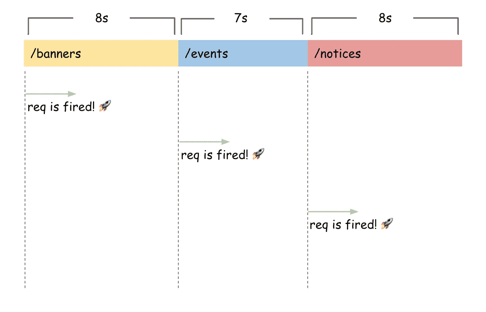
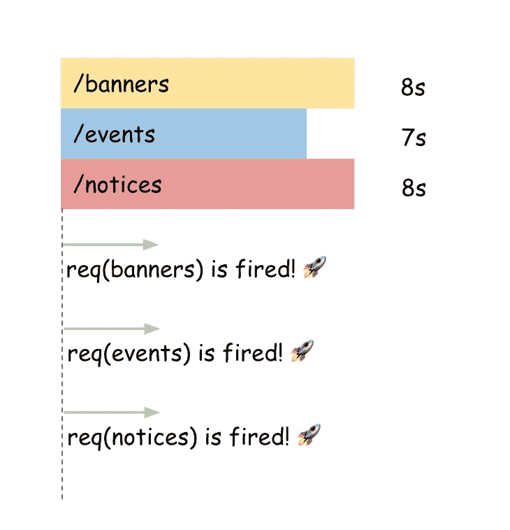
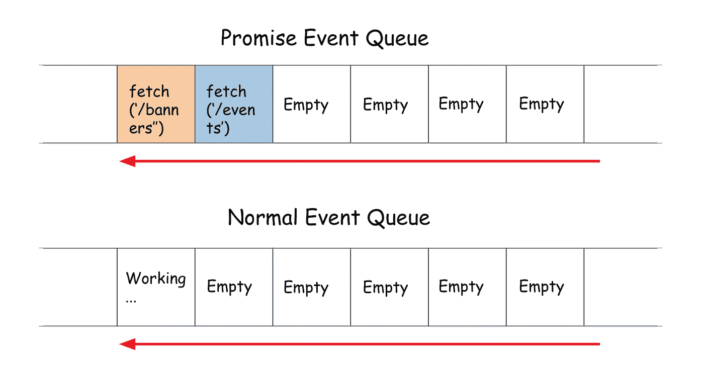
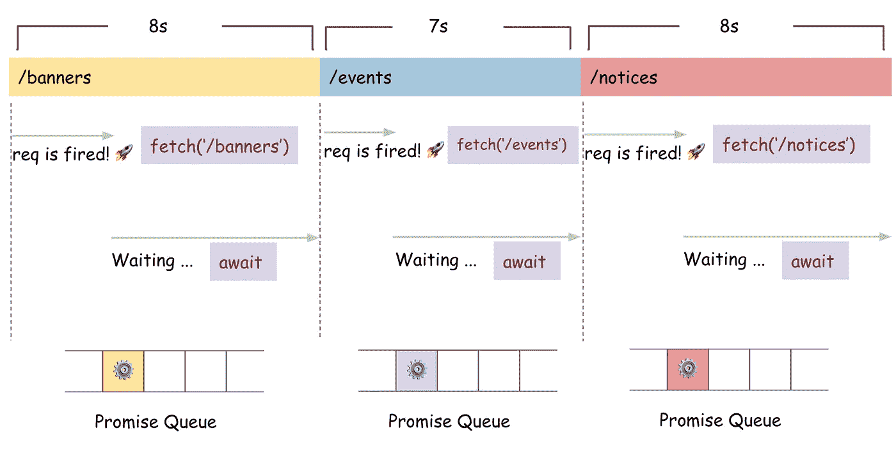
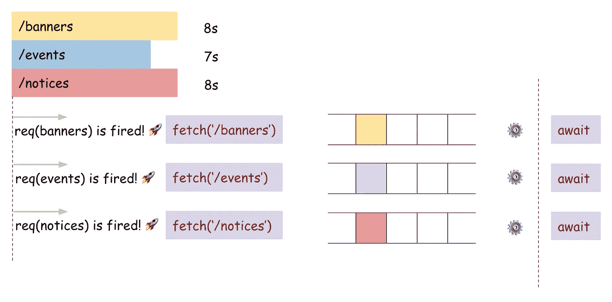

# 用 Async/Await 提高 Web 性能的一个非常简单的技巧

> 原文：<https://betterprogramming.pub/an-extremely-easy-tip-to-improve-web-performance-with-async-await-b609e7e65744>

## 一个很好的拯救技巧


照片由[张家瑜](https://unsplash.com/@danielkcheung?utm_source=medium&utm_medium=referral)在 [Unsplash](https://unsplash.com?utm_source=medium&utm_medium=referral) 上拍摄

你喜欢使用`async` / `await`语法吗？我也是。在我看来，它比`Promise`连锁店要好。但是我想知道你是否正确地使用它。有时它会使你的程序运行得比预期的慢。在这篇文章中，我想告诉你一些非常重要的事情，当使用`async` / `await`时会有更好的性能，这在你的项目中非常容易采用。

# 阅读前

许多 JavaScript 开发人员都喜欢`async` / `await`语法。我认为人们喜欢这种语法的主要原因是因为`Promise` hell，它通过调用`then`不断生成深度。

`async` / `await`让开发者通过使用`await`关键字来减少或摆脱`Promise`的困扰。但是，您有没有想过，如果以非优化的方式使用这种语法，可能会降低应用程序的速度？

那我们该怎么办？让我们谈谈我们的选择。

# 助手功能

让我们假设有一个函数叫做`sleep`。它把时间拖延到你想拖延多久，这是一个`Promise`基数。

```
const sleep = t => {
  return new Promise(res => {
    setTimeout(res, t);
  });
};
```

而且我们还有一个假的`fetch`方法。

```
const fetch = url => {
  const time = url.length * 1000;
  return sleep(time);
};
```

假方法`fetch`采用一个字符串类型的参数，它用于计算延迟的时间长度。如果我们调用`fetch('/notice')`，由于`/notice`有 7 个字符，延迟时间将是 7 秒。

# 基本情况和问题

现在，我们访问应用程序的主页；大概是`/`。当我们访问主页面时，代码试图通过`fetch` ing 加载数据。

```
// React base
async componentDidMount() {
  const banners = await fetch('/banners');
  const events = await fetch('/events');
  const notices = await fetch('/notices'); /* Do other tasks here */ this.setState({
    ...this.state,
    banners,
    events,
    notices
  });
}
```

我们之前制作了一个假的`fetch`方法，这是一个`Promise`基地。它采用字符串类型的参数。

*   `/banners` →八个字符/八秒延迟
*   `/events` →七个字符/七秒钟延迟
*   `/notices` →八个字符/八秒延迟



总的获取时间将是 23 秒，因为它在调用下一个获取之前等待当前获取结束。

如果提取的顺序很重要，这种结构就很好。例如，我们应该在获取`/my-profile`之前获取`/login`,因为它是仅限会员的信息。

如果在渲染之前需要获取五个以上的 API，该怎么办？API 越多，用户在看到页面之前等待的时间就越长。

# 解决办法

解决方案非常简单明了。

```
// React base
async componentDidMount() {
  const bannersFetch = fetch('/banners');
  const eventsFetch = fetch('/events');
  const noticesFetch = fetch('/notices'); /* Do other tasks here */ const banners = await bannersFetch;
  const events = await eventsFetch;
  const notices = await noticesFetch; this.setState({
    ...this.state,
    banners,
    events,
    notices
  });
}
```

与早期版本唯一不同的一点是，我们不再将`await`关键字放在`fetch`之前。相反，我们把它放在后面。接下来会发生什么？



每个`fetch`请求都将被发送到服务器，因为它们都不会在触发下一个`fetch`之前等待响应。

即使在上面的例子中`componentDidMount`没有额外的工作，最长等待时间也只有 8 秒。

# 承诺带来魔力

我们能够从几行代码更改中获得巨大好处的原因是因为承诺。基本上，Promise 是一个异步工作的 API。然而，秘密实际上隐藏在事件队列中。



众所周知，JavaScript 是一种单线程方法。这意味着无论如何，程序中必须只有一个任务在运行。容器是一种队列类型，它保存任务直到轮到它们被执行，被称为*事件队列*或*任务队列；*根据您阅读的文档，这可能会有所不同。

可以被视为*正常任务*的任务示例有`console.log(1)`、`obj.foo()`或任何类似的非异步作业。

Promise 是一个异步 API。在运行时，JavaScript 向承诺事件队列发送一个承诺任务(或基于承诺的任务)。并且承诺队列中的任务也必须等待轮到它们被调用。但是请注意，只有在正常任务完全为空的情况下，Promise 队列中的任何任务才能被拉出并运行。



```
const banners = await fetch('/banners');
const events = await fetch('/events');
const notices = await fetch('/notices');
```

因为每行都有`await`关键字，所以 Promise 队列不能接收更多的任务。首先，执行`fetch('/banners')`。程序等待其响应，并将下一个`fetch`任务放入队列。



```
const bannersFetch = fetch('/banner');
const eventsFetch = fetch('/events');
const noticesFetch = fetch('/notices');const banners = await bannersFetch;
const events = await eventsFetch;
const notices = await noticesFetch;
```

有了这个代码，所有三个`fetch`都可以按照从上到下的顺序堆叠在承诺队列中。这些承诺将在几乎相同的时间被取出并执行(而正常队列是空的)，但是它们不必再等待前一个`fetch`的响应。

# 演示

# 结论

使用`async` / `await`语法让我们的生活更加轻松愉快，但是我们应该好好使用它们。简单地把`await`关键词放在某个地方可能会导致非常不同的结果，这取决于你把它放在哪里。