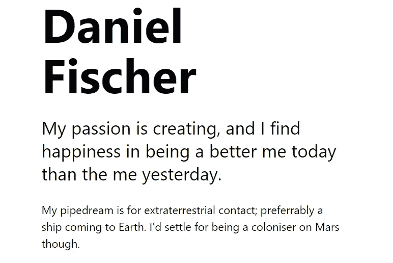
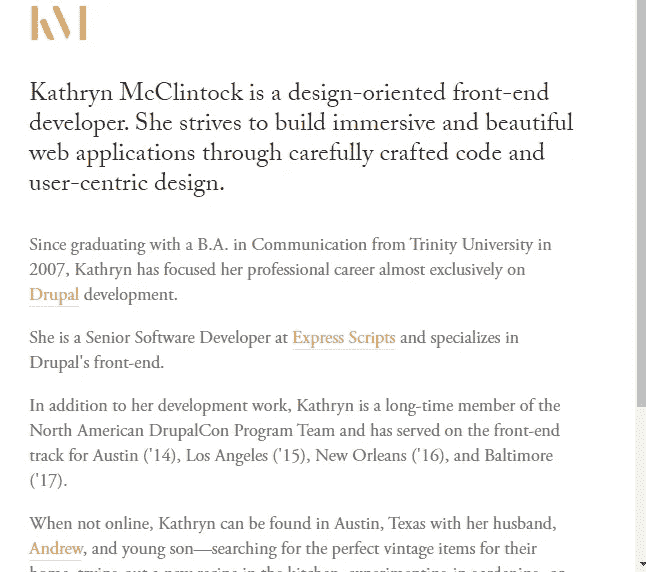
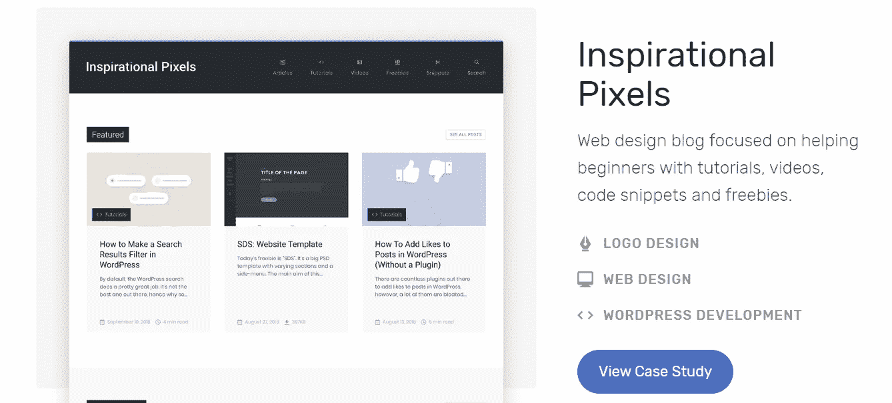

# 构建强大开发人员组合的诚实指南

> 原文：<https://betterprogramming.pub/an-honest-guide-to-build-a-decent-and-powerful-developer-portfolio-2319f2cc2c19>

## 如何有效地展示你的技能

成功通过[图标 8](https://icons8.com/ouch/illustration/flame-success)

是的，你应该关心构建你自己的开发组合——有很多原因。对于专业人士和试图开始职业生涯的人来说都是如此。

让我们来分析一下投资回报:

*   提高知名度和权威性。
*   一种证明你懂手艺的方法。
*   工作背景可以让你在这个行业中获得第一个职位。
*   它可以显示你在某一主题上的专长。
*   提升你的个人品牌。
*   在面试中从一群候选人中脱颖而出。

坏处呢？建立一个像样的投资组合可能需要一段时间。大多数开发人员不知道在里面放什么。你应该使用你在 React 中列出任务清单吗？香草 JavaScript 天气应用？有什么值得放进去的？

本指南旨在消除围绕建立您的投资组合的所有烦恼。记住:**你决定建造的具体项目并不重要——只要它们背后的选择是正确的。**

当然，质量是必须的。你应该关心尽可能写最好的代码。但是选择你的投资组合背后的好理由会很快帮助你找到想法并创造一个令人印象深刻的想法。

通过[图标 8](https://icons8.com/ouch/illustration/flame-2) 列表为空

# 选择项目

组成你的投资组合的项目数量可以变化。你有四到六个中型项目吗？没关系。两个非常大的？那还是好的。然而，要意识到，你拥有的越少，这些项目就越会大放异彩。你将不得不付出额外的努力来建造一些令人印象深刻的东西。

我稍后会讲到你如何在一个项目上付出努力来给面试官留下深刻印象。

请注意，拥有大量高质量的项目也能让你比其他人领先一步。为什么？因为你会有更多的灵活性。你还是会选最好的五六个。但是如果你想给你的投资组合一个不同的方向，你会有一个安全网。也许你决定炫耀你在反应、电子或 Vue 方面的技能。更多的项目意味着更多的选择和灵活性。

通过[图标搜索 8](https://icons8.com/ouch/illustration/flame-searching)

# 你的工作有什么意义？

这是直接联系到上面的。你投资组合背后的实际意义是什么？你想在 Angular 里展示你的力量吗？展示你能多好地转换技术？这个因人而异。我更倾向于专业开发人员。挑选三到四项技能，尽你所能用它们来构建项目。

# 你能为你的投资组合建立什么项目？

这是我在网上找到的很多资源的痛点。他们中的很多人会给你提示和技巧，告诉你如何改进你的投资组合网站。但是你应该构建什么来使它脱颖而出呢？

答案比你想象的要简单。你可以用你的技能创造成千上万的东西:*天气应用，预算应用，克隆*。**我认为让你的项目脱颖而出的是你赋予它们的意义。**你应该*关心*你为什么要建立这些项目——你想用它们展示什么。这些内在的原因会让你的投资组合大放异彩。

这里是我想到的最好的主意，在你决定建造什么的时候给你一些指导。

通过[图标升级 8](https://icons8.com/ouch/illustration/flame-upgrade)

# 1.为家人或朋友做点什么

很容易找到需要什么的人。也许一个家庭成员有一个商店或活动需要一个网站。或者，他们可能需要一个应用程序来管理他们的预订、客户或员工。你喜欢在周末和老朋友聚会吗？创建一个应用程序来整理它们。如果你和你的室友住在一起，创建一个应用程序来分担房屋费用。

利用你周围的环境，并从中创造一些东西。这表明你有解决问题的直觉。这对任何想招聘的人来说都非常有价值。你看到一个问题，了解一个解决方案的平台，并建立它！

# 2.为当地企业做点什么

这可能看起来类似于上面所说的，但这个项目背后的意义是不同的。它让你展示你在更具竞争性的环境中工作的能力——在这种环境中，你实际上是在寻找真正的客户，并与他们一起寻找解决他们问题的方法。这将表明你可以在一个不熟悉的环境中完成项目。它还展示了一些软技能，如向企业推荐产品。

我的建议是，利用网络寻找需要帮助的企业。你可能认识一些人，他们知道其他人需要一个网站。也许你当地的冰淇淋店需要一个新的平台来获得客户。发挥你的想象力，为此鼓起很大的勇气。

# 3.打造符合您需求的产品

我需要一种方法来快速记录我白天写的笔记，将它们归类，并在日历中排序。我在网上商店找不到任何类似的应用程序。为什么不自己做一个放在我的作品集里呢？多酷啊。你用你的技能为自己编写解决方案，然后将它们发布给更多可能有类似需求的人。

# 4.构建克隆体

重建一个网站需要很多技巧和时间。也许你可以做一些简单的事情，然后重构它来改进它。如果你想拍月球，克隆一个 Airbnb 或者 Instagram 这样的非常大的网站，也许可以拿其中的一小部分。让它变得更好，展示你决策背后的过程。你必须知道什么是好的，什么是不好的，才能脱颖而出。

## **个人例子**

我面试过的一些公司让我在他们的网站/平台上挑毛病。炫耀批判我的眼睛带我走了很远。

## **一点小技巧**

我发现这个技巧有巨大的价值，但似乎没有人谈论它。如果可能的话，在对一家公司进行长时间面试的过程中，为什么不克隆或制造一个更小的、改进过的面试公司的产品呢？如果你没有投资组合，这会让你远远领先于其他候选人。你理解了这个项目，创建了一个克隆或者更小的版本，并且实际上向最初的创作者提出了这个项目。

这就像你在做比萨饼，想为当地的比萨饼店工作。为什么不告诉他们你的技术，却不让他们品尝你做的他们最著名的菜肴？

# 5.使用对你有利的课程项目

也许你已经加入了一个训练营或者一个在线编码课程。这些资源中的大部分将指导你在学习的同时构建项目。为什么不把这些项目作为作品集素材的平台呢？改进、扩展和发布它们。展示你有多喜欢多做一点事情*对吧*。

# 6.获得一些积极的自由职业经验

如果你能通过自由职业生存下来，并写一些网站，那将是惊人的。确保你在这方面付出了额外的努力，这样你就可以让你的客户给你的投资组合一个积极的评价。

通过[图标 8](https://icons8.com/ouch/illustration/flame-8) 显示网关

# 接下来呢？

你有一些很酷的项目吗？太好了。现在最好的事情可能是有一个很酷的 yourdomain.com 网站，在那里你可以展示他们。你真的可以在以下平台上找到便宜的方法:

*   [场地](https://it.siteground.com/index.htm?afcode=f29e0a51c2a41f6b32c23cd8f5817a32)(我的选择)。
*   [GoDaddy](https://it.godaddy.com/offers/domains/cctld/com-or-it/viral-offer?isc=ITIDOM1&countryview=1&currencyType=eur&gclid=CjwKCAjw8df2BRA3EiwAvfZWaDNc08_i_djX5UZnuAVGDOZNIj23HHdaQl-FG-_sK4MgnmiLz-KJyhoCSEQQAvD_BwE&gclsrc=aw.ds) 。
*   [宿主](https://www.hostgator.com/web-hosting?utm_source=google&utm_medium=brandsearch&kclickid=b587f9fb-eb90-40f9-a8c4-856475303ccc&kenshoo_ida=Host%20Gator%20IDA&adid=367932471525&utm_term=hostgator&matchtype=e&addisttype=g&campaign=2053150209&adgroup=79038780129&gclid=CjwKCAjw8df2BRA3EiwAvfZWaLqVfoKRrZfipjAQEx9utwfvPr_XqfQTPCwCPEIdTD1hOsQL8v9MlxoCVUEQAvD_BwE)。

套餐真的很便宜，尤其是对新客户来说。对于您将获得的巨大支持和技术规格，投资是完全值得的。我强烈推荐投资，因为缓慢、丑陋的投资组合弊大于利。

# 一个好的投资组合网站的公式

你不会想走这条复杂的路线的。不要分散人们对你所做的伟大工作的注意力。我相信一个简单的三页网站就足够了:

*   **关于:**给自己用一个好的描述。不要用疯狂的词语，比如:一个*惊人的开发者*、*真正勤奋的*、*难以置信的热情*。关注你如何帮助公司和客户实现目标。类似于:“嗨，我是 x，我用我的技能帮助公司创造质量(在此插入)”。请看下面的好例子，请记住使用专业质量的形象！

*   项目:你的项目应该放在这里。对每一个都写一个简短的描述——你建立它的原因和将要使用它的客户。可能包括使用的技术堆栈和源代码的链接。

*   **联系人**:您的联系方式。只要确保它是正确的，并且总是最新的。

# 灵感投资组合

以下是一些公开的开发者作品集，你可以从中寻找一些灵感:

*   [马修·威廉姆斯](http://findmatthew.com/)
*   Adham Dannaway
*   [帕维尔·胡扎](http://www.pavelhuza.com/)
*   [皮埃尔·诺尔](https://pierre.io/)
*   丹尼尔·费舍尔→ [作品集](https://www.danielfischer.com/)。
*   凯瑟琳·麦克林托克→ [作品集](http://www.kathrynmcclintock.com/)。

# 结论

建立投资组合并不容易。这需要时间和精力。但是把它看作是你职业生涯中的一项投资——一件让你引以为豪的事情，它会让你从同龄人中脱颖而出。