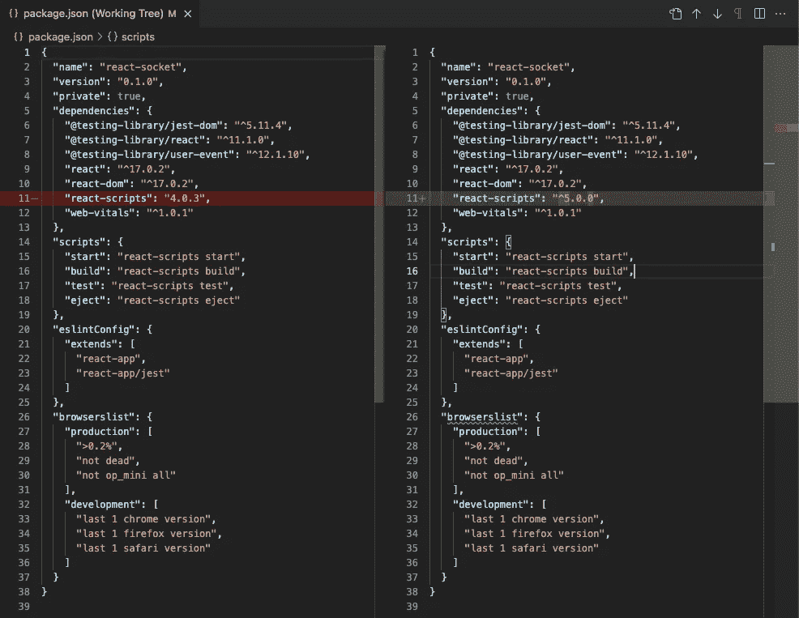
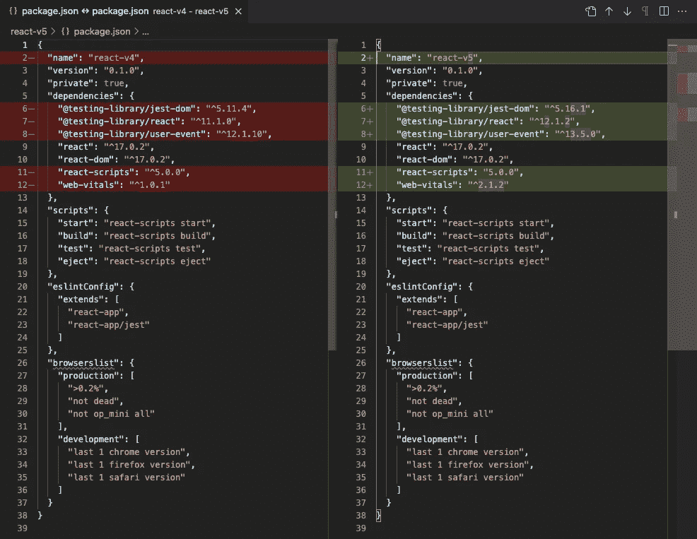
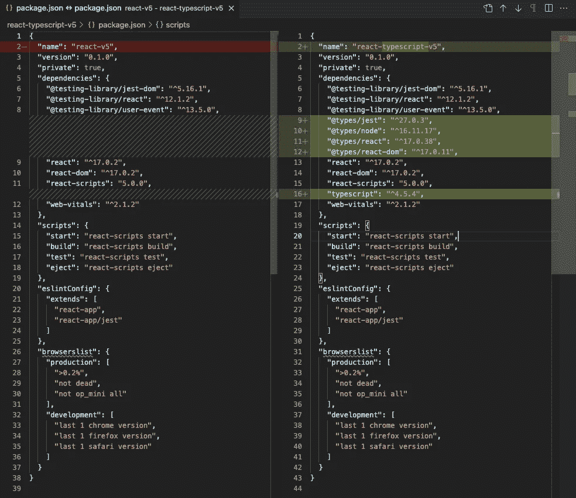

# 创建 React 应用程序 5 (CRA 版本 5)的深入指南

> 原文：<https://betterprogramming.pub/an-in-depth-guide-for-create-react-app-5-cra-5-b94b03c233f2>

## CRA 5 的新功能和新套件的详细信息


照片由[星号 KWON](https://unsplash.com/@unknown_salad?utm_source=medium&utm_medium=referral) 在 [Unsplash](https://unsplash.com?utm_source=medium&utm_medium=referral) 上拍摄

[创建 React 应用](https://medium.com/better-programming/10-fun-facts-about-create-react-app-eb7124aa3785) (CRA)是搭建 React 项目的快捷方式。它可以通过命令`npx create-react-app <project name>`轻松生成。使用一个命令，我们就有了 React 项目的最新包和执行环境。方便有效。

CRA 5 于 2021 年 12 月 14 日发布。它具有以下新功能和新软件包:

*   停止对节点 10 和 12 的支持。
*   快速刷新改进。
*   改进的软件包管理器检测。
*   取消固定所有依赖关系，以便更好地与其他工具兼容。
*   开始顺风支持。
*   升级到 Webpack 5、Jest 27、ESLint 8 和 PostCSS 8。

让我们过一遍这些细节。

# 安装新创建的 React 应用程序

`create-react-app`是一个创建新 React 项目的全局命令行实用程序。创建的项目有最新版本的`react-scripts`，目前是 5.0.0。CRA 5 不再支持节点 10 和 12，它需要节点 14 或更高版本。如果节点版本不符合要求，`create-react-app`将失败。

将节点版本设置为 17 (14 或更高版本)后，安装工作正常。

# 升级现有 Create React 应用程序

`react-scripts`包括脚本和配置。更新 Create React App 项目是通过将`react-scripts`升级到特定版本来实现的。[官方文档](https://create-react-app.dev/docs/updating-to-new-releases/)建议运行以下命令升级到最新版本:

```
npm install --save react-scripts@latest
```

通过运行这个命令，我们将`react-scripts`从版本`4.0.3`平稳地升级到版本`5.0.0`。

下面是`package.json`文件的区别:



作者图片

我们已经升级了`react-scripts`的版本。以下是 CRA 4 `package.json`和 CRA 5 `package.json`的区别。



作者图片

差异看起来很小。我们可以手动更新`testing-library`和`web-vitals`的版本，以匹配 CRA 5 中的版本。

# 升级 TypeScript 版本

如果使用 TypeScript，可以通过运行以下命令来创建新项目:

```
npx create-react-app --template typescript <project name>
```

下面是 JavaScript CRA `package.json`的区别。还有打字稿 CRA `package.json`。



作者图片

从 CRA 4 到 CRA 5，TypeScript 已经从 4.1 版更新到 4.5 版。

# 快速刷新改进

对于热模块更换(HMR)运行时，快速刷新已通过如下所述的紧急情况行为得到改进:

*   如果未启用快速刷新，则退出到强制重新加载。
*   如果启用了快速刷新并且有更新的模块，请依靠快速刷新来恢复错误并跳过强制重新加载。
*   如果启用快速刷新，则没有更新的模块，热更新的状态为`abort`或`failed`，退出强制重新加载。

# 改进的软件包管理器检测

在 CRA 4 中，`npx create-react-app my-app`会使用 yarn 来安装依赖项，如果有 yarn 安装的话。否则，可以设置一个标志来使用 npm:

```
npx create-react-app my-app --use-npm
```

这种行为在 CRA 5 中被改变了。如果环境变量`npm_config_user_agent`设置为`'yarn'`，它将使用 yarn 作为包管理器:

否则，这取决于调用命令的方式:

```
yarn create react-app my-app // use yarnnpm init react-app my-app // use npmnpx create-react-app my-app // use npm
```

# 取消固定的相关性

在 CRA 5 中，这里是`react-scripts`中已安装的`package-lock.json`:

看上面的代码。你发现了什么？

所有版本都使用[插入符号依赖关系](/how-to-upgrade-dependencies-in-package-json-e5546804187f)，即这些包将使用最高的次要版本。

相比之下，CRA 4 的`react-scripts`中的许多包都是精确的版本。

CRA 5 解钉`babel-loader`，这已导致问题时，使用 CRA 与故事书。此外，CRA 5 取消了所有的依赖关系，以便更好地与其他工具兼容。

你还发现了什么？

*   `tailwindcss` ( `^3.0.2`)新增。
*   这些包被更新:`webpack`:(`^5.64.4`)`jest`:(`^27.4.3`)`eslint`:(`^8.3.0`)`postcss`:(`^8.4.4`)。

# 顺风支架

Tailwind 是一个 CSS 框架，打包了像`flex`、`text-5xl`、`font-bold`、`text-green-500`等类。可以直接在标记中组合这些类来构建任何设计。

Tailwind 扫描 HTML 文件、JavaScript 组件和其他一些模板中的类名。它生成相应的样式，然后将它们写入静态 CSS 文件。Tailwind 快速、灵活、可靠，并且零运行时间**。**

CRA 5 号增加了顺风支持。

通常情况下，[设置和使用顺风](https://tailwindcss.com/docs/installation)需要 5 个步骤。借助预配置的 CRA 5，只需 3 个步骤:

**第一步:配置模板路径。**

在根目录下创建配置文件`tailwind.config.js`:

**第二步:将顺风指令添加到 CSS 文件中。**

这里是`src/index.css`:

**第三步:在 React 组件中使用顺风。**

下面是一个`src/App.js`的例子:

`text-5xl`设置`font-size: 3rem`和`line-height: 1`。

`font-bold`设置`font-weight: 700`。

`text-green-500`设置`color: rgb(34 197 94)`。

执行代码`npm start`，我们看到文本应用了顺风样式:


作者图片

# 网络包 5

Webpack 是一个模块捆绑器。它的主要目的是捆绑 JavaScript 文件以在浏览器中使用，但它也能够转换、捆绑或打包任何资源或资产。捆绑模块可以是 [CMJ、AMD、UMD、ESM 等](/what-are-cjs-amd-umd-esm-system-and-iife-3633a112db62)。

[Webpack 5 于 2020 年 10 月 10 日](/micro-frontends-using-webpack-5-module-federation-3b97ffb22a0d)发布，主要特点如下:

*   通过持久缓存提高构建性能。
*   通过更好的算法和默认值改进了长期缓存。
*   通过更好的树抖动和代码生成改进了包的大小。
*   引入了[模块联合](https://webpack.js.org/concepts/module-federation/)，它允许多个 Webpack 构建一起工作。

CRA 5 与 Webpack 5 打包在一起。

# 笑话 27

Jest 是一个 JavaScript 测试框架，专注于创建、运行和构建测试。Jest 是最受欢迎的测试运行程序之一，它与使用 Babel、TypeScript、Node、React、Angular、Vue 等的项目一起工作。

Jest 27 于 2021 年 5 月 25 日发布，主要功能如下:

*   对于观察模式下的快照测试，我们可以输入`u`来更新失败的快照。现在交互模式也可以应用于一次一个地通过失败的测试。我们可以键入`s`跳过失败的测试，键入`q`退出交互模式，或者按`Enter`返回观看模式。
*   与 Jest 26 相比，每个测试文件的初始化速度提高了 70%。
*   支持写在 [ESM](/what-might-be-coming-in-npm-9-6985cf2678a6) 中的用户配置，所有可插拔模块都能够加载 ESM。
*   启用符号链接到测试目录的测试文件，这是 [Bazel](https://enlear.academy/how-to-set-up-bazel-for-a-react-app-c8a6ae6131d5) 想要的特性。
*   使`transform`能够异步，这是 [esbuild](https://esbuild.github.io/) 、 [Snowpack](https://www.snowpack.dev/) 和 [Vite](https://vitejs.dev/) 想要的特性。
*   将默认测试运行器从`jest-jasmine2`更改为`jest-circus`，将默认测试环境从`'jsdom'`更改为`'node'`。
*   Jest 26 中假计时器的新实现成为默认。
*   同一个`done`测试回调不能调用多次，调用`done`和返回承诺不能合并。
*   一个`describe`块不能返回任何东西。

CRA 5 是用 Jest 27 包装的。

# ESLint 8

ESLint 是一个识别和报告 JavaScript / TypeScript 代码中模式的工具。它执行传统的林挺来寻找有问题的模式，它还执行样式检查来执行约定。ESLint 8 于 2021 年 10 月 9 日发布，主要特性如下:

*   停止对节点 10、13 和 15 的支持。
*   移除了代码帧和表格格式化程序。如果需要，需要安装独立的`eslint-formatter-codeframe`或`eslint-formatter-table`软件包。
*   `comma-dangle`规则模式变得更加严格。
*   未使用的禁用指令现在可以用`--fix`修复。
*   `eslint:recommended`预置中启用了 4 条新规则:`no-loss-of-precision`、`no-nonoctal-decimal-escape`、`no-unsafe-optional-chaining,`和`no-useless-backreference`。
*   `CLIEngine`类已被`ESLint`类取代。
*   已弃用的`linter`对象已被移除。
*   `/lib`入口点已被移除。

CRA 5 与 ESLint 8 打包在一起。

# 后 CSS 8

PostCSS 是一个用 JS 插件转换样式的工具。这些插件可以 lint 一个 CSS 文件，支持变量和混合，transpile 未来的 CSS 语法，内联图像等。例如，`[autoprefixer](https://github.com/postcss/autoprefixer)`是一个流行的插件，它根据当前浏览器的流行程度和属性支持来应用 css 前缀。

PostCSS 8 于 2020 年 9 月 15 日发布，主要特点如下:

*   它有一个新的插件 API，允许所有插件共享 CSS 树的单一扫描。它使 CSS 处理速度提高了 20%。它减小了`node_modules`的大小，支持更好的源码图，改进了 CSS 解析器。
*   停止对节点 6、8、11 和 13 的支持。
*   它为 npm 包中的 ES6+源代码提供服务，不需要 Babel 编译。
*   移除了很少使用的`postcss.vendor` API。

CRA 5 与 PostCSS 8 打包在一起。

# 结论

CRA 5 已经到来，具有新的功能和新的软件包。新创建的项目将使用 CRA 5。如果你有一个现有的 CRA 4 项目，按照上述说明进行升级。

如果你有一个现有的 CRA 3 项目，按照本文[先升级到 CRA 4。](/upgrade-create-react-app-based-projects-to-version-4-cra-4-d7962aee11a6)

感谢阅读。我希望这有所帮助。如果你有兴趣，可以看看[我的其他媒体文章](https://jenniferfubook.medium.com/jennifer-fus-web-development-publications-1a887e4454af)。