# 深入了解故事书 6

> 原文：<https://betterprogramming.pub/an-in-depth-look-at-storybook-6-8c44cd6895ee>

## 探索故事书 6.0 以来的新功能


照片由[西格蒙德](https://unsplash.com/@sigmund?utm_source=medium&utm_medium=referral)在 [Unsplash](https://unsplash.com?utm_source=medium&utm_medium=referral) 上拍摄

[Storybook](https://storybook.js.org/) 是 UI 开发的工具。它通过隔离组件使开发更快更容易。这允许我们一次处理一个组件。它简化了 UI 开发、测试和文档。

故事书 6.3 于 2021 年 6 月发布。除了 [React 17](https://reactjs.org/blog/2020/10/20/react-v17.html) 、 [NPM 7](/the-step-by-step-guide-to-understanding-and-adopting-npm-7-914504f7090f) 、[纱线 2](https://yarnpkg.com/) 和 [Webpack 5](/micro-frontends-using-webpack-5-module-federation-3b97ffb22a0d) 支持之外，从故事书 6.0 开始还支持以下特性:

*   零配置设置
*   动态组件编辑
*   多故事书作文
*   文档改进

在本文中，我们将深入探讨这些特性的细节。

# 零配置设置

故事书很复杂。当有更多的旋钮来设置一个复杂的软件时，它变得更加困难。Storybook 6.0 使零配置设置变得简单—最佳实践配置已设置，TypeScript 已配置，并且它与流行的应用程序框架兼容。

以[创建 React App](/upgrade-create-react-app-based-projects-to-version-4-cra-4-d7962aee11a6) 为例。以下命令创建一个 React 项目:

```
npx create-react-app storybook
cd storybook
npm i
```

然后你只要输入一个命令，`npx sb init`，故事书就安装好了。

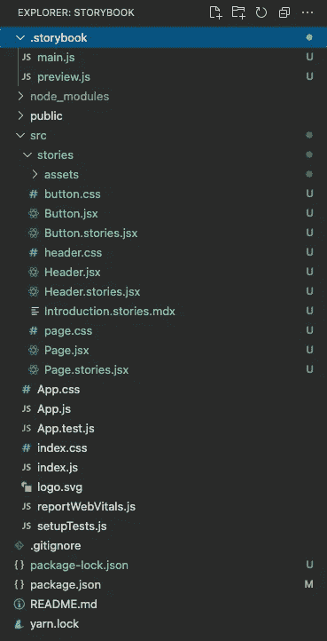

它用两个配置文件创建了文件夹`.storybook`:

*   `main.js`:配置故事文件位置，附加组件，以及自定义网络包和巴别塔配置。由于是在 Create React App 下，所以安装足够智能，可以添加`@storybook/preset-create-react-app`(第 6 行)。

*   `preview.js`:设置装饰器、参数和全局类型的全局设置。下面的参数部分为动作处理程序配置正则表达式(第 2 行)，为`background`或`color`(第 5 行)使用颜色选择器，为`Date`(第 6 行)使用日期选择器。

该装置包括一些示例组件和`src/stories`下的故事。在我们熟悉 Storybook 之后，这些例子就可以去掉了。

执行`npm run storybook`，我们会在网上看到一本漂亮的故事书。

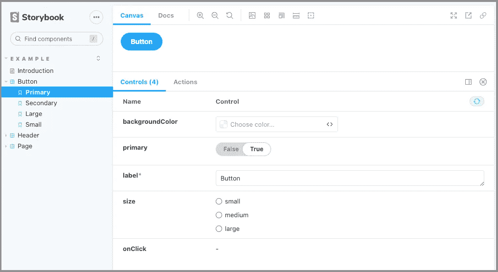

这些示例故事带有一些附加内容。

上面截图中的`[Controls](https://storybook.js.org/docs/riot/essentials/controls)`插件允许动态修改参数。

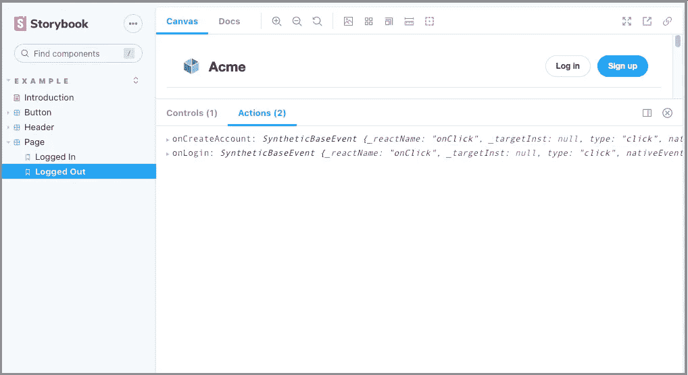

上面截图中的`[Actions](https://storybook.js.org/docs/riot/essentials/actions)`插件显示事件处理程序接收到的数据。点击`Sign up`时，显示`onCreateAccount`。点击`Log in`时，显示`onLogout`。

每个故事都有一个现成的`[DocsPage](https://storybook.js.org/docs/riot/writing-docs/docs-page)`，它集合了组件故事、文本描述、docgen 注释、参数表和代码示例。

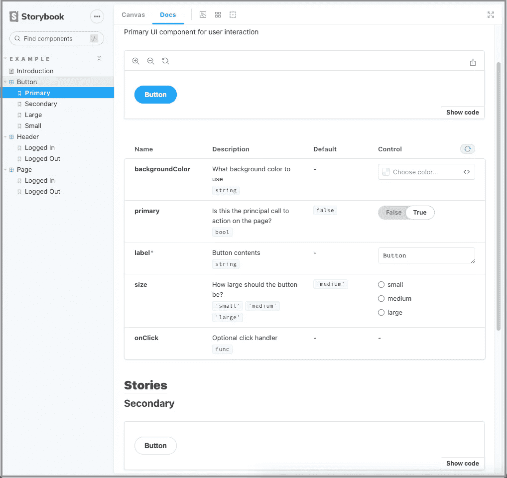

上面截图中的`DocsPage`插件启用`Show code`，显示参数，并允许修改当前渲染故事的参数。要知道只有第一个故事才显示论点。毕竟，它们是同一个组件，只需要一组参数就可以动态修改。

# 动态组件编辑

我们已经看到了在`Controls`插件和`DocsPage`插件中动态修改参数的能力。

[以下是我们为](https://jenniferfubook.github.io/react-components/?path=/story/components-charts--line-chart)[上一篇文章](/build-react-tabs-using-recoil-styled-components-and-storybook-js-4ad534cef007)制作的故事书:

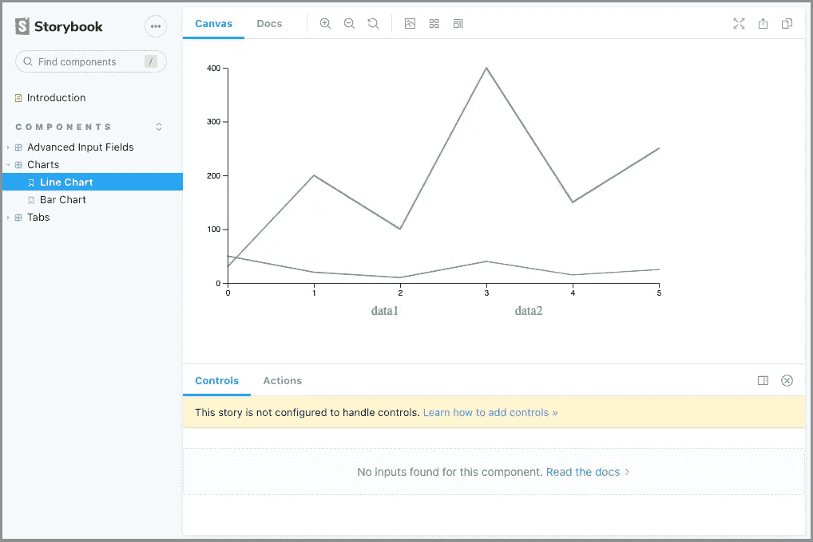

`Controls`附加组件会怎样？

它说“这个故事没有被配置成处理控件。”

动态组件编辑是 args 表的一个特性。这些表列出了组件的参数，简称 args。它需要一个用[组件故事格式](https://storybook.js.org/blog/component-story-format/) (CSF)编写的故事，这是故事书 5.2 中引入的。CSF 基于 ES6 模块，与 Storybook 的内部 API 分离。

args 对象可以在故事和组件级别定义(见下文)。它是一个 JSON 可序列化对象，由字符串键和匹配的有效值类型组成，可以传递给组件。

以下是官方的`Button`故事。

线`14`创建了映射`args`的`Template`用于渲染。

每个故事在第`14`、`20`、`25`和`31`行重复使用`Template`。

然后在`15`行定义`Primary.args`，在`21`行定义`Secondary.args`，在`26`行定义`Large.args`，在`31`行定义`Small.args`。

你想知道第`7`行的`argTypes`是什么吗？

它定义了由`'color'`控件控制的`backgroundColor`，即拾色器。


如果我们注释掉行`7`–`9`,`backgroundColor`默认为一个颜色字符串。

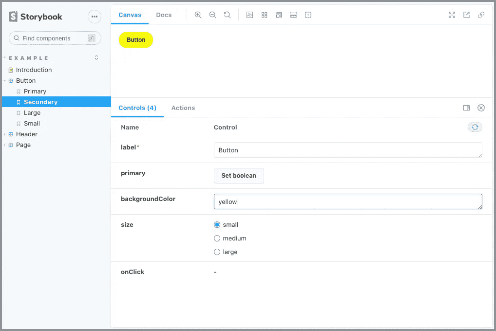

由于`.storybook/preview.js`定义了控件为`background`或`color`使用颜色选择器，如果参数命名为`background`或`color`，则不需要`argTypes`。

顺便说一下，上面截图中的红色星号表示必填字段。

故事书 6.3 示例支持 CSF 2.0。CSF 3.0 做了一些语法上的改进——它目前是一个实验性的特性。

现在让我们检查一下我们之前构建的`Charts`故事:

因为它不遵循 CSF 格式，所以不启用动态元件编辑。

让我们来解决这个问题:

现在我们可以动态编辑图表的参数。

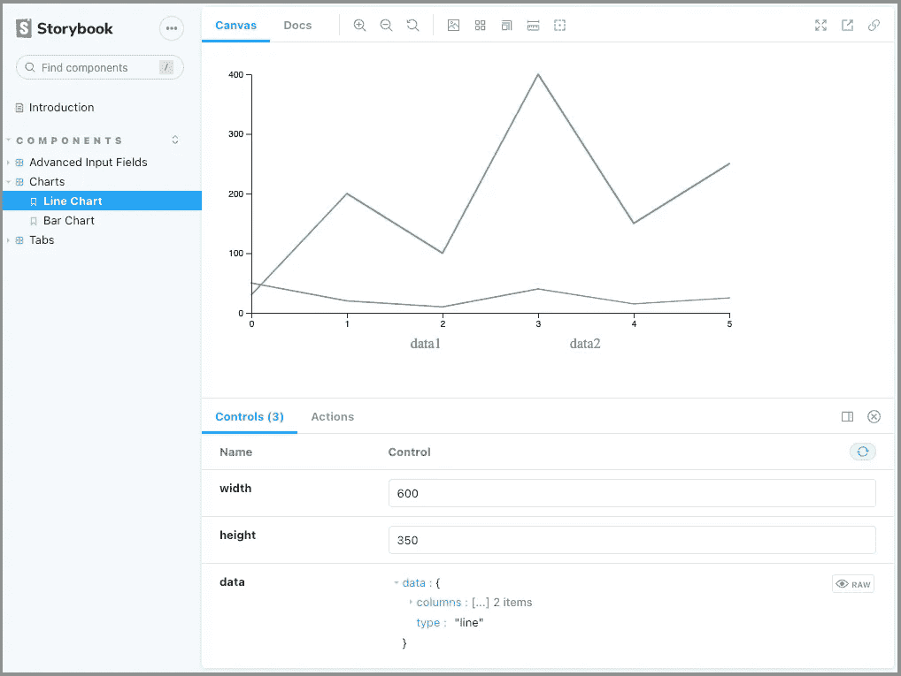

# 多故事书作文

在一个组织中有多个故事书是很常见的。把它们组合成一本故事书是个好主意。这可以通过故事书 6.0+很容易地实现。

在 Create React 应用程序存储库中添加另一个故事书 URL 到`.storybook/main.js`:

现在我们看到了故事书官方示例以及 React 组件库故事。

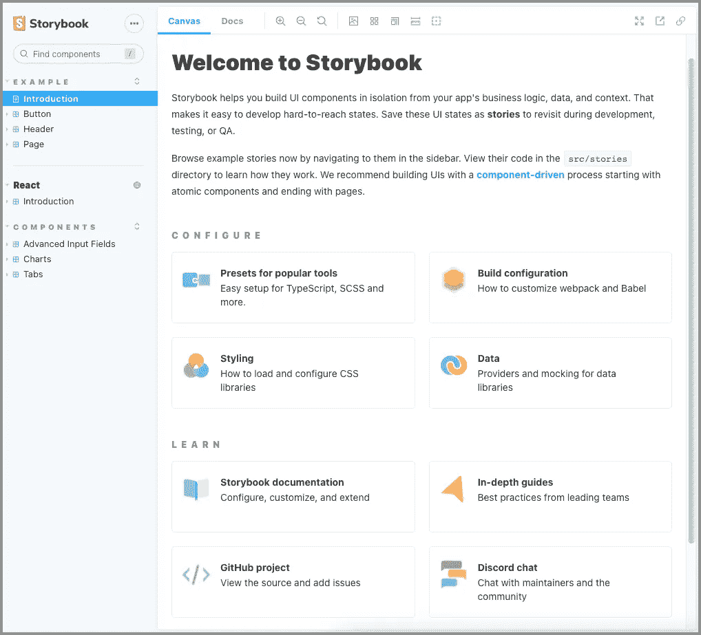

# 文档改进

默认情况下，所有的故事都有一个`DocsPage`，它很好地呈现了组件故事。`[MDX](https://storybook.js.org/docs/react/writing-docs/mdx#customizing-argtypes-with-mdx)`赋予`DocsPage`更多能力。`MDX`是一种结合了 Markdown 和 JSX 的标准文件格式。我们可以使用 Markdown 来格式化文档，以及在文件的任何位置自由嵌入 JSX 组件块，包括`ArgsTable`。

对于相同的`Button`故事，我们将其重命名为`Button.stories.mdx`并实现如下:

在第`4`–`10`行，`Meta`标签定义了故事书组件的信息。

第`12`–`15`行是降价内容。

线`17`—`57`为四层的 JSX 构件块和`ArgsTable`。

有了这个 MDX 代码，我们就有了一个漂亮的文档:

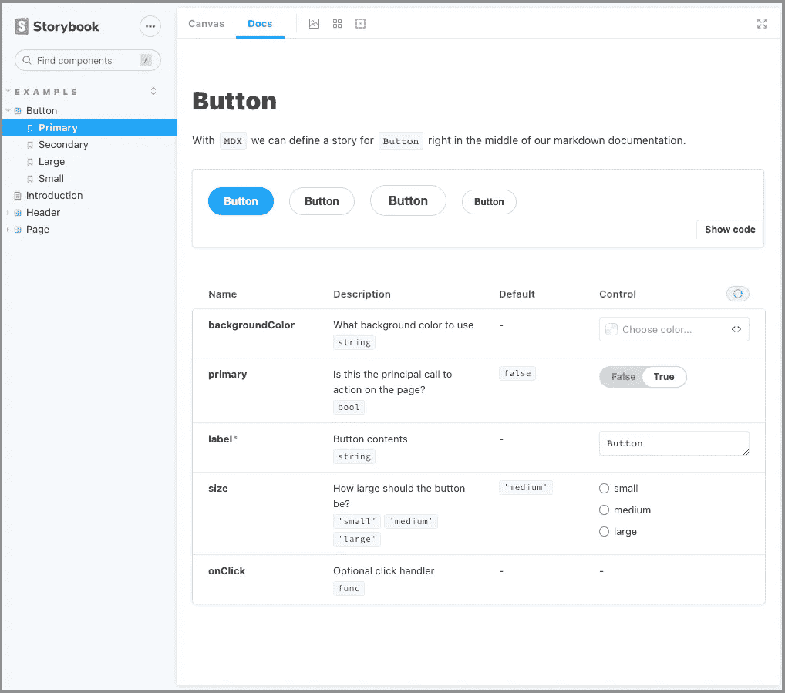

然而，在上面的截图中，由于 JSX 文件和`MDX`文件的混合，侧边栏中的标题是无序的。

我们可以在`.storybook/preview.js`中[配置想要的分类](https://storybook.js.org/docs/riot/writing-stories/naming-components-and-hierarchy#sorting-stories):

第`11`行硬编码了侧边栏的层次顺序。`'Example'`为一级订单，`['Introduction', 'Button', 'Header', 'Page']`为二级订单。

`options`部分固定侧边栏的排序顺序。

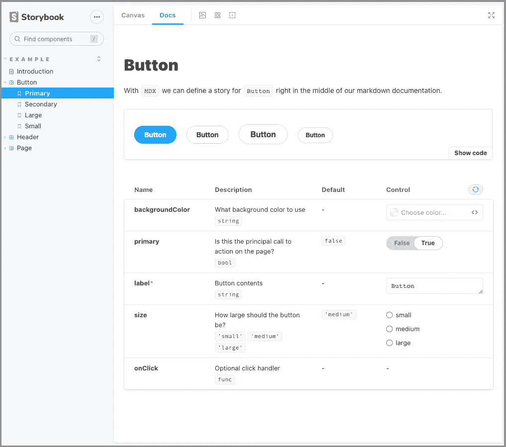

除了宾语，`storySort`还可以带一个功能:

上面的代码产生了一个逆序的侧边栏:

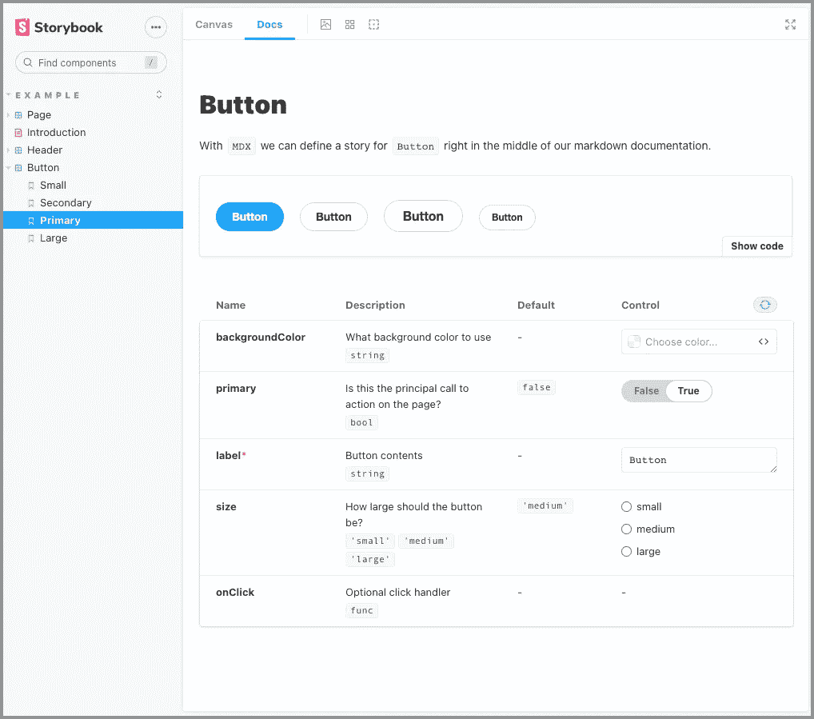

# 结论

自从故事书 6.0 以来，我们已经探索了新的特性。它更容易使用，功能更丰富。

你会试一试吗？

此外，你可以试试 [Chromatic，一个基于云的故事书工具链](/meet-chromatic-a-cloud-based-toolchain-for-storybook-f76d9b2b6f24)。

感谢阅读。我希望这有所帮助。如果你有兴趣，可以看看[我的其他媒体文章](https://jenniferfubook.medium.com/jennifer-fus-web-development-publications-1a887e4454af)。