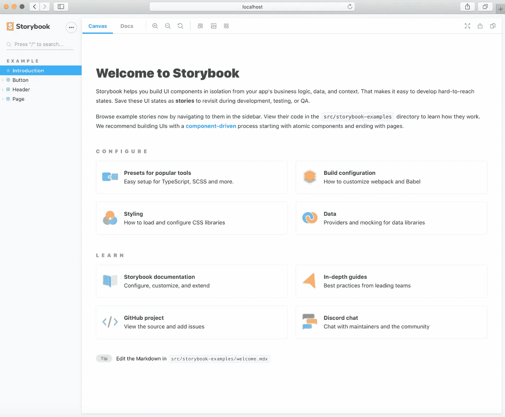
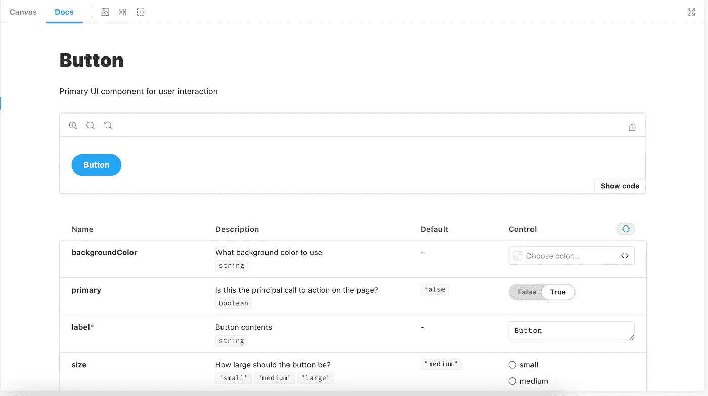

# React 组件与故事书的交互式和文档化平台

> 原文：<https://betterprogramming.pub/an-interactive-and-documented-playground-for-react-components-with-storybook-6-bbc87dcb4258>

## 展示您的组件以及详细的文档


[在](https://unsplash.com/@magicpattern?utm_source=unsplash&utm_medium=referral&utm_content=creditCopyText) [Unsplash](https://unsplash.com/@magicpattern?utm_source=unsplash&utm_medium=referral&utm_content=creditCopyText) 上拍摄的魔术图案

Storybook 是我最近一直在使用的一个非常强大的工具，它可以在一个被文档包围的交互式游戏中展示组件。有几个特性使它变得高效且易于使用，但它最大的好处是允许您在一个隔离的环境中开发 UI 组件，也就是说，不需要任何连接的 UI、API 或数据来触发不同的组件状态。

支撑这些孤立环境的是“故事”。编写故事是为了利用组件，就像应用程序的其他部分使用组件一样。不同之处在于，显示组件并与之交互不需要应用程序的任何业务逻辑，这完全可以通过包含某些控件的交互式 UI 来完成。

让我们想想这在以下几个场景中会有用:

*   开源软件包的文档
*   向这些组件的潜在消费者展示组件的不同变化，例如启用/禁用按钮
*   跨团队设置设计标准

像 AirBnB 这样的组织已经利用 Storybook 来展示他们的设计系统和文档。

在本教程中，我将使用一个 TypeScript 模板完成 Create React 应用程序(CRA)的基本故事书设置。如果 JavaScript 模板有什么需要做的不同，我会在后面指出来。

# 设置

假设您已经在使用 CRA 搭建的应用程序，让我们继续将 [Storybook](https://storybook.js.org/docs/react/get-started/install) 安装在您的项目目录的根目录下:

```
npx sb init
```

然后用:`npm run storybook` / `yarn storybook`运行它

您应该看到下面的屏幕展示了几个示例故事(`Introduction`、`Button`、`Header`和`Page`)。侧边栏将包含您的所有故事，主画布部分包含您的 UI 组件。Docs 选项卡将包含为每个故事的组件自动生成的`prop`类型的表格，以及组件本身。“文档”选项卡非常灵活且可定制——我们稍后会谈到这一点。



故事书文档

# 深入示例故事

在`src/stories`里面，你会发现标准的 TypeScript React 组件和它们对应的故事，名为`<component-name>.stories.tsx`

## Button.tsx

让我们先来看看组件——记住，每个故事背后都有一个组件或它的变体。`button.tsx`渲染一个`button`，接受几个道具。

**提示:**你在每个道具和组件上面看到的注释是用来记录故事的。尝试更改文本“*用户交互的主要 UI 组件”*，并在“文档”选项卡中重新加载您的故事书页面。

## Button.stories.tsx —导出故事

这个文件包含了`Button`组件的故事。

*   看一下第一个块，我们看到一个非常不同的默认导出，它们包含属性。属性定义了这个文件中的故事在侧边栏中的位置。查看 Storybook 提供的网页，我们看到`Button`属于一个叫做`EXAMPLE`的部分，然后属于`Button` **。**
*   `component`道具告诉 Storybook 你具体指的是哪个组件，这样它就可以自动获取它的道具和它们的类型。还记得`Button.tsx`收了几个道具吗？您应该可以在`Docs`选项卡下看到这些完全相同的道具。Storybook 只需要一个简单的属性就可以承认这些:



图片来源:作者

*   最后，`argTypes` —我之前提到过 Storybook 给你一个图形用户界面来与组件交互。这是通过一个[控件](https://storybook.js.org/docs/react/essentials/controls)附件来实现的，你可以利用`args`或`argsTypes`属性来激活它。在某些情况下，这些是根据参数的类型自动添加的。

## 为什么我们只把 backgroundColor 看作一个 argType？

你可能已经注意到`primary`也使用一种类型的控件，但是与`backgroundColor`不同，它没有在`export`对象的`args`属性中指定。默认情况下，Storybook 将根据参数的初始值为每个道具类型选择一个控件。这将与一些参数一起工作，如`boolean`和`strings`(因此有`primary`控件)，但可能有其他场景(即选择一种颜色)，你可能需要一个更高级的控件。这就是你应该利用`argTypes`的地方

## Button.stories.tsx —故事设置

Storybook 有效地允许您创建模板，然后可以扩展这些模板以避免一遍又一遍地编写相同的标记。

一个按钮是一个很好的例子来说明这是如何工作的。一个按钮可以有不同的变体、大小等，但是标记将总是包含一个 HTML 按钮标签。

在这个特定的文件中，我们有不同的故事来展示按钮组件的不同变化(主要的、次要的、大的和小的)。使用下面的模板，我们使用底层的`Button`组件来标记故事:

```
const Template: ComponentStory<typeof Button> = (*args*) => <Button {...args} />;
```

创建基础模板后，其他故事利用模板展示不同的尺寸、颜色等。

```
export const Primary = Template.bind({});Primary.args = { primary: true, label: 'Button',};
```

`Button`组件的主要故事将自己绑定到模板，并传入自定义道具来定义主要变化的样子。第二个故事展示了没有`primary`的按钮会是什么样子:

```
export const Secondary = Template.bind({});Secondary.args = { label: 'Button',};
```

我前面提到，有些类型足以让 Storybook 选择相关控件。在上面的两个故事中，我们使用简单的`args`类型(string 和 boolean)，足以让 Storybook 选择控件。我们还可以看到，它们不需要在`export`对象中定义，而是可以附加到每个 story 对象上。

注意:您必须导出文件中的所有故事*才能在侧边栏中显示，但是只能有一个`default export`。*

# 非模板化故事

故事不一定要绑定到模板，你也可以这样写故事:

# MDX

到目前为止，在上面的例子中，我们已经看到了以标准的[组件故事格式(CSF)](https://storybook.js.org/docs/react/api/csf) 编写的故事。但这不是 Storybook 接受的唯一格式。从版本 6 开始，Storybook 也支持 [MDX](https://storybook.js.org/docs/react/api/mdx) 语法——一个结合了 Markdown 和 JSX 的文件。

当我们想要将包含代码块和其他 Markdown 特性的冗长文档与 UI 组件结合在一起时，MDX 尤其重要。如果我们将演示项目的`Button.stories.tsx`写入 MDX，它看起来会像下面这样:

## **Button.stories.mdx**

注意:将`.mdx` gists 嵌入到 Medium 中会导致实际内容被呈现到页面上，所以我必须用不同的名称来命名它。请遵循您代码库中的`*stories.mdx`格式。

将这个文件作为`Button.stories.mdx`复制到您的项目中，注意它与演示项目中的 CSF 示例完全相同。

要在 MDX 中显示 arg 表，需要`<ArgsTable of={Button} />`。

MDX 文件可以包含故事以及 Markdown，这使得它非常灵活，可以适应许多用例。

# 自定义

Storybook 为其消费者提供了大量的定制内容，其中一些我们已经看过了，例如`argTypes`。以下是其他一些例子:

*   [主题化](https://storybook.js.org/docs/react/configure/theming)——在`addons`和`theming`包的帮助下改变默认网页的颜色和品牌。使用文档中显示的配置文件`.storybook/manager.ts`和`.storybook/preview.js`在明暗主题之间切换，或者创建你自己的主题。
*   [动作](https://storybook.js.org/docs/react/essentials/actions) —当您使用`actions`插件与您的组件交互时，显示每个处理器收到的数据。
*   [测量和概述](https://storybook.js.org/docs/react/essentials/measure-and-outline) —直接从故事书组件页面检查和调试 CSS。
*   [Viewport](https://storybook.js.org/docs/react/essentials/viewport) —验证您的组件在不同设备上的响应能力。

# MDX extras

虽然 Storybook CSF 的大多数功能都是现成的，但有些功能需要通过 MDX 手动添加:

*   参数/道具表— `<ArgsTable of={Button} />`
*   准确的组件描述— `<Description of={Button} />`
*   带缩放图标的“文档”选项卡工具栏— `<Canvas withToolbar>`
*   更改参数控件:

# 摘要

故事书是一个强大的工具，它为设计系统和开源包的开发者提供了一个完美的平台来隔离和显示他们的 UI 组件。

反过来，为这些设计系统和软件包的消费者提供了一个交互式游戏环境来试用这些组件。

除了开箱即用的特性和类型脚本支持之外，它的主要优势是不再需要任何附加到组件的 API 或业务逻辑。他们被展示在一个完全隔离的环境中，并直接从互动游戏场接受辩论。