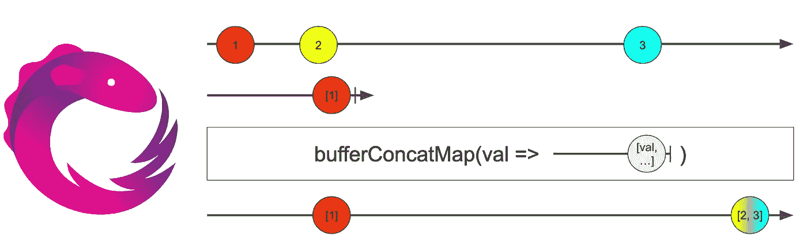
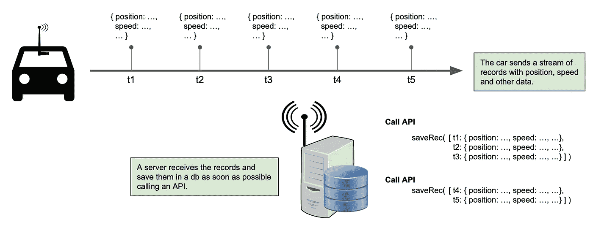
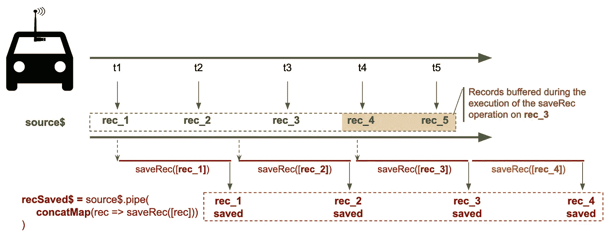
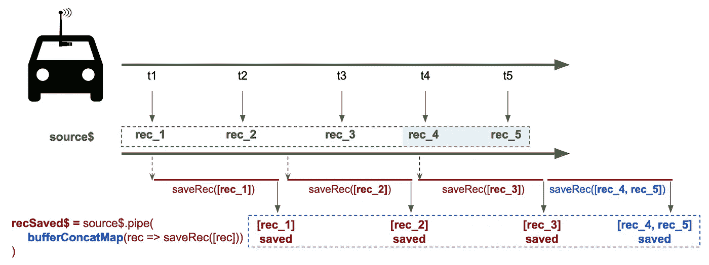
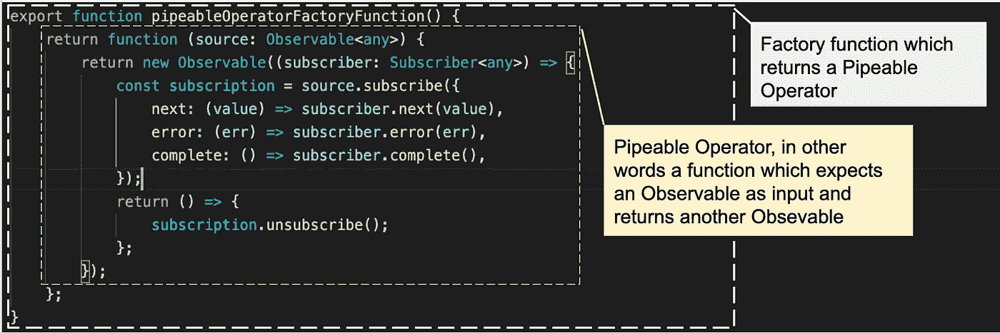
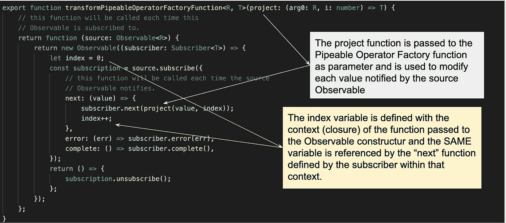
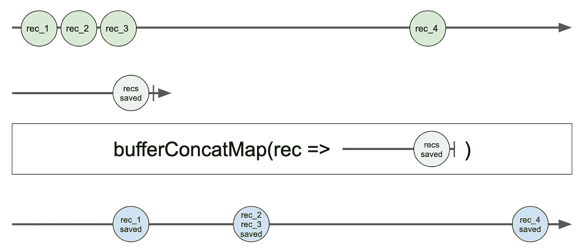

# 使用定制 RxJs 操作符的有趣例子

> 原文：<https://betterprogramming.pub/an-interesting-case-for-using-a-custom-rxjs-operator-da8443a89c3a>

## RxJs 库附带了一组丰富的操作符，这些操作符能够处理我们在处理可观察流时必须处理的大多数情况。



尽管有些情况下构建新的自定义操作符可能会派上用场。让我们来看一个受 stackoverflow 上发布的[问题启发的特殊案例。](https://stackoverflow.com/questions/70851715/rxjs-how-to-get-all-values-that-are-buffered-during-a-concatmap/70903577?noredirect=1#comment125435996_70903577)

# 问题:连接映射时的缓冲

让我们考虑一个场景，我们有一个记录流，例如来自汽车的“黑匣子”，它流入接收系统，该系统必须尽快将它们存储到数据库中。

接收系统有一个 API`saveRec`，它可以接受要存储的记录数组，并在所有记录都被写入时异步响应。不幸的是，我们还有一个约束:`saveRec`不能被同时调用。换句话说，当我们可以调用 API 时，我们必须在再次调用它之前等待它的响应。



通过对 saveRec API 的连续调用来接收和保存记录流

当并发级别限制为 1 时，典型的 RxJs 方法是使用`concatMap`操作符(只不过是`concurrent`参数设置为`1`的`mergeMap`)。

在这种情况下使用`concatMap`可能不是最佳解决方案。例如，让我们想象一下，接收记录之间的时间间隔比`saveRec`响应所需的时间短。在这种情况下，我们将累积等待存储的记录(这些记录保存在`concatMap`操作符内部的缓冲区中，但我们稍后将回到这一点)。



concatMap 在执行 saveRec 操作时缓冲一些记录

考虑到`saveRec`可以接受一个记录数组，理想的情况是在执行前一个调用的过程中使用缓冲的所有记录来调用它。

例如，如果我们在对`rec_3`执行`saveRec`操作时收到了`rec_4`和`rec_5`，那么在下一次调用中，我们将传递`rec_4`和`rec_5`以进行保存。



bufferConcatMap 调用 saveRec，并将所有记录累积在其缓冲区中

这就是我们将要用新的定制操作符`bufferConcatMap`实现的。实际上`bufferConcatMap`是一个*可管道化操作符工厂函数*，因为它是一个在被调用时返回一个*可管道化操作符*的函数，该操作符然后作为参数传递给`Observable`的`pipe`方法。

# 什么是“可管道操作符”和“可管道操作符工厂函数”

在开始实现之前，可能有必要定义什么是 RxJs *可管道操作符*，以及什么是*可管道操作符工厂函数*。

*可管道操作符*是一个函数，它接受一个可观察值作为输入，并返回一个可观察值作为输出(RxJs 代码代表一个*可管道操作符*类型，带有接口`OperatorFunction<T, R>`或其扩展之一)。

*可管道操作符工厂函数*是返回*可管道操作符*的函数。

所以我们新的自定义操作符`bufferConcatMap`是一个函数，它返回一个期望一个可观察值作为输入并返回一个可观察值的函数。

准确地说，这是一个*可管道化的操作符工厂函数*，从现在开始，我们将简单地称它为*自定义操作符*，因为这是一种普遍接受的引用这类函数的方式。

# 简单的自定义运算符

一个简单的自定义操作符可以这样编码。



一个定制操作符(更准确地说是一个“可管道化的操作符工厂函数”)，它镜像源可观察对象

这个自定义操作符创建了一个新的可观察对象，它反映了源可观察对象。换句话说，它什么也不做，但仍然显示了该机制是如何工作的。

现在，假设我们想要转换由源可观察对象通知的每个值，然后将转换后的值及其索引传递给订阅者(换句话说，我们想要从头开始构建 rxJs `map`操作符)。

这是可以做到的

*   向*可管道化操作符工厂函数*传递用于转换从源接收的每个值的函数
*   利用 Javascript“closure”概念定义一个变量(本例中的变量`index`),该变量在可观察返回被订阅时初始化，在`subscriber`上调用`next`函数时递增



“地图”操作符从零开始构建

有趣的是，利用 Javascript 闭包，我们将一些“状态”(`index`变量)附加到一个函数，由`subscriber`定义的`next`函数。向函数添加状态的能力将在`bufferConcatMap`的实现中变得非常重要。

# “bufferConcatMap”运算符

既然我们已经阐明了定制操作符的基础，让我们开始构建我们的`bufferConcatMap`。

## 预期的行为

使用上述示例，预期行为可以用大理石图来表示。



bufferConcatMap 的大理石图

用我们可以说的话来表达:

*   如果上游通知并且没有即时处理，则通知的值会立即被处理
*   如果上游通知并且正在进行处理，那么通知的值将存储在缓冲区中
*   一旦处理完成，如果缓冲区中有内容，它会被立即处理，否则我们等待下一个元素开始新的处理

为了简单起见，我们没有在“需求的文字”中涵盖`error`和`complete`的情况(但是它们在代码中)。

## 我们需要一些状态

是的，我们需要保存一些状态信息，以便操作员按预期工作:

*   当我们还在处理请求时，我们需要一个缓冲区来保存来自上游的值；
*   “在我们处理请求时”？这意味着我们需要有一种方法来知道我们是否正在处理一个请求。

所以我们的状态由两个变量组成:

*   一个`buffer`(一个数组)来保存我们不能处理的项目；
*   一个`processing`标志(一个布尔值),我们在其中存储是否有请求。

## 操作者的解剖

`bufferConcatMap`操作符实际上是一个*可管道操作符工厂函数*，它期望一个`project`函数作为输入参数，并返回一个*可管道操作符。*

**输入参数**

`project`函数是一个期望输入值数组并返回可观察值的函数。为什么要用一组值作为输入？因为`bufferConcatMap`将接收到的值存储在一个缓冲区中，该缓冲区是一个数组，并且一旦没有动态处理，就将该缓冲区传递给`project`函数。

为什么要返回一个可观测的？因为`bufferConcatMap`的行为类似于`concatMap`的变体，正如`concatMap`所做的，它期望作为输入传递的函数是一个返回可观察值的函数。

**返回的*可管操作员***

作为输出返回的*可管道化运算符*本身就是一个函数，它期望一个`source`可观察值作为输入，并返回一个“新的转换后的可观察值”。

如果没有请求，那么“新转换的可观察对象”的行为类似于用`concatMap`创建的可观察对象:它调用`project`函数，并在进行下一次调用之前等待其响应，不同之处在于`project`函数是用来自`source`可观察对象(上游)的`buffer`值调用的，而不是只有一个值。另一方面，如果有一个请求已经在运行中，它获取由`source` Observable 通知的值，并将其存储到其内部缓冲区中，而不调用`project`函数(换句话说，对下游没有影响)。

## 操作员的代码

最后，这里是我们自定义操作符的完整代码。

bufferConcatMap 自定义运算符

这里有一个如何使用它的例子:

bufferConcatMap 的使用示例

让我们来看看这个逻辑基础上的一些关键概念。

**最外部功能(** `bufferConcatMap` **)** 。最外部的函数，一个*可管道化的操作符工厂函数*，作为`pipe`调用的一部分被调用，它代表一个参数(换句话说，看上面的例子，当`newTransformerObservable`被创建时)。

***管工*** 。真正的*可管道操作符*由`bufferConcatMap`返回的函数只有在`newTransformerObservable`被订阅时才会被调用。

**操作员的内部状态**。当*可管道操作符*被调用时(在订阅时)，保存操作符状态的变量(在我们的例子中是`bufferedNotifications`和`processing`)被初始化。这些变量是在*可管道化操作符*的主体中定义的任何函数的词法范围的一部分(例如，定义为参数的函数被传递给嵌入在`bufferConcatMap`实现中的`concatMap`操作符)，因此，每当源可观察对象(上游)通知一个新值时，这些函数的所有调用都会共享这些变量。

`**project**` **和** `**EMPTY**`。`bufferConcatMap`的实现是围绕`concatMap`的一个变化，它使用一些内部状态来实现期望的行为。`concatMap`要求作为输入传递一个返回可观察值的函数。当上游通知新值时，如果某些处理正在进行中，`bufferedConcatMap`只需缓冲该值，而*不做任何事情*。什么都不做的可观察对象是`EMPTY`可观察对象。这是可以观察到的，只要它从上游接收到第一个通知。所以这就是为什么`processing`是`true`的时候`bufferConcatMap`用`EMPTY`。另一方面，如果没有正在进行的处理，只要缓冲区中有值，就用存储在缓冲区中的值调用`project`函数。

# 哦，还有一件事

到目前为止一切都很好，至少看起来是这样。但是我们忽略了一些东西。

假设我们像这样使用`bufferConcatMap`创建一个可观察对象，然后我们同时订阅它两次，像这样

```
const newObs = source.pipe(bufferConcatMap((val) => process(val)));newObs.subscribe(values => {// do something});newObs.subscribe(values => {// do something else});
```

在这种情况下，当`bufferConcatMap`被调用时，即当`newObs`被创建时，状态变量(`bufferedNotifications`和`processing`)被初始化。

因此，相同的变量在两个订阅中共享，这是错误的，会产生非常细微的错误。我们需要确保每个订阅都有自己的状态变量副本，这些副本是在订阅时初始化的。

幸运的是，在这种情况下，rxJs 操作员`defer`帮助了我们。因此，该运算符的最终正确版本如下。

bufferConcatMap 代码的最终版本，也适用于并发订阅

# 结论

在大多数情况下，RxJS 库提供的操作符已经足够了，但是有时构建自定义操作符可能会很方便。如果是这种情况，我们必须记住[可观测量只是特殊的函数](https://benlesh.com/posts/learning-observable-by-building-observable/)。运算符只是处理这种特殊函数的函数。

因此，构建自定义操作符是一项功能组合练习，必须遵循一组有限的规则。使用闭包，我们可以给操作符添加一个内部状态来增强它们的能力，同时保持外部行为有状态。

`bufferConcatMap`背后的所有代码，包括测试，都可以在[这个 repo](https://github.com/EnricoPicci/bufferConcatMap) 中找到。