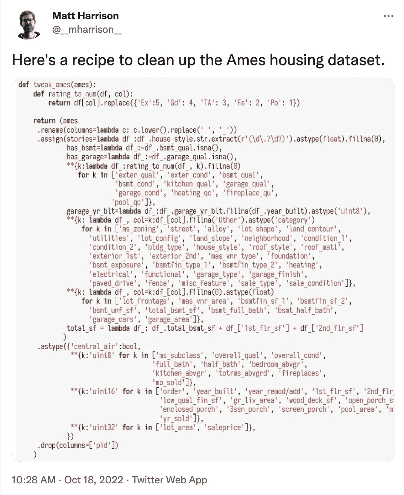

# 熊猫中的方法链:糟糕的形式还是成功的秘诀？

> 原文：<https://betterprogramming.pub/an-interview-with-python-and-pandas-trainer-matt-harrison-e000374ddab>

## 采访蟒蛇和熊猫驯兽师马特·哈里森


作者图片(通过 Canva.com)

蟒蛇驯兽师马特·哈里森引起了一点轰动。

他举的一些熊猫的例子，比如下面的例子，在推特上引起了不同人的情绪反应:



[推特上的观点](https://twitter.com/__mharrison__/status/1582393274102206467)

一个人评论道:“没有一个头脑正常的人会这样写代码。对不对？”有人在推特上说:“如何不写 Python 代码。”

事情是这样的，Matt 是一个经验丰富的程序员，用他自己的话说就是“在战壕里呆了很多年”。他写过关于 [Python](https://store.metasnake.com/intermediate-python-programming-2nd-edition) 和[熊猫](https://store.metasnake.com/effective-pandas-book)的畅销书，并定期在顶级公司培训数据科学团队。

我知道这个故事一定有更多的内容。

在批评 Matt 代码的人们和塑造 Matt 的 lambda-loaded、方法链风格的编写熊猫的现实之间是否有一些脱节？我决定去看看 Matt 是否有兴趣和我聊聊他的代码以及它在 Twitter 上的反应。

我很高兴他答应了。

大卫: *我刚刚完全被你在推特上的帖子迷住了。而且，你知道，看着你处理这些也很有趣。但是我感觉有些人可能遗漏了你发布的代码示例的一些上下文。是这样吗？*

是的，也许我应该快速地谈谈我的背景，让人们知道我来自哪里。我有一个计算机科学学位，你知道，我最初的想法是毕业后成为一名软件工程师。我离开学校后的第一份工作是做自然语言处理，我职业生涯的大部分时间都在使用 Python 处理数据。我不是统计学家。我不是管理员。我的背景是写代码。

我现在做的是培训 Python 数据空间的专业人士，但我也为公司做一些咨询和建议。我是一名教育工作者，但我会说我有时间在战壕里。所以，我不是在看幻灯片，也不是仅仅因为我觉得在网上骚扰别人很有趣就胡编乱造。

正如我所说，作为一名教育工作者，我的目标是向那些将代码作为工具的人，秘密地教授最佳实践，更一般地说，教授软件工程最佳实践。声称不想做程序员的人。他们只是把代码当作工具，对吗？但他们是在编码，我的目标是帮助他们写出专业的代码，让他们以后不会因为写代码而讨厌自己。

也就是说，我知道代码就像每个人的宝贝，程序员在他们的代码上投入了大量的时间、汗水和泪水。当你说某人的孩子丑，或者说他们的孩子做得不对时，对很多人来说，这就像是一种人身攻击，他们会误解。所以，我明白了。

但是你不是你的代码，就像你不是你工作的公司一样。你的身份应该与你的代码分开。所以，如果你正在使用代码，你的目标将会是你想要能够更好地使用代码，或者这就是我认为你的目标。如果不是，那对我来说可能很奇怪。

话虽如此，我不认为你能让一百个人同意一种正确的编码方式。其中 70%的人会说你应该做面向对象编程。20%的人可能会说你需要除锈。可能有 1%的人会说你需要做函数式编程或者类似的事情。所以你永远不会就此达成共识。

**大卫:** *以你这样的方式编写熊猫代码，你觉得怎么样？*

**Matt:** 在数据科学领域，你会看到一个常见的现象，即有类似`Untitled1.ipynb`和`Untitled2.ipynb`的概念。这种观念认为，当数据科学家早上去工作时，他们会拿起昨天工作过的 Jupyter 笔记本，复制粘贴，然后重新开始。这有点像，“当我使用 Excel 时，我只是将它保存为一个新文件，然后从那个文件开始”，对吗？

我的目标是帮助你，这样你就不会有`Untitled28.ipynb`。你有`Analysis_for_ClientA.ipynb`，那是你唯一的笔记本。你可以明天再来，从你停下的地方重新开始，你会变得富有成效。

你的代码将更容易阅读。别人可以使用你的代码，你可以测试你的代码，你可以在一个星期后回来拿起你的代码，别人也可以这样做。

大卫: *你在推特上被一些人称为看门人。在一条推文中，你说你为专业人士写代码。这就是守门的想法的来源吗？如果你不以某种方式写代码，那就不是“专业的”*

是的，我想是的。你知道，有人不高兴，因为我说我教专业人士。我问他们谁是他们的观众，他们说他们和老师或研究生或其他人一起工作。他们认为我说我教专业人士是在讽刺他们。他们不专业。

我明白他们在说什么。但是，我确实教专业人士。就像，这就是我做的。我走进你听说过的大公司，观看他们平台上的节目，我教他们如何编写能很好地为他们服务的代码。很多这样的人不一定是软件工程师，但他们正在编写代码。

**大卫:** *我认为你的内容在某种程度上填补了一个空白。如果你搜索熊猫，你会找到熊猫文档和一大堆面向初学者的内容。编程中的几乎所有事情都是如此。所以在搜索引擎上容易找到的东西和我认为专业人士实际需要的东西之间存在差距。这和这件事有关系吗？*

Matt: 你通过搜索找到的代码风格——我写过这样的代码。这很痛苦。媒体上的大多数数据科学帖子都是类似于“大熊猫的记忆功能”之类的东西。这些岗位都是孤立的教运营的，没问题。但是实际上，我从来没有对一个数据集单独做过一件事。

在我 20 多年的数据工作中，我有多个步骤，我不关心中间步骤。我关心原始数据，即将到来的数据，我关心干净的数据，我将把这些数据可视化或者发送到机器学习系统中。我关心最终结果。写一个链是让我得到最终结果的秘诀。

**大卫:** *是什么把初级熊猫代码和专业熊猫代码区分开来？*

Matt: 我想说，如果你想写好的熊猫代码——让我们把专业这个术语抽出来，只说好的熊猫代码——你应该知道如何写 lambdas。你应该知道如何做列表和字典理解。字典解包，这个很多人可能都不会用的东西，在熊猫世界里超级有用。

有些人说，“我想写我的代码，以便从未使用过 pandas 或 Python 的人可以看到它并使用它。”如果那是你的观众，祝你好运。我不想迎合最小公约数。

我假设他们理解什么是 lambdas、comprehensions 和字典解包。我还假设观众至少有一些 Python 经验。我不认为 lambdas 和字典解包和列表理解一定是初级 Python 代码。

所以，我并不是说用这种初学者风格写代码的人不是专业人士。我是说他们的代码写得很幼稚。如果冒犯了他们，我很抱歉。我不认为这是他们的错。我认为这是因为，就像你说的，互联网上流传的很多内容都是以初学者的风格编写的，告诉你如何孤立地做一些事情。

大卫: *你提到过几次，你的同事不一定认为自己是程序员，但却是专业的熊猫用户。在更传统的软件工程环境中，有没有其他适合熊猫代码的写作风格？*

**马特:**不。我想说的是，如果你在写熊猫代码，你应该拥抱这个链。基本上是一种约束。如果你把自己限制在约束中，它会迫使你思考你正在做的每一步。

David: *项目的规模是一个因素吗？你看到的人们使用的笔记本通常有多大？*

Matt: 我见过一些笔记本，上面写的东西比较长。但是，我的意思是，人们抱怨五行链是有史以来最糟糕的事情。

大卫: *是的，我看到过一些评论，人们反对仅仅几个链条排成一行。就像，拜托，真的吗？*

马特:嗯，有德米特定律，这是一个通用的编程原则。如果你有一个对象，你调用一个对象的实例成员，你调用那个对象的实例成员，你链接那些操作，那么这就违反了德米特定律，它说你不应该询问内部部分关于内部部分。无论您从哪里开始，都应该公开这样做的功能。

我不认为我违反了德米特里定律。我们在这里并不是真的在处理内部零件的内部零件。这和那完全不同。我们有一个数据帧，我们返回另一个数据帧。我们不会深入数据帧，取出这一部分，然后取出其中的某个子部分。

许多软件工程最佳实践在大范围内是有意义的。但它们在小范围内不一定有意义。你会得到很多样板文件。比如，你可以在一个文件中的几个函数中完成这个，那么你为什么要把东西分散开来，做所有这些事情呢？

但是，你知道，在一定范围内，这是有意义的，因为如果你不这样做，事情就太难处理了。是否存在可伸缩性问题，使得链接变得不那么理想？

**马特:**从我的角度来看，这里的规模是你得到了超级复杂的数据。也许你最终会有一个很长的链条。在这种情况下，你可以做的事情之一就是利用`[.pipe()](https://pandas.pydata.org/docs/reference/api/pandas.DataFrame.pipe.html)`。也许这二十行是在清理温度数据，或者别的什么。所以，你可以说，`.pipe(clean_temperature_data)`，去掉那二十行。

但是我见过有人写了一大堆管道，它们都被分派到一行代码中。我的观点是:你应该能够读懂管子里的东西。通过分离事物，你给自己增加了更多的认知开销，因为现在你不得不上下滚动来阅读所有这些事物，而以前链中的线告诉你它是什么。

然而，在有些情况下，连锁合法地使事情变得困难。也许你真的需要一个中间变量，因为你要计算的东西，是由两个不同的东西派生出来的。有很多方法可以做到这一点而不破坏链条。你可以使用`.pipe()`来创建一个中间变量，如果需要的话，你可以在以后引用它。因此，我还没有看到任何东西表明链接不能扩展到代码大小。

至于我们可能想到的另一个尺度，即数据大小，需要注意的一点是 pandas 是一个内存中的工具。你的数据需要放在内存中。这就是为什么当我加载数据时，我做的第一件事就是设置正确的类型来缩小数据。前几天我举了一个例子，我用几行代码就缩小了 95%。

另一件事是 pandas 并不特别擅长做[写时复制语义](https://en.wikipedia.org/wiki/Copy-on-write)。事实上，它并没有真正做到这一点。对于我的客户，我通常推荐 3X-10X 的内存开销，这样你就有空间来做这些操作。所以，是的，数据大小可能是个问题。

人们反对链接的一个理由是它在数据大小上有问题。但是它实际上比我们称之为天真风格的问题要少。也许“幼稚”这个词有不好的内涵，但它有点像那样。你制造所有这些中间变量，对吗？您实际上是在存储对所有这些中间对象的引用，这些中间对象都是您的数据的副本。

当你链接的时候，通常会有一个副本，但是没有指针或者变量来保存它。它被垃圾收集了。你制造一个中间变量，然后下一件事用它做一些事情。在这一点上，没有其他人使用这个中间变量，所以它消失了。你不必担心或管理这些。

大卫: *稍微转换一下，我很好奇可读性对你来说意味着什么。是什么让代码可读？*

**马特:**我认为这个问题没有标准答案。如果你问十个人，你会得到十个不同的答案。我会说，我不只是教熊猫；我也教 Python。在我的 Python 基础课上，很多人会听到我说，“你的目标不是写容易写的代码。你的目标是写出易读的代码。”

但是情人眼里出西施，所以，再一次，你需要考虑你的观众是谁。我不认为编写 Python 代码的专业人员或编写 pandas 代码的专业人员应该编写容易被没有任何培训或背景的新手阅读的代码。

我认为这是有底线的。用任何惯用的 Python 风格编写 Python，而不是用 C 或 Java。我看到很多大学毕业的人说他们学了 Python，但实际上他们学的是 C++或 Java。导师拿了他们的 Java 内容，翻译成 Python，不是特别难，现在学生懂 Python 了吧？但是他们并不真正了解 Python。

话虽如此，只是因为我以这种链接风格编写熊猫，并不意味着当我编写 Python 代码时，我到处都在编写链。有人问我熊猫用面向对象编程在哪里？当我写熊猫代码时，我不写类。这是不是意味着我从来不写类？不，我一直在写类。只是我在写熊猫的时候其实不需要用到类。

所以，我想我会从熊猫的角度来回答这个问题。对我来说，可读的熊猫代码看起来像一个食谱。里面有台阶。你可以说这是第一步，这是第二步，这是第三步。链接是一种约束，如果你遵循这种约束，基本上迫使你像写食谱一样写代码。

对我来说，对于“什么是可读的代码？”有一种不尽人意的答案这是我不用太努力就能读懂的任何代码。如果为了理解几行代码，我不得不写下来并做笔记，那么我们就开始脱离可读性的范畴了。

当我第一次在你的 Twitter 帖子中看到链式风格时，吸引我的一点是，我只需要考虑每一步是做什么的，而不是如何完成的。我发现自己写了更多这样的代码。不一定是链接，而是以一种更具声明性的风格。这是我在熊猫代码中经常看到的，我认为，尤其是在方法链接中。

*但是，人们对链接还有另一个反对意见，我们还没有谈到。我看到有人认为缺乏对链中中间步骤的访问使得代码难以测试和调试。你能谈谈吗？*

**马特:**我在网上发布了这段代码，我想很多人会说，“哦，你就像走到一台电脑前，键入这一整段代码，然后你就完成了？中间步骤在哪里？我怎么调试这个？”

我建议人们去 YouTube 上搜索我的[地道的熊猫对话](https://www.youtube.com/watch?v=PHhOTEYDvHQ)，在那里我展示了最终结果。我又不是坐在电脑前一口气写完所有的东西。我坐在电脑前，一行一行地做这个，边做边测试。

我不在乎最后的中间结果。我在检查它们的同时，也在验证我所做的事情是否真的有效。我认为很多事情就像他们不明白我是如何到达终点的，因为他们只看到了终点。

而且，你知道，我通常会挑战人们，问他们，“你会如何重写这个？”大多数人不这么做，但有一个人这么做了，他们说，"我要写一个很大很长的笔记本，在这里声明一些变量。"他们会说，“你需要降价。”

很多人说我需要使用 Markdown，因为你需要评论。所以你需要有多个单元格，因为它们之间需要降价，对吗？然后每个单元格上面需要有一些标记，解释它在做什么，诸如此类的事情。

我是说，如果你能读懂，那很好。但问题是，当我明天回到这里时，我必须找到这些细胞并按顺序运行它们。如果你碰巧把它们弄乱了或者什么的，那我就有点麻烦了。

在我的笔记本里，当我完成的时候，我把我的链放到一个函数里，然后我把那个函数放在我代码的最上面，明天我可以回来，加载我的原始数据，运行它，我就可以开始了。

话虽如此，如果我确实想要中间变量，我可以使用`.pipe()`并只生成一个全局变量。我在我的《有效的熊猫》一书中展示了这样的例子。你如何调试它？您可以注释掉管道并遍历它。那真的很简单。人们问你是否会使用调试工具。是的。您在该行上放置了一个断点，您可以在该点单步执行该方法。你不能调试它的说法对我来说是假的。

那么，你对这一切的最终想法是什么？人们应该从我们的谈话中得到什么？

**马特:**如果人们不喜欢链接，那对他们来说可能是个坏消息，因为我相信我们会在下一代工具中看到更多，比如 [Polars](https://www.pola.rs/) ，这是 Rust 中的一个数据框架实现。

你不得不戴上眼镜。您可以在链的最末端执行一个`.filter()`，它将返回读取 CSV 文件，并根据过滤器限制它读取哪些列和行。您可以从链中进行查询优化，如果您不使用 Polars 链，您将无法实现这一点。

说真的，我的建议是试着用链子拴住熊猫。我认为很多人对它有不良反应，但他们从来没有尝试过。很多读过我的书的人说，“我很怀疑，但我尝试了，现在它改变了我写熊猫代码的方式。”

***想了解更多？***

看看马特的书 [*有效熊猫*](https://store.metasnake.com/effective-pandas-book) *。Matt 向您展示了如何清理数据、创建强大的可视化效果以及编写您自己的数据配方。还有整整一章专门讨论调试。*

```
**Want to Connect?**Become a better coder in 5 minutes.One email every Saturday with one actionable tip.
Always less than 5 minutes of your time.[Subscribe here](https://davidamos.dev/curious-about-code-newsletter/)
```