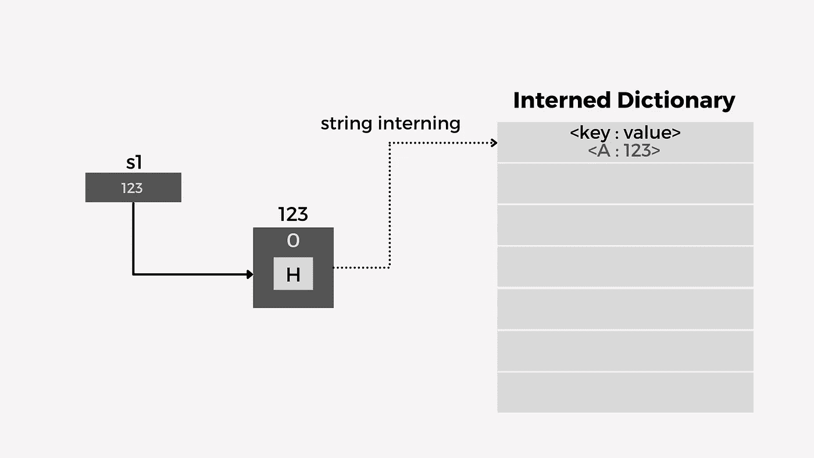
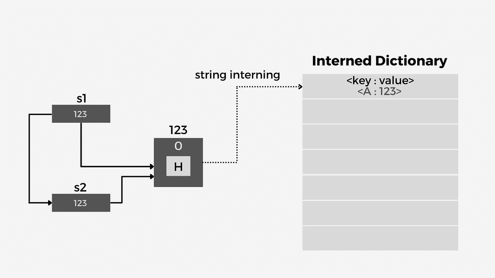
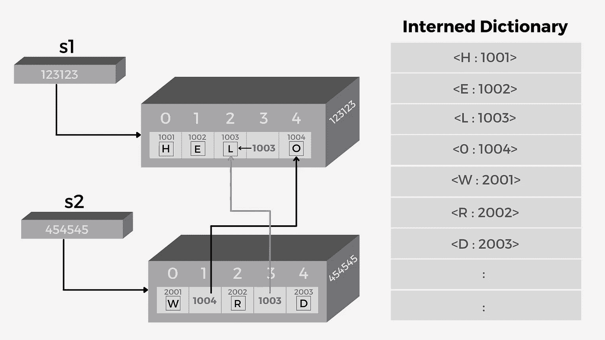

# 面试官最喜欢的问题:“Python 字符串是如何存储在内存中的？”

> 原文：<https://betterprogramming.pub/an-interviewers-favorite-question-how-are-python-strings-stored-in-internal-memory-ac0eaef9d9c2>

## 理解 Python 字符串的内部实现


[瑞恩·华莱士](https://unsplash.com/@accrualbowtie?utm_source=medium&utm_medium=referral)在 [Unsplash](https://unsplash.com?utm_source=medium&utm_medium=referral) 上拍照

> 本文与s2 = s1
> print(s1)# A
> print(s2)# A
> print(id(s1))#12345
> print(id(s2))#12345
> 
> 
> 
> 由作者**'**[**Muhammad Abutahir**](https://www.linkedin.com/in/abu-tahir-bb05741a2/)'创建的图像:显示字符串实习
> 
> 好吧！让我们来分解一下上面的图像:当我们创建第一个字符串`s1`时，在内存中创建了一个字符串对象，之后开始了字符串实习的过程。如果字符“A”存在，Python 将首先在内部字典中查找，因为它最初是空的。创建一个新的键-值对，字符“A”被设置为`key`，它所在的对象的`location`被设置为值`123`。
> 
> 注意:`123`只是一个假设的 id。
> 
> 在下一步中，当我们将字符串`s1`分配给`s2`时，`s1`中的地址被发送给`s2`并且`s2`开始指向同一个对象！我们称之为引用型赋值。
> 
> 
> 
> 由作者'[**Muhammad Abutahir**](https://www.linkedin.com/in/abu-tahir-bb05741a2/)'创建的图像:引用类型赋值和字符串实习
> 
> 好了，现在清楚了！但是为什么我告诉你字符串是非常高效的内存呢？原因如下。
> 
> # 为什么字符串的内存效率极高
> 
> 正如我们前面看到的，字符串使用内部字典，它与普通字典非常相似。我们知道字典不允许重复的键，所以一个键应该是唯一的！那么这个概念在字符串中是如何应用的呢？
> 
> 让我们借助“多字符”字符串来清楚地理解它，如下所示:
> 
> ```
> s1 = ‘Hello’ #Multi character string
> s2 = ‘World’
> print(s1)#Hello
> print(s2)#World
> print(id(s1))#123123
> print(id(s2))#454545
> ```
> 
> 上面的概念非常清楚，但是如果我将同时出现在两个字符串中的字符的`ids`打印为 common，会发生什么呢？
> 
> ```
> # Printing the ids of character ‘o’
> print(id(s1[4]))#1004
> print(id(s2[1]))#1004
> ```
> 
> 哇！很不寻常，对吧？具有唯一地址的不同对象中的一个字符如何具有相同的 id？！让我们借助下图来理解它:
> 
> 
> 
> 由作者'[**Muhammad Abutahir**](https://www.linkedin.com/in/abu-tahir-bb05741a2/)'创建的图像:完整的字符串实习过程
> 
> 所以，我从创建一个字符串`s1`开始，重要的是要理解字符串的实习过程是在创建对象的同时开始的。一个多字符的字符串是一个完整的对象，但是从上图中你可以注意到，单个的字符也是对象，它们有自己唯一的 id。
> 
> 在字符串存储的过程中，单个字符在内存中被创建。Python 将查看 interned dictionary 以查看这些字符是否已经存在，如果不存在，则创建一个对象，并将地址和字符一起作为`key`存储在 interned dictionary 中。
> 
> 在上图中，我们的字符串从`H`开始，所以 Python 查看容器。因为它是空的，所以它将`H`存储为`key`，并将它的地址存储为其中的`value`。接下来，对以下两个字母`E`和`L`重复同样的事情。下一个字母又是`L`，于是 Python 查字典。由于它已经存在，Python 不会创建新的对象，而是将前一个`L`的地址返回到索引位置，这个过程继续。
> 
> 最有趣的部分是，这不仅仅是存储在不同变量中的单个字符串的情况！整个 Python 程序本身只有一个通用的内部字典。因此，即使字符串出现在不同的变量中，它们都将共享相同的地址，用于出现在内部字典中的唯一字符！这将使它非常节省内存！还有，关于重复，从记忆的角度考虑，是不允许的。
> 
> # 摘要
> 
> 在本文中，我讨论了字符串的内部实现和 Python 中字符串实习的过程。正如我之前提到的，从内存角度理解编程语言是掌握该语言基本概念的秘诀。
> 
> 字符串实习是一个过程，确保只为一个唯一的字符分配一个单独的内存位置，在将来，如果出现相同的字符，那么它将返回以前存储的地址。