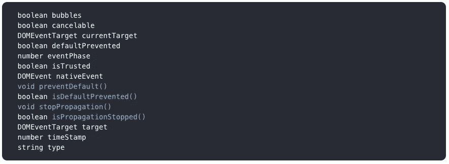
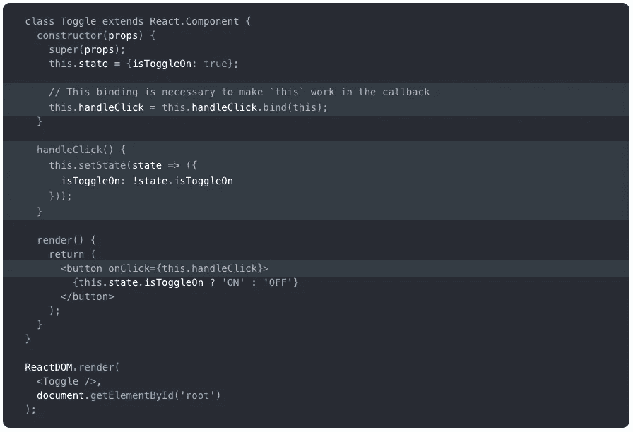

# React 中事件的介绍

> 原文：<https://betterprogramming.pub/an-intro-to-events-in-react-47a6a621b031>

## 用例子解释事件

用 [React](https://reactjs.org/) 处理事件与处理 DOM 元素上的事件非常相似。

然而，不是像在[普通的](http://vanilla-js.com/) JavaScript 中那样调用`addEventListener`，而是在最初呈现元素时提供一个事件监听器。

此外，还有一些语法差异:

*   React 事件以`camelCase`命名(像`onClick`)，而不是全部小写。
*   使用 JSX，您传递一个函数作为事件处理程序，而不是一个字符串。

React 利用自己的事件系统来提供跨浏览器兼容性。

要做到这一点，React 将本机浏览器事件包装在自己的名为`SyntheticEvent`的结构中，并将它们传递给 React 事件处理程序。React 根据 W3C 规范[定义了这些合成事件，这为它们提供了跨浏览器兼容性。](https://www.w3.org/TR/DOM-Level-3-Events/)

因为 React 的`SyntheticEvent`具有与原生浏览器事件相同的接口，所以您可以使用像`preventDefault()`和`stopPropagation()`这样的方法。

每个`SyntheticEvent`对象都有以下属性:

[https://reactjs.org/docs/events.html](https://reactjs.org/docs/events.html)

当您定义基于类的组件时，一个常见的模式是事件处理程序是类上的一个方法。

在下面的例子中，`Toggle`组件呈现一个按钮，允许用户在“开”和“关”状态之间切换。

每当点击事件发生时，`handleClick()`方法改变状态，而`render()`方法显示 DOM 的当前状态:

[https://reactjs.org/docs/handling-events.html](https://reactjs.org/docs/handling-events.html)

出于性能目的，React 有一个内置特性，它“汇集”它的`SyntheticEvents`。这意味着在一个事件处理程序被调用后，`event.target`的所有属性都被重置为`null`。

通过在执行回调后使属性无效，React 可以在应用程序的其他地方重用事件对象。

这是 React 的任务是干燥、模块化和可重用的一个很好的例子。

借助事件池，浏览器不需要为每个事件实例的新对象分配内存。相反，它将在内存中为所有事件实例使用相同的事件对象。

事件处理程序完成执行后，事件对象的键保持不变，但每个键的值都被重置为 null。这释放了内存空间，但也意味着已执行事件的值会丢失。

由于这种无效化，不能异步访问这些属性。

当一个类似于`setState()`的异步函数被执行时，它将试图访问事件的属性，比如`event.currentTarget.value`，正如我们所看到的，所有事件对象的属性都被重置为`null`，所以返回值将是...`null`。哦不！

你可能会遇到类似`Uncaught TypeError: Cannot read property ‘data’ of null`的常见错误。

为了防止一个事件对象被池化，从而无效，我们在函数的开始调用`event.persist()`。

调用此方法将从池中移除`SyntheticEvent`,并且事件对象将不会被后面的 DOM 事件重用；这允许异步保留对事件的引用。

作为`event.persist()`的替代，你可以将你需要的数据存储在一个变量中(例如。`const pug = event.target`)。

在这个例子中，`pug`将包含对 DOM 对象的引用，它独立于对 event 对象的引用。通过将`event.target`保存到一个变量，我们可以保留对该数据的访问，而不需要通过实际的事件对象访问目标。

感谢阅读！