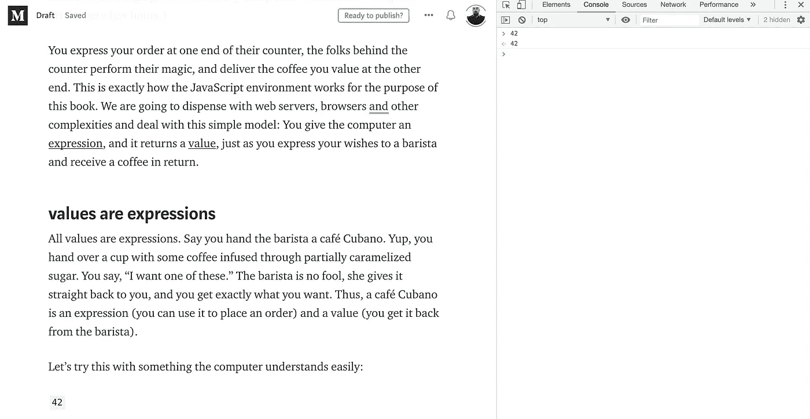

# 面向有经验的程序员的 Javascript 介绍，他们可能需要大量的基础知识

> 原文：<https://betterprogramming.pub/an-intro-to-javascript-for-experienced-programmers-who-could-use-a-strong-dose-of-fundamentals-31535030616b>


当我们准备推出 [Better Programming](http://medium.com/better-programming) 时，我联系了一个我认为是编程大师的人，[雷金纳德·布莱斯维特](http://raganwald.com/)(在许多地方被称为[拉甘瓦尔德](https://twitter.com/raganwald))。我想知道的是，他是否会从他的书《JavaScript Allongé》中贡献一个样本章节，这本书是“Six”版( [amazon](https://www.amazon.com/dp/B00FLKRCVO?tag=coachdotme20-20) | [leanpub](https://leanpub.com/javascriptallongesix) )。

相反，他的反应只是简单地把他的书的版权条款改成了“知识共享:归属/共享——类似”,并让我尽情发挥。(也许狂野是言过其实了。)

下面是这本书的一部分，很长的一部分，我发现它在一个非常特别的方面很有价值。对于从未编程的人来说，有很多 JavaScript 教程。但我一直在编程，至少从 1994 年开始(甚至是 80 年代，如果你把移动屏幕上有 Logo 的乌龟也算在内的话)。

然而，当编程世界跳到 JavaScript 时，我有点迷失了。我花了一段时间才意识到为什么，尽管事后看来这是显而易见的。我从未真正理解 JavaScript 语言的基础。我以前总是有语言足够相似的经验，以至于我大部分时间只是查找偶尔的语法细节。例如，我的第一个 PHP 和 Rails 项目带有一个基于 Perl web 开发的心智模型。不过 JavaScript 有点太不一样了，所以我发现自己需要回去学习基础知识。

这就是雷金纳德的书出现的地方。我发现他的文章很迂腐，这让我想起了我的计算机科学教授。这正是我想要的——这不是给初次程序员的教程。另外，我想 Reginald 会说，对编程语言有学究式的详细了解是务实的——你会工作得更快，犯的错误更少。

下面的教程从最基本的开始:值和变量。我发现这种复习很有价值。但是当他进入函数时，真正的肉来了。

我用我的 JavaScript 控制台在 Chrome 上阅读了下面的内容。这样我就可以一边走一边测试我自己的代码版本。



通过右键单击>检查>控制台打开 Javascript 控制台

# 前奏:喝咖啡时的价值观和表达

*以下材料极其基础；然而，像大多数故事一样，最好的开始方式是从头开始。*

想象我们正在参观我们最喜欢的咖啡店。他们会为你制作任何你想要的饮料，从短而浓的意式浓缩咖啡到干的卡布奇诺，再到以各种浓缩糖浆和牛奶为特色的咖啡口味的沙漠混合物。(你容忍含糖饮料的存在，因为它们为公司提供了足够的利润空间，让你可以整天使用他们的无线网络，每隔几个小时就点一杯 3 美元的饮料。)

你在他们柜台的一端表达你的订单，柜台后面的人表演他们的魔术，在另一端递送你所珍视的咖啡。这正是本书中 JavaScript 环境的工作方式。我们将省去网络服务器、浏览器和其他复杂的东西，处理这个简单的模型:你给计算机一个表达式，它返回一个值，就像你向咖啡师表达你的愿望，得到一杯咖啡作为回报。

## 值是表达式

所有的值都是表达式。假设你递给咖啡师一杯古巴咖啡。是的，你递过来一杯用部分焦糖浸泡的咖啡。你说，“我想要一个。”咖啡师不是傻瓜，她会直接把它还给你，你就会得到你想要的。因此，一杯古巴咖啡是一种表达(你可以用它来下订单)和一种价值(你可以从咖啡师那里拿回来)。

让我们用计算机容易理解的东西来试试:

```
42
```

这是一种表达吗？一个值？都不是？还是两者都有？

答案是，这既是一个表达式*又是一个值*。辨别两者的方法非常简单:当你输入 JavaScript 时，你会得到同样的结果，就像我们的古巴咖啡馆一样:

```
42   
//=> 42
```

所有的值都是表达式。那很简单！还有其他种类的表达吗？当然可以！我们回咖啡店吧。我们可以不交出成品咖啡，而是交出配料。让我们交出一些磨碎的咖啡加上一些开水。

敏锐的读者会意识到我们遗漏了一些东西。恭喜你！喝一口浓咖啡。我们一会儿就会谈到这一点。

现在咖啡师还给我们一杯浓缩咖啡。如果我们交出浓缩咖啡，我们就能拿回浓缩咖啡。所以，开水加咖啡粉是一种表达，但不是一种价值。开水是一种价值。研磨咖啡是一种价值。浓缩咖啡是一种价值。开水加研磨咖啡是一种表达方式。

让我们用其他计算机容易理解的东西来试试这个:

```
"JavaScript" + " " + "Allonge"   
//=> "JavaScript Allonge"
```

现在我们看到“字符串”是值，你可以用字符串和一个操作符`+`做一个表达式。因为字符串是值，所以它们本身也是表达式。但是带运算符的字符串不是值，是表达式。现在我们知道“咖啡渣加热水”的例子中缺少了什么。咖啡渣是一个值，沸腾的热水是一个值，它们之间的“加”运算符使整个事物成为一个表达式，而不是一个值。

## 价值观和身份

在 JavaScript 中，我们测试两个值是否与`===`操作符相同，以及它们是否与`!==`操作符不同:

```
2 === 2     
//=> true 'hello' !== 'goodbye'     
//=> true
```

`===`到底是如何运作的？想象给你看一杯咖啡。然后你会看到另一杯咖啡。这两个杯子“一模一样吗？”在 JavaScript 中，有四种可能性:

首先，有时，杯子是不同种类的。一个是小杯咖啡，另一个是大杯。这相当于在 JavaScript 中比较两个不同类型的东西。例如，字符串`"2"`和数字`2`不是一回事。字符串和数字是不同的类型，因此字符串和数字永远不会相同:

```
2 === '2'   
//=> false true !== 'true'   
//=> true
```

第二，有时，杯子是同一类型的——也许是两个咖啡杯——但它们有不同的内容物。一个拿着单人的，一个拿着双人的。这相当于比较两个类型相同但“内容”不同的 JavaScript 值。比如数字`5`和数字`2`不是一回事。

```
true === false   
//=> false 2 !== 5   
//=> true 'two' === 'five'   
//=> false
```

如果杯子是同类型的*和*内容是一样的怎么办？JavaScript 的第三和第四种可能性涵盖了这一点。

## 值类型

第三，有些类型的杯子上没有明显的标志。如果它们是同一种杯子，装的是同样的东西，我们就没有办法区分它们。到目前为止，我们看到的字符串、数字和布尔值就是这种情况。

```
2 + 2 === 4   
//=> true (2 + 2 === 4) === (2 !== 5)   
//=> true
```

请注意这些例子所发生的事情:即使我们获得一个字符串、数字或布尔值作为表达式的求值结果，它也与另一个具有相同“内容”的相同类型的值相同。字符串、数字和布尔值是 JavaScript 所谓的“值”或“原始”类型的例子。我们将交替使用这两个术语。

我们还没有遇到第四种可能。稍微延伸一下这个比喻，一些类型的杯子在底部有一个序列号。所以即使你有两个同类型的杯子，它们的内容物是一样的，你仍然可以区分它们。

## 参考类型

那么，哪些类型的值可能是相同的类型，具有相同的内容，但不被认为与 JavaScript 相同呢？我们来认识一个当代编程语言中非常常见的数据结构，*数组*(其他语言有时称之为列表或向量)。

一个数组是这样的:`[1, 2, 3]`。这是一个表达式，你可以把`[]`和其他表达式组合起来。疯狂做一些事情，比如:

```
[2-1, 2, 2+1] 
[1, 1+1, 1+1+1]
```

请注意，您总是生成具有相同内容的数组。但是它们是相同的吗，就像`42`的每一个值都与`42`的每一个值相同吗？自己试试这些:

```
[2-1, 2, 2+1] === [1,2,3] 
[1,2,3] === [1, 2, 3] 
[1, 2, 3] === [1, 2, 3]
```

怎么样！当您键入`[1, 2, 3]`或它的任何变体时，您键入的是一个生成自己的*唯一*数组的表达式，该数组与任何其他数组都不相同，即使其他数组看起来也像`[1, 2, 3]`。这就好像 JavaScript 正在生成底部带有序列号的新咖啡。

它们看起来一样，但是如果你用`===`来审视它们，你会发现它们是不同的。每次你评估一个表达式(包括输入一些内容)来创建一个数组，你都在创建一个新的、不同的值，即使它*看起来*与其他数组值相同。正如我们将看到的，这适用于许多其他类型的值，包括本书的主题*函数*。

## 浓郁的香气:基本数字

> 在计算机科学中，文字是表示源代码中固定值的符号。几乎所有的编程语言都有整数、浮点数和字符串等原子值的符号，通常还有布尔和字符的符号；有些还有枚举类型和复合值元素的符号，如数组、记录和对象。匿名函数是函数类型的文字。— [维基百科](https://en.wikipedia.org/wiki/Literal_(computer_programming))

像大多数语言一样，JavaScript 有一个文字集合。我们看到，像`42`这样仅由数字组成的表达式是一个字面量。它代表数字 42，也就是以 42 为基数的 10。不是所有的数字都是十进制的。如果我们以零开始一个文字，它是一个八进制文字。所以字面上的`042`是 42 基 8，实际上是 34 基 10。

在内部，`042`和`34`具有相同的表示，如[双精度浮点数](http://en.wikipedia.org/wiki/Double-precision_floating-point_format)。理解计算机内部的数字表示很重要。机器对数字的表示几乎永远不会与我们对数字行为的理解完全一致，因此，如果我们对它在“引擎盖下”做什么知之甚少，就会有一些地方让我们感到惊讶。

例如，JavaScript 可以安全处理的最大整数是`9007199254740991`，或`2^53 - 1`。像大多数编程语言一样，JavaScript 不允许我们使用逗号来分隔数字组。

## 浮动的

大多数程序员从未遇到过整数的大小限制。但是我们提到，数字在内部表示为浮点，这意味着它们不一定只是整数。例如，我们可以编写`1.5`或`33.33`，JavaScript 将这些文字表示为浮点数。

人们很容易认为我们现在已经拥有了处理大量金钱等事情所需的一切，但正如已故的约翰·贝鲁西所说的那样，“不，不，不，不，不，不。计算机内部浮点数的表示是二进制的，而我们的文字数是十进制的。这对整数来说没有意义，但对分数来说有意义，因为一些以 10 为基数的分数没有以 2 为基数的精确表示。

最常重复的一个例子是:

```
1.0   
//=> 1 1.0 + 1.0   
//=> 2 1.0 + 1.0 + 1.0   
//=> 3
```

然而:

```
0.1   
//=> 0.1 0.1 + 0.1   
//=> 0.2 0.1 + 0.1 + 0.1   
//=> 0.30000000000000004
```

当执行具有可接受偏差的计算时，这种“不精确”可以忽略。例如，当将页面上的一些文本居中时，只要您可能计算的手写内容和 JavaScript 计算的内容之间的差异小于一个像素，就没有可观察到的错误。

但是作为一个规则，如果你需要处理实数，你应该对 IEEE 浮点运算标准有更多的了解。专业程序员几乎从不使用浮点数来表示货币金额。例如，“$43.21”几乎总是用两个数字表示:`43`表示美元，`21`表示美分，而不是`43.21`。在本书中，我们不需要考虑这些细节，但在本书之外，我们必须考虑。

## 数字运算

正如我们所见，JavaScript 有许多常见的算术运算符。我们可以创建看起来非常像数学表达式的表达式，例如，我们可以写出`1 + 1`或`2 * 3`或`42 - 34`甚至`6 / 2`。这些可以组合成更复杂的表达式，比如`2 * 5 + 1`。

在 JavaScript 中，操作符有一个优先顺序，它被设计成模仿人类解析书面算法的方式。所以:

```
2 * 5 + 1   
//=> 11 1 + 5 * 2   
//=> 11
```

JavaScript 将表达式视为我们编写的`(2 * 5) + 1`和`1 + (5 * 2)`，因为`*`操作符的*优先级比`+`操作符的*高。JavaScript 有更多的操作符。在某种意义上，它们的行为就像小函数。如果我们写`1 + 2`，这在概念上类似于写`plus(1, 2)`(当然，假设我们有一个函数将绑定到名字`plus`的两个数字相加)。

除了常见的`+`、`-`、`*`、`/`，JavaScript 还支持模数、`%`和一元否定、`-`:

```
-(457 % 3)   
//=> -1
```

还有许许多多可以用于数字的运算符，包括像`|`和`&`这样的位运算符，它们允许您直接对数字的二进制表示进行运算，还有许多其他运算符执行赋值或逻辑比较，我们将在后面讨论。

# 关于函数，尽可能的少，但是不能少

在 JavaScript 中，函数是值，但它们也不仅仅是简单的数字、字符串，甚至是像树或地图这样复杂的数据结构。函数代表要执行的计算。像数字、字符串和数组一样，它们也有表示形式。让我们从第二个最简单的函数开始。在 JavaScript 中，它看起来像这样:

```
() => 0
```

这是一个应用于无值并返回`0`的函数。让我们验证我们的函数是一个像所有其他函数一样的值:

```
(() => 0)   
//=> [Function]
```

什么！？它为什么不给我们打回`() => 0`？这个*似乎*打破了我们的规则，即如果一个表达式也是一个值，JavaScript 将把相同的值返回给我们。这是怎么回事？最简单和最容易的答案是，尽管 JavaScript 解释器确实返回了那个值，但是在屏幕上显示它是另一回事。`[Function]`是编写 Node.js 的人做出的选择，node . js 是托管 JavaScript REPL 的 JavaScript 环境。如果你在浏览器中尝试同样的东西，你可能会看到别的东西。

我更喜欢其他的东西，但是我必须承认，在屏幕上输入给我们的东西是任意的，真正重要的是它对人类阅读有些用处。但我们必须明白，无论我们看到的是`[Function]`还是`() => 0`，JavaScript 内部都有一个完整而恰当的功能。

## 功能和身份

你还记得，我们有两种关于身份的值:值类型和引用类型。如果值类型具有相同的内容，则它们共享相同的标识。引用类型没有。

哪一种是函数？让我们试试看。出于安抚 JavaScript 解析器的原因，我们将函数括在括号中:

```
(() => 0) === (() => 0)   
//=> false
```

像数组一样，每次你计算一个表达式来产生一个函数，你会得到一个新的函数，这个函数与其他任何函数都不相同，即使你使用相同的表达式来产生它。“函数”是一种引用类型。

## 应用函数

让我们让函数发挥作用。我们使用函数的方式是*将*它们应用于零个或多个值，称为*参数*。正如`2 + 2`产生一个值(在本例中是`4`)一样，将一个函数应用于零个或多个参数也会产生一个值。

下面是我们如何在 JavaScript 中将一个函数应用于一些值:假设 *fn_expr* 是一个表达式，当它被求值时，产生一个函数。让我们把这些参数叫做 *args* 。以下是如何将函数应用于一些参数:

```
*fn_expr*(*args*)
```

现在，我们只知道一个这样的表达:`() => 0`，所以让我们使用它。我们将把它放在括号中，让解析器满意，就像我们上面做的一样:`(() => 0)`。因为我们没有给它任何参数，我们将简单地在表达式后面写`()`。所以我们写道:

```
(() => 0)()   
//=> 0
```

## 返回值和计算表达式的函数

我们看过`() => 0`。我们知道`(() => 0)()`返回`0`，这并不奇怪。同样，以下这些都应该是显而易见的:

```
(() => 1)()   
//=> 1 (() => "Hello, JavaScript")()   
//=> "Hello, JavaScript" (() => Infinity)()   
//=> Infinity
```

好吧，最后一个很棒，但是总的想法是这样的:我们可以通过把值放在箭头的右边来创建一个返回值的函数。

在前奏中，我们看了表情。像`0`这样的值是表达式，像`40 + 2`这样的东西也是表达式。我们能在箭头的右边放一个表达式吗？

```
(() => 1 + 1)()   
//=> 2 (() => "Hello, " + "JavaScript")()   
//=> "Hello, JavaScript" (() => Infinity * Infinity)()   
//=> Infinity
```

是的，我们可以。我们可以把任何表达式放在箭头的右边。比如`(() => 0)()`就是一个表达式。我们能不能把它放在一个箭头的右边，像这样:`() => (() => 0)()`？

让我们来试试:

```
(() => (() => 0)())()   
//=> 0
```

是的，我们可以！函数可以返回评估另一个函数的值。

当处理有许多相同字符的表达式(如括号)时，您可能会发现格式化代码会有所帮助，使事情突出。所以我们也可以写:

```
(() =>
    (() => 0
      )()
)()
//=> 0
```

它评估为相同的东西，`0`。

## 逗号

JavaScript 中的逗号操作符很有趣。它接受两个参数，对这两个参数求值，然后自己计算右边参数的值。换句话说:

```
(1, 2)   
//=> 2 (1 + 1, 2 + 2)   
//=> 4
```

我们可以在函数中使用逗号来创建计算多个表达式的函数:

```
(() => (1 + 1, 2 + 2))()   
//=> 4
```

这在尝试做可能涉及*副作用*的事情时很有用，但我们稍后会讲到。在大多数情况下，JavaScript 并不关心事物是否由空格、制表符或换行符分隔。所以我们也可以写:

```
() =>   
    (1 + 1, 2 + 2)
```

或者甚至:

```
() => (     
        1 + 1,     
        2 + 2   
)
```

## 最简单的块

还有一个东西我们可以放在箭头的右边，一个*块*。一个块有零个或多个用分号分隔的*语句*。

所以，这是一个有效的函数:

```
() => {}
```

它返回评估没有语句的块的结果。那会是什么？让我们来试试:

```
(() => {})()   
//=> undefined
```

这是什么`undefined`？

## `undefined`

在 JavaScript 中，缺少值被写成`undefined`，它的意思是没有值。它会再次出现。`undefined`是它自己的值类型，它的行为类似于值类型:

```
undefined   
//=> undefined
```

像数字、布尔值和字符串一样，JavaScript 可以打印出值`undefined`。

```
undefined === undefined   
//=> true (() => {})() === (() => {})()   
//=> true (() => {})() === undefined   
//=> true
```

无论你如何评价`undefined`，你都会得到一个相同的值。`undefined`是一个值，表示“我没有值”但它仍然是一个值:-)

你可能认为 JavaScript 中的`undefined`相当于 SQL 中的`NULL`。不会。在 SQL 中，两个为`NULL`的事物不等于也不共享同一个恒等式，因为两个未知数不可能相等。在 JavaScript 中，每个`undefined`都与其他`undefined`相同。

## 空的

我们已经看到 JavaScript 通过键入`undefined`来表示一个未定义的值，我们已经以两种方式生成了未定义的值:

1.  通过评估不返回值`(() => {})()`的函数，以及；
2.  靠自己写作`undefined`。

还有第三种方法，使用 JavaScript 的`void`操作符。请看:

```
void 0   
//=> undefined void 1   
//=> undefined void (2 + 2)   
//=> undefined
```

`void`是一个取任意值并计算为`undefined`的运算符，始终。那么，当我们故意想要一个未定义的值时，我们应该使用第一、第二还是第三种形式呢？答案是，用`void`。按照惯例，使用`void 0`。

第一种形式可行，但很麻烦。第二种形式在大多数情况下是有效的，但是通过将`undefined`重新赋值给一个不同的值也可以打破它。第三种形式保证总是有效，所以我们将使用这种形式。

## 回到街区

回到我们的函数。我们对此进行了评估:

```
(() => {})()   
//=> undefined
```

我们说过函数返回评估一个*块*的结果，我们说过块是由分号分隔的 JavaScript *语句*的列表(可能是空的)。

类似于:`{`声明 1 `;`声明 2 `;`声明 3 `; ... ;`声明 n `}`

我们还没有讨论这些*语句*。什么是声明？

JavaScript 语句有很多种，但第一种是我们已经见过的。表达式是一个 JavaScript 语句。尽管它们不太实用，但它们是有效的 JavaScript 函数，应用时会返回`undefined`:

```
() => { 2 + 2 } () => { 1 + 1; 2 + 2 }
```

正如我们在上面用逗号看到的，当我们觉得这样更易读时，我们可以将这些函数重新安排到多行中:

```
() => {     
        1 + 1;     
        2 + 2   
}
```

但是无论我们如何排列它们，一个包含一个或多个表达式的块仍然计算为`undefined`:

```
(() => { 2 + 2 })()   
//=> undefined (() => { 1 + 1; 2 + 2 })()   
//=> undefined (() => {     
         1 + 1;     
         2 + 2   
})()   
//=> undefined
```

如您所见，包含一个表达式的块的行为不像表达式，包含多个表达式的块的行为不像用逗号运算符构造的表达式:

```
(() => 2 + 2)()   
//=> 4 (() => { 2 + 2 })()   
//=> undefined (() => (1 + 1, 2 + 2))()   
//=> 4 (() => { 1 + 1; 2 + 2 })()   
//=> undefined
```

那么，我们如何获得一个函数来评估一个应用时返回值的块呢？用`return`关键字和任意表达式:

```
(() => { return 0 })()   
//=> 0 (() => { return 1 })()   
//=> 1 (() => { return 'Hello ' + 'World' })()   
// 'Hello World'
```

`return`关键字创建一个*返回语句*，该语句立即终止函数应用程序并返回其表达式求值的结果。例如:

```
(() => {     
         1 + 1;     
         return 2 + 2   
})()   
//=> 4
```

此外:

```
(() => {     
         return 1 + 1;     
         2 + 2   
})()   
//=> 2
```

return 语句是我们看到的第一个语句，它的行为与表达式不同。例如，您不能在简单函数中将 one 用作表达式，因为它不是表达式:

```
(() => return 0)()   
//=> ERROR
```

语句属于块内部，并且只属于块内部。一些语言通过将一切都变成表达式来简化这一点，但是 JavaScript 保持了这种区别，所以在学习 JavaScript 时，我们还学习了像函数声明、for 循环、if 语句等语句。稍后我们会看到更多这样的例子。

## 评估为函数的函数

如果计算结果为函数的表达式是一个表达式，如果 return 语句的右边可以有任何表达式… *我们可以把计算结果为函数的表达式放在函数表达式的右边吗？*

是:

```
() => () => 0
```

那是功能！它是一个函数，当被应用时，计算为一个函数，当被应用时，计算为`0`。所以我们有一个函数，它返回一个函数，返回零。同样:

```
() => () => true
```

那是一个函数，返回一个函数，返回`true`:

```
(() => () => true)()()   
//=> true
```

当然，如果我们愿意，我们可以用积木做同样的事情:

```
() => () => { return true; }
```

但我们一般不会。

好吧。我们很聪明，但是到目前为止，这一切似乎都很抽象。

晶体的衍射本身是美丽而有趣的，但你不能责怪我们想要展示它的实际用途，就像能够确定数百万光年以外的恒星的成分一样。所以…在下一节，我们将看到如何使功能变得实用。

# 啊。我想争论一下。

到目前为止，我们已经看了没有参数的函数。我们甚至还没有说什么是参数*什么是*，只说我们的函数没有任何参数。

大多数程序员都非常熟悉实参(通常称为“参数”)。中学数学讨论这个。所以你知道它们是什么，我也知道你知道它们是什么，但是请耐心等待解释！

我们来做一个带自变量的函数:

```
(room) => {}
```

这个函数有一个参数，`room`，和一个空体。下面是一个有两个参数和一个空体的函数:

```
(room, board) => {}
```

我相信你对这个函数有两个参数`room`和`board`的想法非常满意。一个人对这些论点做了什么？当然是用在身体上。你认为这是什么？

```
(diameter) => diameter * 3.14159265
```

这是一个在给定直径的情况下计算圆周的函数。我大声读出来是“当应用于代表直径的值时，这个函数*返回*直径乘以 3.14159265。”

记住，为了应用一个没有参数的函数，我们编写了`(() => {})()`。要应用带有一个参数(或多个参数)的函数，我们将参数(或多个参数)放在括号内，如下所示:

```
((diameter) => diameter * 3.14159265)(2)   
//=> 6.2831853
```

看到如何编写一个函数并将其应用于两个参数，您不会感到惊讶:

```
((room, board) => room + board)(800, 150)   
//=> 950
```

## 函数和主体的快速总结

从例子中，参数在主体表达式中是如何使用的对你来说可能是非常明显的，特别是如果你使用过任何编程语言(除了 BASIC 的方言——我记得在我的中学时代——当你调用一个过程时，它不允许参数)。

表达式由值的表示(如`3.14159265`、`true`和`undefined`)、组合表达式的操作符(如`3 + 2`)、一些特殊形式(如用于从表达式创建数组的`[1, 2, 3]`)或用于创建函数的`function (` *参数* `) {` *主体语句* `}`组成。

一个重要的可能语句是 return 语句。return 语句接受任何有效的 JavaScript 表达式。

这种松散的定义是递归的，所以我们可以凭直觉(或者利用我们对其他语言的经验)认为，既然一个函数可以包含一个带有表达式的 return 语句，我们就可以编写一个返回函数的函数，或者一个包含另一个数组表达式的数组。或者返回数组的函数、函数数组、返回函数数组的函数等等:

```
() => () => {}; () => [ 1, 2, 3]; [1, [2, 3], 4]; () => [     
        () => 1,     
        () => 2,     
        () => 3   
];
```

## 按值调用

像大多数当代编程语言一样，JavaScript 使用“按值调用”的评估策略。这意味着，当您编写一些代码来将函数应用于一个或多个表达式时，JavaScript 会计算所有这些表达式，并将函数应用于结果值。

所以当你写下:

```
((diameter) => diameter * 3.14159265)(1 + 1)   
//=> 6.2831853
```

内部发生的是表达式`1 + 1`先求值，结果产生了`2`。然后我们的圆周函数应用到了`2`。

我们将在下面看到，虽然 JavaScript 总是通过值来调用，但是“值”的概念有额外的微妙之处。但在此之前，我们先来看看变量。

## 变量和绑定

现在一切看起来简单明了，我们可以继续更详细地讨论论点。我们将从`(diameter) => diameter * 3.14159265`逐步提升到如下功能:

```
(x) => (y) => x
```

`(x) => (y) => x`看起来很疯狂，就好像我们正在把英语作为第二语言来学习，老师承诺我们很快就会使用像*反既定主义*这样的词。除了希望使用长词来让人印象深刻之外，除非我们发现自己想要讨论英格兰教会在 19 世纪英国政治中的作用，否则这不会看起来有吸引力。

但是学习单词*反体制主义*还有另一个原因:我们可以学习前缀和后缀在英语语法中是如何工作的。跟`(x) => (y) => x`是一回事。它本身就有一定的重要意义，而且它也是学习函数、环境、变量等等的绝佳借口。

为了讨论这是如何工作的，我们应该就几个术语达成一致(您可能已经知道它们，但是让我们一起检查并“同步我们的字典”)。第一个`x`，也就是`(x) => ...`里的那个，是一个*论证*。`function (y) ...`中的`y`是另一种说法。第二个`x`，即`=> x`中的那个，不是参数，*是引用变量*的表达式。无论我们谈论的是`(x) => (y) => x`还是简单的`(x) => x`，参数和变量的工作方式都是一样的。

每次调用一个函数(“被调用”意味着“应用于零个或多个参数”)，都会创建一个新的*环境*。环境是一个(可能是空的)字典，它通过名称将变量映射到值。我们称之为“变量”的表达式中的`x`本身就是一个通过在环境中查找值来计算的表达式。

价值是如何进入环境的？对于论点来说，这很简单。当您将函数应用于参数时，字典中会为每个参数放置一个条目。所以当我们写下:

```
((x) => x)(2)   
//=> 2
```

事情是这样的:

1.  JavaScript 将这一切解析为由几个子表达式组成的表达式。
2.  然后，它开始计算表达式，包括计算子表达式
3.  一个子表达式，`(x) => x`计算出一个函数。
4.  另一个是`2`，计算结果是数字 2。
5.  JavaScript 现在评估对参数`2`应用函数。有趣的地方就在这里…
6.  创造了一个环境。
7.  值“2”绑定到环境中的名称“x”。
8.  表达式“x”(函数的右侧)在我们刚刚创建的环境中进行计算。
9.  在一个环境中评估时，变量值是绑定到该环境中变量名的值，即“2”
10.  这就是我们的结果。

当我们谈论环境时，我们将使用一个[不令人惊讶的语法](http://json.org/)来显示它们的绑定:`{x: 2, ...}`。也就是说，环境是一个字典，值`2`与名字`x`绑定在一起，字典中可能还有我们现在没有讨论的其他内容。

## 通过共享呼叫

前面，我们区分了 JavaScript 的*值类型*和它的*引用类型*。当时，我们研究了 JavaScript 如何区分相同和不同的对象。现在是时候再看一看值类型和引用类型之间的区别了。

JavaScript 严格维护一个属性:当一个值——任何值——作为参数传递给函数时，函数环境中绑定的值必须与原始值相同。

我们说了 JavaScript 将名称绑定到值，但是没有说将名称绑定到值是什么意思。现在我们可以详细说明:当 JavaScript 将值类型绑定到名称时，它会制作该值的副本，并将副本放在环境中。正如您所回忆的那样，如果字符串和数字等值类型具有相同的内容，则它们是相同的。因此 JavaScript 可以随心所欲地复制任意多的字符串、数字或布尔值。

引用类型呢？JavaScript 不会在任何环境中放置引用值的副本。JavaScript 将*引用*放在环境中引用类型，当需要使用该值时，JavaScript 使用该引用获取原始值。

因为许多引用可以共享同一个值，又因为 JavaScript 将引用作为参数传递，所以可以说 JavaScript 实现了“通过共享调用”语义。通过共享调用通常被理解为通过值调用的专门化，它解释了为什么一些值被称为值类型，而另一些值被称为引用类型。

至此，我们已经准备好来看看*闭包*。当我们结合我们关于值类型、引用类型、参数和闭包的知识时，我们将理解为什么这个函数总是计算为`true`,不管你将它应用于什么参数:

```
(value) =>   ((ref1, ref2) => ref1 === ref2)(value, value)
```

# 闭包和范围

是时候看看函数中的函数是如何工作的了:

```
((x) => (y) => x)(1)(2)   
//=> 1
```

首先，让我们用我们在上面学到的东西。给定`(` *某函数* `)(` *某自变量* `)`，我们知道我们将函数应用于自变量，创建一个环境，将自变量的值绑定到名称，并对函数的表达式求值。所以我们先用这段代码:

```
((x) => (y) => x)(1)   
//=> [Function]
```

属于签名为`(x) => ...`的函数的环境变成了`{x: 1, ...}`，应用该函数的结果是另一个函数值。结果值是一个函数是有意义的，因为`(x) => ...`身体的表达式是:

```
(y) => x
```

现在我们有了一个代表这个函数的值。然后我们将获取该函数的值，并将其应用于参数`2`，就像这样:

```
((y) => x)(2)
```

所以我们似乎得到了一个新的环境`{y: 2, ...}`。在这个函数的环境中，表达式`x`将如何被求值？它的环境里没有`x`，它一定是来自别的地方。

顺便说一下，这是 JavaScript 和同一家族中的语言的一个重要的定义特征:它们是否允许像函数这样的东西嵌套在彼此内部，如果是，它们如何处理在函数内部引用的来自函数“外部”的变量。例如，下面是 Ruby 中的等价代码:

```
lambda { |x|   lambda { |y| x } }[1][2]   
#=> 1
```

## 如果没有自由变量的函数是纯的，闭包是不纯的吗？

函数`(y) => x`很有意思。它包含一个*自由变量*，`x`。自由变量是指不在函数内的变量。到目前为止，我们只看到了一种“绑定”变量的方法，即传入一个同名的参数。由于函数`(y) => x`没有名为`x`的参数，变量`x`没有被绑定在这个函数中，这使得它是“自由的”

现在我们知道了函数中使用的变量要么是有界的，要么是自由的，我们可以将函数分为有自由变量的函数和没有自由变量的函数:

*   不含自由变量的函数称为*纯函数*。
*   包含一个或多个自由变量的函数被称为*闭包*。

纯函数最容易理解。无论你在哪里使用它们，它们的意思总是一样的。下面是一些我们已经见过的纯函数:

```
() => {}  
(x) => x    
(x) => (y) => x
```

第一个函数没有任何变量，因此没有任何自由变量。第二个没有任何自由变量，因为它唯一的变量是绑定的。第三个实际上是两个函数，一个在另一个里面。`(y) => ...`有自由变量，但是整个表达式引用的是`(x) => ...`，它没有自由变量:它体内任何地方唯一的变量是`x`，当然是绑定在`(x) => ...`内的。

由此，我们学到了一些东西:一个纯函数可以包含一个闭包。

如果纯函数可以包含闭包，那么闭包可以包含纯函数吗？仅使用我们目前所学的知识，尝试构建一个包含纯函数的闭包。如果不能，给出为什么不可能的理由。

纯函数总是意味着同样的事情，因为它们的所有“输入”都完全由它们的参数定义。结束时就不是这样了。如果我向你展示这个纯函数`(x, y) => x + y`，我们就知道它和`(2, 2)`有什么关系。但是这个关闭:`(y) => x + y`呢？在不理解计算自由变量`x`的魔力的情况下，我们不能说它将如何处理自变量`(2)`。

## 总是环境的问题

为了理解闭包是如何被评估的，我们需要重新考察环境。正如我们之前说过的，所有的功能都与环境相关联。当描述我们的环境时，我们也挥舞着一些东西。还记得我们说过`((x) => (y) => x)(1)`的环境是`{x: 1, ...}`而`((y) => x)(2)`的环境是`{y: 2, ...}`吗？让我们来填空吧！

`((y) => x)(2)`的环境实际上是*`{y: 2, '..': {x: 1, ...}}`。`'..'`表示类似“父母”、“圈地”或“超环境”的东西是`(x) => ...`的环境，因为功能`(y) => x`在`(x) => ...`的体内。因此，每当函数应用于参数时，它的环境总是有一个对其父环境的引用。*

*现在你可以猜到我们在环境`{y: 2, '..': {x: 1, ...}}`中如何评价`((y) => x)(2)`。变量`x`不在`(y) => ...`的直接环境中，但在它的父环境中，所以它的计算结果为`1`，这就是`((y) => x)(2)`返回的结果，即使它最终忽略了自己的参数。*

*`(x) => x`被称为 I 组合子，或*恒等函数*。`(x) => (y) => x`被称为 K 组合子，或*红隼*。一些人对此非常兴奋，以至于他们写了关于他们的整本书，一些人是伟大的 T21，一些人——我该怎么说呢——是有趣的，如果你使用 Ruby 的话。*

*函数也可以有祖父母:*

```
*(x) => (y) => (z) => x + y + z*
```

*该函数的功能与以下功能非常相似:*

```
*(x, y, z) => x + y + z*
```

*只是你用`(1)(2)(3)`而不是`(1, 2, 3)`来称呼它。另一个很大的不同是，你可以用`(1)`调用它，然后得到一个函数，你可以稍后用`(2)(3)`调用它。*

*第一个函数是[与](https://en.wikipedia.org/wiki/Currying)第二个函数相匹配的结果。调用一个只有部分参数的 curried 函数有时被称为[部分应用](https://en.wikipedia.org/wiki/Partial_application)。有些编程语言自动库里和部分求值函数，不需要手动嵌套。*

## *来自模糊星球的模糊变量*

*当一个变量与祖先环境的变量同名时，有趣的事情发生了。考虑:*

```
*(x) => (x, y) => x + y*
```

*函数`(x, y) => x + y`是一个纯函数，因为它的`x`是在自己的环境中定义的。尽管它的父节点也定义了一个`x`，但在评估`x + y`时，它会被忽略。JavaScript 总是从函数自己的环境开始搜索绑定，然后依次搜索每个父类，直到找到一个为止。同样的道理也适用于:*

```
*(x) =>   
  (x, y) =>     
    (w, z) =>       
      (w) =>         
        x + y + z*
```

*在评估`x + y + z`时，JavaScript 会在曾祖父母范围内找到`x`和`y`，在父范围内找到`z`。在曾曾祖父母范围内的`x`被忽略，正如两个`w`一样。当一个变量与一个祖先环境的绑定同名时，它被称为*隐藏*祖先。*

*这往往是一件好事。*

## *先有鸡还是先有蛋？*

*纯函数和闭包的这种行为有很多很多后果，可以用来编写软件。我们将详细探讨它们，并看看 JavaScript 提供的其他一些处理变量和可变状态的机制。*

*但在我们这样做之前，还有最后一个问题:祖先从哪里开始？如果一个文件中没有其他代码，那么`(x) => x`的父环境是什么？*

*JavaScript 总是认为至少有一个环境是我们无法控制的:一个全局环境，其中绑定了许多有用的东西，比如充满标准函数的库。因此，当您在 REPL 中调用`((x) => x)(1)`时，它的完整环境将如下所示:`{x: 1, '..':` *全局环境* `}`。*

*有时，程序员希望避免这种情况。如果你不想让你的代码直接在全局环境中运行，你能做什么？当然是为他们创造一个环境。许多程序员选择像这样编写每个 JavaScript 文件:*

```
*// top of the file (() => {      
  // ... lots of JavaScript ...    
})(); // bottom of the file*
```

*效果是在全局环境和你自己的函数之间插入一个新的空环境:`{x: 1, '..': {'..':` *全局环境* `}}`。这有助于防止程序员意外更改程序中所有代码共享的全局状态。*

# *对咖啡的持续渴望*

*到目前为止，我们真正看到的都是*匿名函数*，没有名字的函数。这与大多数其他语言的编程感觉非常不同，在其他语言中，重点是命名函数、方法和过程。命名事物是编程的一个关键部分，但是到目前为止我们所看到的都是如何命名参数。*

*在 JavaScript 中还有其他命名事物的方法，但是在我们学习其中一些之前，让我们看看如何使用我们已经有的东西来命名事物。让我们重温一个非常简单的例子:*

```
*(diameter) => diameter * 3.14159265*
```

*这个“3.14159265”是什么数字？ [PI](https://en.wikipedia.org/wiki/Pi) ，很明显。我们想给它起个名字，这样我们可以写成这样:*

```
*(diameter) => diameter * PI*
```

*为了将`3.14159265`绑定到名称`PI`，我们需要一个函数，将参数`PI`应用于参数`3.14159265`。如果我们把我们的函数表达式放在括号里，我们可以把它应用到`3.14159265`的论点上:*

```
*((PI) =>    
// ???? 
)(3.14159265)*
```

*当求值时，我们在将`3.14159265`绑定到名字`PI`的新函数中放什么？当然，我们的周长函数是:*

```
*((PI) =>   
    (diameter) => diameter * PI 
)(3.14159265)*
```

*该表达式计算后返回一个计算周长的函数。这听起来很糟糕，但是仔细想想，`(diameter) => diameter * 3.14159265`也是一个表达式，当它被求值时，返回一个计算周长的函数。我们所有的“功能”都是表达。这个有几个活动部件，仅此而已。但是我们可以像`(diameter) => diameter * 3.14159265`一样使用。*

*让我们来测试一下:*

```
*((diameter) => diameter * 3.14159265)(2)   
//=> 6.2831853 ((PI) =>   
  (diameter) => diameter * PI 
)(3.14159265)(2)   
//=> 6.2831853*
```

*那有效！我们可以在表达式中绑定我们想要的任何东西，方法是将它包装在一个函数中，该函数会立即用我们想要绑定的值调用。*

## *内面向外*

*还有另一种方法，我们可以创建一个函数，将`3.14159265`绑定到名字`PI`，然后在表达式中使用它。我们可以通过将绑定放入我们的直径计算函数来颠倒事物，就像这样:*

```
*(diameter) =>   
  ((PI) =>     
    diameter * PI)(3.14159265)*
```

*它产生的结果与我们之前的直径计算函数表达式相同:*

```
*((diameter) => diameter * 3.14159265)(2)   
//=> 6.2831853 ((PI) =>   
  (diameter) => diameter * PI 
)(3.14159265)(2)   
//=> 6.2831853 ((diameter) =>   
  ((PI) =>     
   diameter * PI)(3.14159265))(2)   
//=> 6.2831853*
```

*哪个更好？第一个似乎最简单，但是半个世纪的经验告诉我们名字很重要。像`3.14159265`这样的“神奇文字”对于可持续软件开发来说是一种诅咒。*

*第三个对大多数人来说是最容易阅读的。它很好地分离了关注点:“外部”函数描述了它的参数:*

```
*(diameter) =>   // ...*
```

*其他一切都封装在它的身体里。就应该这样，命名`PI`是它的事，不是我们的事。另一种表述是:*

```
*((PI) =>   // ... )(3.14159265)*
```

*先“暴露”命名`PI`，我们要看看里面，找出我们为什么在乎。那么，我们应该一直这样写吗？*

```
*(diameter) =>   
  ((PI) =>     
    diameter * PI)(3.14159265)*
```

*这个问题的关键在于，通常情况下，调用函数比计算表达式要昂贵得多。每次我们调用外部函数，我们都会调用内部函数。我们可以通过写作来解决这个问题*

```
*((PI) =>   (diameter) => diameter * PI )(3.14159265)*
```

*但是我们混淆了我们的代码，除非万不得已，否则我们不想这样做。*

*如果这种语言给了我们一种在块内绑定名字的方法，而不会导致函数调用的开销，那就太好了。而 JavaScript 做到了。*

## *常数*

*编写“周长”函数的另一种方式是将`PI`与直径参数一起传递，类似于:*

```
*(diameter, PI) => diameter * PI*
```

*我们可以这样使用它:*

```
*((diameter, PI) => diameter * PI)(2, 3.14159265)   
//=> 6.2831853*
```

*这与我们上面的例子不同，因为只有一个环境，而不是两个。我们在环境中有一个绑定代表我们的常规参数，另一个是我们的“常量”这样效率更高，而且几乎是我们一直想要的:一种将`3.14159265`绑定到可读名称的方法。*

*JavaScript 为我们提供了一种方法，即`const`关键字。在未来的章节中，我们将会学到更多关于`const`的知识，但是这里是我们可以对`const`做的最重要的事情:*

```
*(diameter) => {   
  const PI = 3.14159265;      return diameter * PI 
}*
```

*`const`关键字在封装它的块中引入了一个或多个绑定。它不会产生函数调用的成本。太好了。更好的是，它将符号(如`PI`)放在值(`3.14159265`)附近。这比我们写的好多了。*

*我们在*常量语句*中使用`const`关键字。语句出现在块中，当我们写一个以表达式为主体的粗箭头时，我们不能使用它们。*

*它正如我们所希望的那样工作。而不是:*

```
*((diameter) =>   
  ((PI) =>     
    diameter * PI)(3.14159265))(2)*
```

*或者:*

```
*((diameter, PI) => diameter * PI)(2, 3.14159265)   
//=> 6.2831853*
```

*我们写道:*

```
*((diameter) => {   
  const PI = 3.14159265;    

  return diameter * PI 
})(2)   
//=> 6.2831853*
```

*我们可以绑定任何表达式。函数是表达式，所以我们可以绑定辅助函数:*

```
*(d) => {   
  const calc = (diameter) => {     
    const PI = 3.14159265;          return diameter * PI   
  };

  return "The circumference is " + calc(d) 
}*
```

*通知`calc(d)`？这强调了我们所说的:如果我们有一个计算函数的表达式，我们用`()`来应用它。绑定到函数的名称是计算函数的有效表达式。*

*令人惊讶的是如此重要的一个想法——命名函数——竟然可以用几句话顺便解释一下。这强调了 JavaScript 非常非常正确的一点:作为“第一类实体”的功能函数是可以像任何其他值一样绑定到名称、作为参数传递、从其他函数返回等等的值。*

*我们可以通过用逗号分隔来绑定多个名称-值对。为了提高可读性，大多数人每行使用一个绑定:*

```
*(d) => {   
  const PI   = 3.14159265,       
        calc = (diameter) => diameter * PI;      return "The circumference is " + calc(d) 
}*
```

## *嵌套块*

*到目前为止，我们只见过用作函数体的块。但是还有其他种类的块。您可以在`if`语句中找到块。在 JavaScript 中，一个`if`语句看起来像这样:*

```
*(n) => {   
  const even = (x) => {     
    if (x === 0)       
      return true;     
    else       
      return !even(x - 1);   
  }   
  return even(n) 
}*
```

*它适用于相当小的数量:*

```
*((n) => {   
  const even = (x) => {     
    if (x === 0)
       return true;
    else
       return !even(x - 1);
   }
   return even(n) 
})(13)   //=> false*
```

*`if`语句是一个语句，不是表达式(一个不幸的设计选择)，它的子句是语句或者块。所以我们也可以这样写:*

```
*(n) => {   
  const even = (x) => {     
    if (x === 0)       
      return true;     
    else {       
      const odd = (y) => !even(y);
      return odd(x - 1);     
    }   
  }
  return even(n) 
}*
```

*这也是可行的:*

```
*((n) => {
   const even = (x) => {
     if (x === 0)
       return true;
     else {
       const odd = (y) => !even(y);
       return odd(x - 1);
     }
   }
   return even(n)
 })(42)   //=> true*
```

*我们使用了一个块作为`else`子句，因为它是一个块，所以我们在其中放置了一个`const`语句。*

## *常量和词法范围*

*这看起来非常简单，但是如果我们想把`const`放在任何我们喜欢的地方，我们需要理解绑定名称的一些语义。首先要问自己的是，如果我们使用`const`将两个不同的值绑定到“相同”的名称上会发生什么？*

*让我们回顾并重新考虑闭包是如何工作的。如果我们使用参数将两个不同的值绑定到同一个名称会发生什么？*

*这是我们直径函数的第二个公式，与一个使用生命的名字联系在一起:*

```
*((diameter_fn) =>
   // ...
)(
   ((PI) =>
     (diameter) => diameter * PI
   )(3.14159265) )*
```

*这有点复杂，但是它将`((PI) => (diameter) => diameter * PI)(3.14159265)`绑定到`diameter_fn`，并对我们省略的表达式求值。我们可以在那里使用任何表达式，并且那个表达式可以调用`diameter_fn`。例如:*

```
*((diameter_fn) =>
   diameter_fn(2) )(
   ((PI) =>
     (diameter) => diameter * PI
   )(3.14159265)
)   
//=> 6.2831853*
```

*我们从闭包一节中了解到这一点，但是即使当我们通过评估`diameter_fn(2)`来调用`diameter_fn`时`PI`没有被绑定，当我们评估`(diameter) => diameter * PI`时`PI` *被*绑定，因此当我们评估`diameter_fn`时，表达式`diameter * PI`能够访问`PI`和`diameter`的值。*

*这被称为[词法范围](https://en.wikipedia.org/wiki/Scope_(computer_science)#Lexical_scope_vs._dynamic_scope)，因为我们可以通过查看程序的源代码来发现名字被绑定在哪里。我们可以看到`PI`被绑定在`(diameter) => diameter * PI`周围的环境中，我们不需要知道`diameter_fn`在哪里被调用。*

*我们可以通过故意制造“冲突”来测试这一点*

```
*((diameter_fn) =>
   ((PI) =>
     diameter_fn(2)
   )(3)
 )(
   ((PI) =>
     (diameter) => diameter * PI
   )(3.14159265)
)   
//=> 6.2831853*
```

*虽然我们在`diameter_fn(2)`周围的环境中已经将`3`绑定到`PI`，但是起作用的值是`3.14159265`，我们在`PI`周围的环境中绑定的值(直径)直径* PI。*

*我们可以从闭包的工作方式中仔细地算出这一点。`const`也是这样工作的吗？让我们来看看:*

```
*((diameter_fn) => {
   const PI = 3;
  return diameter_fn(2)
})(
   (() => {
     const PI = 3.14159265;
     return (diameter) => diameter * PI
   })()
)
//=> 6.2831853*
```

*是的。用`const`将值绑定到名称就像用参数调用将值绑定到名称一样，它使用词法范围。*

## *常量也是来自一个阴暗的星球吗？*

*我们刚刚看到用`const`绑定的值使用词法范围，就像用参数绑定的值一样。它们在声明它们的环境中被查找。我们知道功能创造环境。参数是在我们创建函数时声明的，因此参数绑定到我们调用函数时创建的环境是有意义的。*

*但是`const`语句可以出现在块中，我们看到块可以出现在其他块中，包括函数体。那么`const`变量的界限在哪里呢？在函数环境中？还是在与街区相对应的环境中？*

*我们可以通过制造另一场冲突来检验这一点。但是，我们不是将两个不同的变量绑定到两个不同位置的同一个名称上，而是将两个不同的值绑定到同一个名称上，但是一个环境将被另一个环境完全包围。*

*如上所述，让我们从参数开始。我们将从以下内容开始:*

```
*((PI) =>
   (diameter) => diameter * PI )(3.14159265)*
```

*无偿地把它包在另一个生命里，这样我们就可以把`PI`和别的东西捆绑在一起:*

```
*((PI) =>
   ((PI) =>
     (diameter) => diameter * PI
   )(3.14159265)
 )(3)*
```

*这仍然会计算出一个计算直径的函数:*

```
*((PI) =>
   ((PI) =>
     (diameter) => diameter * PI
   )(3.14159265)
 )(3)(2)   
//=> 6.2831853*
```

*我们可以看到我们的`diameter * PI`表达式在最近的父环境中使用了`PI`的绑定。但是有一个问题:绑定`3.14159265`到`PI`是否以某种方式改变了“外部”环境中的绑定？让我们稍微改写一下:*

```
*((PI) => {
   ((PI) => {})(3);
   return (diameter) => diameter * PI;
 })(3.14159265)*
```

*现在我们将`3`和`PI`绑定在一起，在我们生命中的一个空虚的生命中，我们将`3.14159265`和`PI`绑定在一起。这种绑定会“覆盖”外层绑定吗？我们的函数会返回`6`还是`6.2831853`？这是一本书，你已经提前浏览过，所以你知道答案是**否**，内装帧不会覆盖外装帧:*

```
*((PI) => {
   ((PI) => {})(3);
   return (diameter) => diameter * PI;
 })(3.14159265)(2)   
//=> 6.2831853*
```

*我们说，当我们使用另一个绑定中的参数绑定一个变量时，内部绑定*会遮蔽外部绑定*。它在自己的范围内有效，但不影响封闭范围内的绑定。*

*那么`const`呢。它的工作原理是一样的吗？*

```
*((diameter) => {
   const PI = 3.14159265;

   (() => {
     const PI = 3;
   })();

   return diameter * PI;
 })(2)   
//=> 6.2831853*
```

*是的，名字和参数一样用`const`阴影包围绑定。但是等等！还有呢！！！*

*只有当我们调用一个函数时，参数才会被绑定。这就是我们制作这些生活的原因。但是`const`语句可以出现在块中。当我们在一个块中使用`const`时会发生什么？*

*我们需要一个免费的积木。我们已经看到了`if`语句，还有什么比:*

```
*if (true) {   // an immediately invoked block statement (IIBS) }*
```

*让我们来试试:*

```
*((diameter) => {
   const PI = 3; if (true) {
     const PI = 3.14159265;    
     return diameter * PI;
   }
 })(2)
//=> 6.2831853 ((diameter) => {
   const PI = 3.14159265;

   if (true) {
     const PI = 3;
   }
   return diameter * PI;
 })(2)   
//=> 6.2831853*
```

*啊！`const`语句不仅仅隐藏由函数创建的环境中的值，它们还隐藏由块创建的环境中的值！*

*这非常重要。考虑另一种选择:如果`const`可以在一个块中声明，但是它总是将名称限制在函数的作用域中，那该怎么办？在这种情况下，我们会看到这样的情况:*

```
*((diameter) => {
   const PI = 3.14159265;
      if (true) {
       const PI = 3;
      }
   return diameter * PI; })(2) //=> would return 6 if const had function scope*
```

*如果`const`总是将其值绑定到函数环境中定义的名称，那么在块中放置一个`const`语句只会重新绑定现有的名称，覆盖旧的内容。那会超级混乱。这段代码将“工作”*

```
*((diameter) => {
   if (true) {
     const PI = 3.14159265;
   }
   return diameter * PI;
 })(2)   
//=> would return 6.2831853 if const had function scope*
```

*还是那句话，令人困惑。通常，我们希望将我们的名字尽可能地绑定在我们需要的地方。这个设计规则被称为最小特权原则，它同时具有质量和安全性的含义。能够在块中绑定一个名字意味着如果名字只在块中需要，我们不会把它的绑定“泄露”给不需要与之交互的代码的其他部分。*

## *重新装订*

*默认情况下，JavaScript 允许我们将新值重新绑定到用参数绑定的名称上。例如，我们可以写:*

```
*const evenStevens = (n) => {
   if (n === 0) {
     return true;
   }
   else if (n == 1) {
     return false;
   }
   else {
     n = n - 2;
     return evenStevens(n);
   }
 } evenStevens(42)   //=> true*
```

*行`n = n - 2;` *给名字`n`重新绑定*一个新值。让我们尝试一个类似的事情，用`const`绑定一个名字。我们已经使用`const`绑定了`evenStevens`，让我们尝试重新绑定它:*

```
*evenStevens = (n) => {
   if (n === 0) {
     return true;
   }
   else if (n == 1) {
     return false;
   }
   else {
     return evenStevens(n - 2);
   }
}   
//=> ERROR, evenStevens is read-only*
```

*JavaScript 不允许我们重新绑定已经用`const`绑定的名字。我们可以通过使用`const`声明一个带有新函数或块作用域的新绑定来*隐藏*，但是我们不能在现有作用域中重新绑定一个带有`const`的名字。*

*这是有价值的，因为它极大地简化了程序的分析，一眼就能看出当某个东西与`const`绑定时，我们不必担心它的值会改变。*

# *命名功能*

*让我们开门见山吧。这段代码不*而*命名一个函数:*

```
*const repeat = (str) => str + str*
```

*它没有将函数命名为“repeat ”,原因与`const answer = 42`没有将数字命名为`42`相同。这种语法将一个匿名函数绑定到环境中的一个名称，但是函数本身仍然是匿名的。*

## *`function`关键字*

*JavaScript*有命名函数的语法吗，我们用`function`关键字。在 ECMAScript 2015 创建之前，`function`是编写函数的常用语法。**

**这是我们用“粗箭头”编写的`repeat`函数**

```
**(str) => str + str**
```

**下面是使用`function`关键字编写的(几乎)完全相同的函数:**

```
**function (str) { return str + str }**
```

**让我们来看看明显的区别:**

1.  **我们引入一个带有`function`关键字的函数。**
2.  **我们要讨论的其他事情是可选的。**
3.  **我们在圆括号中有参数，就像胖箭头函数一样。**
4.  **我们没有粗箭头，而是直接指向身体。**
5.  **我们总是使用一个块，我们不能写`function (str) str + str`。这意味着如果我们希望函数返回值，我们总是需要使用`return`关键字**

**如果我们省略掉跟在`function`关键字后面的“一些可选的东西”,我们可以将所有我们见过的粗箭头函数翻译成`function`关键字函数，例如**

```
**(n) => (1.618**n - -1.618**-n) / 2.236**
```

**可以写成:**

```
**function (n) {   return (1.618**n - -1.618**-n) / 2.236; }**
```

**这仍然没有*命名*一个函数，但是正如我们上面提到的，用`function`关键字编写的函数有一个可选的“其他东西”“别的东西”能命名一个函数吗？是的，当然。**

**以下是我们用名称编写的示例函数:**

```
**const repeat = function repeat (str) {
   return str + str;
}; const fib = function fib (n) {
   return (1.618**n - -1.618**-n) / 2.236; 
};**
```

**在关键字`function`和参数列表之间放置一个名字来命名函数。令人困惑的是，函数的名称与我们可能选择绑定到函数值的名称并不完全相同。例如，我们可以写:**

```
**const double = function repeat (str) {   
  return str + str; 
}**
```

**在这个表达式中，`double`是环境中的名字，但是`repeat`是函数的实际名字。这是一个*命名的函数表达式*。这可能看起来令人困惑，但是请将绑定名称视为环境的属性，而不是函数的属性。而函数的名称是函数的属性，而不是环境的属性。**

**事实上，名称*是*的一个属性:**

```
**double.name   //=> 'repeat'**
```

**在本书中，我们不研究 JavaScript 的工具，比如浏览器中内置的调试器，但是我们会注意到，当你在所有现代工具中导航调用栈时，函数的绑定名称会被忽略，但是它的实际名称会显示出来，所以即使函数没有得到正式的绑定，命名函数也是非常有用的，例如**

```
**someBackboneView.on('click', function clickHandler () {   //... });**
```

**现在，函数的实际名称对它的使用环境没有影响。致 whit:**

```
**const bindingName = function actualName () {   //... };  
bindingName   
//=> [Function: actualName] actualName   
//=> ReferenceError: actualName is not defined**
```

**所以“actualName”在我们使用命名函数表达式的环境中不受限制。它被束缚在别的地方吗？是的，它是。这里有一个函数决定一个正整数是否为偶数。我们将在生活中使用它，这样我们就不必将它与带有`const`的名称绑定在一起:**

```
**(function even (n) {
   if (n === 0) {
     return true
   }
   else return !even(n - 1)
})(5)   
//=> false (function even (n) {
   if (n === 0) {
     return true
   }
   else return !even(n - 1) 
})(2)   
//=> true**
```

**显然，名字`even`被绑定到函数体中的函数*。是否绑定到函数体外的函数？***

```
**even   //=> Can't find variable: even**
```

**`even`是绑定在函数本身内部，而不是外部。正如我们在上面看到的，这对于创建递归函数很有用，并且它说明了最小特权原则:如果你不需要*在其他地方给它命名，你就不需要。***

## **函数声明**

**还有另一种命名和/或定义函数的语法。它被称为*函数声明语句*，它看起来很像一个命名函数表达式，只是我们将它用作一个语句:**

```
**function someName () {   // ... }**
```

**这表现得有点像:**

```
**const someName = function someName () {   // ... }**
```

**因为它将环境中的名称绑定到命名函数。然而，有两个重要的区别。首先，函数声明被*提升*到它们出现的函数的顶部。**

**考虑这个例子，在我们用`const`将一个函数绑定到变量`fizzbuzz`之前，我们尝试将变量【】用作一个函数:**

```
**(function () {
   return fizzbuzz();

   const fizzbuzz = function fizzbuzz () {
     return "Fizz" + "Buzz";
   } 
})() //=> undefined is not a function (evaluating 'fizzbuzz()')**
```

**在尝试使用函数之前，我们实际上没有将函数绑定到名字`fizzbuzz`，所以我们会得到一个错误。但是函数*声明*的工作方式不同:**

```
**(function () {
   return fizzbuzz();

   function fizzbuzz () {
     return "Fizz" + "Buzz";
   } })()   
//=> 'FizzBuzz'**
```

**尽管`fizzbuzz`是在函数的后面声明的，JavaScript 的行为就像我们写的一样:**

```
**(function () {
   const fizzbuzz = function fizzbuzz () {
     return "Fizz" + "Buzz";
   }    
   return fizzbuzz(); 
})()**
```

**`fizzbuzz`的定义被“提升”到其封闭范围的顶部(在这种情况下是一个生命)。这种行为是 JavaScript 设计中有意为之的，以促进某种编程风格，将主要逻辑放在前面，将“辅助函数”放在底部。在 JavaScript 中没有必要以这种方式声明函数，但是理解语法和它的行为(尤其是它与`const`的不同之处)对于处理产品代码是必不可少的。**

## **函数声明警告**

**函数声明在形式上应该只在我们称之为函数的“顶层”进行。尽管一些 JavaScript 环境允许使用下面的代码，但是这个例子在技术上是非法的，绝对不是一个好主意:**

```
**(function (camelCase) {
   return fizzbuzz();

   if (camelCase) {
     function fizzbuzz () {
       return "Fizz" + "Buzz";
     }
   }
   else {
     function fizzbuzz () {
       return "Fizz" + "Buzz";
     }
   } 
})(true) //=> 'FizzBuzz'? Or ERROR: Can't find variable: fizzbuzz?**
```

**函数声明不应该出现在块内部。像这样的表达式的大问题是，它们可能在您的测试环境中工作得很好，但在生产环境中却以不同的方式工作。或者，在 JavaScript 引擎更新时，比如有了新的优化，它可能以一种方式工作，而以另一种方式工作。**

**另一个警告是函数声明不能存在于任何 T21 表达式中，否则它就是一个函数表达式。这是一个函数声明:**

```
**function trueDat () { return true }**
```

**但这不是:**

```
**(function trueDat () { return true })**
```

**括号使它成为一个表达式，而不是一个函数声明。**

# **组合子和函数装饰子**

## **高阶函数**

**正如我们所见，JavaScript 函数将值作为参数并返回值。JavaScript 函数是值，因此 JavaScript 函数可以将函数作为参数、返回函数或两者都作为。一般来说，一个函数要么接受函数作为参数，要么返回一个函数，或者两者都接受，被称为“高阶”函数。**

**下面是一个非常简单的高阶函数，它将一个函数作为参数:**

```
**const repeat = (num, fn) =>
   (num > 0)
     ? (repeat(num - 1, fn), fn(num))
     : undefinedrepeat(3, function (n) {
   console.log(`Hello ${n}`)
}) //=>     'Hello 1'     'Hello 2'     'Hello 3'     undefined**
```

**高阶函数支配着 *JavaScript Allongé* 。但在我们继续之前，我们将讨论一些特定类型的高阶函数。**

## **组合子**

**“组合子”一词在数学中有精确的技术含义:**

> **“组合子是一种高阶函数，它只使用函数应用程序和早期定义的组合子来定义其参数的结果。”–[维基百科](https://en.wikipedia.org/wiki/Combinatory_logic)**

**如果我们正在学习组合逻辑，我们会从最基本的组合子开始，比如`S`、`K`和`I`，然后从那里开始学习实用的组合子。根据雷蒙德·斯穆利安的名著[模仿一只知更鸟](http://www.amazon.com/gp/product/B00A1P096Y/ref=as_li_ss_tl?ie=UTF8&camp=1789&creative=390957&creativeASIN=B00A1P096Y&linkCode=as2&tag=raganwald001-20)的例子，我们将了解到基本组合子是以鸟类命名的。**

**在本书中，我们将使用“组合子”的更宽松的定义:“高阶纯函数，只接受函数作为参数并返回一个函数。我们不会严格要求在构造中只使用先前定义的组合子。**

**让我们从一个有用的组合子开始:大多数程序员称它为 *Compose* ，尽管逻辑学家称它为 B 组合子或“蓝鸟”。下面是典型的编程实现:**

```
**const compose = (a, b) =>
   (c) => a(b(c))**
```

**假设我们有:**

```
**const addOne = (number) => number + 1;  
const doubleOf = (number) => number * 2;**
```

**使用`compose`，您可以在任何地方书写**

```
**const doubleOfAddOne = (number) => doubleOf(addOne(number));**
```

**你也可以写:**

**`const` `doubleOfAddOne` `=` `compose(doubleOf,` `addOne);`**

**当然，这只是许多例子中的一个。虽然一些程序员认为“应该只有一种方法”，但如果明智地使用，使用组合子以及用大量符号和关键字显式地写出东西会有一些优势。**

## **关于组合子的平衡陈述**

**使用大量组合符的代码倾向于命名动词和副词(如`doubleOf`、`addOne`和`compose`)，同时避免语言关键字和名词的名称(如`number`)。因此，一个观点是，当你想强调你正在做的事情以及它们是如何结合在一起的时候，组合子是有用的，当你想强调你正在做的事情的时候，更显式的代码是有用的。**

## **功能装饰者**

***函数装饰器*是一个高阶函数，它将一个函数作为参数，返回另一个函数，返回的函数是参数函数的变体。这里有一个简单得可笑的装饰:**

```
**const not = (fn) => (x) => !fn(x)**
```

**所以我们可以写`not(someFunction)(42)`，而不是写`!someFunction(42)`。几乎没有进展。但是像`compose`一样，我们可以写:**

```
**const something = (x) => x != null;**
```

**在其他地方，写下:**

```
**const nothing = (x) => !something(x);**
```

**或者我们可以写:**

```
**const nothing = not(something);**
```

**`not`是一个函数装饰器，因为它修改了一个函数，同时保持与原始函数的语义密切相关。函数装饰者并不严格要求是纯函数，所以在制作装饰者方面比组合者有更大的自由度。**

# **积木**

**当你在 JavaScript 中查看函数内部的函数时，会有一点“意大利面条式代码”的感觉。JavaScript 的优势在于你可以做任何事情。缺点是你会。有“如果”、“赞成”、“返回”,所有的东西都杂乱无章地放在一起。虽然您不必将自己局限于少量的简单模式，但是理解这些模式是有帮助的，这样您就可以围绕一些基本的构建块来构建您的代码。**

## **作文**

**这些积木中最基本的一个是*组合*:**

```
**const cookAndEat = (food) => eat(cook(food));**
```

**事实上就是这么简单:每当你将两个或更多的函数链接在一起时，你就是在组合它们。您可以像我们刚刚做的那样，用显式 JavaScript 代码组合它们。你也可以用我们在组合子和装饰子中看到的 B 组合子或“compose”来概括组合:**

```
**const compose = (a, b) => (c) => a(b(c));  
const cookAndEat = compose(eat, cook);**
```

**如果这就是全部，构图就没什么大不了的了。但是像许多模式一样，在它适用的时候使用它只有 20%的好处。另外的 80%来自于组织你的代码，这样你就可以使用它:编写可以用各种方式组合的函数。**

**当然，你不必使用组合子来实现这些想法，你可以使用 if 语句。但是`once`和`maybe`是组合在一起的，所以你可以按照你认为合适的方式将它们链接在一起:**

```
**const actuallyTransfer = (from, to, amount) =>   // do something  const invokeTransfer = once(maybe(actuallyTransfer(...)));**
```

## **部分应用**

**另一个基本构件是*局部应用*。当一个函数有多个参数时，我们通过用所有的参数对它求值来把函数“应用”到参数上，产生一个值。但是如果我们只提供一些参数呢？在这种情况下，我们不能得到最终的值，但是我们可以得到一个表示应用程序的*部分*的函数。**

**对于这一点，代码比文字更容易。[下划线](http://underscorejs.org)库提供了一个名为*映射*的高阶函数。它对数组的每个元素应用另一个函数，如下所示:**

```
**_.map([1, 2, 3], (n) => n * n)   //=> [1, 4, 9]**
```

**我们不想瞎写`_.`，可以这样写来用:**

**`const` `map` `=` `_.map;`**

**这段代码通过将函数`(n) => n * n`作为第二个参数来实现 map 函数的部分应用:**

```
**const squareAll = (array) => map(array,  (n) => n * n);**
```

**结果函数–`squareAll`–仍然是 map 函数，只是我们已经应用了它的两个参数之一。很好，但是为什么每次我们想在地图上应用一个函数的时候都要写一个函数呢？我们可以把它抽象得更高一层。`mapWith`将任意函数作为参数，返回部分应用的映射函数。**

```
**const mapWith = (fn) =>   
    (array) => map(array, fn); const squareAll = mapWith((n) => n * n); squareAll([1, 2, 3])   //=> [1, 4, 9]**
```

**重要的是要看到部分应用与组合是正交的，并且它们可以很好地协同工作:**

```
**const safeSquareAll = mapWith(maybe((n) => n * n)); safeSquareAll([1, null, 2, 3])   //=> [1, null, 4, 9]**
```

**我们用`compose`组合子概括了复合。**

# **神奇的名字**

**当一个函数被应用于参数(或被“调用”)时，JavaScript 在一个为执行该函数而创建的环境中将参数值绑定到函数的参数名。到目前为止，我们还没有讨论的是，除了您放入参数列表中的任何值之外，JavaScript 还将值绑定到一些“神奇”的名称。**

## **function 关键字**

**对于这些“神奇”的名字，有两个不同的规则，一个用于使用`function`关键字调用函数，另一个用于使用“粗箭头”定义的函数。我们将从用`function`关键字定义的函数的工作方式开始。**

**第一个神奇的名字是`this`，它被绑定到一个叫做函数上下文的东西上。当我们开始讨论对象和类*时，我们将更详细地探讨`this`【编辑:不是在本文中，而是在书中，也许在未来的摘录中】*。第二个神奇的名字非常有趣，它叫做`arguments`，最有趣的是它包含了一个传递给函数的参数列表:**

```
**const plus = function (a, b) {   
  return arguments[0] + arguments[1]; 
} plus(2,3)   
//=> 5**
```

**虽然`arguments`看起来像一个数组，但它不是数组:它更像是一个对象，恰好将一些值绑定到属性，这些属性的名称看起来像从零开始的整数:**

```
**const args = function (a, b) {
   return arguments; 
} args(2,3)   
//=> { '0': 2, '1': 3 }**
```

**`arguments`总是包含传递给函数的所有参数，不管声明了多少个。因此，我们可以这样写`plus`:**

```
**const plus = function () {   return arguments[0] + arguments[1]; } plus(2,3)   
//=> 5**
```

**当讨论对象时，我们将更深入地讨论属性。这里有一些关于`arguments`的有趣的事情:**

```
**const howMany = function () {
   return arguments['length']; 
} howMany() //=> 0 howMany('hello')   
//=> 1 howMany('sharks', 'are', 'apex', 'predators')   
//=> 4**
```

**`arguments`绑定最常见的用途是构建可以接受可变数量参数的函数。**

## **神奇的名字和肥胖的箭头**

**当您调用用粗箭头定义的函数时，神奇的名称`this`和`arguments`具有不同的行为:当调用函数时，粗箭头函数总是从其封闭范围获取`this`和`arguments`的绑定，而不是被绑定，就像任何其他绑定一样。**

**例如，当这个表达式的内部函数用`function`定义时，`arguments[0]`是指它唯一的参数，`"inner"`:**

```
**(function () {
   return (function () { return arguments[0]; })('inner'); 
})('outer') //=> "inner"**
```

**但是如果我们使用粗箭头，`arguments`将被定义在外部环境中，用`function`定义的那个。因此`arguments[0]`指的是`"outer"`，而不是`"inner"`:**

```
**(function () {
   return (() => arguments[0])('inner'); 
})('outer') //=> "outer"**
```

**虽然这两种语法具有不同的语义似乎有些不切实际，但当您考虑设计目标时，这是有意义的:胖箭头函数被设计为非常轻量级，并且经常与映射或回调之类的构造一起使用来模拟语法。**

**举一个虚构的例子，这个函数接受一个数字并返回一个数组，该数组表示一个假设的乘法表中的一行。它使用我们在[构建模块](#buildingblocks)中讨论过的`mapWith`。 [24](#fn-mapWith) 我们将使用`arguments`来展示使用粗箭头和 function 关键字之间的区别:**

```
**const row = function () {
   return mapWith((column) => column * arguments[0])(
     [1, 2, 3, 4, 5, 6, 7, 8, 9, 10, 11, 12]
   ) 
} row(3) //=> [3,6,9,12,15,18,21,24,27,30,33,36**
```

**这很好，因为`arguments[0]`指的是我们传递给函数`row`的`3`。我们的“粗箭头”函数`(column) => column * arguments[0]`在被调用时不会绑定`arguments`。但是如果我们重写`row`来使用`function`关键字，它就会停止工作:**

```
**const row = function () {
   return mapWith(function (column) { return column * arguments[0] })(
     [1, 2, 3, 4, 5, 6, 7, 8, 9, 10, 11, 12]
   ) } row(3) //=> [1,4,9,16,25,36,49,64,81,100,121,144]**
```

**现在我们的内部函数在每次被调用时都会绑定`arguments[0]`，所以我们得到的结果就好像我们编写了`function (column) { return column * column }`一样。**

**虽然这个例子显然不现实，但是有一个通用的设计原则值得关注。有时，一个函数意味着被用作一个大 F 函数。它有一个名字，它被不同的代码调用，它是代码中的一级实体。**

**但有时，函数是小 f 函数。它是要计算的表达式的简单表示。在上面的例子中，`row`是一个大 F 函数，但是`(column) => column * arguments[0]`是一个小 F 函数，它的存在只是为了给`mapWith`一些应用。**

**魔术变量适用于大 F 函数而不适用于小 F 函数，这使得使用小 F 函数作为语法更加容易，将它们视为可以传递给类似`mapWith`的函数的表达式或块。**