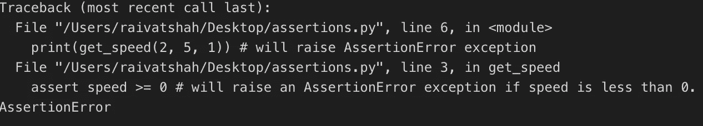

# Python 断言语句简介

> 原文：<https://betterprogramming.pub/an-intro-to-python-assert-statements-bdd45834d303>

## 为什么断言？


由 [Katerina Limpitsouni](https://twitter.com/ninalimpi) 创作

如果 Python 是一个故事，断言就是无名英雄之一。你可能没有听说过它们，也不知道它们能做什么。所以，让我们开始吧！

# **什么是断言？**

*断言*或*断言语句*内置于 Python 中，是调试的工具。顾名思义，assert 语句在检查程序员指定的条件时，试图断言它对其余代码的权限。

例如，您可以告诉 assert 语句检查变量`speed`的值是否大于或等于`0`(因为 velocity 可以是负的，而 speed 不是)。如果条件为真，assert 不做任何事情，程序正常运行。但是，如果条件失败，assert 语句断言它的权限并引发一个`AssertionError`，这将停止程序的执行。Python 中的代码大概是这样的:

使用 Python 断言的示例

如果引发了一个`AssertionError`(如第 7 行的`get_speed`函数的第二次调用)，很容易发现，这使得在大型代码库中进行调试很容易。错误消息可能是这样的:



*断言错误*

该错误消息的好处是，作为开发人员，您可以找到确切的行号，在本例中是在第 3 行，也就是编写 assert 语句的地方。因此，通过断言其权威性，assert 语句使开发人员的工作变得更加轻松。

# **为什么断言？**

为什么不用别的东西来代替，比如一个`if` … `else`语句，如下所示？

不使用断言的相同代码

首先，这段代码会占用更多的空间，不仅因为它将在一个`if`语句内分支，还因为它还必须在单独的一行上有一个`raise`异常。其次，作为一名程序员，它分散了你的注意力，使你无法完成主要的工作，也就是说，不是通过一种强力方法来防御所有可能的错误，而是专注于主要代码。引发异常允许更好的错误处理和更干净的代码。作为程序员，您有很多选择来处理引发的异常，使用`try`和`except`。更多关于他们的[这里](https://www.w3schools.com/python/python_try_except.asp)。

因此，断言被设计成程序的迷你自检，它们可以很好地集成，而不必跨越我们的多个`if` … `else`语句。

# **如何断言？**

现在你已经知道了断言以及为什么我们应该使用它们，我们可以看看如何使用它们以及应该在哪里使用它们。根据 [Python 文档](https://docs.python.org/3/reference/simple_stmts.html#grammar-token-assert-stmt)，assert 语句具有以下语法，这只是创建 assert 语句的模板:

`assert_smt ::= "assert" expression1 ["," expression2]`

这一开始可能看起来很复杂，但是使用起来非常简单。`expression1`是你要测试的条件。你希望你的程序正常运行。在我们的速度例子中，它是`speed >=0`。`[]`括号表示`expression2`是可选的。然而，我们可以用它来提供特定的错误消息。例如:

带有特定消息的断言

这样，如果出现断言错误，将向程序员显示`expression2` 中的特定消息。

# **哪里没有断言？**

断言看起来很酷，那么它们应该无处不在来检查错误吗？简单的回答是*没有*。

很容易陷入*真断言*的陷阱:其条件永远不会评估为`False`的断言。例如，当非空时，`tuple`语句将始终计算为`True`。即使您不打算提供一个`tuple`作为条件，它也可能会意外发生:

```
assert (    
       speed >= 0,    
       "Speed should be non-negative!"
)
```

乍一看，这个 assert 语句看起来完全没问题。然而，`()`使它成为一个 tuple 对象，如果它不为空，它将总是计算为`True`。

使用断言时也需要小心。可以通过尝试优化执行来禁用断言，在命令行中使用诸如`-O`和`-OO`这样的标志。这意味着即使条件为假，它们也不会起作用，也不会引发错误。

这就是对 assert 语句的介绍，我希望这篇文章能帮助你开始。如果您想深入了解 assert 语句，请查阅以下资源:

# 资源

以下是一些可供进一步阅读的资源:

[简单语句—Python 3.7.4 文档](https://docs.python.org/3/reference/simple_stmts.html#grammar-token-assert-stmt)

[Python 中的断言](https://www.tutorialspoint.com/python/assertions_in_python.htm)

[emre/notes](https://github.com/emre/notes/blob/master/python/when-to-use-assert.md)