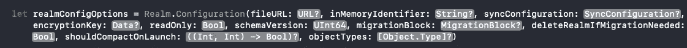
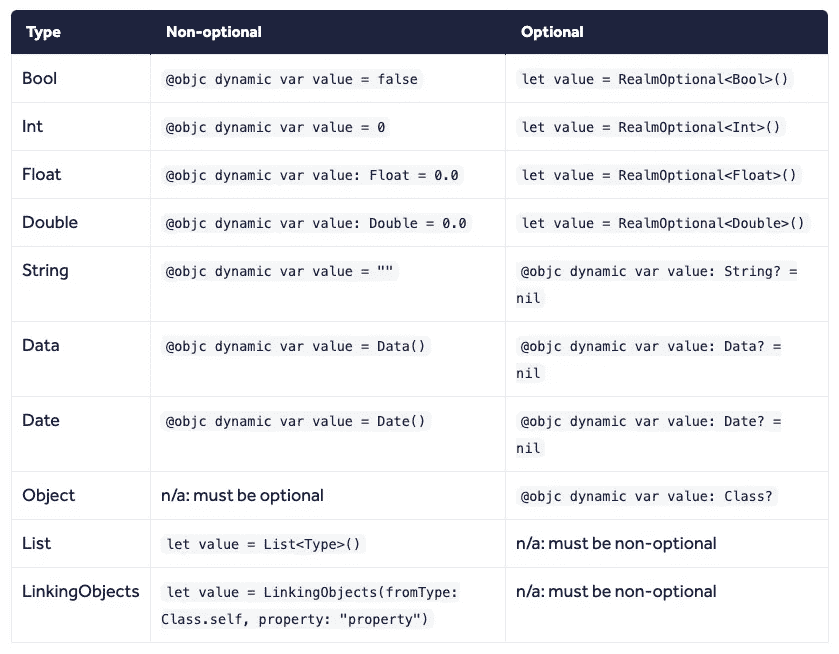

# iOS 领域介绍

> 原文：<https://betterprogramming.pub/an-intro-to-realm-for-ios-2633162952f1>

## 立即将非核心数据的数据库添加到您的应用中


[境界](https://realm.io/)标志

Realm mobile database 是一个用于移动和 web 开发的数据存储解决方案。在撰写本文时，Realm 为 Java、Kotlin、Swift、Obj-C、JavaScript 和. NET 提供了一个解决方案。正如文章标题所示，我们将重点关注 iOS——特别是 Swift。本文假设您对 Swift 和 iOS 开发有基本的了解。

在撰写本文时，您可以使用 Swift Package Manager (SPM)、CocoaPods 或 Carthage 将 Realm 添加到您的项目中。在本指南中，我将使用 SPM，因为这是最快捷、最简单的入门方式。如果你之前没有用过 SPM，可以从下面的 YouTube [视频](https://www.youtube.com/watch?v=ZxHndSGmWcE&t=324s)中学习如何使用。

为了遵循这个指南，我建议在这里下载完整的项目[，并让这篇文章与项目并排打开。](https://github.com/atticus183/IntroToRealm)

如果你在移动设备或 Windows PC 上，只需知道所有执行的动作都将在初始视图控制器的`viewDidLoad`中。您会注意到几个写事务在它们自己的私有方法中。这是为了保持`viewDidLoad`相对干净，并执行检查，以确保我们的测试数据不会在每次运行应用程序时重复。

一旦你下载了项目并打开它，点击`Cmd+B`来构建项目。这可能需要几分钟才能完成。

在本指南中，我们的数据模型将代表一家银行、其经理和客户。这样，我可以说明一对一和一对多的关系。

# 什么是境界？

Realm 是一个对象数据库，支持对象之间的关系。如果您来自 SQL 世界，Realm 对您来说会非常熟悉。在本指南的后面，我们将启动 Realm Studio，您将能够看到代表每个类的表和代表每个对象的行。

当您想要更新一个对象的值时，您可以在一个`write`事务中直接对对象本身进行更改。Realm mobile 数据库被认为是 SQLite 和核心数据的替代品。

简单地说，一个*领域*是存储和管理数据的地方。您可以在一个项目中使用多个领域，但是对于本文来说，让它保持基本。让我们开始吧。

# 下载 Realm Studio

首先推荐下载 [Realm Studio](https://realm.io/products/realm-studio) 并安装。这将允许您查看保存到本地领域的数据。

# 默认领域入门

创建一个默认的本地领域非常简单。打开您的项目，导航到`ViewController.swift`文件，导入`RealmSwift` *，*并将以下内容放在`ViewController`类中(最好在顶部):

现在在模拟器中运行您的项目(`Cmd + R`)。应用程序启动后，将创建默认领域。您只需要这一行代码就可以开始了。

**注意:**在本指南或您自己的开发过程中，您可能需要从模拟器中删除应用程序，以移除之前的领域并强制创建新的领域。当您删除领域模型所期望的持久化属性时，通常会发生这种情况。您可以在 Realm docs 中的处找到更多信息[。](https://realm.io/docs/swift/latest/#realms)

## 自定义领域配置

虽然您可以从上面的一行代码开始，但是您可以在`Realm.Configuration`结构上设置几个选项。由于本指南是对 Realm 的介绍，我们不会深入细节，但是下面的截图显示了几个不同的选项。



# 查看模型和数据库内容

将以下内容添加到`viewDidLoad`方法的末尾:

这将把位置打印到调试区域。复制外景链接(不含`file://` ) ，打开境界工作室。点击打开领域文件，点击`Cmd+Shift+G`，在对话框中粘贴链接。点击`default.realm`文件，然后点击打开。这个领域还没有任何数据，但我们很快就会知道。

# 关系

## 一对一

要创建一对一的关系，请将属性设置为您想要关联的 Realm 类。在我们的例子中，每个银行可以有一个分行经理。请确保此类型是可选的。下面的属性将是`Bank`类的一部分。

```
@objc dynamic var branchManager: BranchManager?
```

## 一对多

要创建一个*一对多*关系，请将该属性设置为`many`类的特定于领域的`List`类型。在我们的例子中，每家银行可以有许多客户。以下将是`Bank`类的一部分。

```
let customers = List<Customer>()
```

## 多对多

我们不会在我们的例子中涉及这个，但是知道它是可用的。以下是来自领域文档的内容:

> "您可以使用`List`属性创建与任意数量的对象或支持的原始值的关系"

在他们的[文档](https://realm.io/docs/swift/latest/#many-to-many)中找到更多关于 Realm 的*多对多*关系的信息。

## 相反的

要创建一个*反向*关系，请使用领域特定的`LinkObjects`结构。在我们的示例中，我们希望能够找到每个客户是哪家银行的成员。以下将是`Customer`类的一部分。确保`init`属性字符串匹配`Bank`类中的`many`属性。

```
let bank = LinkingObjects(fromType: Bank.self, property: "customers")
```

# 创建数据模型

类用于创建模型对象和`must`子类对象。模型类型不支持结构和枚举。创建一个类的属性必须是一个`var`并带有前缀`@objc dynamic`。属性必须给定一个初始值或者是可选的。

## 支持的类型

支持`Bool`、`Int`、`Int8`、`Int16`、`Int32`、`Int64`、`Double`、`Float`、`String`、`Date`、`Data`。所有这些属性都是可选的。Realm 的文档提供了一个极好的备忘单:



[领域文档](https://realm.io/docs/swift/latest/#models)

## 创建我们的模型

在本指南中，我们将创建一个代表银行的模型。我们的模型将由三个类组成:`Bank`、`branchManager`和`Customer.` 这些模型类将被添加到`Model.swift`文件中。

**银行**

这里有一个细目分类:

*   每个银行将有一个由`UUID().uuidString`生成的唯一 ID
*   每个`Bank`将有一个`branchManager`
*   每个`Bank`都会有很多顾客
*   银行可以是信用合作社、中央银行或零售银行。如代码中所述，Realm 将忽略嵌套的枚举。
*   领域将忽略`CLLocation`计算属性

**分公司经理**

这里有一个细目分类:

*   每个`BranchManager`将有一个唯一的 ID。把这个当做一个员工 ID。
*   这个类没有什么特别的

**客户**

这里有一个细目分类:

*   每个`Customer`将有一个唯一的账号
*   属性跟踪它们的起始余额和当前余额
*   持有他们成为银行成员的日期的财产
*   帮助提供全名的计算属性
*   与`Bank`成反比。稍后我将向您展示如何从这个逆属性中检索客户的银行。

## 主键

如果您熟悉关系数据库，您可能想知道 Realm 是否支持自动递增 id 或检索特定项的方法。它们不支持自动递增 id；但是，它们支持主键。请记住，一旦设置了主键，就不能更改。

# 创建模型对象

最后，让我们创建一个持久存储到数据库的对象。在本指南的这一部分，您应该已经创建了默认领域和三个模型类。

每当您想要创建一个新对象或更改一个现有对象时，您必须在一个 Realm `write`事务中。一个`write`事务看起来是这样的:

当然，在生产应用程序中，您应该将它包装在一个`do catch`块中，以捕捉任何潜在的错误。

## 创建两个客户和一个分行经理

让我们创建几个客户和一个分行经理。我们可以将这个`write`事务添加到`viewDidLoad`方法中:

构建并运行项目。您应该有三个对象持久存储到您的领域数据库中。我们将使用这些对象与`Bank`类相互关联。现在，每次运行项目时，这些对象都可以使用了。

## 创建银行

现在让我们创建`Bank`对象。我们可以将这个`write`事务添加到`viewDidLoad`方法中:

我们将在本指南的后面介绍如何添加客户和分行经理关系，因为这需要您知道如何从数据库中查询项目。

# 正在检索项目

从领域中检索对象的主要方法是使用`Results`类。这个类符合`RealmCollection`协议，所以你迭代每个条目，通过索引检索一个条目，等等。我们将在`viewDidLoad`中添加以下内容:

由于我们的数据集中只有一个分行经理和一家银行，我们可以安全地调用`.first!`来检索分行经理和银行。

# 修改对象

修改对象的属性非常简单。从领域中检索一个对象，并在一个`write`事务中直接修改属性。

在我们的例子中，假设分行经理结婚了，并将她的姓从`Scott`改为`Miller`。使用我们上面检索的`branchManager`对象，让我们更改她的姓氏。我们将以下内容添加到`viewDidLoad`中，就在我们检索银行、客户和分行经理的位置下方:

就是这样！这就是改变一个对象的值所要做的一切。

# 添加关系

这三个常量都是类型`Result`，如上所述，它们合在一起就是一个 Realm 集合。

让我们创建银行和分行经理之间的关系，然后创建银行和客户之间的关系。在`viewDidLoad`的结尾，我们将添加以下内容:

注意，上面的动作是在一个领域`write`事务中。我们在银行和分行经理之间设置了一对一的关系。然后，我们通过将每个客户附加到银行的 customer `List`类型来设置银行与其客户之间的一对多关系。如果您在 Realm Studio 中打开领域，您将能够看到已经建立的关系。

## 从反向关系中检索客户的银行

为了从`Customer`类中检索客户的银行，您在`bank`属性上调用`.first!`。将以下内容添加到您添加关系的部分下方的`viewDidLoad`:

由于银行与客户的关系是**一对多的，**我们可以放心地对逆属性`bank`调用`.first!`。

# 过滤结果

可以使用`.filter`高阶函数过滤领域集合。您可以使用美元语法或创建一个`NSPredicate`。来自 Core Data 的开发人员应该很高兴听到您可以使用`NSPredicate`来过滤领域集合。在`viewDidLoad`的末尾增加以下内容:

常量`jonCustomer`应该包括名字为`Jon`的所有客户。在我们的例子中，只有一个，所以我们可以使用`.first?`来检索`Jon Smith`客户对象。

## 断言

为了执行高级过滤，支持几个谓词:`IN`、`BETWEEN`、`AND`、`OR`、`NOT`、`BEGINSWITH`、`CONTAINS`、`ENDSWITH`、`LIKE`、`ANY`、`NONE`和`@count`。

# 在生产应用程序中使用领域

我在我的个人财务应用程序 [seventytwo](https://apps.apple.com/app/seventytwo/id1449439220) 中使用与 Realm Cloud 配对的 Realm 移动数据库。我没有注意到 Realm Cloud 有任何停机时间，它非常可靠。在设备之间同步数据所需的时间几乎是瞬间的。

# 结论

如果您正在寻找一个移动数据库解决方案，Realm 是一个很好的选择。更好的是，Realm 还有一个名为 Realm Cloud 的产品，它允许你将数据保存到多个设备上，并将用户的数据存储在云中。请注意，MongoDB 在 2019 年购买了 Realm。如果你有兴趣了解更多关于 Realm 的方向，请看这里的路线图。

你可以在 GitHub 上点击查看整个项目。

# 资源

[](https://realm.io/docs/swift/latest/) [## 领域:在短时间内创建反应式移动应用

### XCode 10.0 或更高版本目标 iOS 9 或更高版本、macOS 10.9 或更高版本，或者任何版本的 tvOS 或 watchOS，如果您…

realm.io](https://realm.io/docs/swift/latest/) [](https://github.com/realm/realm-cocoa/releases) [## 领域/领域-可可

### Realm 是一个移动数据库:核心数据的替代品& SQLite - realm/realm-cocoa

github.com](https://github.com/realm/realm-cocoa/releases)