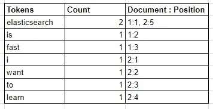
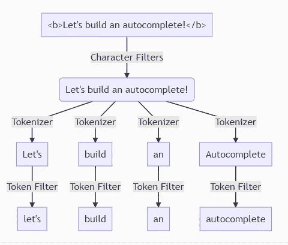

# 弹性研究中的分析器介绍

> 原文：<https://betterprogramming.pub/an-introduction-to-analyzers-in-elasticsearch-9596917693a2>

## 了解流程和组件

卢卡·布拉沃在 [Unsplash](https://unsplash.com?utm_source=medium&utm_medium=referral) 上的照片。

如果你想用 [Elasticsearch](https://www.elastic.co/elasticsearch/) 创建一个好的搜索引擎，了解分析器是必须的。好的搜索引擎是返回相关结果的搜索引擎。当用户在我们的搜索引擎中查询时，我们需要返回与该查询相关的文档。

我们可以调整的一个组件是分析器，以便 Elasticsearch 返回相关文档。分析器是一个组件，负责处理我们想要索引的文本，并控制查询时哪些文档更相关。

# 倒排索引

由于分析器与倒排索引紧密相关，我们需要首先理解什么是倒排索引。

倒排索引是一种数据结构，用于存储标记到具有该术语的文档标识符之间的映射。除了文档标识符，倒排索引还存储相对于文档的标记位置。由于 Elasticsearch 将令牌与文档标识符进行映射，因此当您向 Elasticsearch 进行查询时，它可以轻松获得您想要的文档并快速返回。

# 将文档编入倒排索引

假设我们想要索引两个文档:

*   文档 1:“弹性搜索很快”
*   文档二:“我想学 Elasticsearch”

让我们看一看倒排索引，看看分析和索引过程的结果:

如您所见，术语被计数并映射到文档标识符及其在文档中的位置。我们没有看到完整文档“Elasticsearch 很快”或“我想学习 Elasticsearch”的原因是因为它们经历了分析过程，这是我们在本文中的主要话题。

# 对倒排索引的质疑

关于对倒排索引的查询，有一点需要注意:Elasticsearch 将只获取与被查询的文档具有相同术语的文档。

我们可以通过使用两种类型的 Elasticsearch 查询轻松测试这一点:匹配查询和术语查询。基本上，匹配查询会经历一个分析过程，而术语查询不会。如果你对它们之间的区别感兴趣，你可以阅读[这篇文章](https://medium.com/better-programming/elasticsearch-text-vs-keyword-2ccb99ec72ae)。

如果您尝试对上面示例中的索引进行术语查询“Elasticsearch ”,将不会得到任何结果。发生这种情况是因为倒排索引中的标记是小写“e”的“elasticsearch”，当您使用匹配查询进行相同的尝试时，Elasticsearch 会在倒排索引中搜索之前将查询分析为“elasticsearch”。因此，查询将返回结果。

# Elasticsearch 中的 Analyzer 是什么？

当我们将文本文档插入到 Elasticsearch 中时，它不会按原样保存文本。文本将经过由分析器执行的分析过程。在分析过程中，分析器在将文本保存到倒排索引之前，首先将文本转换并拆分成标记。

例如，插入“让我们建立一个自动完成！”Elasticsearch 会将文本转换成四个词:“let's”、“build”、“an”和“autocomplete”。

分析器将影响我们如何搜索文本，但它不会影响文本本身的内容。对于前面的例子，如果我们搜索“let”，Elasticsearch 仍然会返回全文“让我们构建一个自动完成！”而不仅仅是“让”

# Elasticsearch 的分析 API

Elasticsearch 提供了一个非常方便的 API，我们可以用它来测试和可视化一个分析器:

这个 API 将极大地简化我们的分析器的调试过程。我们将在本文中大量使用它。

# 分析仪的组件

Elasticsearch 的 analyzer 有三个组件，您可以根据您的使用情况进行修改:

*   字符过滤器
*   标记器
*   令牌过滤器

## 字符过滤器

分析过程中发生的第一个过程是字符过滤，它删除、添加和替换文本中的字符。

Elasticsearch 中有三个内置的字符过滤器:

*   [HTML 剥离字符过滤器](https://www.elastic.co/guide/en/elasticsearch/reference/current/analysis-htmlstrip-charfilter.html):将剥离出`<b>`、`<i>`、`
`、` `等 HTML 标签和字符。
*   映射字符过滤器:这个过滤器可以让你将一个术语映射到另一个术语。例如，如果你想让用户搜索一个表情符号，你可以把“:)”映射到“微笑”。
*   [模式替换字符过滤器](https://www.elastic.co/guide/en/elasticsearch/reference/current/analysis-pattern-replace-charfilter.html):将一个正则表达式模式替换成另一个术语。不过，要小心。使用模式替换字符过滤器会降低文档索引过程的速度。

## 标记器

在字符过滤过程之后，我们的文本继续使用标记器进行标记化过程。标记化将文本拆分成标记。例如，我们之前将“让我们构建一个自动完成”转换为“让我们”、“构建”、“an”和“自动完成”。将文本分成四个标记的转换过程是由标记器完成的。

本文中涉及的标记化工具太多了。如果你感兴趣，你可以在 [Elasticsearch 文档](https://www.elastic.co/guide/en/elasticsearch/reference/current/analysis-tokenizers.html)中找到这个列表。

一些最常用的记号赋予器是:

*   标准记号赋予器:Elasticsearch 的默认记号赋予器。它将通过空格和标点符号分割文本。
*   空白记号赋予器:一个记号赋予器，它只通过空白分割文本。
*   Edge N-Gram tokenizer:对创建自动完成非常有用。它会根据空格和单词中的字符来拆分你的文本(例如，Hello -> "H "，" He "，" Hel "，" Hell "，" Hello。").

请注意，您需要小心使用记号赋予器，因为太多记号赋予器会降低插入过程的速度。

## 令牌过滤器

令牌过滤是分析中的第三个也是最后一个过程。该过程将根据我们使用的令牌过滤器来转换令牌。在令牌过滤过程中，我们可以小写，删除停用词，并为术语添加同义词。

Elasticsearch 中也有很多 token 过滤器。你可以在[的文档](https://www.elastic.co/guide/en/elasticsearch/reference/current/analysis-tokenfilters.html)中读到它们。

令牌过滤器最常见的用法是小写令牌过滤器，它将所有的令牌都小写。

# 标准分析仪

标准分析仪是 Elasticsearch 的默认分析仪。如果您没有在映射中指定任何分析器，那么您的字段将使用此分析器。它使用在 [Unicode 的标准附件#29](https://unicode.org/reports/tr29/) 中指定的基于语法的标记化，并且它在大多数语言中都能很好地工作。

标准分析仪使用:

*   标准记号赋予器
*   小写令牌过滤器
*   停止令牌过滤器(默认情况下禁用)

有了这些组件，它基本上可以做到以下几点:

*   通过空格和标点符号将文本标记为标记。
*   令牌小写。
*   如果您启用停止令牌过滤器，它将删除停止字。

让我们试着解释一下文档“让我们了解一下 Analyzer！”使用标准分析仪:

我们可以看到一个标准的分析器通过空格将文本分割成标记。它还删除了标点符号“！”因为后面没有令牌。我们可以看到所有的标记都是小写的，因为标准分析器使用小写的标记过滤器。

在我之前的文章中，我们只使用了标准的分析器并创建了一个简单的自动完成功能。通过使用包含我们选择的字符过滤器、记号赋予器和记号过滤器的自定义分析器，我们可以创建一个更高级的自动完成功能，从而产生更相关的结果。

# 定制分析器

自定义分析器是一种我们可以根据需要定义其名称和组件的分析器。

要创建自定义分析器，我们必须在 Elasticsearch 设置中定义它，这可以在创建索引时完成:

我们刚刚创建了一个定制的分析器，它有一个空白标记器、html_strip 字符过滤器和小写过滤器。但是，在我们在索引中使用分析器之前，有什么方法可以测试它吗？

让我们使用文本`<b>Let’s build an autocomplete!</b>`进行试验，并与标准分析仪进行比较:

我们可以看到它们之间的一些差异:

1.  标准分析器的结果有两个`b`标记，而 cust_analyzer 没有。这是因为 cust_analyzer 完全剥离了 HTML 标记。
2.  标准分析器通过空白或特殊字符如`<`、`>`和`!`来分割文本，而 cust_analyzer 只通过空白来分割文本。
3.  标准分析器去掉了特殊字符，而 cust_analyzer 没有。我们可以在`autocomplete!`令牌中看到不同之处。

所以一切都如我们所料。我们的分析仪按照我们的要求运行。我们的最后一步是通过映射将其应用于现场:

现在，我们将我们的`standard-text`字段映射为使用标准分析器，将`cust_analyzer-text`映射为使用 cust_analyzer。

让我们将文档`<b>Let’s build an autocomplete!</b>`编入索引并试用它！

让我们试着用`bool query`查询`b`，看看会发生什么:

唯一的结果是我们使用标准分析器索引的文档，因为我们没有在标准分析器中去掉带有`html_strip character filter`的 HTML 标记，而在 cust_analyzer 中却做了。

让我们再尝试一个查询，`autocomplete!`:

现在，唯一的结果是我们使用 cust_analyzer 索引的文档。因为标准分析器通过空格和标点符号将文档分割成标记，所以它删除了`!`字符。cust_analyzer 只按空白分割文档，所以没有删除`!`。

# 结论

如果你想创建一个好的搜索引擎，分析器是你需要学习的一个重要组件。理解它是控制当用户查询单词时向用户显示哪些文档的第一步。

创建一个好的搜索引擎的下一步是理解相关性分数计算、提升、查询和要使用的特性，这是我打算写的内容。敬请关注。

感谢阅读！