# 面向 JavaScript 开发人员的 Ant 表介绍

> 原文：<https://betterprogramming.pub/an-introduction-to-ant-tables-for-javascript-developers-c420754c9fe7>

## Ant 表提供了排序、过滤、分页、行选择、无限滚动以及更多特性


作者照片。

[表](https://en.wikipedia.org/wiki/Table_(information))，也称为数据网格，是行和列的数据排列，或者可能是更复杂的结构。它是用户界面的重要组成部分。然而，一个表格(具有排序、过滤、分页、行选择、无限滚动等功能。)不是通过许多应用程序框架本机提供的组件。

您要么构建自己的表，要么采用现有的表组件。桌子有两个最大的竞争者。一个是[蚂蚁设计](https://github.com/ant-design/ant-design)另一个是[反应表](https://github.com/tannerlinsley/react-table)。以下 npm 趋势显示了他们的每周下载量，非常接近:

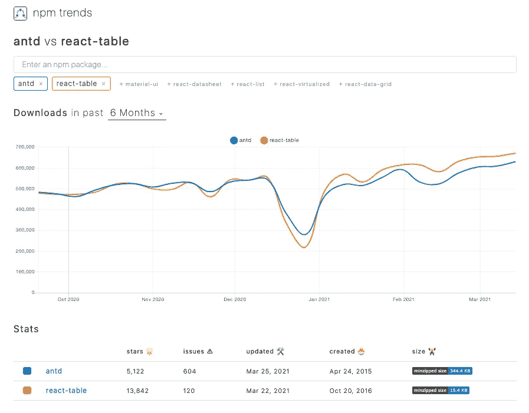

[Ant 设计系统](https://github.com/ant-design/ant-design)是企业级 UI 设计语言和 React UI 库的开源代码。Ant 表是 Ant 设计系统中的主要组件之一。我们[之前写过 React 表](/an-introduction-to-react-table-6ebd34d8059e)，现在我们将按照相同的清单来回顾 Ant 表。并排阅读 React Table 和 Ant Design 如何以不同的方式提供相同的表功能是很有趣的。

# 基本表格

如[了解 Ant 设计系统——企业 UI 设计](/understanding-the-ant-design-system-a-ui-design-for-enterprises-39afdb188b06)中所述，我们安装`npm i antd`到 [Create React App](/upgrade-create-react-app-based-projects-to-version-4-cra-4-d7962aee11a6) 并重写`src/App.js`以探索表格功能。

一个基本的蚂蚁表是`<Table dataSource={data} columns={columns} />`。

*   `dataSource`是要在表格上显示的行的数组。
*   `columns`是列的数组。

以下是复制到`src/dataSource.js`的`columns`和`data`的定义:

Ant 设计系统要求`columns`和`dataSource`中的每个条目都有一个`key`，这类似于 JSX 列表的要求:`Each child in a list should have a unique “key” prop`。

下面是改装过的`src/App.js`:

在第 6 行，基本表的分页被关闭，因为默认的 Ant 表是分页表。

下表显示在浏览器中:


# 具有成组页眉和页脚的表格

表头可以分组，表尾也可以分组。在`Table`名称空间下，`ColumnGroup` / `Column`用于分组页眉，`Summary`用于定义页脚:

下面是修改后的`src/App.js`:

*   在第 8 行，`data`来自`'./dataSource'`。
*   第 10-14 行定义了一个自定义页脚，它是一个带有计算总行数的单元格的行。
*   第 16-23 行将`firstName`和`lastName`列嵌套成一组`Name`。
*   第 24-55 行将其他三列嵌套到另一个组中，`Information`。
*   列`grade`的标题是根据行的值生成的(第 28-51 行)。

下表显示在浏览器中:

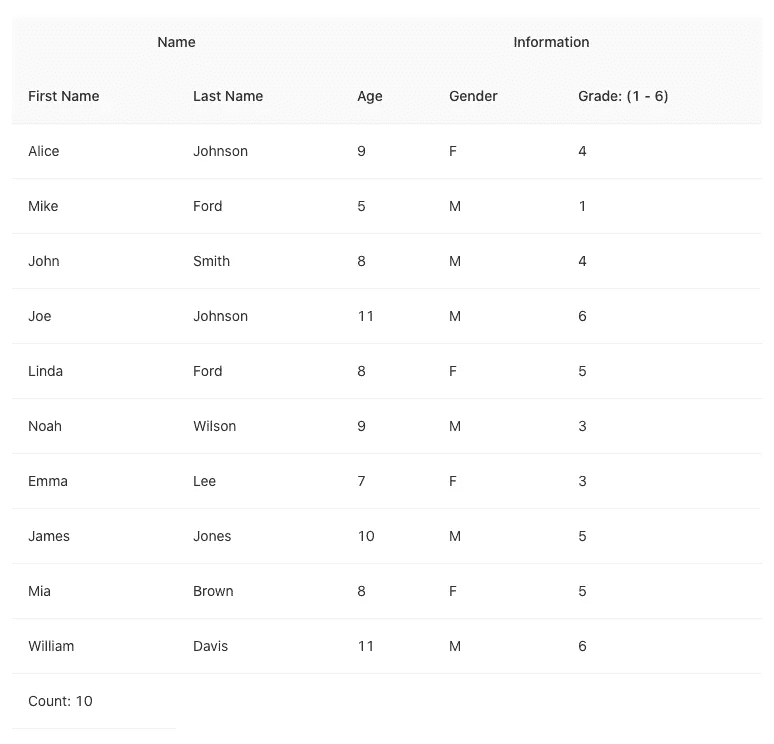

# 具有行排序的表格

行排序是基本的表功能。这通常是通过单击列标题对表格进行排序来实现的。Ant 表支持单列和多列行排序。

在`src/dataSource.js`中使用此`columns`:

*   第 6 行指定了`firstName`的分类器。
*   默认的`sortDirections`是`['ascend', 'descend']`。第一次单击列标题会按升序对行进行排序，第二次单击会按降序对行进行排序，第三次单击会取消排序。然后循环重复。
*   第 7 行将`sortDirections`设置为`['ascend', 'descend', 'ascend']`，跳过移除排序。第一次单击按升序排列行，第二次单击按降序排列行。然后循环重复。
*   第 13 行指定了`lastName`的分类器。
*   第 14 行指定初始排序方向为降序。如果`sortOrder`被设置为`['descend']`，则此降序不可更改。

下表显示在浏览器中。最初，它按降序对`lastName`进行排序:

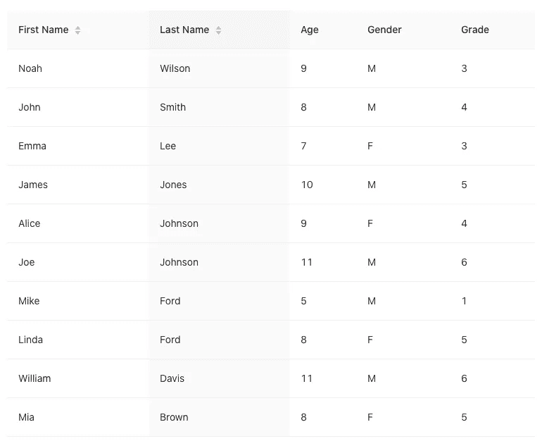

Ant 表也支持多重排序。

更改`src/dataSource.js`中的`columns`定义:

*   第 6-9 行指定了`firstName`的分类器。这是一个优先级为 *1* 的多重分拣机。
*   第 15-18 行指定了`lastName`的分类器。它是一个优先级为 *2* (高于优先级 *1* )的多重分拣机。

点击`firstName`和`lastName`的排序顺序后，浏览器显示下表:

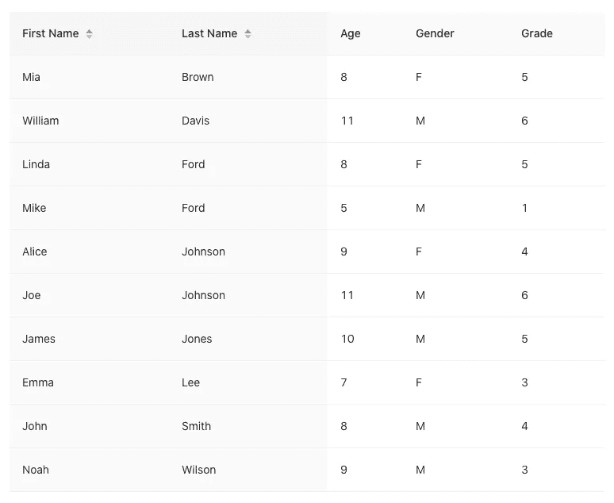

上表有多种排序，其中`lastName`是第一种排序，`firstName`是第二种排序。

如果我们将这两个`multiple`设置为相同的数字，那么这两列的排序优先级取决于哪一列先被点击。

# 带过滤器的桌子

行过滤也是基本的表功能。它根据单个列或多个列的筛选条件来筛选表行。

使用`src/dataSource.js`中的`columns`:

*   第 6 行将过滤值定义为`A`。
*   第 7 行过滤从指定过滤值(`A`)开始的`firstName`记录。

下表显示了保留的行，其中`firstName`从`A`开始。因此，当前计数为 *1* :

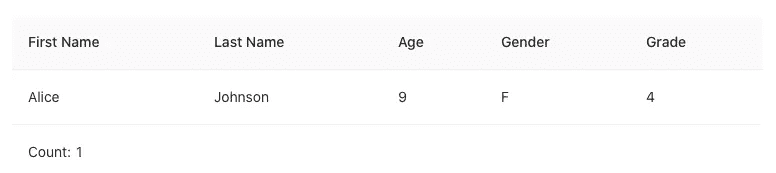

Ant 表对于每一列都有一个内置的过滤器 UI。在`src/dataSource.js`中使用此`columns`:

*   第 6-15 行定义了带有两个选项的列过滤器 UI:一个用于`Starting with A`，一个用于`Ending with a`。
*   `onFilter`调用(第 16-19 行)相应调整。

浏览器中的下表具有动态过滤预定义选项的功能:

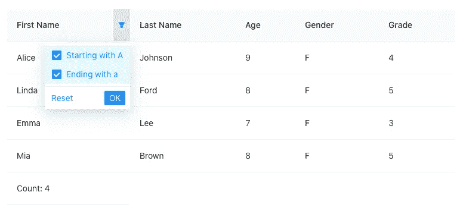

Ant 表不提供全局过滤，但是可以通过过滤数据来实现。

表排序器和过滤器在`ColumnType`中定义:

# 分页表

默认情况下，Ant 表是分页表。

在第 7 行，我们没有关闭分页。然后显示下表，在右下角显示分页信息:

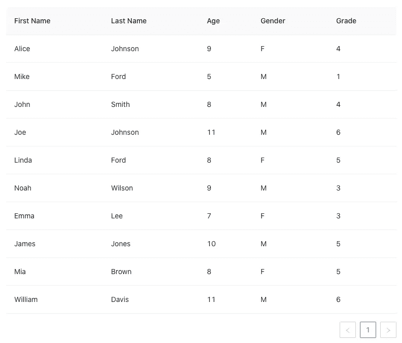

分页信息可以位于`'topLeft'`、`'topCenter'`、`'topRight'`、`'bottomLeft'`、`'bottomCenter'`和/或`'bottomRight'`。

以下设置设置左上角的分页信息:

```
<Table columns={columns} dataSource={data} pagination={{ position: ['topLeft'] }} />
```

空的分页位置隐藏了分页信息，但数据仍然是分页的(即，您只能看到第 1 页上的数据，而不能转到下一页)。

```
<Table dataSource={data} columns={columns} pagination={{ position: [] }} />
```

一页的默认大小是十行。如果最多有十行数据，下面的`hideOnSinglePage: true`值将隐藏分页信息。

```
<Table dataSource={data} columns={columns} pagination={{ hideOnSinglePage: true }} />
```

我们的数据源有十行。以下配置将使用页面大小更改程序生成两个页面:

```
<Table dataSource={data} columns={columns} pagination={{ pageSize: 5, showSizeChanger: true }} />
```

单击页面大小更改器时，页面在浏览器中的显示方式如下:

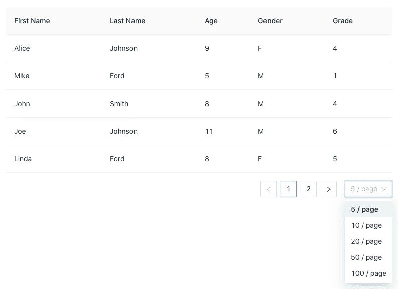

下面是`TablePaginationConfig`定义(第 33 行)。props(第 2-28 行和第 34 行)可用于配置表格的分页:

# 用服务器数据分页

对于我们展示的所有特性(排序、过滤和分页)，数据都是在一个静态文件中定义的。然而，实际数据通常是从服务器动态获取的。

将以下代码复制到`src/App.js`中:

*   第 6 行将常量`pageSize`设置为`3`。因此，十条记录生成四页。
*   第 12-16 行模拟从外部数据源获取数据。
*   第 27 行配置分页的`pageSize`和`total`。
*   第 28 行定义了`onChange`，这是对`pagination`、`filters`和/或`sorter`的变更的回调(第 18-20 行)。该信息通常用于从服务器获取数据。

下面是服务器抓取模拟的分页表:

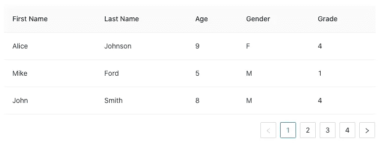

# 具有行选择的表格

行选择切换是否选择行。通常，空框表示未选择行，复选标记表示选择了行。该表通常在标题处有一个指示，表示是否所有行都被选中。如果是，标题会显示一个复选标记。如果未选择所有行，标题将显示一个空复选框。如果选择了一些行，则标题会显示一个表示不确定状态的破折号。Ant 表有内置的复选框，用于表示未选中、选中和不确定。

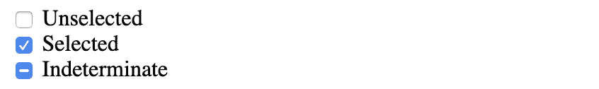

将以下代码复制到`src/App.js`:

*   第 7 行指定了预先选择的行。
*   第 8-11 行定义了一个处理行选择的行选择对象。
*   定义的`rowSelection`在第 14 行被消耗。

下表列出了初始行选择:

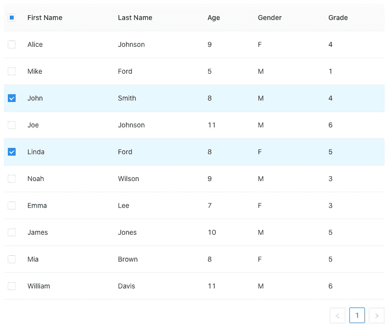

事实上，行选择可以设置为单选按钮，而不是复选框:

然后，只能选择一行:


以下是`TableRowSelection`的定义。除了我们示例中使用的`type`、`selectedRowKeys`和`onChange`之外，还有许多其他的道具和回调可用于行选择:

# 无限滚动的表格

无限滚动显示滚动条，而不是分页表。用户可以向下滚动，直到到达末尾。与 React Table 类似，Ant 表格的无限滚动利用了`[react-window](https://github.com/bvaughn/react-window)`的力量。这个包需要安装:`install i react-window`。

将下面的代码复制到`src/App.js`中:

*   第 9-93 行定义了`VirtualTable`组件。它使用`ResizeObserver`(第 78 行)来控制表格宽度。表格的`components`(第 87-89 行)由`renderVitualList`函数(第 43-75 行)呈现。
*   每一列都分配有`width`道具(第 13-16 行)。为了简单起见，我们将列宽设置为相等。
*   第 48-67 行使用`react-window`中的`VariableSizeGrid`来呈现每个单元格的适当宽度和高度。
*   第 68-72 行使用[渲染道具](/headless-ui-components-a-journey-with-high-order-components-render-props-and-custom-hooks-811c9677b4cf)来渲染每个单元格。在我们的示例中，第 70 行检索一个静态单元格值。但是可以为服务器数据动态加载一系列可查看的行。
*   第 97-104 行使用`VirtualTable`组件。`scroll`属性(第 100-102 行)以像素为单位指定表格高度。
*   第 67 行为每个单元格设置了`virtual-table-cell`类，这在`src/App.css`中定义。

虽然只有十行，但是一个`200px`高度的表格可以上下滚动:

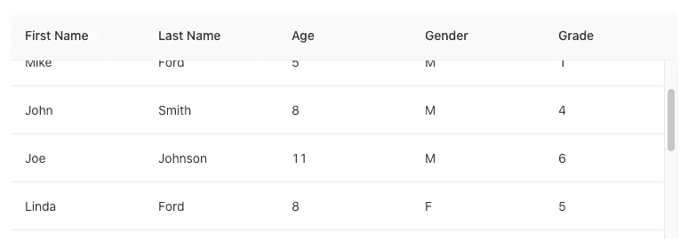

我们已经展示了分页、行选择、无限滚动的例子。`TableProps`中还有其他选择:

例如，我们可以将`Table`设置为`bordered`(第 58 行):

```
<Table dataSource={data} columns={columns} bordered />
```

然后显示一个带边框的表格:

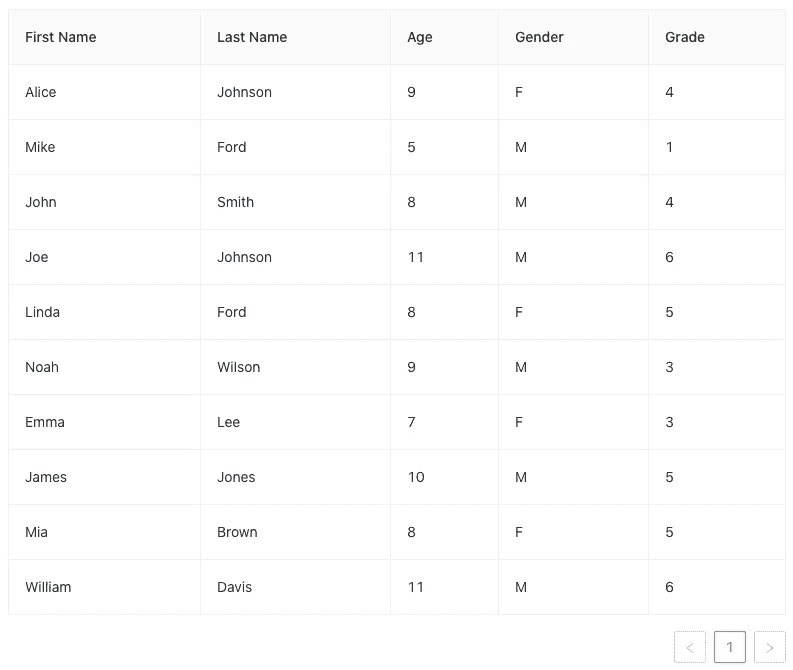

将`Table`设置为固定高度(第 63 行的`scroll`):

```
<Table columns={columns} dataSource={data} scroll={{ y: 200 }} />
```

那么表头就固定了:

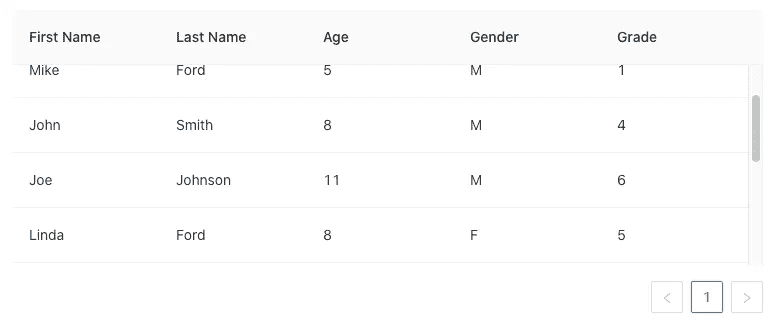

试试吧！

# Ant 与 React 表

我们已经深入研究了 Ant 表。您可能想知道是否为您的项目选择这些或反应表。

看情况。

Ant 表格提供了表格组件以及 UI 显示。它们在您的应用程序中实现起来简单快捷。然而，他们在展示上固执己见，这可能需要额外的努力才能符合你的特定外观和感觉。

React Table 是一个[无头库](/headless-ui-components-a-journey-with-high-order-components-render-props-and-custom-hooks-811c9677b4cf)，它将组件的逻辑和行为从其可视化表示中分离出来。没有 UI。因此，您全权负责并完全控制自定义外观和感觉。

此外，Ant 表是 Ant 设计系统的一部分，该系统有许多可以立即采用的预构建组件。React Table 只是关于可以插入到您的实现中的表。

那么，Ant 表还是 React 表呢？

# 结论

Ant 表提供了排序、过滤、分页、行选择、无限滚动以及更多特性。您可以使用 Ant 表以及 Ant 设计系统中的其他组件来构建企业级产品。

感谢阅读。我希望这有所帮助。你可以在这里看到我的其他媒体出版物。