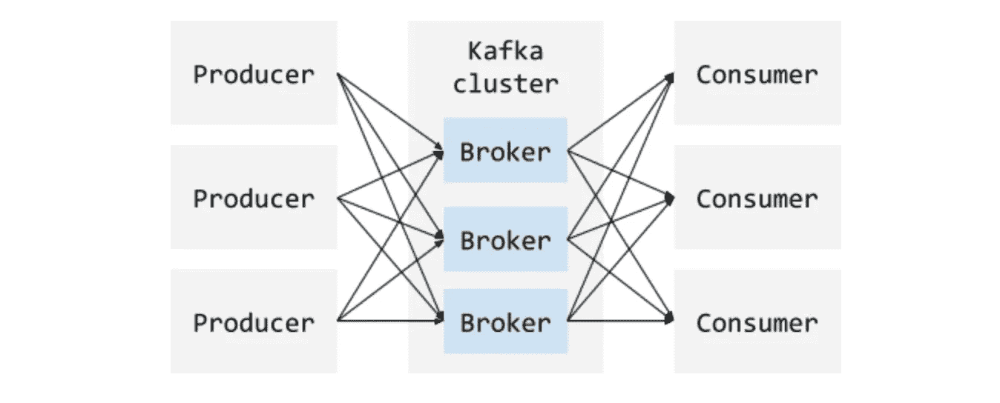
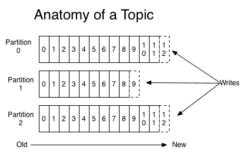

# 阿帕奇·卡夫卡简介

> 原文：<https://betterprogramming.pub/an-introduction-to-apache-kafka-95a82260c1c3>

## 卡夫卡的基本成分和如何写一个基本的生产者和消费者

照片由 [Unsplash](https://unsplash.com/@codestorm) 的 [Safar Safrov](https://unsplash.com/@codestorm) 拍摄

Kafka 是 LinkedIn 在 2010 年开发的，从 2012 年开始就是 Apache 的顶级项目。它是一个高度可伸缩、持久、健壮和容错的发布-订阅事件流平台。

在之前的一个项目中，我作为软件开发人员与 Kafka 一起工作了一段时间。我想分享一些我第一次与卡夫卡生产者和消费者合作时发现有用的事情。也就是说，这篇文章是对卡夫卡的介绍——卡夫卡的基本组成部分，如何写一个生产者和消费者，以及它有什么语言支持。事不宜迟，我们先深入卡夫卡的主干，讨论一些卡夫卡的基础知识。

让我们探索一下卡夫卡的一些常见用例:

*   *应用程序活动跟踪的实时处理*，如搜索。
*   *流处理*
*   *日志聚合*，Kafka 整合来自多个服务(生产者)的日志，并为消费者标准化格式。
*   一个有趣的用例是*微服务*架构。Kafka 可能是[事件源](https://martinfowler.com/eaaDev/EventSourcing.html)微服务的合适选择，在这些微服务中会生成许多事件，我们希望跟踪事件的顺序(即发生了什么)。

关于卡夫卡的使用有很多案例研究，比如《纽约时报》和《网飞》。

# 基本组件

让我们谈一谈 Kafka 用于其发布-订阅消息传递系统的基本组件。**生产者**是向 Kafka 集群发布数据的实体/应用，Kafka 集群由**代理**组成。当生产者发布时，代理负责接收和存储数据。**消费者**然后在指定的偏移量(即位置)消费来自代理的数据。

也就是说，它是一个多生产者、多消费者的结构，看起来像这样:

说明生产者、卡夫卡集群和消费者之间的关系

卡夫卡的基本数据单位是什么样的？这通常被称为**消息**或记录(可互换)。消息包含数据和元数据。元数据包含诸如偏移量、时间戳、压缩类型等信息。

这些信息被组织成被称为**主题**的逻辑分组或类别，生产者向其发布数据。通常，一个主题中的消息分布在不同代理的不同分区中。一个代理管理许多分区。

一个制作者可以发布多个主题。您可以定义您的主题以及制作者发布的主题。同样，消费者也可以选择他们想订阅的主题。在某些方面，这类似于读取和写入数据库表。

然后一个主题被分成**分区**，每个分区包含一个主题信息的子集。一个代理可以有多个分区。为什么一个主题有多个分区？主要是为了增加产量；可以并行访问该主题。

此外，Kafka 代理还通过复制为我们提供了可靠性和数据保护。如果代理失败，那么分配给该代理的所有分区都将不可用。

为了解决这个问题，有了副本的概念，即每个分区的副本。您可以指定一个分区拥有的副本数量。在给定的时间点，所有副本都与原始分区(即“主分区”)相同，除非它没有跟上主分区中的最新数据。

对一个题目的剖析；主题中分区和偏移量是如何工作的(来源:[http://kafka.apache.org/documentation.html#introduction](http://kafka.apache.org/documentation.html#introduction)

卡夫卡的独特之处在于，它将所有的信息保留一段固定的时间(这可以是无限期的)。在此消息日志中，每条消息都有一个偏移量或位置。卡夫卡不再管理消费者要传达什么信息，而是将这一责任完全委托给消费者自己。通过这样做，Kafka 能够支持更多的消费者。

有大量的文章深入研究了 Kafka 和其他形式的消息传递系统之间的差异。这里看更多[这里](https://dzone.com/articles/understanding-when-to-use-rabbitmq-or-apache-kafka)[看更多](https://hackernoon.com/introduction-to-message-brokers-part-1-apache-kafka-vs-rabbitmq-8fd67bf68566)。事实上，当谈到卡夫卡在设计和建筑中的小微妙之处时，这只是冰山一角。你可以在 Kafka 官方文档中找到更多信息。

# 写作生产者和消费者

可以说，大多数软件开发人员/工程师不需要完全了解卡夫卡是如何工作的。但是你绝对需要知道如何编写一个发布数据的公共生成器。知道如何编写一个消费 Kafka 主题中的数据的消费者也是很好的。

首先，让我们安装卡夫卡。对于 Mac 用户，您可以通过运行 brew 在本地开始使用 Kafka。这将同时安装 [Zookeeper](https://zookeeper.apache.org/) (一种用于实现高度协调的分布式系统的服务)和 Kafka。

`brew install kafka`

对于其他人，你也可以按照官方[网站](https://kafka.apache.org/quickstart)安装 Kafka。

那么，让我们开始动物园管理员。

`zookeeper-server-start /usr/local/etc/kafka/zookeeper.properties`

接下来，我们将启动我们的 Kafka 服务器。

`kafka-server-start /usr/local/etc/kafka/server.properties`

我们现在将为我们的生产者创建一个发布主题。

`kafka-topics --create --zookeeper localhost:2181 --replication-factor 1 --partitions 1 --topic test-topic`

这创建了一个名为 testTopic 的主题，它有一个分区和一个复制因子。

我们现在准备利用提供的 Kafka 类`KafkaProducer`编写一个基本的生产者，它将发布到 testTopic。

一个用 Java 编写的示例生成器，它向测试主题发布五条记录

这里有一些重要的配置:

*   **引导服务器配置:**这是用于建立集群连接的代理主机/端口对列表。
*   **密钥序列化器:**实现序列化器接口的类，用于序列化密钥。
*   **值序列化器:**除了序列化值之外，与键序列化器相同。

我们可以通过运行消费者来测试我们已经发布了数据。这里，我们在命令行上创建一个消费者，并从头开始阅读主题 test-topic。

`kafka-console-consumer --bootstrap-server localhost:9092 --from-beginning --test-topic`

您可以使用偏移量来消耗分区中的最后 N 条消息，如下所示:

`kafka-console-consumer --bootstrap-server localhost:9092 --offset 3 --partition 0 --test-topic`

现在转向消费者，我们做一件非常相似的事情，使用类`KafkaConsumer`。

同样，这里需要注意一些重要的配置:

*   **群组 id:** 您可以使用此 id 将消费者分组。如果您有多个消费者，请注意这一点，因为一个主题中的消息只由一个组中的一个消费者使用。
*   **引导服务器配置:**与上面类似，这是我们连接到集群的方式。
*   **键和值反序列化器:**这是用来反序列化键和值的类。
*   **启用自动提交:**如果您将此设置为 true，那么使用者将自动提交它从轮询中知道的最大偏移量。自动提交的默认时间间隔是五秒。

当生产者发布数据时，我们可以测试我们的消费者是否得到了数据。

运行以下命令来启动一个生成器。然后，您可以输入一些数据并按 enter 键。

`kafka-console-producer --broker-list localhost:9092 --topic test-topic`

您应该看到您的消费者打印出记录细节。随着您输入和发布更多的数据，您应该会看到您的消费者也打印出消息的细节，以及偏移量。

# 语言和框架支持

Kafka APIs 只支持 Java 和 Scala，但是有很多[开源](https://cwiki.apache.org/confluence/display/KAFKA/Clients)(和企业解决方案)覆盖其他语言，比如 C/C++、Python、。NET，Go，NodeJS 等等。

对于框架，我个人主要使用 SpringBoot，那里也有官方的 Spring 支持。

…本介绍到此结束！我很想听听你和卡夫卡一起工作的经历是怎样的，以及是为了什么样的用例。