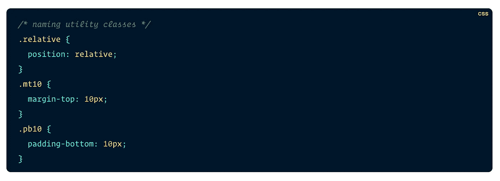
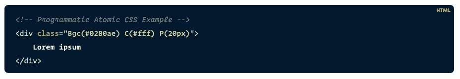
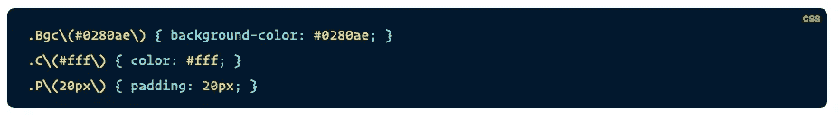
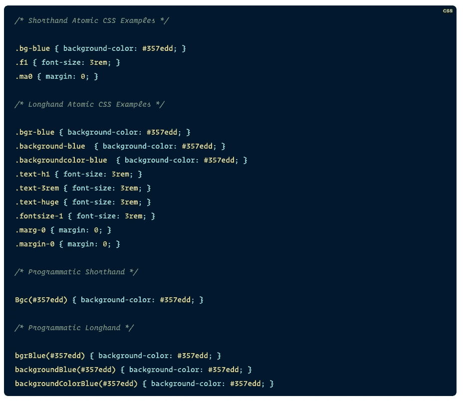
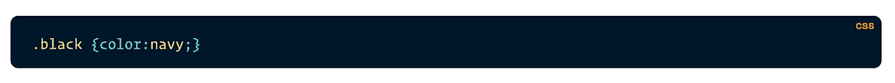
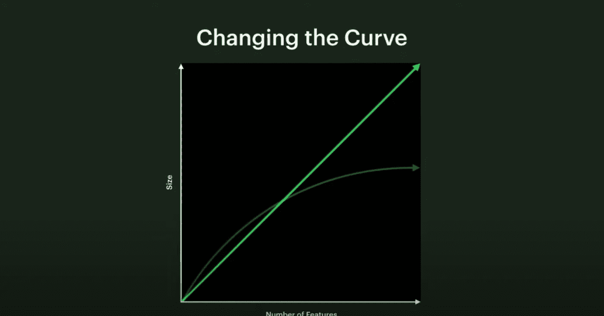
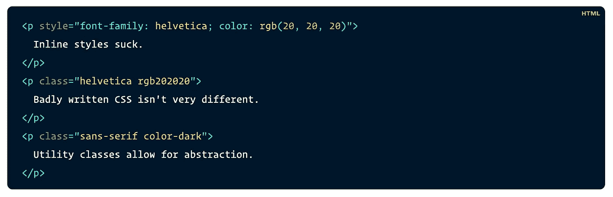
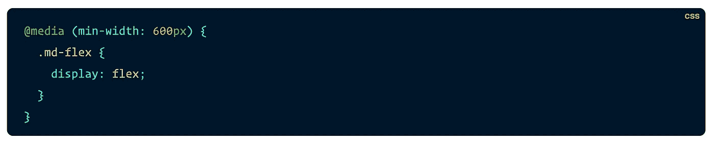

# 原子 CSS 简介

> 原文：<https://betterprogramming.pub/an-introduction-to-atomic-css-880cb02ad57f>

## 让我们探索原子 CSS，以及如何将它应用到您的项目中

由[Zoltan·塔斯](https://unsplash.com/@zoltantasi?utm_source=unsplash&utm_medium=referral&utm_content=creditCopyText)在 [Unsplash](https://unsplash.com/s/photos/atom?utm_source=unsplash&utm_medium=referral&utm_content=creditCopyText) 上拍摄的照片

在过去的几年中，原子 CSS，也称为功能 CSS，已经变得流行起来，但它的概念并不是每个人都清楚。我们来试着解释一下。

Atomic 指的是原子，可能最小的东西。原子 CSS 的定义是:

> 原子 CSS 是一种 CSS 架构方法，它支持小型、单一用途的类，这些类的名称基于视觉功能。

# 在实践中应用原子 CSS

原子 CSS 真的很好用。

基本上，它是关于定义内部只有一个属性的类，如下所示:

原子 CSS 的一个例子

您可以看到根据它包含的属性来命名这些类名是多么容易。

# 生成原子 CSS

有许多工具可以根据 HTML 文件中定义的类名自动生成 CSS 样式。例如，如果您键入以下内容:

下面的 CSS 是自动生成的:

由构建工具生成的 CSS。

# 适合所有人的风格

和所有事情一样，每个人的风格代码都不一样。一些人喜欢简写风格，而另一些人喜欢更易读的手写风格的类名。

使用速记和手写风格的原子 CSS。

# 不可变 CSS

使用原子 CSS 的一个重要规则是永远不要修改类名的属性值。否则，您可能会得到这样的 CSS:

糟糕的原子 CSS 的一个例子

如果你需要一个新的样式，你必须为它创建 CSS 并改变`html`部分的类名。

# 可量测性

你可能首先认为使用原子 CSS 会比传统方式编写更多的 CSS。这是真的——但只是在开始。

是的，您必须为您使用的每种颜色、每种边距、填充、高度等等创建大量的类名。但是这样你就不用再加很多了。你添加的每个特性并不会产生很多 CSS，因为你已经写好了所有的类名。

生成的 CSS 的大小将遵循如下算法曲线:

在闪烁的绿色中，CSS 的大小以“经典”的方式显示。在深绿色中，CSS 的大小与原子 CSS 一致。图片来自 Sebastien Lorber 的 js 中的[原子 CSS](https://sebastienlorber.com/atomic-css-in-js)

脸书发布了一个新版本(你可以在这里看到专门的文章)，其中他们使用了原子 CSS。他们将主页上的 CSS 减少了 80%,同时它现在支持黑暗模式和动态字体大小以方便访问。

# 原子 CSS 有什么帮助？

让我们总结一下原子 CSS 是如何有帮助的。

原子 CSS 为如何组织你的 CSS 提供了一个明显而简单的方法。类是不可变的，这意味着您的 CSS 是可预测的——您可以根据需要添加或删除 CSS，而不用担心会破坏任何东西。

最重要的是，您的类的名称现在是有意义的——您不需要执行任何心理练习来找到它们。您可以阅读您的`html`文件，而不必查看您的`css`文件来理解所使用的样式。

不再有未使用的 CSS，不再有用`important!`覆盖一个有优先级的属性的 CSS，最终，你得到的 CSS 比传统方式少。

# 原子 CSS 和内联样式有什么不同？

内联样式很长时间以来都是不好的做法，原子 CSS 看起来也差不多。

事实上，原子 CSS 和内联样式确实有一个共同的主要痛点。例如，如果您想将基础颜色从绿色更改为橙色，您不能只编辑您的 CSS 文件。你必须改变所有 HTML 文件中的每一个类。

值得注意的是，由于我们方便的 ide，做出这些改变不再那么痛苦了。而且，尽管有这个痛点，原子 CSS 提供了比内联风格好得多的东西…

# 原子 CSS 允许抽象

原子 CSS 允许抽象做出小的改变，而使用内联风格是不可能的。

一个使用内嵌样式和原子 CSS 的 HTML 示例

第一个例子是使用内联样式，第二个是坏的原子 CSS，第三个是好的原子 CSS。

在这种情况下，如果我们想在整个应用程序中改变深色的值，我们可以只改变包含在类名`color-dark`中的 CSS。

# 短暂

使用内联风格会产生很长的代码行，而原子 CSS 可以根据你的代码风格使用缩写。

# CSS 功能

原子 CSS 使用纯 CSS，这意味着它可以使用为 CSS 设计的所有功能，如媒体查询、伪选择器、CSS 动画等。

想要一个取决于屏幕大小的类名吗？只需添加一个前缀:

带有媒体查询的原子 CSS 示例

# 何时使用原子 CSS

这个问题适用于它能适用的每一个概念和方法论。一切都取决于你的项目需求。好消息是原子 CSS 不是一个“全有或全无”的特性。您可以决定仅在项目的某些部分应用它。

如果一些媒体查询中有很多样式，那么使用原子 CSS 可能会很困难。决定总是取决于你的情况。

我想引用菲尔·卡尔顿的一句话来结束我的演讲:

> 计算机科学中只有两个难题:缓存失效和命名事物

这么说吧，原子 CSS 解决了计算机科学中两大难题之一。

# 参考

本文主要受以下两篇文章的启发:

 [## 让我们确切地定义什么是原子 CSS

### 随着原子 CSS(也称为函数式 CSS)越来越受欢迎，关于类似的…

css-tricks.com](https://css-tricks.com/lets-define-exactly-atomic-css/) 

*   [https://css-tricks.com/growing-popularity-atomic-css/](https://css-tricks.com/growing-popularity-atomic-css/)