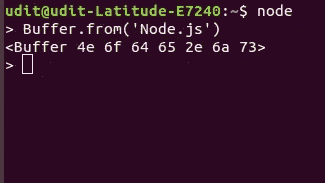
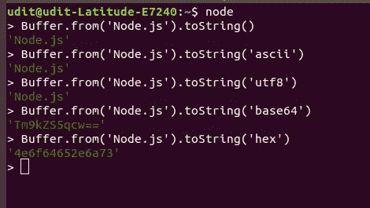
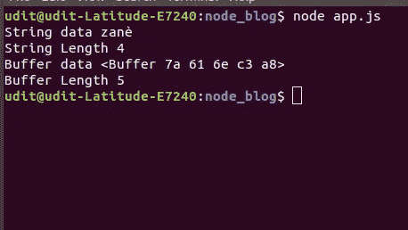
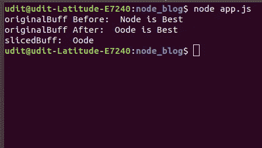

# Node.js 中缓冲区的介绍

> 原文：<https://betterprogramming.pub/an-introduction-to-buffer-in-node-js-2237a9bce9da>

马库斯·斯皮斯克在 [Unsplash](https://unsplash.com?utm_source=medium&utm_medium=referral) 上拍摄的照片

# 介绍

Buffer 是 Node 全局对象上的一个对象属性，在 Node 中大量使用它来处理二进制数据流。因为它是全球可用的，所以没有必要在我们的代码中要求它。

缓冲区实际上是分配在 V8 堆之外的一块内存。V8 是默认的 JavaScript 引擎，支持 Node 和 Google Chrome。在 Node 中，缓冲区是使用 JavaScript typedArray ( `[Uint8Array](https://developer.mozilla.org/en-US/docs/Web/JavaScript/Reference/Global_Objects/Uint8Array)`)实现的，但这并不意味着分配给缓冲区的内存在 V8 堆内部。它仍然被显式地分配在 V8 堆之外。

因此，我们可以将缓冲区视为某种数组，它是一种低级数据结构，用来表示二进制数据序列，但有一个主要区别:与数组不同，缓冲区一旦被分配，就不能调整大小。

# 缓冲和字符编码

每当数据存储在缓冲区实例中或从缓冲区实例中提取时，它都只是二进制数据。

不指定编码的缓冲区

当我们从一个`Node.js`字符串创建一个缓冲区时(我们将马上讨论创建缓冲区)，你可以看到我们得到了一些十六进制序列预览。这是因为我们没有指定任何字符编码。

因此，只要有缓冲区，就必须有某种字符编码来正确地读回数据(也就是说，每当我们从文件或某个套接字读取一些内容时，我们都将其作为缓冲区读取，因此，如果我们不指定字符编码，我们将得到一个缓冲区对象)。

具有不同字符编码的缓冲器

您可以看到，当不同的字符编码应用于缓冲区时，我们会得到不同的结果。这就是字符编码如何改变我们看待数据的方式。如果没有参数给`toString()`方法，默认情况下它采用`‘utf8’`编码。

`Node.js`中支持的不同类型的字符编码有:

*   `'ascii'` —仅用于 7 位 ASCII 数据
*   `'utf8'` —多字节编码的 Unicode 字符。许多网页和其他文档格式使用 UTF-8。
*   `'utf16le'` — 2 或 4 个字节，小端编码的 Unicode 字符
*   `'ucs2'`—`'utf16le'`的别名
*   `'base64'` — Base64 编码
*   `'latin1'` —将`Buffer`编码成一个字节编码字符串的一种方式
*   `'binary'`—`'latin1'`的别名
*   `'hex'` —将每个字节编码为两个十六进制字符

# 创建缓冲区

创建缓冲区有三种最常用的方法:

1.  `Buffer.from()`
2.  `Buffer.alloc()`
3.  `Buffer.allocUnsafe()`

## Buffer.from()

`Buffer.from`用于从数组、字符串或缓冲区本身创建缓冲区。

`Buffer.from(‘Node.js’)`输出`<Buffer 4e 6f 64 65 2e 6a 73>`

## Buffer.alloc()

`Buffer.alloc`接受一个大小(整数)作为参数，返回一个新的指定大小的初始化缓冲区(即创建一个特定大小的填充缓冲区)。

`Buffer.alloc(8)`输出`<Buffer 00 00 00 00 00 00 00 00>`

这里我们有一个 8 字节的缓冲区，每一位都预先填充了 0。

## Buffer.allocUnsafe()

`Buffer.allocUnsafe`接受 size 作为参数，返回一个未初始化的新缓冲区。这意味着它可能包含一些旧的或敏感的数据。所以必须小心使用。由于创建缓冲区时不涉及初始化，该方法比`Buffer.alloc()`更快。

`Buffer.allocUnsafe(8)`可能输出`<Buffer d0 ce ed 02 00 00 00 00>`

我们可以看到，有一些信息留在我们的缓冲区，这些信息直接来自我们的记忆。为了保护我们的敏感信息，我们需要预填充这个缓冲区，我们通过使用`**fill()**` 方法来完成。

`Buffer.allocUnsafe(8).fill()`输出`<Buffer 00 00 00 00 00 00 00 00>`

# 字符串/数组和缓冲区的区别

我们在字符串和缓冲区上都有一个`length` 属性，它在两者中的行为是相同的。

上面代码的输出

现在，正如你所看到的，尽管`*lengt*h`属性对于 String 和 buffer 的行为是一样的，但是我们得到了不同的答案。这是因为字符串基于 UTF-8 编码计算字符数，而缓冲区计算用于表示给定字符串的实际字节数。

就像数组和字符串一样，对于 buffer，我们可以使用类似于`slice`、`indexOf`等多种操作。但是当我们在缓冲区上使用这些方法时，会有一些不同。

假设我们想对数组`arr.slice([begin[, end]])***.***` *S* 应用一个`slice`操作，数组上的切片给我们一个新数组，从原始数组的开始索引到结束索引都有切片元素。在`slice`之后，两个数组将有不同的引用(也就是说，它们不共享内存，所以无论我们在其中一个数组中做什么都不会影响另一个)。

但缓冲器的情况并非如此。当我们在一个缓冲区上应用`slice`操作时，例如`buf.slice([start[, end]])` ***，*** ，它也返回一个新的缓冲区，但是新的缓冲区引用与原始缓冲区相同的内存(只是通过`start`和`end`索引进行了偏移和裁剪)。这意味着我们在任一缓冲区中所做的任何改变都会反映到另一个缓冲区中。

上述代码的输出

# 结束了

当我们需要从 TCP 流中读取图像、压缩文件或任何其他形式的二进制数据时，缓冲区非常有用。Node 中的流大量使用缓冲区，因此对它们有一个基本的了解是有好处的。

# 参考

 [## Node.js v12.8.1 文档

### 在引入 TypedArray 之前，JavaScript 语言没有读取或操作流的机制…

nodejs.org](https://nodejs.org/dist/latest-v12.x/docs/api/buffer.html)