# 缓冲区溢出漏洞简介

> 原文：<https://betterprogramming.pub/an-introduction-to-buffer-overflow-vulnerability-760f23c21ebb>

## 记忆开发的艺术


*来源:*[*https://reto Hercules . com/images 600 _/buffer-overflow-png-7 . png*](https://retohercules.com/images600_/buffer-overflow-png-7.png)

# 缓冲器

缓冲区是一种临时存储，通常存在于用于保存数据的物理内存中。

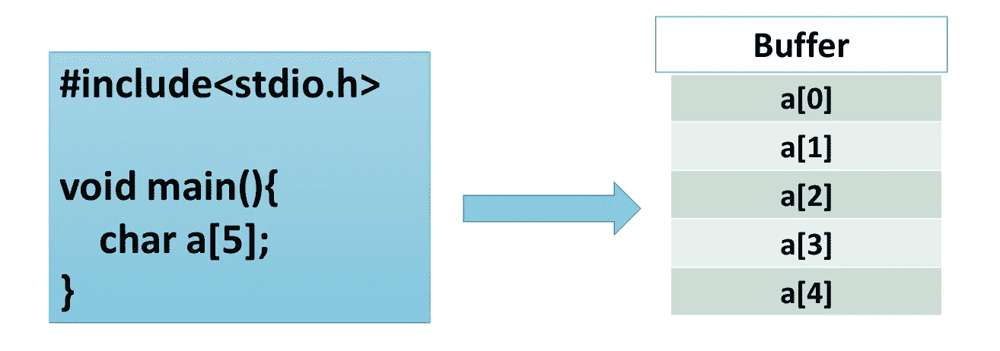

考虑左图所示的程序，其中定义了长度为 5 的字符缓冲区。在一个大的内存集群中，一个 5 字节的小内存将被分配给缓冲区，如右图所示。

# 缓冲区溢出

当更多的数据被写入特定长度的内存，导致相邻的内存地址被覆盖时，就会发生缓冲区溢出。

## 演示(控制局部变量)

让我们以一个基本认证应用程序为例，它要求输入密码，如果密码正确，则返回`Authenticated!`。

在不真正了解应用程序如何工作的情况下，让我们输入一个随机密码。

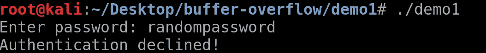

它显示`Authentication Declined!`，因为密码不正确。为了测试，我们需要输入大量随机数据。

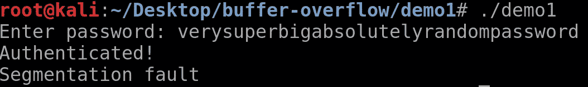

你一定想知道为什么它得到了认证，为什么有一个`Segmentation fault`。让我们看看更详细的应用程序版本。

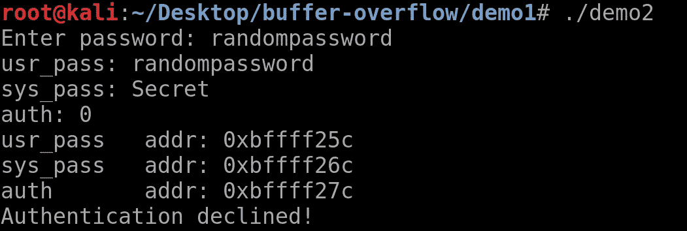

如您所见，有三个变量:`auth`、`sys_pass`和`usr_pass`。

`auth`变量根据值(最初为 0)决定用户是否通过验证。`usr_pass`存储用户输入的密码，而`sys_pass`变量是正确的密码。

app 的工作原理是，如果`usr_pass`变量等于`sys_pass`，那么`auth`变量就变成了`1`。如果`auth`变量不是`0`，则用户通过验证。

您还可以看到变量是如何存储在内存中的。由于地址是十六进制的，并且相差 1，因此，`usr_pass`和`sys_pass`变量是长度为 16 的缓冲区。

要测试缓冲区溢出，请输入如下所示的长密码。

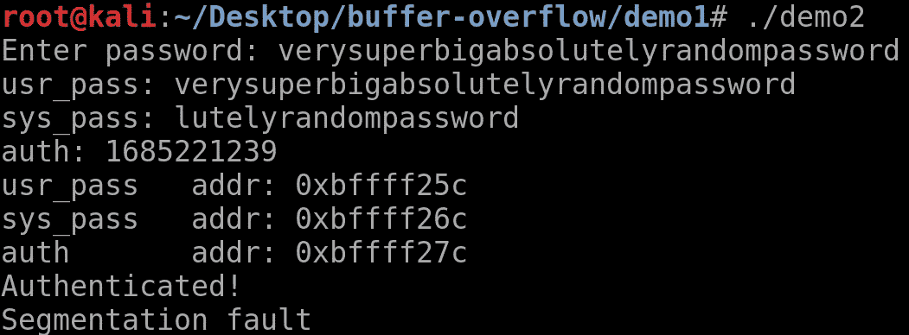

可以看到，在`usr_pass`变量中输入的密码溢出了`sys_pass`变量，然后溢出了`auth`变量。

注意:像`strcpy()`、`strcmp()`、`strcat()`这样的 C 函数不检查变量的长度，可以覆盖后面的内存地址，这正是缓冲区溢出的含义。

为了更好地理解，请参考下面的代码。

```
#include <stdio.h>int main(void) {    
    int auth = 0;
    char sys_pass[16] = "Secret";
    char usr_pass[16];    printf("Enter password: ");
    scanf("%s", usr_pass);    if (strcmp(sys_pass, usr_pass) == 0) {
        authorized = 1;
    }    printf("usr_pass: %s\n", usr_pass);
    printf("sys_pass: %s\n", sys_pass);
    printf("auth: %d\n", authorized);
    printf("sys_pass   addr: %p\n", (void *)sys_pass);
    printf("auth       addr: %p\n", (void *)&authorized);    if (auth) {
        printf("Authenticated!\n");
    }
    else{
        printf("Authentication declined!\n");
        }
}
```

注意:这可能是一个不切实际的例子，只是为了便于理解。现实生活中你可能看不到这样的情况。

现在让我们稍微深入一下这些概念。

# 正在运行的进程的内存划分

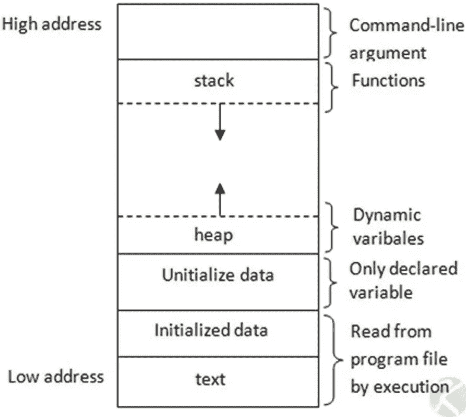

来源:[技术诀窍](https://kotharitechnotrick.wordpress.com/2013/12/26/memory-mapping-in-c/)。

这就是分配给进程的内存的样子。有`stack`、`heap`、`Uninitialized data`等各种区间。用于不同的目的。

你可以在这里读到更多关于内存布局的内容:[一个进程的内存布局。](https://www.thegeekstuff.com/2012/03/linux-processes-memory-layout/)

这篇博客主要关注堆栈中的缓冲区溢出，所以让我们来看看。

1.  堆栈:一种后进先出的数据结构，被计算机广泛用于内存管理等。
2.  内存中有一堆寄存器，但我们只关心 EIP、EBP 和 ESP。
3.  EBP:这是一个堆栈指针，指向堆栈的底部。
4.  ESP:是一个指向栈顶的栈指针。

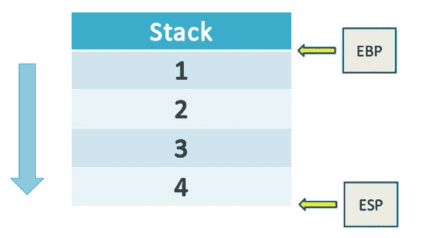

5.EIP:它包含下一条要执行的指令的地址。


# 堆栈布局

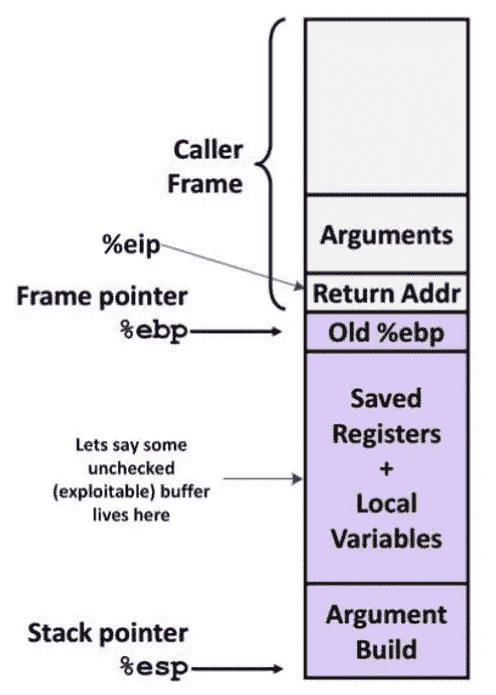

上图显示的是一辆`stack`的样子。这看起来可能有点吓人，但是相信我，一点也不。

让我们看看与堆栈相关的一些要点:

*   堆栈从较高的内存填充到较低的内存。
*   在堆栈中，所有的变量都是相对于 EBP 来访问的。
*   在程序中，每个函数都有自己的堆栈。
*   一切都参考了 EBP 登记册。

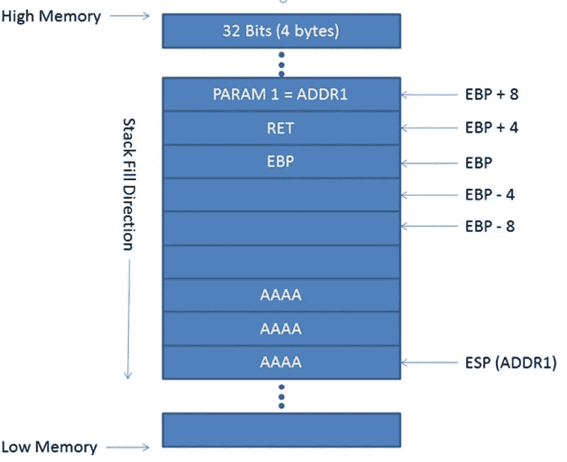

来源: [IT &安全素材](https://itandsecuritystuffs.wordpress.com/2014/03/18/understanding-buffer-overflows-attacks-part-1/)。

在 EBP 之上，存储功能参数。

例如:

```
void foo(int a, int b, int c){
      //Function body
   }
```

这里，`a`、`b`和`c`是存储在 EBP 上方的功能参数。

*   函数的所有局部变量都存储在 EBP 下面。
*   `Old %ebp`是前一个函数的 EBP 的值。因为，在一个函数被执行后，它必须返回到一个更老的函数，我们需要存储老 EBP 和 EIP 的值。
*   ESP 寄存器存储堆栈底部的地址。

例如:

```
void foo(int a, int b, int c){
       int x;
       int y;
       int z;
   }
```

这里，`x`、`y`、`z`是函数的局部变量，存储在 EBP 以下。

# 利用缓冲区溢出

是时候使用堆栈来研究缓冲区溢出利用了。

在此之前，让我们试着理解一个栈是如何为任何函数构建的。

下面我们来看一个例子:

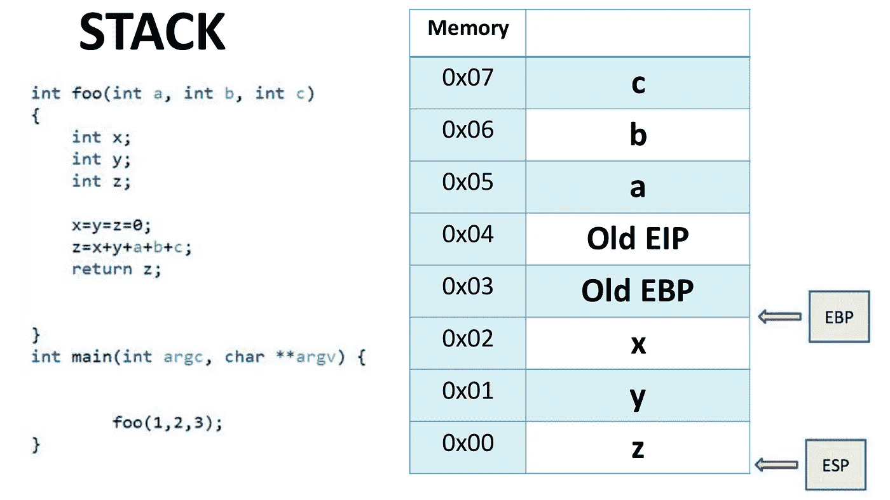

如左图所示，右边的堆栈是功能`foo`的堆栈。

*   由于`a`、`b`和`c`是传递给函数的参数，因此它们存储在 EBP 之上。此外，因为堆栈是从高到低的内存填充的，并且参数是从右到左读取的，所以`c`首先写入内存，然后是`b`和`a`。
*   `x`、`y`和`z`是存储在 EBP 下的局部变量。
*   还需要将函数`main`的`Old EIP`和`Old EBP`存储在堆栈中，以便知道函数执行后返回到哪里。

现在，如前面的演示所示，您可以使用局部变量看到缓冲区溢出是如何发生的。

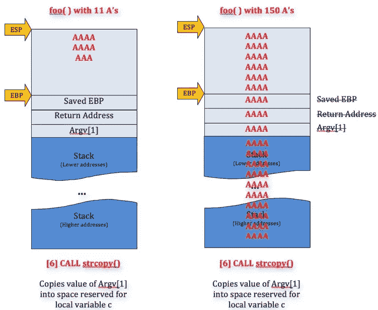

来源:[安检筛](https://www.securitysift.com/windows-exploit-development-part-2-intro-stack-overflow/)。

想象这样一种情况，您溢出了变量`x`、`y`和`z`，使得旧的 EIP 被修改并存储了放置恶意代码的内存地址。

为了更好的理解，请参考下图。

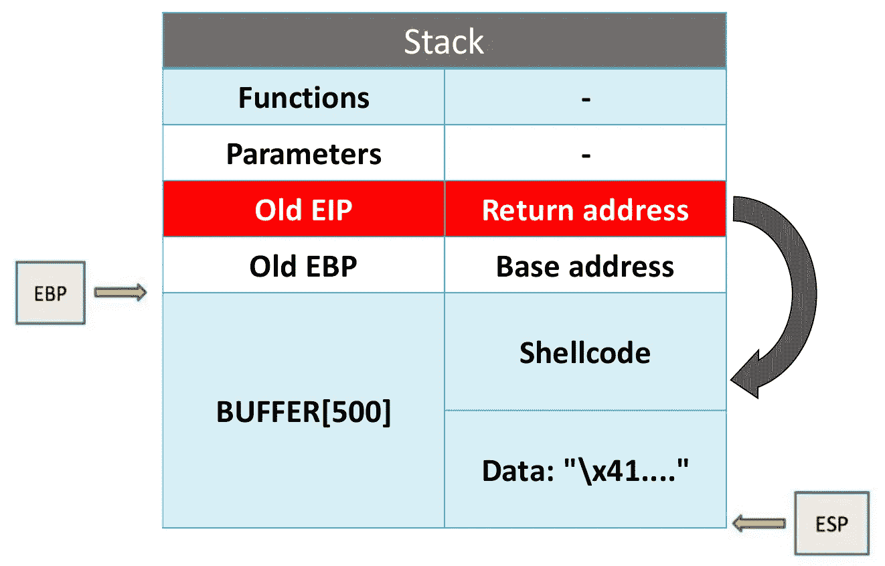

假设在函数中定义了一个长度为 500 的缓冲区。现在它以这样一种方式溢出，它有一些随机数据，后跟外壳代码(恶意代码)，然后是指向外壳代码的返回地址。

因此，在函数被执行后，返回地址指向的指令被执行，这就是我们的外壳代码被执行的方式。

缓冲区溢出就是这样发生的。

你一定要看这个视频: [*缓冲区溢出攻击——computer phile*](https://www.youtube.com/watch?v=1S0aBV-Waeo)更真实的了解缓冲区溢出。以上视频中使用的代码在 [GitHub](https://gist.github.com/apolloclark/6cffb33f179cc9162d0a) 上。

# 安全措施

*   使用 Python、Java 或 Ruby 之类的编程语言，在这些语言中会发生动态内存分配，并且语言本身会为您管理内存。
*   在像 C 和 C++这样的语言中，在将数据写入缓冲区之前，执行所有相关的检查和输入验证。
*   在使用任何外部库之前，检查其中的安全漏洞。
*   使用源代码分析工具针对漏洞进行静态分析。
*   使用不可执行的堆栈:这意味着即使一个机器码被注入到堆栈中，它也不能被执行，因为特定的内存区域是不可执行的。这是通过设置 NX 位来实现的。

注意:即使采取了这些措施，仍有可能利用缓冲区溢出。因此，这些只是有助于防止利用缓冲区溢出的安全层。

# 参考

*   [砸栈取乐牟利](https://insecure.org/stf/smashstack.html)
*   [缓冲区溢出漏洞利用及对策](http://homes.sice.indiana.edu/yh33/Teaching/I433-2016/lec11-more-bo.pdf)
*   [缓冲区溢出漏洞和攻击](http://www.cis.syr.edu/~wedu/Teaching/IntrCompSec/LectureNotes_New/Buffer_Overflow.pdf)

如果你喜欢这个博客，别忘了留下一些掌声:)

*我们连线吧？*

*领英:*[*https://linkedin.com/in/ashwigoel*](https://linkedin.com/in/ashwigoel)

*网址:*[*https://ashwingoel.com*](https://ashwingoel.com)

*邮件:*[*goelashwin36@gmail.com*](mailto:goelashwin36@gmail.com)