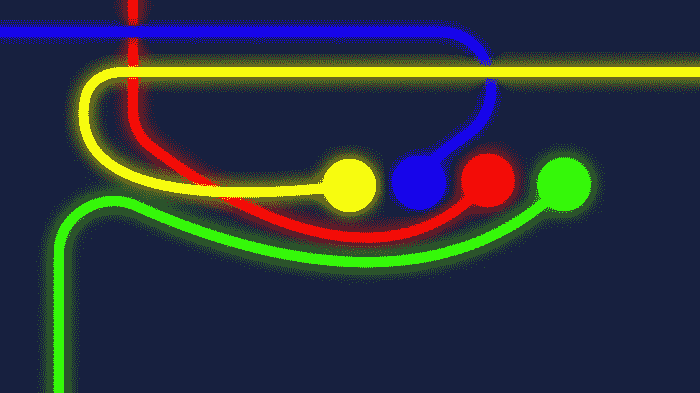
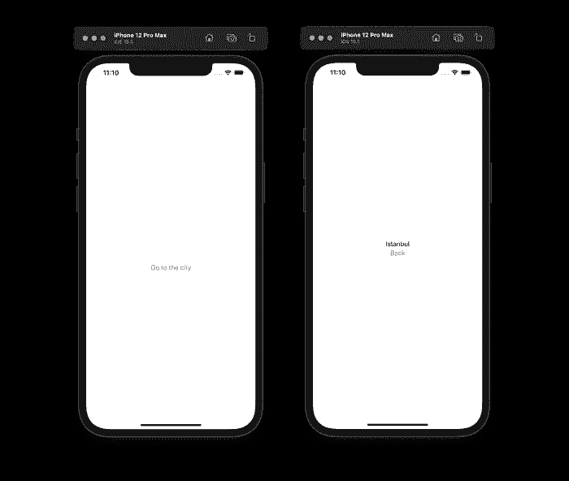
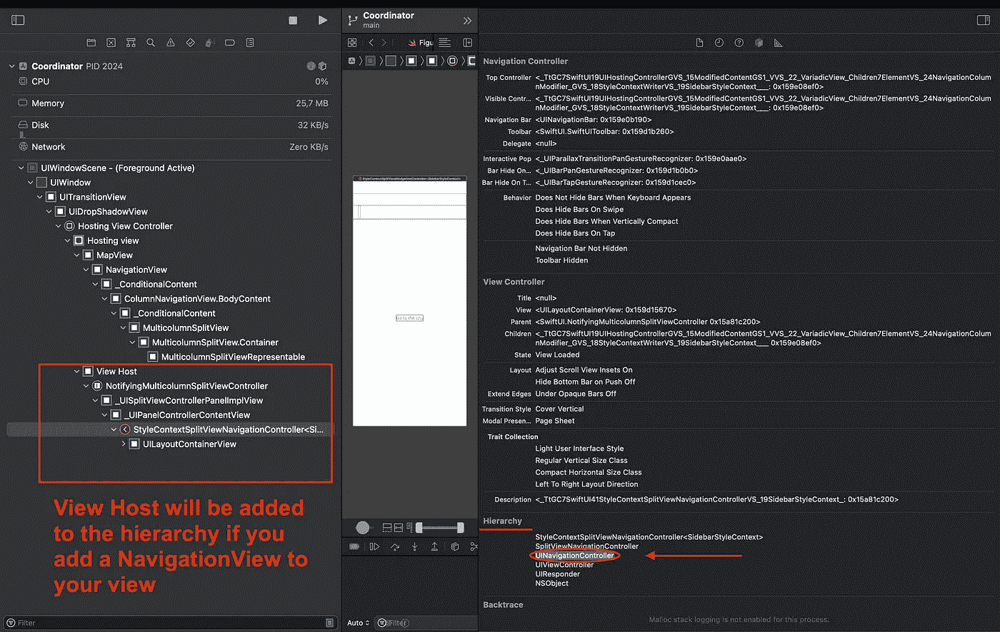
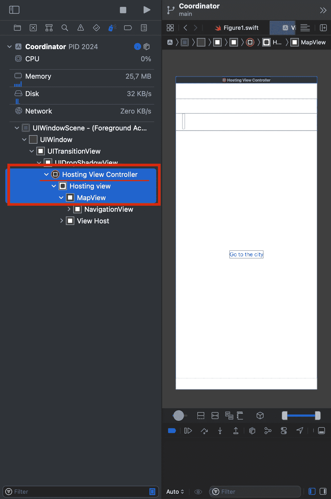

# SwiftUI 中的协调器模式介绍

> 原文：<https://betterprogramming.pub/an-introduction-to-coordinator-pattern-in-swiftui-38e5b02f031f>

## 深入阅读这份关于处理 SwiftUI 导航的深度指南

控制流

本文是关于在 iOS 13.0+的 SwiftUI 应用中处理复杂流程的解决方案。SwiftUI 应用中的导航可能会成为一个难点。

当谈到处理应用程序流的有用模式时，协调器模式肯定是其中之一。本文将向您展示如何将协调器模式与 SwiftUI 这样的声明性框架集成在一起。它将通过解释导航系统的每个部分，并找到一个解决方案来应用协调器模式来修复导航问题。如果您理解这个概念，您可以将解决方案映射到 Jetpack Compose 或其他框架。

“SwiftUI 中的协调器模式介绍”是一系列文章的一部分，通过该系列文章，您将学习如何处理多个协调器、子协调器如何与其父协调器通信、如何处理`UITabBarControllers`、不同的流程以及可以为您的应用选择正确流程的智能协调器。

在本文中，只描述了协调器模式中负责路由的部分。因此，要创建一个真实的应用程序，需要阅读以下文章:

*   协调员模式综合指南(即将推出)
*   智能协调员(即将推出)
*   与协调员的深度链接(即将推出)

# 导航=州

许多标记语言，如 HTML 或其他用户界面，通常是声明性的。HTML 仅仅描述了网页上应该出现的内容。它没有指定用于呈现页面的[控制流](https://en.wikipedia.org/wiki/Control_flow)。

但是，在命令式编程语言中，控制流*语句*是导致选择两条或多条路径中的哪一条的语句。这就是为什么协调模式中的指令在命令式语言中工作良好。

引用[马特·卡罗尔](https://medium.com/@mattcarroll?source=post_page-----dd84b624d0e--------------------------------)中的[这篇文章](https://medium.com/super-declarative/understanding-state-management-and-why-you-never-will-dd84b624d0e)很好地定义了国家:

> 应用程序在给定时刻的行为

`App(t) = State`

那么，我们可以认为导航是状态吗？导航状态每次可以是一个值，它会因另一个函数的副作用而改变。

接下来，如果您选择导航作为状态，将会发现问题！

# 问题陈述

下载 starter 项目，以便更轻松地执行步骤:

 [## GitHub——swift ui 中协调模式的介绍

### 启动项目

github.com](https://github.com/mohamadrezakoohkan/coordinator-intro-swiftui-starter) 

我们知道 SwiftUI 是一个声明性的框架，所以它会有状态，当从屏幕 1 到 2，2 到 3，3 到 4，…，n-1 到 n 转换时，框架中会有一些限制。一些主要问题会出现！

在 SwiftUI [NavigationView](https://developer.apple.com/documentation/swiftui/navigationview) 中，我们错过了弹出到根，向后弹出一步，在堆栈中间取消整个导航堆栈，或者替换中间的视图，或者其他功能和导航代码增加了每个屏幕的复杂性。

屏幕 2 应该保持来自屏幕 1 的导航状态，并且屏幕 2 应该产生一个[副作用](https://en.wikipedia.org/wiki/Side_effect_(computer_science))来弹出一步回到屏幕 1。

甚至很难解释，让我们看看一些代码！

协调者-启动者

图一

图 1 看起来是这样的:一个主页(`MapView`)，有一个按钮通过一个推转换导航到详细页(`CityView`)，在详细页中有一个弹出按钮导航回主页。

混乱来了！

`@State var showCity: Bool`是航海州。母版页将该状态传递给详细视图，以便能够在详细页中触发副作用，从而再次改变母版页中的导航。所以在两种情况下，从主页面推送到详细页面和从详细页面弹出到主页面，导航状态都是参与者并存储在主页面中！

还有一个问题。如果有十个屏幕用这些状态链接在一起，我们必须推回到第一个或根屏幕，会怎么样？这将是完全混乱处理这一流程！

让我们总结一下事实:

1.  应用程序的导航状态是一种状态，一次只有一个值。每次，我们的导航状态可以代表屏幕 A，而在另一次，它可以是屏幕 b。
2.  导航和路由是必须改变对方环境/屏幕的路线的副作用，所以状态是一条路线，因为它是从导航的副作用改变而来的。

有了所有的事实，解决问题的工具和说明是什么？

# 思考不同

目前的导航系统有`[NavigationStack](https://developer.apple.com/documentation/swiftui/navigationstack/)`、`NavigationView`和`[UINavigationController](https://developer.apple.com/documentation/uikit/uinavigationcontroller)`。

NavigationView 在 iOS 16.0 中已被弃用，但对于新的 iOS 版本，苹果在 WWDC22 中引入了新的 [NavigationStack。这是从 iOS 16.0+开始提供的，它适用于每个苹果平台，但它不是协调器模式，也不向后兼容。](https://developer.apple.com/videos/play/wwdc2022/10054/)

> 有了新的`NavigationStack`，您可以弹出到根视图或向后弹出一步，而不需要传递前一个视图的 push 引用，但是您仍然不能从堆栈中间的视图中删除整个导航堆栈。消除行为仅适用于根视图！

与 UINavigationController 相比:

*   `UINavigationController`在 iOS 2.0+上工作，这对于混合的 UIKit/SwiftUI 应用来说很好，但`NavigationStack`在 iOS 16.0 上工作
*   `UINavigationController`比`NavigationStack`更能控制导航
*   `UINavigationController`定制更加灵活
*   `NavigationStack`是新的，更兼容不同的苹果平台

`NavigationView` vs `UINavigationController`呢？

从设计角度来看，UIKit 中的`UINavigationController`与 SwiftUI 中的`[NavigationView](https://developer.apple.com/documentation/swiftui/navigationview)`不同。它有不同的实现和用法。

但从技术角度来说，SwiftUI 中的`NavigationView`就是`UINavigationController`！没错！UIKit 和 SwiftUI 都是闭源框架，它们的文档并没有说太多它们的组件是如何创建的。因此有很多不确定性。

但是通过更深入地观察`NavigationView`的层次，我们能够确定它们是相同的！

图 2

所以如果都是`[UINavigationController](https://developer.apple.com/documentation/uikit/uinavigationcontroller)`的话，那么有一个很棒的导航管理器，但是不能照原样使用。SwiftUI 视图不能堆叠到 UINavigationController 中！

但是等等，也有一些好消息！如果您再次检查 Debug 视图层次结构，您将会看到 MapView 嵌入在继承自`[UIViewController](https://developer.apple.com/documentation/uikit/uiviewcontroller)`的`[UIHostingController](https://developer.apple.com/documentation/swiftui/uihostingcontroller)`中。

因此，这似乎是我们在 UIKit 中为协调者使用的相同方法。`NavigationView`持有`View`的筹码，与`UINavigationController`持有`UIViewController`的筹码完全相同！

[Soroush Khanlou](https://khanlou.com/) 引入了导航流管理器、[协调器](https://khanlou.com/2015/01/the-coordinator/)模式。在那篇文章之后，他有一个[演讲](https://www.youtube.com/watch?v=a1g3k3NObkE)，更深入地探讨了如何解决大规模视图控制器的问题。一旦您理解了流程背后的思想，协调器模式就是处理流程的最直接、最灵活的模式！

听起来很有趣！我们可以对其应用协调器模式！

# SwiftUI 中协调员的实施

如前所述，协调器(导航系统)应该是一种因功能的副作用而改变的状态。状态管理器可以是触发给定的[单触发](https://www.controleng.com/articles/ladder-logic-106-one-shots/)值的功能，具有改变流程的副作用。

一次性是指一次恰好发生一次并产生副作用的值/信号！例如，计算器中的`=`运算符是一次性值/信号。它将进行计算，并在显示屏上产生一个新值。你可以想象 UIKit 的 present/push 函数，它接受单个对象，并对应用程序的生命周期产生副作用。

在协调器模式中，一次性的值被称为“路由”，我们将它们存储在枚举中。协调功能将使用路由，并且每条路由都应该有路由要求。

在一个简单的应用程序中，一条路线至少应该包含它的“过渡风格”和“目的地视图”,这样我们就可以识别出一条路线的价值，以及它可以如何路由到哪里！路由不仅仅是路径，还可以做路径做的事情！

让我们开始实施吧！

对于过渡风格，我们考虑一个简单的应用程序，它只能选择`push`、`presentModally`或`presentFullScreen`一条路线。

navigationtransitionstyle . swift

对于目的地，它必须根据它的路线选择应该创建哪个视图/路径。

> 下面的函数只是伪代码，以便更好地形象化我们将要实现的目标。

目的地视图

最后，所有的需求都可以用伪代码实现，我们可以通过将它们全部放入一个新概念`NavigationRouter`中来实现我们的北极星“路线”！

再说一次，路由至少应该包含它的转换风格和目的地视图，所以通过抽象路由，我们可以将这些需求应用到任何其他具体类型。

导航路由器. swift

由于路由必须是一次性的，枚举更有意义！这些路由将成为指向单个流的协调器的触发点

> 在下一篇文章“协调器模式综合指南”中，您可以了解更多关于处理不同流、多个`UINavigationController`、`UITabBarControllers`和`child`协调器的信息。
> 
> 记得在你做了这篇文章中的大量练习后检查一下。

MapRouter.swift

有了所有的路线和`UINavigationController`，唯一剩下的就是一个厨师做一顿饭叫`Coordinator`！

我们做饭吧！

开发者不是奇才，但是可以想象很多！他们通过混合指令和持续的努力，过去的成功和失败，通过想象的力量，并在其中加入创新思维来制作东西。

首先，让我们创建一个`Coordinator`的抽象来理解它的核心功能！

它必须有:

*   引用一个`UINavigationController`
*   用于启动流程的启动功能
*   显示路线目的地的功能
*   所有的`UINavigationController`功能，例如后退一步，返回到根页面的所有步骤，以及取消整个`navigationController`
*   它应该可以注入到每条路线的目的地/视图/页面。导航堆栈中的所有页面都应该有一个单独的`Coordinator`对象！

如果我们写下我们的需求，应该是这样的:

协调器-抽象

似乎足够了。让我们实现这个抽象吧！

Coordinator.swift

啊？？问题出现了！

## 什么是`public let startingRoute: Router`？

要启动协调器，我们可以创建一个继承自协调器类的新类，然后在`start`函数中，我们实现启动它的逻辑！但是，我决定为起始路由创建一个属性来使用同一个`Coordinator`类，因为在本文中，我只是描述了协调器模式的路由责任。

您可以使用这两种场景，并自己进行一些练习。我非常乐意在评论区听到你的子类之旅。

## 什么是`**public func show(_ route: Router, animated: Bool** = true)`

这是协调器的主要功能。它选择一条路线，创建目的地，为其注入一个协调器，并使用不透明的`View`类型将视图放入`UIHostingController`。这个`View`是基于路线的转场，它将系统导航到目的地！

## 什么是`public func pop(animated: Bool = true)`

因为它是`UINavigationController`的功能，所以应该可以从协调器对象访问它。它与路线无关，所以它只是改变流程中的一些东西。

## 什么是`public func popToRoot(animated: Bool = true)`

与`navigationController`的另一个功能`pop`相同

## 什么是`open func dismiss(animated: Bool = true)`

这是`UIViewController`的主要功能之一，但也有一些不同。在这种架构中，`UIHostingControllers`不会仅仅通过解除`navigationController`而从内存中释放。这时，就会发生内存泄漏。

`hostingControllers`将被保留，因为它们仍然具有对`navigationController`的强引用，但是通过从导航堆栈中手动移除`hostingControllers` ，该问题将被解决，并且它们对`navigationController` 的引用将被销毁，因此`hostingControllers` 将被成功释放

## 为什么有些函数是公共的、开放的还是私有的？

这取决于您的需求，但是我发现了对`Coordinator`属性的访问控制的最佳封装。

## 为什么它是一个可观察的物体？

如前所述，它应该可注入 SwiftUI 视图，因此`Observable Object`类型是 SwiftUI 视图中依赖注入的唯一可能的解决方案。它将被解析为一个`@EnvironmentObject`。

## 找不到答案？在评论区提问

虽然`Coordinator`和`Router`似乎是合适的工具，但是我们如何将它们放入应用的生命周期中呢？

将`UINavigationController`放入应用生命周期的最简单方法是我们在基于 UIKit 的应用中使用的`AppDelegate`和`SceneDelegate`。在我看来，即使我们能够在屏幕上添加多个窗口，他们和他们的功能的分离对于大多数复杂的功能来说是一个痛苦的杀手！

因此，如果我们回到过去使用`AppDelegate`和`SceneDelegate`的时代，我们将能够将`UINavigationController`放入`UIWindow` 并启动应用程序！

首先，让我们去掉`YOUR_PROJECT_NAMEApp.swift`文件，它是应用程序的`@main`入口点。让我们把它扔进垃圾桶吧！

其次，用`configurationForConnecting`委托创建`AppDelegate.swift`。正是这个技巧将`SceneDelegate`类连接到您的应用程序。

AppDelegate.swift

> 重要提示:请记住，如果您以前在设备上使用旧的 YourApp.swift 文件(应用程序的@main 入口点)构建和运行您的应用程序，您应该从该设备上完全删除应用程序并重新运行项目。

第三，创建`SceneDelegate.swift`来修改窗口，并将你的第一个`navigationController`插入其中。

SceneDelegate.swift

app 启动后会新建一个窗口，通过启动功能的副作用将协调器移动到`startingRoute` 。

最后剩下的是视图中的用法。代码如下:

协调员-介绍-用法

最有趣的是，所有适用于`NavigationView`的`ViewModifiers`仍然适用于这个模式。像`navigationBarHidden`、`navigationBarItems`之类的东西。

毕竟，您可以使用没有协调器模式的旧的基于状态的导航管理来检查这个代码块。再也不用担心处理 100 个页面，从第 73 页跳到第 18 页，或者删除第 99 页的整个导航堆栈。

这只是对大协调器模式的介绍。在接下来的文章中，我将解释许多事情，比如:

*   如何处理多个协调员
*   儿童协调员如何与父母沟通
*   如何处理`UITabBarControllers`
*   不同的流程和智能协调器可为您的应用提供合适的流程。

下载最终项目以遵循每个步骤，并将它们改为练习:

 [## GitHub——swift ui 中协调模式的介绍

### 最终方案

github.com](https://github.com/mohamadrezakoohkan/coordinator-intro-swiftui-final) 

感谢 [Soroush Khanlou](https://khanlou.com/) 的这一成熟模式。他还有很多创新，我建议你看看他的个人博客！

事实是，苏斯博士说得对:“你读得越多，你知道的东西就越多，你学得越多，你去的地方就越多。”谢谢你阅读我的想法。我非常欢迎你的评论、想法、批评和建议。我希望看到你创造不可思议的东西！

# 下一步是什么？

*   协调器模式综合指南(即将推出)
    我已经解释了更多关于处理不同流、多个`UINavigationController`、`UITabBarControllers`和`child`协调器的内容
*   智能协调器(即将推出)
    在本文中，您将能够创建协调器，它们不仅仅是从屏幕 A 移动到 B 的路由器，还具有一些更智能的功能来决定是从 A 移动到 B 还是从 A 移动到 C
*   与协调员的深度链接(即将推出)
    这篇文章将从路线创建一个图表，并使任何或每个视图可以从一个独特的深度链接
*   SwiftUI 中有协调员的 MVVM 模式(即将推出)
*   SwiftUI 中的 MVI 模式(即将推出)
*   SwiftUI 中有协调员的 MVI 模式(即将推出)

# 资源

*   [https://en . Wikipedia . org/wiki/Side _ effect _(computer _ science)](https://en.wikipedia.org/wiki/Side_effect_(computer_science))
*   [https://en . Wikipedia . org/wiki/User _ interface _ markup _ language](https://en.wikipedia.org/wiki/User_interface_markup_language)
*   [https://en.wikipedia.org/wiki/Declarative_programming](https://en.wikipedia.org/wiki/Declarative_programming)
*   [https://en.wikipedia.org/wiki/Control_flow](https://en.wikipedia.org/wiki/Control_flow)
*   [https://en . Wikipedia . org/wiki/Side _ effect _(computer _ science)](https://en.wikipedia.org/wiki/Side_effect_(computer_science))
*   [https://developer . apple . com/documentation/ui kit/uinavigationcontroller](https://developer.apple.com/documentation/uikit/uinavigationcontroller)
*   [https://developer . apple . com/documentation/swift ui/navigation view](https://developer.apple.com/documentation/swiftui/navigationview)
*   [https://developer.apple.com/videos/play/wwdc2022/10054/](https://developer.apple.com/videos/play/wwdc2022/10054/)
*   [https://khanlou.com/2015/01/the-coordinator/](https://khanlou.com/2015/01/the-coordinator/)
*   [https://www.youtube.com/watch?v=a1g3k3NObkE](https://www.youtube.com/watch?v=a1g3k3NObkE)
*   [https://developer . apple . com/documentation/swift ui/uihostingcontroller](https://developer.apple.com/documentation/swiftui/uihostingcontroller)
*   [https://developer . apple . com/documentation/ui kit/uiview controller](https://developer.apple.com/documentation/uikit/uiviewcontroller)
*   [https://www . controleng . com/articles/ladder-logic-106-one-shots/](https://www.controleng.com/articles/ladder-logic-106-one-shots/)