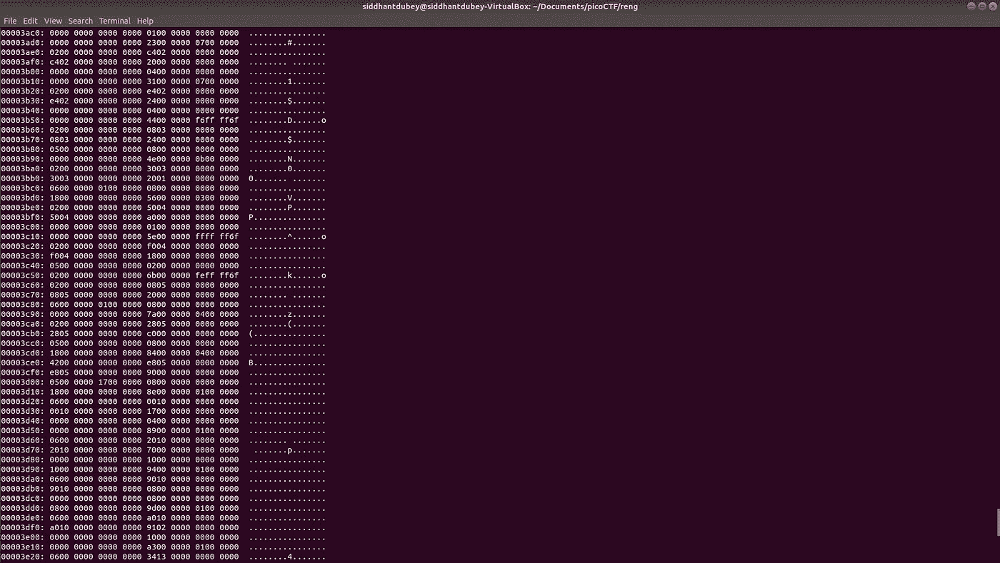

# 网络安全介绍、夺旗比赛和基本安全概念

> 原文：<https://betterprogramming.pub/an-introduction-to-cybersecurity-capture-the-flag-contests-and-basic-security-concepts-80f3fbf62bbc>

## 学习网络安全可能会感到害怕。从这里开始。



文件的十六进制转储

网络安全很重要，这是无法回避的事实。这也不像大多数流行媒体上展示的黑客攻击。

然而，这并不意味着它不有趣，它无疑是如此。由于这种阴谋，很多人都想涉足网络安全，包括我自己，我发现*捕捉旗帜事件* (CTFs)是体验这个领域的一个很好的方式。

现在，CTFs 在网络安全专业人员的日常工作中绝不是完全准确的，但它们非常有教育意义，确实有助于人们发展网络安全技能，而且参与起来也很有趣。

此外，如果你是一名程序员，这些将让你了解你应该如何设计你的程序，使它们不容易受到恶意用户的攻击。你不想成为一个用明文存储所有密码的人。

# 什么是 CTF？

在这一点上，你可能会问自己:“酷，但什么是 CTF？”

从本质上讲，这是一场团队网络安全竞赛，主要有三种类型:

*   危险:这些有几个不同类别的任务集合:网络攻击、二进制开发、逆向工程、取证和加密。通过解决这些挑战，您会发现“标志”通常遵循像`flag{Th1s_1s_a_flag}`这样的标准格式。一些例子包括 [picoCTF](https://picoctf.com/) 和 [Defcon CTF](https://www.defcon.org/html/links/dc-ctf.html) 的资格赛。
*   攻击-防御:在攻击-防御比赛中，每个团队都有自己的主机或服务，其任务是保护主机免受其他团队的攻击，同时也试图利用其他团队的主机。众所周知，Defcon CTF 决赛采取这种形式。
*   混合:从这类比赛的名称可以推断，它是某种危险与攻防相结合的比赛。

在这篇文章中，我将主要关注危险类型的 CTF。以后可能会再写一篇攻防比赛的文章。

# 所有这些类别是什么？

在你进入我之前提到的危险竞赛中所有酷的类别之前，你需要学习一些基础知识。最重要的是，您需要熟悉 Linux 终端。

这里有几个你会反复使用的命令:

```
ls: This command lists out all the files and subdirectories that you are currently in.pwd: This prints your current working directory. If you are in the documents directory, this will return documents.cd: This command changes the directory into any of the subdirectories of the current directory. Eg: If you have an essays folder in your documents folder and your current directory is documents, cd essays, will take you to your essays folder.
```

这些是 Linux 终端的绝对基础，还有更多命令，我们将在本文的其余部分介绍。

要在 CTFs 中取得成功，了解以下内容也很重要:

*   一种脚本语言，其中最流行的是 [Python](https://www.python.org/) 。Python 中有很多很酷的网络安全库，包括 [pwn](http://docs.pwntools.com/en/stable/) ，里面有很多对 CTFs 有帮助的函数。
*   数字基数。了解这是如何工作的非常有帮助。
*   JavaScript:在 web 开发中做好工作需要 JavaScript 知识以及一些 SQL 注入的 SQL 知识。
*   拥有一个基于 UNIX 的操作系统也是明智的，因为 Linux 上所有令人惊奇的工具都是现成的，这可以在一个虚拟的盒子里完成，不需要改变你的主操作系统。但是，您仍然可以在 Windows 上参与 CTFs。

是时候开始挖掘更重要的东西了。

# 密码系统

密码学的挑战包括你所认为的破解密码。给定一个密文，你能把它解码成原始信息吗？可以反其道而行之吗？

这些类型的问题包括您必须解密的加密消息。为了准备这些，最好学习不同类型的密码以及如何解密。

以下是这些挑战中一些常见的加密方法:凯撒密码、维格纳密码和 RSA。关于如何解密这些的更多信息，[查看这个链接。](https://ctf101.org/cryptography/overview/)

# 密写

根据定义，隐写术不是密码学，但它确实涉及到在众目睽睽之下隐藏信息。因此，许多 CTF 组织者将在加密部分包括隐写术挑战。

隐写术包括在媒体文件中隐藏消息，通常是音频和图像。值得注意的是，隐写术在网络安全领域没有太多真正的应用，只是增加了你的知识。

有许多方法可以做到这一点，但这篇通用文章的篇幅不足以涵盖所有方法，因此这里有一篇关于隐写术的深入文章:

[](https://medium.com/@FourOctets/ctf-tidbits-part-1-steganography-ea76cc526b40) [## CTF 花絮:第一部分——隐写术

### 一些人问我用什么工具治疗 CTF 氏症。我用什么都取决于 CTF 是什么。都有…

medium.com](https://medium.com/@FourOctets/ctf-tidbits-part-1-steganography-ea76cc526b40) 

# 二元剥削

二进制漏洞利用包括查找程序(通常是 Linux 可执行文件)中的漏洞，然后利用这些漏洞获取标志。

这些利用通常涉及使用程序来获得对外壳的控制，或者只是修改程序来产生标志。这是一个非常广泛的领域，在这里可以找到一些有用的提示。

# 辩论术

CTFs 中的取证挑战通常有以下几个方面:

*   文件格式分析:给定各种有问题的文件，可以修复吗？你能修复一个损坏的文件来产生一个标志吗？
*   内存转储分析:查看系统的内存，看是否可以了解任何重要的信息。
*   隐写术:是的，隐写术也出现在法医部分。
*   数据包捕获分析:数据包是通过网络从一台设备发送到另一台设备的一段数据。从数据包中可以收集到很多信息，并且有很多程序可以进行数据包分析和捕获。可能最受欢迎的是 Wireshark。

以下是关于这个话题的一些进入[的细节。](https://trailofbits.github.io/ctf/forensics/)

# 网络开发

网络开发挑战让参赛者从开发网站和网络应用程序中取回旗帜。有几种方法可以做到这一点:

*   SQL 注入:有时，web 应用程序的创建者会无意中注入 SQL 代码。这为开发者利用 SQL 从 web 应用的数据库中获取信息提供了一个绝好的机会。
*   只是检查元素:在竞赛的简单阶段，活动组织者可能只是在网站的 HTML 中隐藏旗帜。他们还可能有一个 JavaScript 函数，需要接受某个输入来显示标志，这些可以通过 inspect element 和一些解决问题的技巧来完成。
*   目录遍历:如果一个应用程序接受一个目录作为输入，而这个输入没有被正确地检查，攻击者就可以随心所欲地篡改目录。
*   XSS(跨站点脚本):这是指攻击者可以发送将由 web 应用程序的另一个用户的浏览器执行的 JavaScript。
*   命令注入:有时，开发人员忘记正确检查进入系统外壳的输入。如果没有正确检查，攻击者可以向 web 应用程序发送他们想要的任何系统命令。

关于以上主题的更多深入信息，请看这个[的精彩资源。](https://ctf101.org/web-exploitation/overview/)

# 逆向工程

顾名思义，这些类型的挑战是基于对程序进行逆向工程，以找出如何正确利用它。正如所期望的，成功利用的产品是标志。

这些可以在许多编程语言中给出，但是下面的，尤其是前两个，比其他的更容易出现:

*   汇编:读到这里，你可能会想没人用汇编编程，相反，很多人都用汇编编程。它不是非常普遍，但是它被用于非常相关的嵌入式微系统的编程中。这可能是一个令人沮丧的学习，但它是一个非常有用的技能。
*   C:许多程序是用 C 写的，它对内存分配的控制使它成为一种有价值的编程语言。熟悉 C 可能有助于你做好用 C 写的逆向工程程序。
*   Java: Java 是一种非常流行的编程语言，它的代码易于阅读。了解 Java 将极大地帮助你对它进行逆向工程，所以如果你还不知道的话，学习它是值得推荐的。

需要注意的是，很多时候你并没有得到程序的实际源代码，而只是得到了可执行文件。

为了克服这个障碍，我们使用了*反编译器。这些程序试图将可执行文件转换回源代码。*

反编译程序的一个很好的例子是由国家安全局创建的 [Ghidra](https://www.nsa.gov/resources/everyone/ghidra/) 。它是一个非常强大的工具，并且非常擅长它所做的事情。在你的电脑上设置这个是明智的。

对于逆向工程更深入的解释，看一看这个[精彩的资源](https://ctf101.org/reverse-engineering/overview/)。

# 初学者友好的 CTFs

好吧，这些 CTF 的事情看起来很酷，我如何参与其中呢？

好吧，未来的 pwner，这里有一个对初学者来说很棒的 CTF 列表。请注意，目前并非所有这些都可用:

*   picoCTF:由卡内基梅隆大学运营，面向初中和高中学生，全年开放。
*   overthewire:这对初学者学习和测试他们的技能很有帮助。从强盗挑战开始将帮助你从零开始。
*   [HSCTF:又一款专为高中生打造的 CTF。](https://hsctf.com/)
*   你可以在这里找到更多的 CTF 来练习和学习。

现在，出去抓住那些旗子。相信我，这是一次不可思议的经历。

如果你喜欢这篇介绍，可以考虑订阅我的时事通讯:[https://mailchi.mp/35c069691d2c/newsletter-signup](https://mailchi.mp/35c069691d2c/newsletter-signup)。

# 一份庞大的资源清单

*   [比特踪迹](https://trailofbits.github.io/ctf/web/exploits.html):大量关于 CTFs 的有用信息。
*   [CTFS 资源:密码学和法医学信息。](https://ctfs.github.io/resources/)
*   CTF 101:CTF 入门指南。