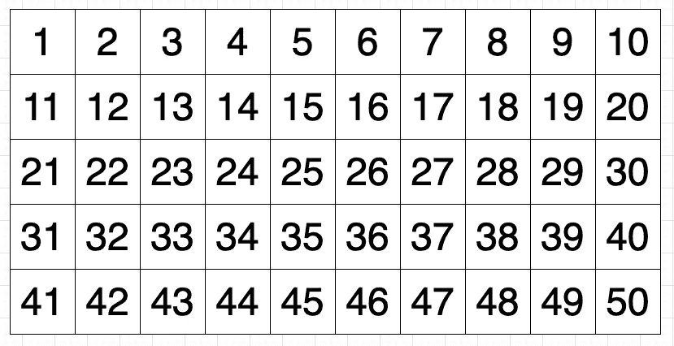
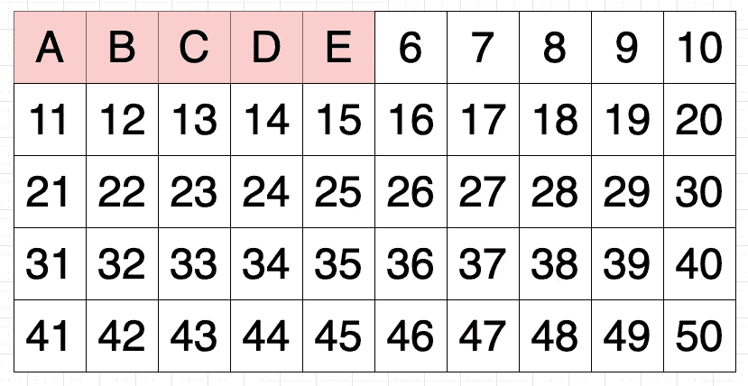
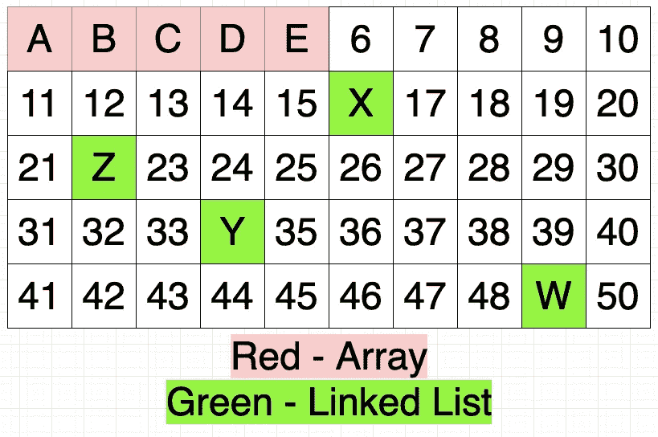
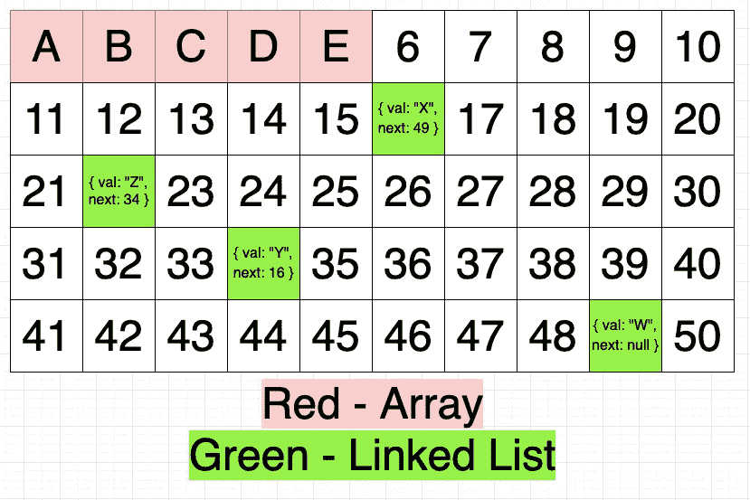
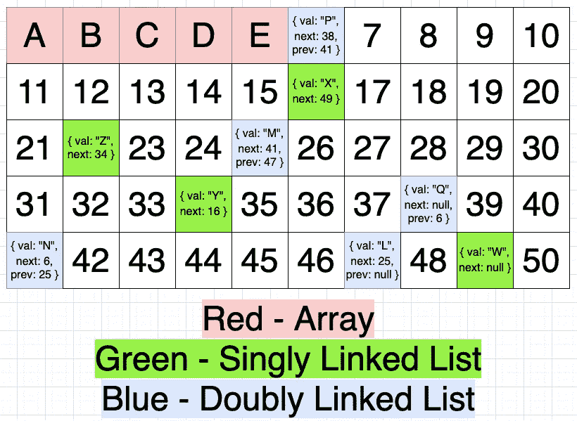

# 链表简介

> 原文：<https://betterprogramming.pub/an-introduction-to-d1957df2f406>

## 什么是链表，我们应该用它们做什么？

蒂姆·福斯特在 [Unsplash](https://unsplash.com/s/photos/patterns?utm_source=unsplash&utm_medium=referral&utm_content=creditCopyText) 上的照片

# 背景

在过去的几天里，我一直在学习数据结构。这一次，我们将深入到更常见的链表中，而不是一个特殊的数据结构。

有两种类型的链表:单链表和双链表。因为这是对数据结构的介绍，我们将把重点放在更简单的一个上——单链表。如果你能够理解单向链表，那么双向链表就会自然而然地出现在你面前。为了清楚起见，除非另有说明，否则链表和单链表是一样的。

# 什么是链表？

根据维基百科，

> 在[计算机科学](https://en.wikipedia.org/wiki/Computer_science)中，**链表**是数据元素的线性集合，其顺序不是由它们在内存中的物理位置给出的。相反，每个元素[指向下一个](https://en.wikipedia.org/wiki/Pointer_(computer_programming))。它是一个[数据结构](https://en.wikipedia.org/wiki/Data_structure)，由一组[节点](https://en.wikipedia.org/wiki/Node_(computer_science))组成，它们共同代表一个[序列](https://en.wikipedia.org/wiki/Sequence)。在其最基本的形式中，每个节点包含:[数据](https://en.wikipedia.org/wiki/Data_(computing))，以及一个[引用](https://en.wikipedia.org/wiki/Reference_(computer_science))(换句话说，一个*链接*)到序列中的下一个节点。

如果这只是让你更加困惑，不要担心。我们将把每个句子分解开来，并解释它的意思。

# 链表在内存中没有顺序

让我们从第一句开始，

> 在[计算机科学](https://en.wikipedia.org/wiki/Computer_science)中，**链表**是数据元素的线性集合，其顺序不是由它们在内存中的物理位置给出的。

一些帮助我们理解这句话的视觉效果:

物理内存

这个 10x5 的网格代表物理内存。它代表计算机的物理内存，数字代表内存的位置。这些特定的数字仅用于说明目的(也就是说，这不是物理内存的编号方式)。

当句子说“它们在记忆中的物理位置”时，它的意思就是字面上的意思。例如，如果我有一个长度为 5 的数组，`[“A”, “B", “C", “D", “E"]`这个数组将占用物理内存中的 5 个内存槽。物理内存现在将如下所示:

数组的物理内存

该数组占用了五个内存插槽，每个元素占用一个插槽。“A”占用第一个槽，“B”占用第二个槽，“C”占用第三个槽，依此类推。根据数组的性质，这是*排序的*，因为它遵循内存中槽的顺序。这是必要的，因为数组中的顺序关系到通过索引访问元素。如果我有一个单独的数组`["E", "D", "A", "B", "C"]`，它将与上面显示的数组不同，因为该数组将位于内存中的不同位置(即，插槽 1–5 已经被占用，因此该数组将占用不同的插槽)。

那么*无序*是什么意思？这意味着内存中没有存储数据的顺序。一个链表可以用下面的来表示:`Z -> Y -> X -> W`。关于物理内存，请看下图:

数组和链表的物理内存

物理内存“Z”位于插槽 22，“Y”位于插槽 34，“X”位于插槽 16，“W”位于插槽 49。如果你按照这个顺序，内存中的槽被表示为`22 -> 34 -> 16 -> 49`。这是没有顺序的。每个槽用其各自的指针表示链表的单个值。

# 链表的元素

除了值，链表的元素还包含什么？

> 相反，每个元素[指向下一个](https://en.wikipedia.org/wiki/Pointer_(computer_programming))。

本质上，链表包含两部分数据:它保存的值和指向下一个元素的指针。

指针是链表如何知道它序列中的下一个元素是什么。它为下一个元素指向内存中的下一个位置或槽。当它到达序列的末尾时，指针通常会指向`null`。

链表中的指针类似于数组的索引。当您访问数组中的一个元素时，您使用它的索引，因为索引“指向”该元素。

为了更新链表的视觉效果，我将用两个键将链表中的每个元素表示为一个对象:`val`和`next`。`val`代表内存中的值，`next`是指向链表序列内存中下一个元素的指针。

更新内存中的链表

请注意，一个元素只指向下一个元素。这意味着当你遍历一个链表时，你只能在一个方向上遍历它(即，只能向前)。

# 节点和序列

最后两句，他们一起走。

> 它是一个[数据结构](https://en.wikipedia.org/wiki/Data_structure)，由一组[节点](https://en.wikipedia.org/wiki/Node_(computer_science))组成，它们共同代表一个[序列](https://en.wikipedia.org/wiki/Sequence)。在其最基本的形式中，每个节点包含:[数据](https://en.wikipedia.org/wiki/Data_(computing))，以及到序列中下一个节点的[引用](https://en.wikipedia.org/wiki/Reference_(computer_science))(换句话说，一个*链接*)。

在这一点上，链表的概念已经建立，这更多的是为了澄清术语。

节点包含数据和引用。正如我在前面提到的，数据也可以是对象中的`val`，引用也可以是`next`。这个物体叫做`node`。

序列是节点的集合。回想一下我是如何使用`Z -> Y -> X -> W`作为例子的。这是序列的典型表示方式。

太好了——你现在对链表有了基本的理解！但是它有什么了不起的呢？

# 链表的主要好处

链表的主要好处是插入或删除一个节点不需要重新组织或重新分配内存。这是因为链表的本质是无序的。您可以在物理内存中有开放空间的任何地方插入一个节点。与数组不同，这不需要本地化。

通过将前一个节点的指针重新分配给“已删除”节点之后的下一个节点来“删除”节点。我引用 deleted 的原因是，该节点将不再存在于序列中，但仍将在内存中，没有任何引用它。

当在链表中插入一个节点时，通常不需要选择在内存中的什么位置存储该节点，类似于实例化一个数组。

# 链表的主要缺点

链表的主要缺点是遍历序列来寻找一个特定的值。因为节点分散在整个物理内存中，所以不容易访问特定的节点，这与通过索引访问元素的数组不同。

当你得到一个链表时，通常你只能访问它的头部。头部是链表的第一个节点。从头开始，您需要遍历每个节点，直到找到您需要的节点。

# 双向链表

如果你能跟上这一点，太棒了！这意味着你已经理解了 95%的双向链表。双向链表是具有两个引用/指针的节点序列，一个指向下一个节点，另一个指向前一个节点。在单链表中，每个节点只有一个指针，指向下一个节点。

双向链表的节点有两个指针，所以可以双向遍历链表(即向前和向后)。

为了在我们的图中表示这一点，我将创建下面的双向链表:`L <-> M <-> N <-> P <-> Q`。每个节点将用三个键-值对来表示:`val`表示值，`next`表示下一个节点的内存位置，`prev`表示前一个节点的内存位置。至于双向链表的头，我会默认前面的节点为`null`。

数组、单向链表和双向链表的物理内存

你有它！

# 结论

现在你已经对单双链表有了基本的了解！如果你是一个初露头角的新开发人员，链表是一种数据结构，在面试和白板演示中你肯定需要理解它。

感谢阅读！