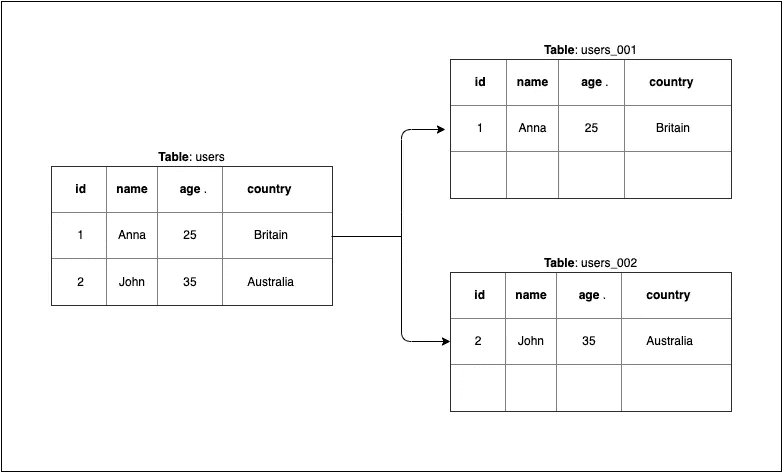
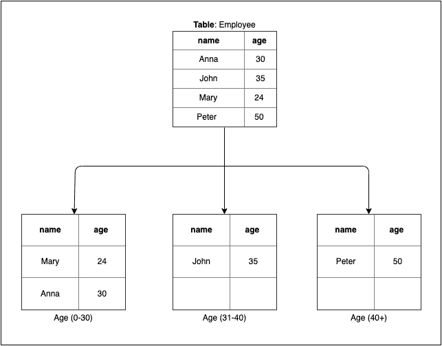
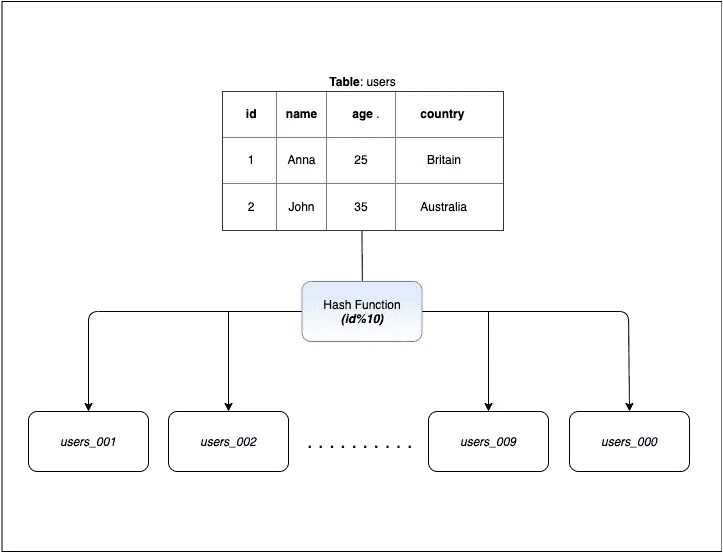
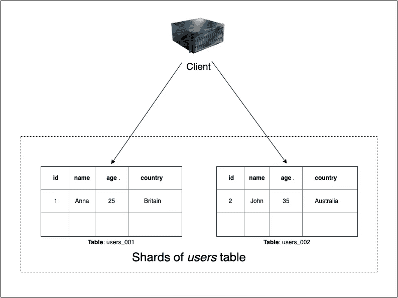
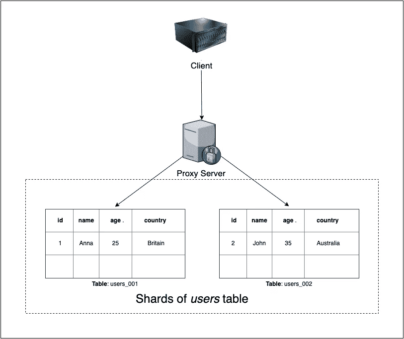

# 数据库分片简介

> 原文：<https://betterprogramming.pub/an-introduction-to-database-sharding-b6abde73d04f>

## 随着应用的增长扩展数据库

图 1:[Alexander Schimmeck](https://unsplash.com/@alschim?utm_source=unsplash&utm_medium=referral&utm_content=creditCopyText)在 [Unsplash](https://unsplash.com/s/photos/queue?utm_source=unsplash&utm_medium=referral&utm_content=creditCopyText) 上拍摄的照片

随着应用程序必须处理的数据量不断增加，不可能将所有数据保存在单个节点上，因为单个服务器可能无法处理如此大的吞吐量。在这种情况下，将数据库划分为多个节点是一种有效的技术。

今天，我们将讨论数据库分片(分区)。近年来，分片受到了很多关注。但是，许多人不熟悉这个概念。

在这个博客中，我们将讨论基本概念，为什么需要它，以及实现它的方法。

# 什么是分片？

分片是将来自单个数据源的数据划分到多个分区，其中每个分区的结构都是相同的。单个分区也称为碎片。碎片可以放在同一个服务器或不同的服务器上。

为了更好地理解这一点，请看下图。我们有一个*用户*表，包含用户信息，如*姓名*、*年龄*和*国家*。我们将其分成两个表， *users_001* 和 *users_002。*(在什么基础上我们可以分片一个表将在随后的段落中讨论。)

需要注意的一点是，碎片*不共享任何数据*。因此，复制需要与分片一起工作，以防止数据丢失。

图 2:表格的分片

# 为什么我们需要分片？

让我们用一个例子来理解这一点。假设在图 1 中，只有一条车道，而不是三条车道。会发生什么？交通本来会很慢，可能会堵塞。

同样，在数据库中，如果我们从一个表中读取所有内容，响应时间可能会随着负载的增加而增加，数据库也可能会关闭。

分片将流量从单个表分割到多个表，就像图 1 中的车道一样。

# 分片是怎么做的？

有几种分片技术，但最流行的是:

1.  基于范围的分区。
2.  哈希分区。

## **基于范围的分区**

在这种情况下，数据根据键的范围进行分片(分区)。同一范围内的数据属于同一分区。

键的选择在这里非常重要，因为如果选择不好，那么数据将分布不均匀，也就是说，一个碎片可能包含大部分数据。

在图 3 中，*雇员*表的分区基于*年龄*列。年龄范围为(0-30)，(30-40)，和(> 40)。因此，将有三个碎片，员工数据将根据他们的年龄进行分区。

**图 3:** 基于范围的分割

## **哈希分区**

这也被称为基于键的分区**。**在这种情况下，我们选择一个键并传递给一个哈希函数，然后得到分区，即哈希函数可以被认为是从键到分区的映射。

在决定散列函数时，必须确保数据均匀分布在各个碎片上。

例如，在图 2 中的分区模式中，我们的键是 ID 列。我们的哈希函数选取 ID 的最后一位数字，并相应地将数据放入分区，即以 1 结尾的数据放入 *users_001* ，以 2 结尾的数据放入 *users_002* ，依此类推。

**图 4:** 哈希分区

# 分片是如何实现的？

从实现的角度来看，有两种方法可以做到这一点:

1.  客户端分区。
2.  代理辅助分区。

## **客户端分区**

客户端知道数据是如何分区的，并直接选择分区来读写数据。

这种方法的优点是没有中间层。但是缺点是在实现之后不容易改变分区的数量，因为所有的客户端代码都需要改变。

**图 5:** 客户端分区

## **代理辅助分区**

在代理辅助分区中，客户机向代理服务器发出请求，而不是直接调用 shard。代理服务器根据分片模式将该请求转发给正确的分片。

这种技术的优点是客户端不知道任何关于分片的逻辑，并且分片和分区的数量比客户端分区更容易更改。

**图 6:** 代理辅助分区

# 结论

对于拥有大量数据的数据库来说，分片是一个很好的解决方案。它有助于将负载从单个节点分散到多个节点。但是，它增加了应用程序的复杂性。

在某些情况下，分片可能是必要的，但在添加分片之前，需要尝试其他选项，如添加缓存或迁移到更大的服务器，因为创建时间和维护成本可能超过分片的好处。