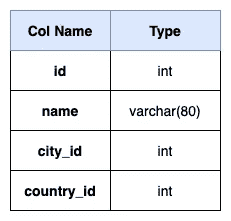
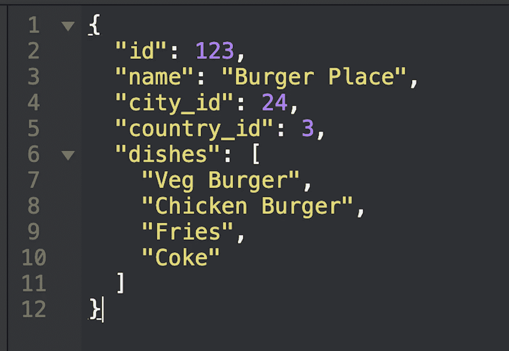
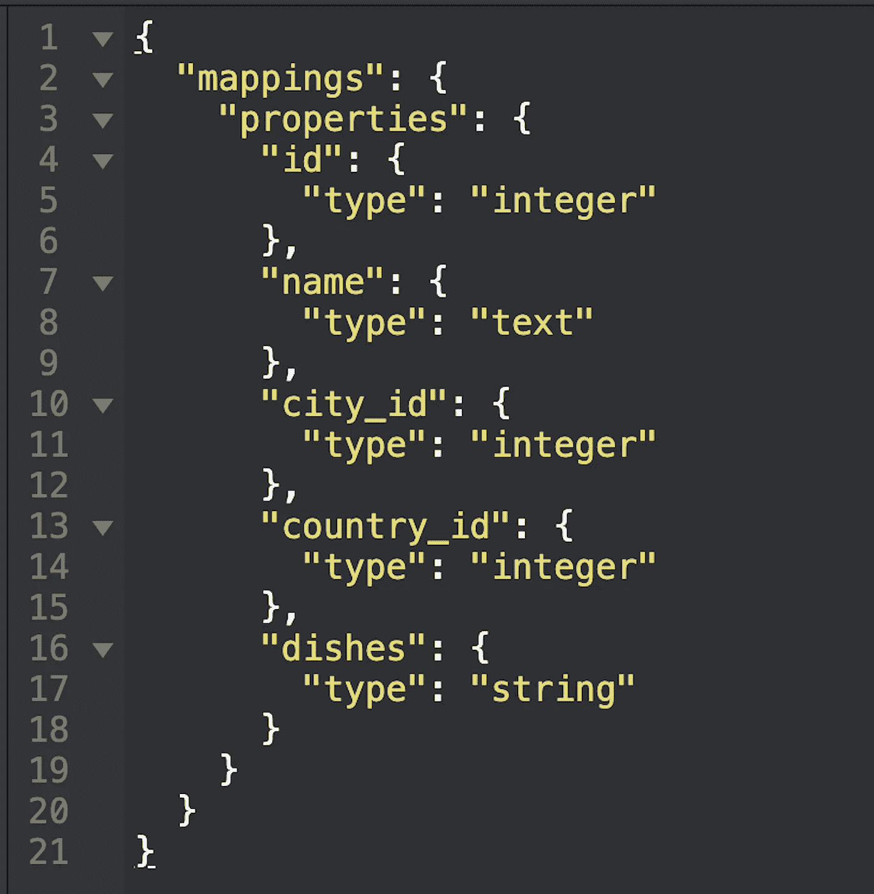

# 弹性研究导论

> 原文：<https://betterprogramming.pub/an-introduction-to-elasticsearch-4999b2a752e9>

## 深入流行的开源搜索引擎

Elasticsearch 徽标

如今，*搜索*已经成为所有网站和应用的重要功能之一。任何网站超过 50%的流量都使用*搜索*功能。所以，每个人都在努力让自己的搜索更快更好地提升用户体验。

所以，今天，我们要谈论一个流行的搜索和分析引擎，叫做 [Elasticsearch](https://www.elastic.co/) 。本文的范围是让读者熟悉弹性搜索和基本术语。

# 什么是 Elasticsearch？

根据官网上的定义:

> “Elasticsearch 是一个分布式、开源的搜索和分析引擎，适用于所有类型的数据，包括文本、数字、地理空间、结构化和非结构化数据。Elasticsearch 是建立在 Apache Lucene 之上的。”

你可以把 Elasticsearch 看作是一个 NoSQL 数据库，具有高性能搜索的额外功能。高性能搜索是因为 [Apache Lucene](https://lucene.apache.org/) ，一个全功能的文本搜索引擎库。

Elasticsearch 用于搜索电子商务平台中的商品，食品订购应用程序中的餐厅，在线预订网站中的航班等。

# 为什么我们需要 Elasticsearch？

我们用一个例子来理解这个。假设您有一个食品订购应用程序，您需要添加按餐馆名称进行关键字搜索的功能。

**图 1** :餐厅表

因此，对于这个功能，需要一个搜索引擎，它将根据用户的输入查询返回餐馆。如果有 1000 万家餐馆，即表中有 1000 万行，那么通过部分匹配关键字进行搜索将会非常慢。

这个问题随着生产量的增加而扩大。一个受欢迎的网站每秒收到数千个搜索请求。因此，现有的 SQL 数据库不能用于这种类型的用例。

在这种情况下，我们需要一些更快的关键字搜索，是一个分布式系统，处理非常高的吞吐量和弹性搜索满足所有这些标准。

让我们深入研究一下 Elasticsearch，了解数据在其中的结构。

# 弹性搜索文档

您可以将 Elasticsearch 文档视为 MySQL 表中的一行。数据存储在文档中，采用 JSON 格式。

每个文档都包含一组键及其对应的值。该值可以是字符串、整数、浮点、布尔、数组或其他类型的数据。

下面给出了一个餐馆文档的例子。每个字段都可以被索引和搜索，不管它是字符串(`“name”` *)* 还是数组(`“dishes”`)。

**图 2** :餐厅对象的文档

# 绘图

Elasticsearch 中的映射类似于 MySQL 数据库中的表。该映射包含存储在索引中的文档的轮廓。

它定义了文档中出现的字段的数据类型，如字符串、整数和格式。例如，如果我们想在一个字段中存储日期，那么类型将是`“date”`，格式将类似于`“yyyy-mm-dd”`。

当您索引(添加)文档时，Elasticsearch 会自动尝试确定属性类型。你可以把它想象成在 MySQL 中插入一个 JSON，然后由 MySQL 决定列数和列类型。

在 Elasticsearch 中，数组没有专用的数据类型。数组的第一个值决定了它的类型。例如，对于我们的餐馆文档，菜肴被认为是字符串类型。

图 3:餐馆文档的映射

# 弹性搜索指数

Elasticsearch index 类似于 MySQL 数据库。它是彼此相似的文档的集合。

例如，所有的餐馆文档都可以放在一个索引下。每个索引都由一个名称唯一标识。该名称用于搜索、更新和删除文档。

# 结论

Elasticsearch 是一个分布式分析搜索引擎，具有近实时返回结果的能力。

Elasticsearch 还可以与 [Kibana](https://www.elastic.co/kibana) 集成，用于实时可视化数据。

Elasticsearch 的集成更快更简单，因为 Elasticsearch 客户端是用 Java、PHP、Ruby、Python、Go 等多种语言编写的。