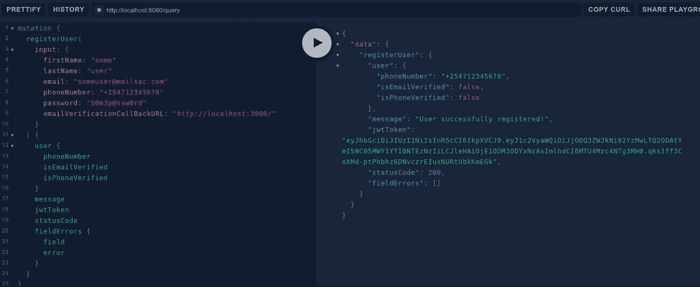
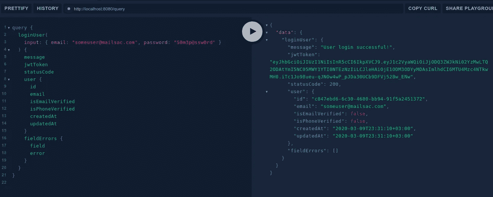

# 介绍带有 Apollo 客户端和 React 钩子的 GraphQL

> 原文：<https://betterprogramming.pub/an-introduction-to-graphql-with-apollo-client-and-react-hooks-fc87ab960e36>

GraphQL 是什么？我如何为我的项目设置它？更多


反应，阿波罗，GraphQL。图片由 hackernoon.com 提供

# TL；博士:

*   GraphQL 不是一种数据库查询语言。它是一种 API 数据的查询语言，和 REST 一样。
*   与 REST 不同，只需进行一次查询，就能得到您想要的结果。
*   本文的 GitHub repo 可以在这里找到:[https://github.com/machariamuguku/react_apollo_graphql](https://github.com/machariamuguku/react_apollo_graphql)

# **graph QL 是什么？**

[GraphQL](https://graphql.org/) 是由脸书开发的(API)数据查询语言。GraphQL 给了客户端(前端和其他 API)要求他们想要的东西的能力，不多也不少。它为数据提供了一个结构化的查询，并对所请求的数据进行了完整和可理解的描述。

# 揭穿常见的 GraphQL 神话(GraphQL 不是什么？)

## 误区一。GraphQL 是一种类似 SQL 的数据库查询语言

GraphQL 是**而不是**一种数据库查询语言。GraphQL 查询一个 API(类似 REST ),它进行验证和实际的获取。GraphQL 是一个粘合层，一端是您的前端，另一端是 API 后端和数据库。

## 误区二。GraphQL 是魔法

GraphQL 是**而不是**魔法。您必须自己为每个可能的 GraphQL 查询、变异或订阅定义解析器。这包括验证和业务逻辑。

## 误区三。GraphQL 跟图有关系

GraphQL 是 API 数据的查询语言。GraphQL 中的*图*指的是，在 GraphQL 中的[，你如何通过定义一个模式将你的业务领域建模为一个图，在这个模式中，你定义不同类型的节点以及它们如何相互连接/关联。](https://graphql.org/learn/thinking-in-graphs/)

## 误区四。GraphQL 暴露了我的整个数据库

GraphQL **只公开您明确告诉它通过解析器公开**的内容。GraphQL 为您提供了对所公开内容的细粒度控制。

# 为什么选择 GraphQL？为什么不休息一下呢？

*   它可以让你查询你到底需要什么。不多也不少。这有助于解决剩余的过度提取和不足提取问题。
*   可预测的有效载荷结构。查询的结构与相应的有效负载相同。这使得有效负载高度可预测。
*   只有一个端点。与 REST 不同，GraphQL 只有一个端点，这使得前端工作变得非常容易。
*   来自多个来源的数据聚合。有了像 [Apollo Federation](https://www.apollographql.com/docs/apollo-server/federation/introduction/) 这样的工具，就有可能跨多个联邦服务发出一个请求。这意味着往返行程的大幅削减。
*   GraphQL 是强类型的。在后端，GraphQL 有一个成熟的语言(模式定义语言或 SDL)，完整的基本类型(`String`、`Int`、`Float`、`Boolean`等)。).这使得它不容易出错。
*   即时测试 GraphQL 查询、变异和订阅。使用[GraphQL](https://github.com/graphql/graphiql)或 [GraphQL Playground](https://github.com/prisma-labs/graphql-playground) ，您可以轻松测试 graph QL 查询、变异和订阅。这是通过传递变量和 HTTP 头的能力完成的。

# 为什么是阿波罗客户端？

*   **阿波罗缓存**。Apollo 客户机附带了一个默认的、最小设置的、功能强大的缓存。这确保了先前获取的数据被缓存在用户的内存中。默认情况下，客户端首先检查所需的数据是否已经在缓存中，并返回该数据，而不是再次查询它。
*   **易用性**。Apollo client 的设置非常简单，在 Apollo client v3 时代更是如此。
*   **阿波罗反应钩**。使用 Apollo React 钩子，您可以在功能组件内部进行查询和修改。这使得编写纯函数更加容易。
*   **阿波罗工装**。像阿波罗联邦、`apollo-link-rest`和`apollo-upload-client`这样的工具只有最低限度的配置支持。

# GraphQL 变异和查询示例

1.  注册用户突变。突变就像 REST 中的 POST 请求。



GraphQL 注册用户突变

2.GraphQL 登录用户查询。查询就像 REST 中的 GET 请求。



GraphQL 登录用户查询

正如您所看到的，有效负载结构(在右边)反映了请求结构(在左边)。你得到的正是你所查询的。很整洁，是吧？

# Apollo 客户端设置

我们将使用 [Yarn](https://yarnpkg.com/) 、 [create-react-app](https://create-react-app.dev/docs/getting-started/) 、CLI、 [Apollo Client 3 beta](https://www.apollographql.com/docs/react/v3.0-beta/get-started/) 、 [Ant Design](https://ant.design/) 和 [Star Wars GraphQL API](https://swapi.graph.cool/) 。另外，确保您已经安装了 Node.js。

1.  进入你的项目文件夹，创建一个新的 React 项目。

```
*npx create-react-app react_apollo_graphql*
```

2.`cd`进入项目，在你最喜欢的编辑器/IDE 中打开，启动它确保一切正常。

```
cd react_apollo_graphql && code . && yarn start 
#I use vscode. Replace code . with your fav text editor
#e.g subl . for sublime text
```

3.如果一切顺利，项目应该在您的代码编辑器和默认浏览器上启动。

4.添加 Apollo 客户机包和 GraphQL 作为开发依赖项。

```
yarn add @apollo/client && yarn add graphql --dev
```

4.编辑`index.js`如下，添加 Ant Design CSS，在你的 app 上全球提供 Apollo 客户端。

5.在`src/`中创建一个组件文件夹。在其中，创建两个名为`People.js`和`Person.js`的文件，如下所示。

6.编辑`App.js`如下。

7.保存、运行和享受。

注意:只要把`useLazyQuery`换成`useQuery`、`useMutation`或`useSubscription`，就好 GraphQL 了。

就是这样！我希望这有所帮助。感谢阅读！