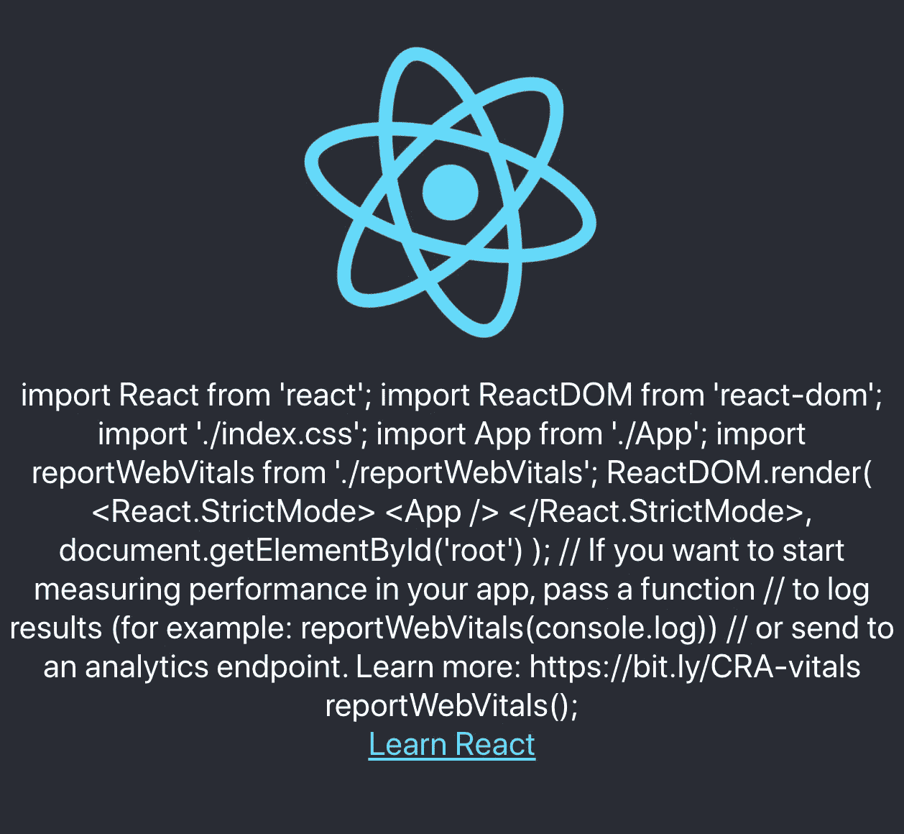

# JavaScript 编译时处理简介

> 原文：<https://betterprogramming.pub/an-introduction-to-javascript-compile-time-processing-f77571e71dfd>

## Babel 的插件宏和 codegen 为我们在编译时操作源代码提供了一个新的维度


图片鸣谢:作者。

在 JavaScript 中，我们可以在源代码中有一个静态值。比如从`0`开始的计数器。我们也可以在源代码中有一个动态值。例如，`new Date()`会在运行时返回当前时间对象。

但是我们能得到一个专门用于编译时处理的值吗(例如，我们想在编译这个版本的代码时显示一个时间戳)？

是的，我们可以。`[preval.macro](https://github.com/kentcdodds/preval.macro)`非常适合这种任务。

Babel 是一个 JavaScript transpiler。它使我们能够编写现代 JavaScript，并将其转换成 ES5 JavaScript。此外，Babel 插件可以在编译期间执行其他代码转换。对于我们的特定示例，它可以在编译时评估`new Date()`，并将生成的值交换到源代码的特定位置。

*   `[babel-plugin-macros](https://github.com/kentcdodds/babel-plugin-macros)`:定义一个标准接口，供库使用编译时代码转换。
*   `[babel-plugin-preval](https://github.com/kentcdodds/babel-plugin-preval)`:提供将编译时生成的值交换到 JavaScript 文件中的功能。
*   `[babel-plugin-codegen](https://github.com/kentcdodds/babel-plugin-codegen)`:提供将编译时生成的代码交换到 JavaScript 文件中的能力。

`preval.macro`是`babel-plugin-preval`的简单形式，`[codegen.macro](https://github.com/kentcdodds/codegen.macro)`是`babel-plugin-codegen`的简单形式。它们是易于使用的宏——一个用于值，一个用于代码。我们将举例说明如何在 JavaScript 代码中应用这些宏。

# preval.macro

`preval`是*预评估代码*的简称。

`macro`是在构建阶段定义文本替换的一种方式。

`preval.macro`是一个 Babel 插件，用于在编译期间预先评估代码。

和往常一样，我们从[创建 React 应用](https://medium.com/better-programming/10-fun-facts-about-create-react-app-eb7124aa3785)开始:

```
npx create-react-app my-app
```

然后，安装`preval.macro`:

```
npm install --save-dev preval.macro
```

我们可以在`package.json`的`[devDependencies](https://medium.com/better-programming/package-jsons-dependencies-in-depth-a1f0637a3129)`中看到新包装:

```
"devDependencies": {
  "preval.macro": "^5.0.0"
}
```

`preval.macro`将生成的值交换到源代码的特定位置。这个具体位置标记为`module.exports`，如下图修改后的`src/App.js`:

在第 12 行，[标记的模板文字](/manipulating-javascript-strings-using-template-literals-f7070412099f)显示`preval`是函数名，模板文字是`module.exports`的表达式。时间戳是在编译时计算的。`module.exports`与构建时计算的值交换。它在编译后的代码中变成一个静态值。

在第 14 行，时间戳在运行时被评估。该值将在程序运行时计算。

对于下面的截图，代码是在晚上 7:54:12 通过`npm run build`编译的。它于晚上 8 点 12 分 44 秒通过`serve -s build`发射。


这是另一种改进型`src/App.js`:

第 5-8 行在编译时读取`index.js`。带标签的模板文本显示`preval`是函数名(第 5 行)，模板文本有一个用于`module.exports`的表达式(第 7 行)。`module.exports`在构建期间与文件内容交换。它变成一个静态值并存储在变量`indexFile`中。

在运行时，`indexFile`值由下面截图中的第 15 行显示:



# codegen.macro

`codegen`是*代码生成器*的简称。

`codegen.macro`是一个在编译时生成代码的巴别塔插件。`codegen.macro`类似于`preval.macro`。`preval.macro`为数值，`codegen.macro`为代码。

安装`codegen.macro`:

```
npm install --save-dev preval.macro
```

我们可以在`package.json`的`[devDependencies](https://medium.com/better-programming/package-jsons-dependencies-in-depth-a1f0637a3129)`中看到新的包:

```
"devDependencies": {
  "codegen.macro": "^4.0.0"
}
```

这是改装过的`src/App.js`:

我们重用了第一个`preval.macro`示例，并添加了第 15-18 行。

在第 17 行，标记的模板文字显示`codegen`是函数名，模板文字是`module.exports`的表达式。

与`preval`不同，`codegen`的`module.exports`带字符串(代码以字符串引用)。在构建期间，字符串交换`module.exports`成为实际的代码。新嵌入的代码将在运行时执行。

对于下面的截图，代码是在晚上 7:54:38 通过`npm run build`编译的。晚上 8 点 13 分 57 秒通过`serve -s build`发射。

`codegen.macro`在晚上 7:54:38 生成代码。这个生成的代码在晚上 8:13:57 执行


`codegen`也可以是函数。

这是另一种改进型`src/App.js`:

在第 5 行，标记的模板文字显示`codegen`是函数名，模板文字是`module.exports`的表达式。它生成`double`函数来在编译时替换`module.exports`。这个函数在运行时在第 12 行执行。

下面是截图。`double`函数将五加倍为十:


# 牛逼的巴别塔宏

我们体验过巴别塔宏的威力。`preval.macro`和`codegen.macro`都很牛逼。

要不要试试更牛逼的宏？

查看令人敬畏的巴别塔宏库。

## 一般

*   `[param.macro](https://github.com/citycide/param.macro)`:JavaScript 的部分应用语法和 lambda 参数。灵感来源于 Scala 的`_`和 Kotlin 的`it`。
*   `[ms.macro](https://github.com/knpwrs/ms.macro)`:将各种时间格式转换为毫秒。
*   `[data-uri.macro](https://github.com/Andarist/data-uri.macro)`:将资产转换为[数据 URIs](https://developer.mozilla.org/en-US/docs/Web/HTTP/Basics_of_HTTP/Data_URIs) 。
*   `[regexgen.macro](https://github.com/Andarist/regexgen.macro)`:将一组字符串转换成优化的正则表达式。
*   `[tinker.macro](https://github.com/bradlc/tinker.macro)`:评估 Laravel 代码。
*   `[@lingui/macro](https://lingui.js.org/ref/macro.html)`:LinguiJS[中的国际化宏](https://github.com/lingui/js-lingui/)。
*   `[pipeline.macro](https://github.com/Andarist/pipeline.macro)`:类似流水线操作的宏。
*   `[paths.macro](https://github.com/storybookjs/paths.macro)`:将`__dirname`和`__filename`等路径作为静态值导入。
*   `[for-own.macro](https://github.com/nicolo-ribaudo/for-own.macro)`:让`for-in`只访问自己的属性。
*   `[files.macro](https://github.com/ridermansb/files.macro)`:将目录转换成文件名数组。
*   `[flavors.macro](https://github.com/gnithin/flavors.macro)`:通过操作导入头构建不同风格的应用。
*   `[yaml-to-js.macro](https://github.com/lorefnon/yaml-to-js.macro)`:在构建时将 YAML 模板字符串转换成 JavaScript 对象。
*   `[@ts-delight/pipe.macro](https://github.com/ts-delight/pipe.macro)`:支持异步步骤、附加参数、早期返回和协调的类型脚本友好的流畅管道 API。
*   `[@ts-delight/if-expr.macro](https://github.com/ts-delight/if-expr.macro)`:面向表达式的流畅替代 JavaScript 的`if`语句，编译成三元表达式。
*   `[@ts-delight/switch-expr.macro](https://github.com/ts-delight/switch-expr.macro)`:面向表达式的流畅替代 JavaScript 的`switch`语句，编译成三元表达式。
*   `[@ts-delight/async-to-generator.macro](https://github.com/ts-delight/async-to-generator.macro)`:将异步函数转换为生成器函数。
*   `[fast-fp.macro](https://github.com/rakeshpai/fast-fp.macro)`:零开销函数式编程库。
*   `[return.macro](https://github.com/proteriax/return.macro)`:JavaScript 中 Kotlin 的早期回归守卫`?: return`。

## 性能和内存管理

*   `[using.macro](https://github.com/Veetaha/using.macro)`:自动将你的资源句柄包装到`try-finally`块中，类似于 C# [使用声明](https://docs.microsoft.com/en-us/dotnet/csharp/language-reference/proposals/csharp-8.0/using#using-declaration)风格。
*   `[inline-loops.macro](https://github.com/planttheidea/inline-loops.macro)`:内联到本机循环以提高性能。
*   `[assign.macro](https://github.com/vincentriemer/assign.macro)` : Transpile `Object.assign`风格的表达式来指导赋值。

## 文件加载

*   `[lqip.macro](https://github.com/stereobooster/lqip.macro)`:在构建时创建 LQIP，类似于 webpack 的`[lqip-loader](https://github.com/zouhir/lqip-loader)`。
*   `[raw.macro](https://github.com/pveyes/raw.macro)`:应用网络包的`raw-loader`。
*   `[yaml.macro](https://github.com/eemeli/yaml.macro)`:将 YAML 文件作为预解析对象加载。
*   `[json.macro](https://github.com/ifiokjr/json.macro)`:单独或模式匹配加载 JSON 文件，特别支持`package.json`、version、tsconfig 文件。

## 对象/数组操作

*   利用对象获取器和图形，轻松转换对象。
*   `[idx.macro](https://github.com/dralletje/idx.macro)`:遍历对象和数组的属性。

## 以打字打的文件

*   `[typecheck.macro](https://github.com/vedantroy/typecheck.macro)`:自动生成类型脚本类型的类型检查函数。
*   `[ts-nameof.macro](https://github.com/dsherret/ts-nameof/tree/master/packages/ts-nameof.macro)`:打字稿中的`[nameof](https://msdn.microsoft.com/en-us/library/dn986596.aspx)`。

## 代码生成

*   `[preval.macro](https://github.com/kentcdodds/preval.macro)`:预评估代码。
*   `[codegen.macro](https://github.com/kentcdodds/codegen.macro)`:生成代码。
*   `[import-all.macro](https://github.com/kentcdodds/import-all.macro)`:导入所有匹配 glob 的文件。

## 发展

*   `[penv.macro](https://github.com/chengjianhua/penv.macro)`:根据构建环境选择指定的值或分支。
*   `[dev-console.macro](https://github.com/eemeli/dev-console.macro)`:从生产构建中移除所有`console.log`、`console.warn`和`console.error`调用。
*   `[babel-plugin-trace/macro](https://github.com/codemix/babel-plugin-trace)`:添加带有文件名和函数名前缀的带标签的语句日志帮助器。
*   `[inspect.macro](https://github.com/bgschiller/inspect.macro)`:将表达式及其结果记录到控制台。
*   `[require-context.macro](https://github.com/storybooks/require-context.macro)`:模拟 webpack 的`require.context()`。
*   `[@ts-delight/debug.macro](https://github.com/ts-delight/debug.macro)`:通过构建时增强，使 [visionmedia/debug](https://github.com/visionmedia/debug) 的使用更加方便。

## 反应

*   `[tersus-jsx.macro](https://github.com/davidyu85/Tersus-JSX)`:受 AngularJS、`ng-if`(使用`tj-if`)和`ng-repeat`(使用`tj-for`)的启发，让 React 中的 JSX 更加整齐。
*   `[tagged-translations](https://github.com/vinhlh/tagged-translations)`:翻译 React 应用程序中的文本。
*   `[svgr.macro](https://github.com/evenchange4/svgr.macro)`:应用 [SVGR](https://github.com/smooth-code/svgr) 。
*   `[css-to-rn.macro](https://github.com/jhen0409/css-to-rn.macro)`:将 CSS 转换为 React 原生样式表。
*   `[hooks.macro](https://github.com/yuchi/hooks.macro)`:自动反应钩子记忆失效。
*   `[inline-mdx.macro](https://github.com/hamlim/inline-mdx.macro)`:将 MDX 转换成内嵌组件。
*   `[react-broker/macros](https://github.com/jaredLunde/react-broker)`:惰性加载 React 组件。
*   `[rpi.macro](https://github.com/stereobooster/rpi.macro)`:用于`[react-precious-image](https://github.com/stereobooster/react-precious-image)`的宏。
*   `[mdi-norm/macro](https://github.com/eugeneilyin/mdi-norm#with-babel-macros)`:嵌入材质设计系统 SVG 图标。
*   `[reactive.macro](https://github.com/yesmeck/reactive.macro)`:减少反应样板。
*   `[@ts-delight/inject-display-name.macro](https://github.com/ts-delight/inject-display-name.macro)`:将显示名注入到动态构造的组件中。
*   `[react-css-modules.macro](https://github.com/bohdanbirdie/react-css-modules.macro)`:将 CSS 模块映射到`styleName`属性。

## CSS-in-JS

*   `[react-emotion/macro](https://emotion.sh/docs/babel-plugin-emotion#babel-macros)`:缩小并优化[情感](https://github.com/emotion-js/emotion)风格。
*   `[glamorous.macro](https://github.com/kentcdodds/glamorous.macro)`:给你的[迷人的](https://github.com/paypal/glamorous)组件一个好看的`displayName`用于 React DevTools。
*   `[styled-jsx/macro](https://github.com/vercel/styled-jsx#using-resolve-as-a-babel-macro)`:使用 [styled-jsx](https://github.com/vercel/styled-jsx) 的`resolve`标签。
*   `[styled-components/macro](https://www.styled-components.com/docs/tooling#babel-macro)`:改善调试体验，为样式化组件增加服务器端渲染支持。
*   `[styled-import/macro](https://github.com/glortho/styled-import)`:轻量级 CSS 解析器，用于从样式表中窃取规则。对于样式化组件、React 或任何其他可能在 JS 中使用 CSS 的地方——对于使用全局或第三方样式表特别有用。
*   `[unique-classname.macro](https://github.com/huchenme/unique-classname.macro)`:为情感生成唯一的类名。
*   `[twin.macro](https://github.com/ben-rogerson/twin.macro)`:作为宏的[顺风](https://tailwindcss.com/)的替代和更新解决方案。

## GraphQL

*   `[graphql.macro](https://github.com/evenchange4/graphql.macro)`:编译 GraphQL AST。
*   `[blade.macro](https://github.com/babel-blade/babel-blade)`:内联生成 GraphQL 查询字符串，解决[双重声明问题](https://babel-blade.netlify.com/docs/declarationdeclaration.html)。

# 结论

Babel 的插件宏和 codegen 为我们在编译时操作源代码提供了一个新的维度。它也被称为使用[抽象语法树](https://en.wikipedia.org/wiki/Abstract_syntax_tree) (AST)，这是编译器中广泛使用的数据结构，用于表示程序代码的结构。AST 是编译器语法分析阶段的结果，它对最终输出有很大的影响。

如果你对编写宏感兴趣，可以看看 Kent Dodds 的 [author markdown 页面](https://github.com/kentcdodds/babel-plugin-macros/blob/master/other/docs/author.md)。那里有很多关于 Babel 的插件宏和 codegen 的信息。

感谢阅读。我希望这有所帮助。你可以在这里看到我的其他媒体出版物。