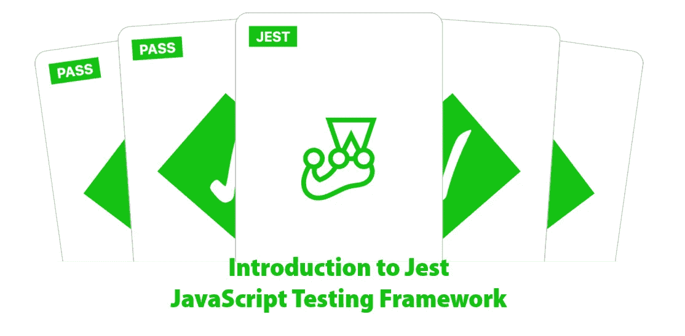
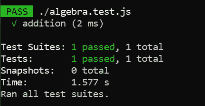
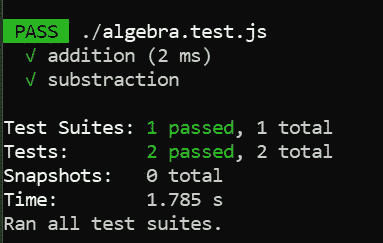
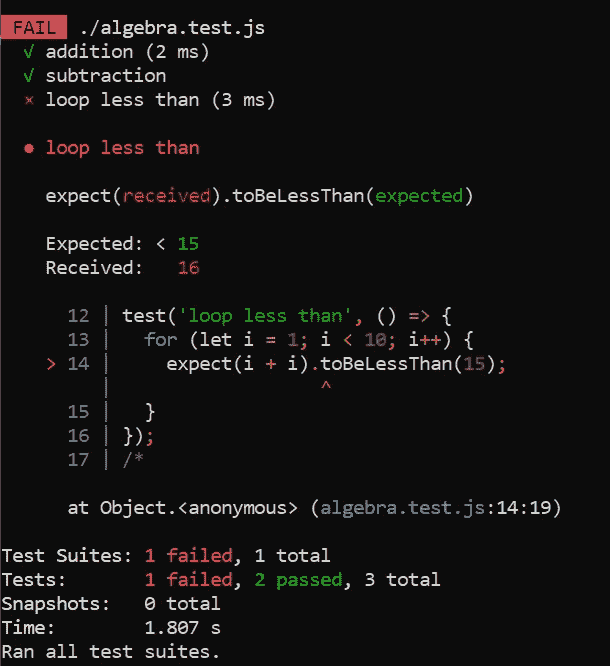

# Jest JavaScript 测试框架介绍

> 原文：<https://betterprogramming.pub/an-introduction-to-jest-javascript-testing-framework-b6677f0d30d>

## 适用于大多数 JavaScript 项目的开源测试工具包



Jest 官方 GitHub 页面上的徽标，由作者修改以包含附加文本

今天的主题是 Jest，这是一个 JavaScript 测试框架，可以方便地测试您的 JavaScript 项目。在撰写本文时，它提供了对 Babel、TypeScript、Node、React、Angular、Vue 以及更多的支持。

根据[官方文档](https://jestjs.io/docs/en/getting-started)，它提供以下功能:

*   快速安全
*   代码覆盖率
*   轻松嘲讽
*   伟大的例外

Jest 是一个非常棒的测试工具包，适用于正在寻找其他替代方案并拥有以下测试框架经验的开发人员:

*   自动话频警报器(automatic voice alarm)ˌ视听教具(audiovisual aids)
*   Expect.js
*   茉莉
*   摩卡
*   代理查询
*   应该. js
*   磁带

让我们进入下一部分，开始安装 Jest。

# 设置

根据您自己的喜好，通过 yarn 或 npm 安装非常简单。

## 故事

通过纱线安装 Jest，如下所示:

```
yarn add --dev jest
```

## npm

或者，您也可以使用 npm 来安装 Jest。

```
npm install --save-dev jest
```

## JavaScript 文件

让我们创建两个新的 JavaScript 文件作为测试的一部分:

*   `algebra.js`
*   `algebra.test.js`

以`.test.js`结尾的文件将成为 Jest 测试套件的一部分。您可以创建更多的测试文件，Jest 会自动将它们包含在测试中。

## 配置

如果您在一个新文件夹中重新开始，运行以下命令创建一个新的`package.json`文件。

```
npm init
```

然后在`package.json`中修改或包含以下内容

```
{
  "scripts": {
    "test": "jest"
  }
}
```

您的最终`package.json`应该如下:

# 基本用法

在这一节中，我们将在`algebra.js`中实现两个函数，并设置相应的测试脚本。

打开`algebra.js`，在里面添加以下代码。在文件的最后，调用`exports`来导出函数。稍后我们将在`algebra.test.js`内部调用它们。

## 创建测试脚本

接下来，转到`algebra.test.js`并添加下面的代码来导入我们之前定义的函数。

```
const {sum, subtract} = require('./algebra');
```

简单调用内置的`test`函数如下:

```
test('addition', () => {
  expect(sum(1, 2)).toBe(3);
});
```

断言是通过将任何函数包装在`expect`函数中，后跟任何预定义的[匹配器](https://jestjs.io/docs/en/using-matchers)来确定的。在本例中，我们使用了`toBe`作为匹配器，这意味着 Jest 期望返回的结果是 3。

`toBe`表示完全相等，因为它在内部使用了`Object.is`。如果你只是想测试一个对象的值，你应该使用`toEqual`。`toEqual`将递归检查一个对象的所有字段。

此外，您可以通过使用`not`否定测试或检查相反的值。举个例子，

```
test('addition', () => {
  expect(sum(1, 2)).toBe(3);
  expect(sum(2, 2)).not.toBe(3);
});
```

## 运行测试

一旦您对您的测试脚本感到满意，回到您的终端并运行

```
yarn test
```

或者

```
npm run test
```

您应该在终端中看到以下输出。



作者图片

Test Suites 表示测试的文件数量(以`test.js`结尾)。同时，Tests 表示进行的测试总数。让我们在`algebra.test.js`内部增加一个新的测试。

```
test('subtraction', () => {
  expect(subtract(1, 2)).toBe(-1);
});
```

运行测试时，将显示以下结果:



作者图片

# 比较数字

请注意`toBe`和`toEqual`的数字相同。你可以互换使用它们。此外，通过使用以下匹配器，您可以轻松地比较测试中的数字:

*   `toBeGreaterThan`
*   `toBeGreaterThanOrEqual`
*   `toBeLessThan`
*   `toBeLessThanOrEqual`

让我们看看下面的例子，它使用了一个循环，并检查最终值是否小于 20。

```
test('loop less than', () => {
  for (let i = 1; i < 10; i++) {
    expect(i + i).toBeLessThan(20);
  }
});
```

让我们将该值从 20 改为 15。当您运行测试时，您应该得到下面的错误日志。



作者图片

表示调用`toBeLessThan`时第 14 行断言失败。它期望返回值小于 15，但却得到了 16。正如您所看到的，它对于识别无效测试用例背后的问题非常有用和容易。

## 浮点

浮点比较应该通过`toBeCloseTo`来完成。这仅仅是因为任何舍入误差都会使测试用例无效。

```
test('compare floating number', () => {
  let value = 0.1 + 0.2;
  expect(value).toBeCloseTo(0.3);
});
```

# 比较字符串

## 正则表达式

Jest 支持通过正则表达式比较字符串。您需要做的就是调用`toMatch`函数并传入 regex 字符串。这里有一个例子来检查字符串`medium`是否出现在`welcome to medium`字符串中。

```
const text = 'welcome to medium'
test('string comparison', () => {
  expect(text).toMatch(/medium/);
});
```

您可以使用一个`RegExp`对象来代替正则表达式字符串符号。

```
expect(text).toMatch(new RegExp('medium'));
```

## 长度

另一方面，您也可以通过`toHaveLength`比较两个字符串之间的长度。

```
expect('abc').toHaveLength(3);
```

它也适用于数组。

```
expect([1, 2, 3]).toHaveLength(3);
```

# 比较数组

如果你想检查一个数组中是否有一个特定的条目，你应该使用`toContain`。下面的例子说明了如何检查`apple`是否出现在`fruits`数组中。

```
const fruits = ['apple', 'orange', 'papaya', 'banana', 'peach'];
test('check list', () => {
  expect(fruits).toContain('apple');
});
```

# 异步代码

根据您的需要，有多种方式来处理异步代码。

## 回收

处理回调最简单的方法是在调用回调函数时使用单个`done`参数。举个例子，

## 承诺

带有承诺的异步代码要容易得多，因为您需要做的就是返回承诺。看看修改后的例子:

```
test('test promise', () => {
  return getData().then(data => {
    expect(data).toBe('wfng');
  });
});
```

## 异步/等待

另一方面，使用 async/await 要简单得多。让我们重用前面的例子，并将其修改为使用 async/await。

```
test('test async', async () => {
  const data = await getData();
  expect(data).toBe('wfng');
});
```

## 例子

请注意，您可以在您的测试脚本中混合使用它们。让我们尝试使用`Promise`实现一个简单的例子。创建两个新的 JavaScript 文件:

*   `data.js`
*   `data.test.js`

在`data.js`中，将下面的代码添加到其中以创建一个通用的`getData`函数，该函数从一个 URL 获取数据。

然后打开`data.test.js`并在其中创建以下测试函数。

```
test('example promise', () => {
  return getData('https://httpbin.org/get?name=wfng').then(data => {
    expect(data.args.name).toBe('wfng');
  });
});
```

它将对`httpbin`进行 URL 调用，您应该会从中获得下面的`responseText`。

```
{
  "args": {
    "name": "wfng"
  }, 
  "headers": {
    "Accept": "text/html,application/xhtml+xml,application/xml;q=0.9,image/webp,*/*;q=0.8", 
    "Accept-Encoding": "gzip, deflate, br", 
    "Accept-Language": "en-US,en;q=0.5", 
    "Dnt": "1", 
    "Host": "httpbin.org", 
    "Upgrade-Insecure-Requests": "1", 
    "User-Agent": "Mozilla/5.0 (Windows NT 10.0; Win64; x64; rv:84.0) Gecko/20100101 Firefox/84.0", 
    "X-Amzn-Trace-Id": "Root=1-5fe85ce9-7d0b2686509d0aaf2cd7043a"
  }, 
  "origin": "180.129.116.68", 
  "url": "https://httpbin.org/get?name=wfng"
}
```

我们的测试案例是按如下方式比较`args.name`输出:

```
expect(data.args.name).toBe('wfng');
```

保存您的文件并重新运行测试。Jest 将对`algebra.test.js`和`data.test.js`进行测试。

# 结论

让我们回顾一下今天所学的内容。

我们首先简要解释了 Jest 背后的基本概念。我们还通过 yarn 或 npm 安装了必要的模块。

之后，我们创建了一个简单的测试脚本，并使用 Jest 成功运行了测试。对于数字、字符串和数组断言，我们使用了不同的匹配器。

我们还学习了处理异步代码，并使用 promise 实现了一个简单的例子。

最后，我们探索了如何将 Jest 与 [Selenium](https://www.selenium.dev/) 和 [Perfecto Smart Reporting](https://developers.perfectomobile.com/display/PD/Test+analysis+with+Smart+Reporting) 集成。这有助于简化我们项目的整个测试过程。

感谢你阅读这篇文章。希望在下一篇文章中再见到你！

# 参考

1.  [玩笑——入门](https://jestjs.io/docs/en/getting-started)
2.  [Jest——使用匹配器](https://jestjs.io/docs/en/using-matchers)
3.  [Jest —测试异步代码](https://jestjs.io/docs/en/asynchronous)
4.  [Perfecto — Jest 集成](https://developers.perfectomobile.com/display/PD/Jest)
5.  [Github — Jest Perfecto 示例](https://github.com/PerfectoMobileSA/Jest-perfecto-sample)