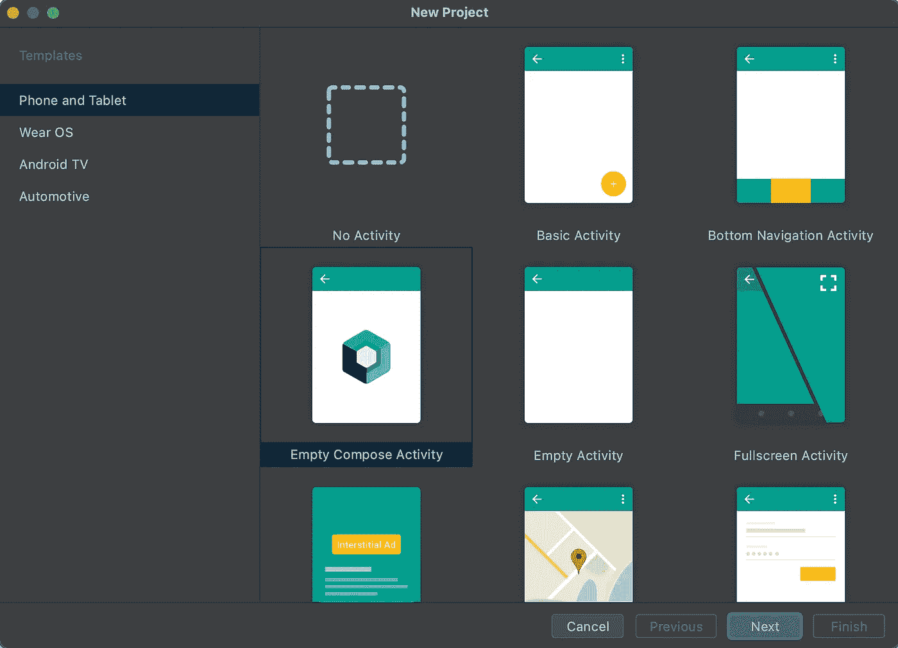
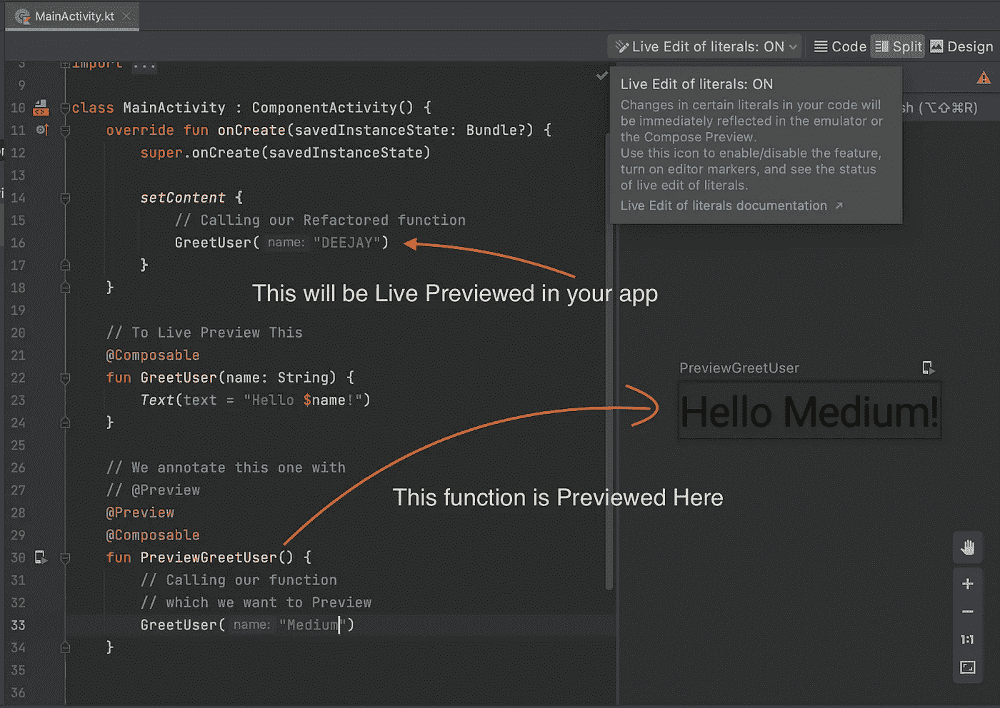
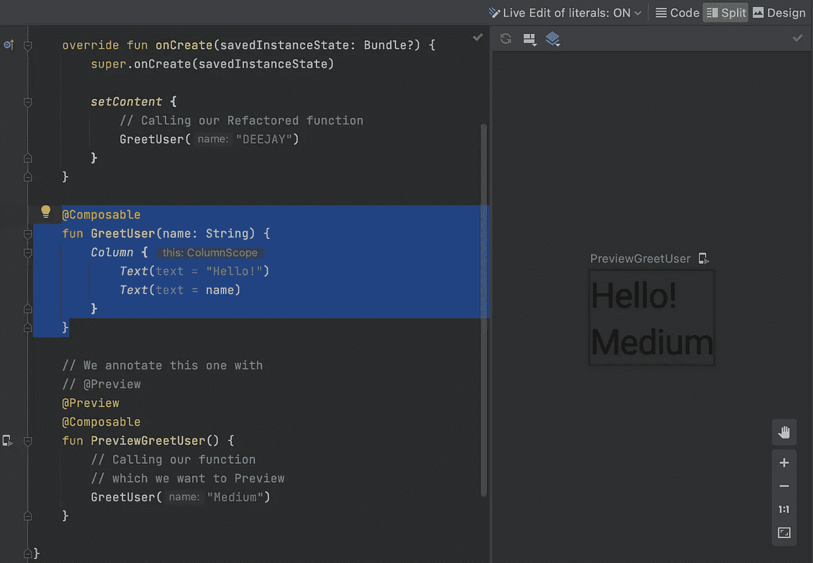
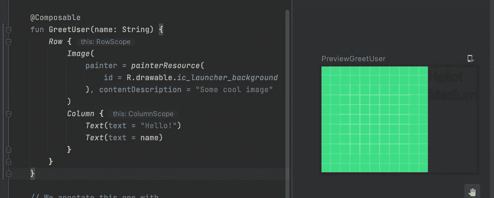
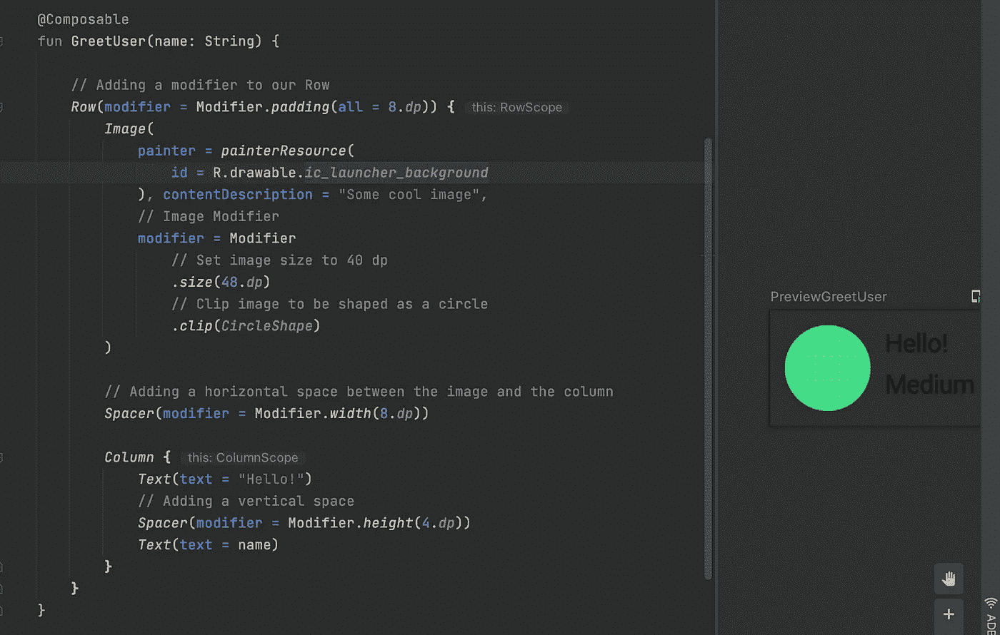
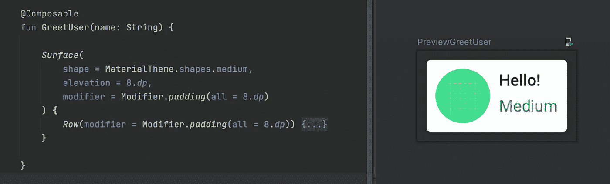
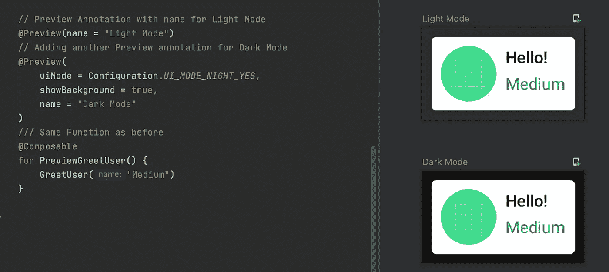

# Jetpack Composable 简介

> 原文：<https://betterprogramming.pub/an-introduction-to-jetpack-composable-1802083128cd>

## 谷歌给 Android 带来了最好的颤动。至少感觉是这样的


鸣谢:作者

早在开发原生 Android 应用的时候，我们使用 UI 的唯一选择就是 XML 文件。我们用 XML 创建 UI，并从我们的 Java 或 Kotlin 代码中扩充它们。我们必须处理 XML 属性和不同的布局。Android Studio 中的 UI composer 随着时间的推移变得越来越好，但仍然不完美。

当 Flutter 推出时，它是一种构建移动应用的新方式。我们只用一种编程语言——Dart 来定义我们的 UI 和应用程序逻辑。这在开始时有点新鲜，但随着我慢慢熟悉，它变得很有意义。

与我用 Android 的老方法相比，在 Flutter 中构建 UI 要简单、直观、快速得多。

快进到 2021 年，我们有了 Jetpack Compose，谷歌的意图是一样的——让在 Android 中构建 ui 变得简单、快速和直观。

在这个故事中，我将带您了解如何开始使用 Jetpack Compose。

# 1.Jetpack 撰写入门

*   让我们创建一个新的 Android Studio 项目。您可以从模板中选择“空撰写活动”。



*   你会得到一些示例代码，但我会从头开始，所以也许继续删除你已经看到这个初学者模板

*   `Text("...")`是 Kotlin 中的一个可组合函数。
*   Jetpack Compose 仅由可组合的函数组成，这些函数定义了您的小部件在屏幕上的外观。它不关心它的初始化或销毁，只关心它在屏幕上的样子。
*   可组合函数只能从其他可组合函数中调用。
*   让我们创建自己的可组合函数。我将把文本重构为另一个名为`GreetUser`的可组合函数:

*   现在，要在你的应用程序中预览它，你必须再次运行应用程序，但是 composable 带来了一些非常令人兴奋的东西。在颤振中，我们有热装弹。这里我们有一个类似的叫做实时预览的东西。
*   为了实时预览我们的可组合函数的输出，我们必须创建另一个函数，并用`@Preview`注释该函数。

*   `PreviewGreetUser`函数只通过传递正确的参数来调用`GreetUser`函数。它唯一的职责就是预览`GreetUser`功能。



# 2.了解布局

*   与 Flutter 类似，我们通过嵌套可组合函数来构建更复杂的布局。
*   要垂直对齐两个`Text`小部件，我们可以这样做:

```
@Composable
fun GreetUser(name: String) {
    *Column* {
        *Text*(text = "Hello!")
        *Text*(text = name)
    }
}
```

*   现场预览发挥其魔力:



*   让我们在`Row`中增加一个`Image`:



*   您现在看到的是所有这些元素的默认样式。
*   我们可以使用修改器来修改样式:

```
// To add padding to our Row:*Row*(modifier = Modifier.*padding*(all = 8.*dp*)) {...}
```

*   同样，让我们为我们的`Image`、`Text`和`Columns`添加修饰符。



# 3.更好的可组合设计

构建 Compose 是为了支持 Google 的材料设计原则。它的许多 UI 元素实现了开箱即用的材料设计，这使得事情变得非常优雅。

材料设计有三大支柱:

*   颜色
*   排印
*   形状

因为我们还没有添加任何样式，所以默认情况下，Compose 为我们可以自定义的小部件添加了一个默认主题。

## 1.颜色；色彩；色调

*   向我们的图像小部件添加边框:

```
modifier = Modifier
    .*size*(48.*dp*)
    .*clip*(*CircleShape*)
    .*border*(1.*dp*, MaterialTheme.colors.secondary, *CircleShape*)
```

*   为我们的`Text`小部件添加颜色:

```
*Text*(text = name, color = MaterialTheme.colors.secondaryVariant)
```

## 2.排印

*   让我们为两个`Text`小部件定义两种不同的文本样式:

```
*Text*(text = "Hello!", style = MaterialTheme.typography.subtitle2)
```

和

```
*Text*(
    text = name,
    color = MaterialTheme.colors.secondaryVariant,
    style = MaterialTheme.typography.body2
)
```

以下是实时预览向我们展示的内容:


## 3.形状

要自定义小部件的形状，请用 Surface 包装它。

让我们用一个`Surface`包装我们的父`Row`，并给它添加一些填充和高度:

```
*Surface*(
    shape = MaterialTheme.shapes.medium,
    elevation = 8.*dp*,
    modifier = Modifier.*padding*(all = 8.*dp*)
) {
     Row(...)
  }
}
```



## 4.支持黑暗模式很容易

现在我们要预览亮模式和暗模式。我们所要做的就是添加另一个`Preview`注释并定义我们的配置:

这将为我们生成两个实时预览:



## 5.构建小部件列表

在 Android 中构建一个小部件的动态列表并不容易，尤其是在我们必须定义 RecyclerView 适配器、Viewholder 类的地方。

在 Flutter 中，处理长列表非常优雅。让我们看看在 Composables 中使用列表有多简单。

*   获取[样本列表数据](https://gist.github.com/yrezgui/26a1060d67bf0ec2a73fa12695166436)，随意使用自己的东西。
*   重命名我们的`GreetUser`函数，并修改它以适应消息的标题和正文。

*   使用`LazyColumn`函数根据列表项生成动态小部件。

## 6.改编

与 Flutter 类似，我们的 composable 也可以持有自己的状态，并且小部件将根据状态的变化而重新绘制。这叫做重组。

*   让我们添加一个变量来保存小部件中的状态。在我们的`ChatCard()`里面:

```
var isExpanded by *remember* { *mutableStateOf*(false) }
```

*   现在，让我们使`ChatCard`内部的`Column`可点击。让我们通过在`Column()`中添加一个可点击的修饰符来实现。

```
*Column* (modifier = Modifier.*clickable* { isExpanded = !isExpanded }) { ... }
```

*   现在让我们点击时展开`ChatCard`中的文本。

```
*Text*(
    text = body,
    color = MaterialTheme.colors.secondaryVariant,
    style = MaterialTheme.typography.body2,
    maxLines = if (isExpanded) Int.MAX_VALUE else 1,
)
```

*   就是这样！每次你点击每个项目，`isExpanded`属性就会被切换，根据它的值，`Text`小工具的`maxLines`属性也会被切换。

使用 composable 很有趣。随着时间的推移，它肯定会赶上来，而且随着越来越多的开发者为平台做出贡献，其他人也就越容易掌握它。

在下一个故事中，我们将更深入地研究 composable，构建更漂亮的 ui。

感谢阅读！