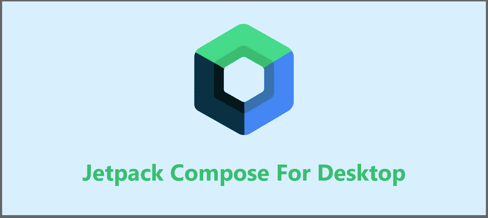
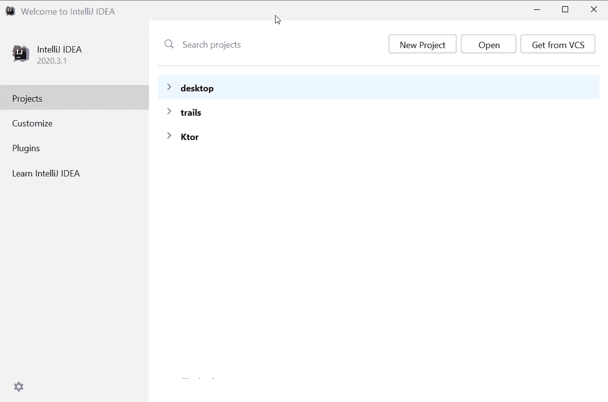
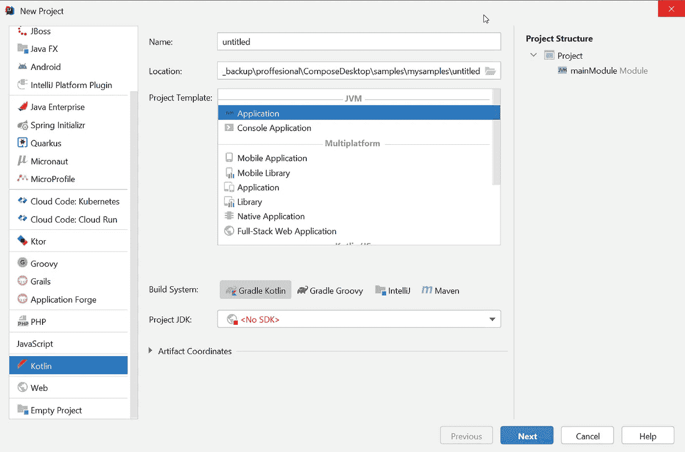
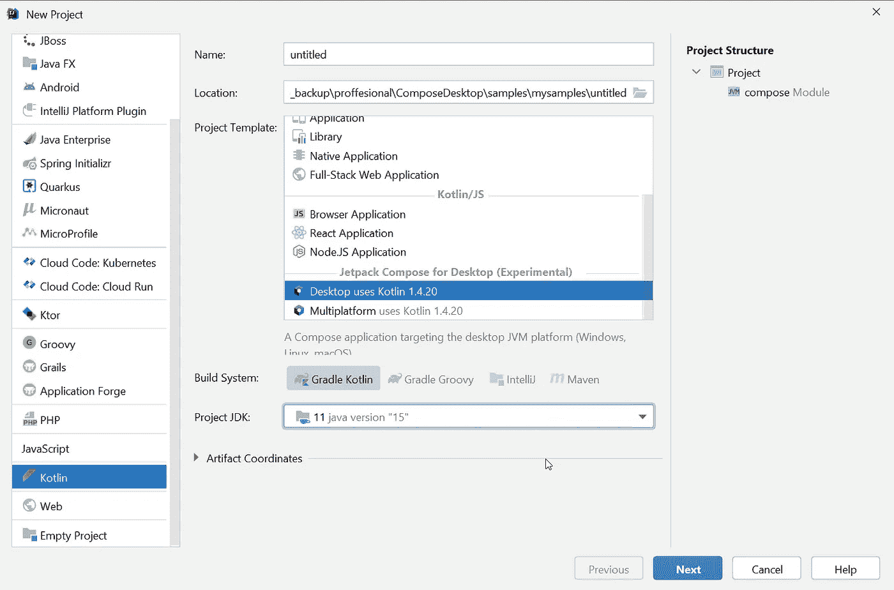
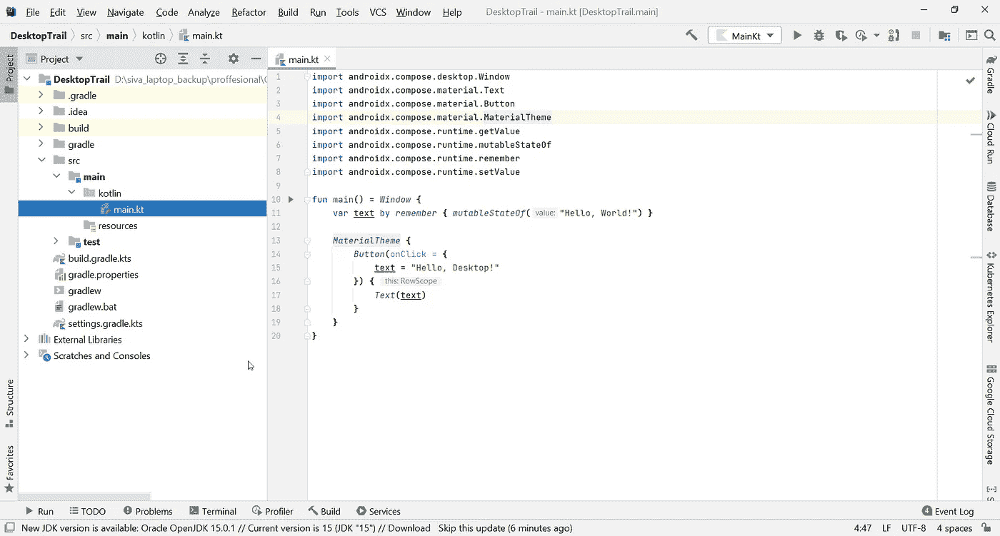
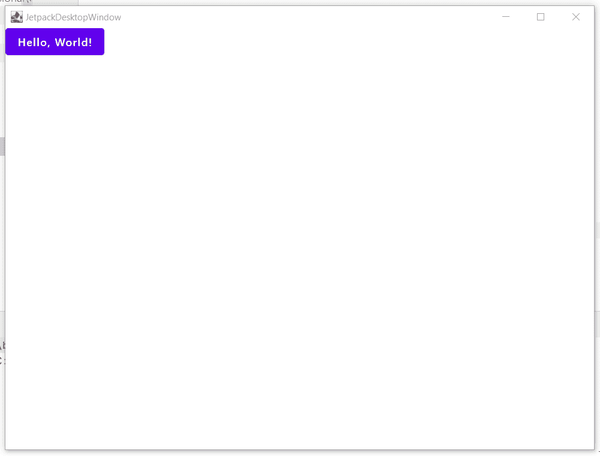

# 桌面版 Jetpack Compose 简介

> 原文：<https://betterprogramming.pub/an-introduction-to-jetpack-compose-for-desktop-5c3bf8629dc5>

## 在您的 Windows 应用中使用强大的 Android 框架



作者照片。

到目前为止，我们只在 Android 开发中看到过 [Jetpack Compose](https://developer.android.com/jetpack/compose) 。今天，我们进入了一个新的阶段，JetBrains 宣布了 IntelliJ 的早期版本，允许您使用 Jetpack Compose 来构建 Windows 应用程序。

这是我将在未来几天写的许多文章的第一篇，解释如何使用 Jetpack Compose for desktop。上个月，JetBrains 发布了 Compose for desktop Milestone 2，带来了更好的开发体验和互操作性。

一如既往，JetBrains 试图通过提供独家项目向导来缓解开发人员的生活。在 IntelliJ 的早期版本中，他们添加了一个桌面项目向导来在几秒钟内配置项目。

首先从开发开始，您需要安装 IntelliJ IDEA 2020.3:

[](https://www.jetbrains.com/idea/whatsnew/#section=mac) [## IntelliJ IDEA - 2020.3 的新功能

### IntelliJ IDEA 欢迎屏幕已经过重新设计。初始向导已被快速访问屏幕取代…

www.jetbrains.com](https://www.jetbrains.com/idea/whatsnew/#section=mac) 

# 项目模板快速入门

正如我前面所说的，IntelliJ 最好的一点是项目模板。安装 IDE 后，启动应用程序。您将看到以下窗口:



然后单击顶部栏中的“新建项目”按钮，这将带您到选择应用程序类型的窗口。看看“新项目”窗口:



首先，我们需要从左侧菜单中选择 Kotlin。然后更新项目名称和位置。之后，我们需要选择项目模板。这是配置适当项目的重要部分。我们需要从项目模板列表中选择桌面模板，您可以在向下滚动时找到它。然后你需要选择项目 JDK。我建议选择 JDK 11 号。



然后单击“下一步”按钮，这将把您带到带有撰写模块的确认窗口。现在单击“Finish”按钮，IntelliJ 将通过自动下载适当的 gradle 为您设置项目。

# 运行您的第一个桌面应用程序

如果一切按预期进行，桌面项目设置将会成功，您将会看到以下设置:



此时，您可以运行应用程序了。由于某种原因，右上角“运行”按钮旁边的`Main.kt`没有被默认选中，所以它会要求你配置项目。要解决这个问题，您需要点击`Main.kt`文件中主函数旁边的绿色“Run”按钮。

成功运行后，您将看到以下输出，其中有一个按钮包含“Hello，World！”文字。如果你点击它，按钮里面的文字会变成“你好，桌面！”看一看:



# 探索代码

正如您所看到的，这是一个简单的 Hello World 程序，并不复杂。大部分代码类似于 Android 应用程序的 Jetpack Compose UI。

`Main.kt`是包含与输出相关的代码的 Kotlin 文件。它有 main 函数，是应用程序运行的入口点。代码从`Window`函数开始，打开一个包含给定内容的窗口。初始配置窗口属性需要几个参数，如`title`、`size`、`location`、`centered`、`content`等。

```
fun main() = ***Window* {**}
```

在这种情况下，我们将只把值传递给内容参数，其余的参数保留默认值。在下一步中，我们声明了一个具有`remember`功能的`text`变量和初始值`Hello, World!`。看一看:

```
fun main() = *Window* { var **text** by ***remember* {** *mutableStateOf*("**Hello, World!**") **}**}
```

在声明式 UI 系统中，代码本身描述了 UI。我们需要描述任何时间点的 UI——不仅仅是初始时间。我们使用`remember`作为文本在视图中显示的状态，比如按钮、文本字段等等。当我们将来更新这个`text`变量时，与这个变量相关的视图也将更新显示文本。

为了更好地理解它，我建议阅读下面的文章:

[](https://medium.com/better-programming/jetpack-compose-components-part-2-2b3eb135d294) [## Jetpack 合成组件(第 2 部分)

### 查看图标、图像、记忆、间隔、单选按钮、加载器、开关和复选框以及滑块

medium.com](https://medium.com/better-programming/jetpack-compose-components-part-2-2b3eb135d294) 

代码的下一部分是定义一个具有点击功能的按钮，并将材质主题应用于窗口。看一看:

# 结论

Jetpack Compose 在桌面和 Android 上都处于非常早期的阶段，但它仍然显示了构建 UI 的巨大进步。像 Jetpack Compose 这样具有 Kotlin 强大功能的框架将提高开发人员的生产力，并为他们提供一种在不同平台上工作的方式。

像 [Gurupreet Singh](https://twitter.com/_gurupreet) 这样的开发人员在 Compose 发布中非常活跃，并且正在创建有价值的资源(比如 [ComposeCookBook](https://github.com/Gurupreet/ComposeCookBook) )来帮助其他开发人员。他还从 Compose Android 应用程序中创建了 Spotify 桌面克隆版,这给了我很多灵感。

# 奖金

如果您不熟悉 Jetpack Compose，请从这里开始:

*   [“Jetpack Compose——一种在 Android 中创建素材 UI 的简单新方法”](https://medium.com/better-programming/jetpack-compose-a-new-and-simple-way-to-create-material-ui-in-android-f49c6fcb448b)
*   [“JetPack 与服务器驱动的用户界面相结合”](https://medium.com/android-dev-hacks/jetpack-compose-with-server-driven-ui-396a19f0a661)
*   [“Jetpack Compose:如何构建消息应用”](https://medium.com/better-programming/jetpack-compose-how-to-build-a-messaging-app-e2cdc828c00f)

目前就这些。希望你学到了有用的东西。感谢阅读。