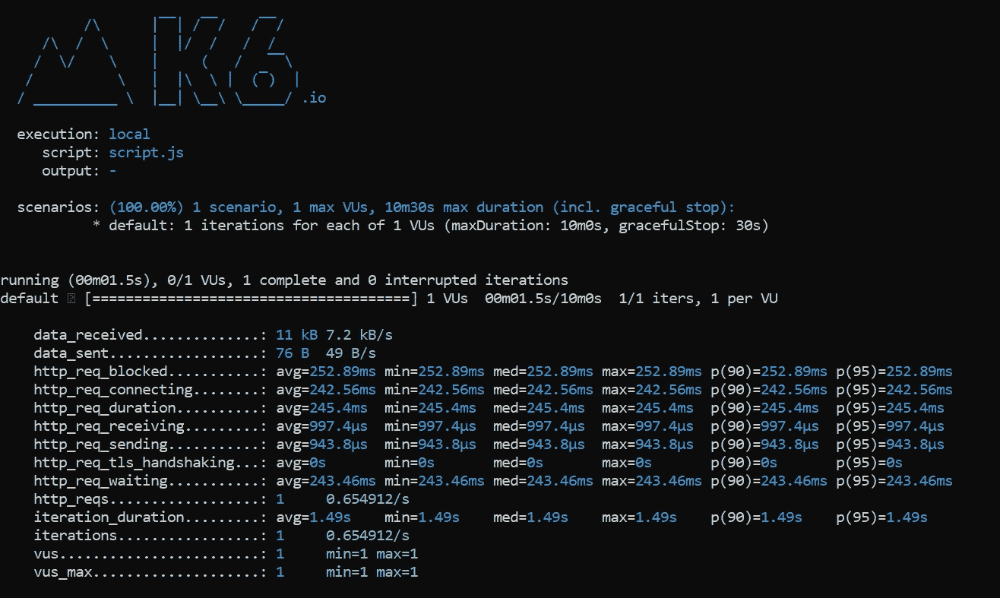
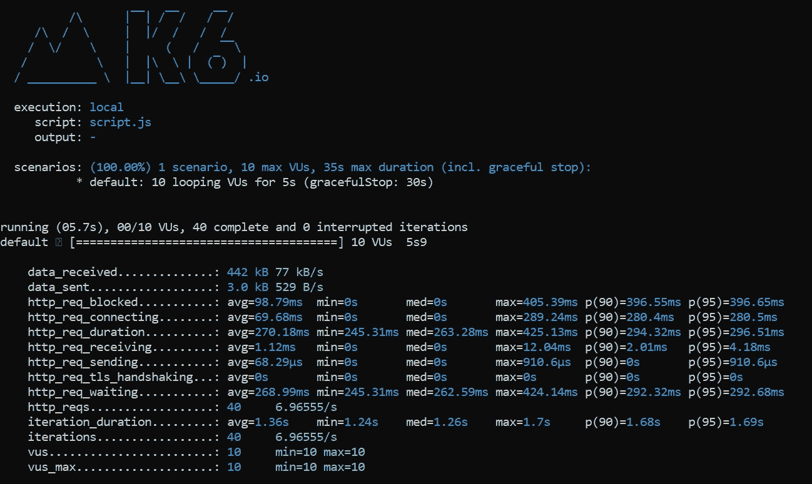

# k6 简介:一个 API 负载测试工具

> 原文：<https://betterprogramming.pub/an-introduction-to-k6-an-api-load-testing-tool-132a0d87827d>

## 建立一个可以处理你的流量的 API


照片由[埃文·克劳斯](https://unsplash.com/@evankrause_?utm_source=unsplash&utm_medium=referral&utm_content=creditCopyText)在 [Unsplash](https://unsplash.com/s/photos/load?utm_source=unsplash&utm_medium=referral&utm_content=creditCopyText) 上拍摄

通过阅读这篇文章，您将学会使用一个名为 k6 的免费开源负载测试工具在 RESTful API 上执行负载和压力测试。k6 以前被称为负载影响，是一个成熟的工具，用于:

*   **冒烟测试** —验证您的系统在最小负载下不会抛出错误
*   **负载测试—** 评估系统在正常负载和峰值负载下的性能
*   **压力测试** —验证您的系统在高负载或极端条件下的可靠性和稳定性
*   **峰值测试** —评估流量突然激增时系统的性能
*   **浸泡测试** —长期验证您系统的可靠性和稳定性

如果你喜欢用 JavaScript 编写测试脚本，k6 是一个很好的工具。此外，它也有对[类型脚本](https://github.com/k6io/template-typescript)的模板支持。您甚至可以从 OpenAPI 或 Postman 生成测试脚本。

让我们继续下一节的设置和安装。

# 设置

安装非常简单，尽管这在一定程度上取决于你机器的操作系统。

## Windows 操作系统

k6 自带面向 Windows 用户的 MSI 安装程序。只需通过下面的链接下载安装程序。正常安装，你就可以开始了。

*   [k6 安装器](https://dl.k6.io/msi/k6-latest-amd64.msi)

## 苹果个人计算机

对于 Mac 用户，最简单的方法是运行以下命令:

```
brew install k6
```

## Debian/Ubuntu

在您的终端中运行以下命令，通过`apt-get`进行安装。

```
sudo apt-key adv --keyserver hkp://keyserver.ubuntu.com:80 --recv-keys C5AD17C747E3415A3642D57D77C6C491D6AC1D69echo "deb [https://dl.k6.io/deb](https://dl.k6.io/deb) stable main" | sudo tee /etc/apt/sources.list.d/k6.listsudo apt-get updatesudo apt-get install k6
```

如果由于防火墙或代理而无法获得密钥，请尝试以下替代方法:

```
curl -s [https://dl.k6.io/key.gpg](https://dl.k6.io/key.gpg) | sudo apt-key add -
```

## 红帽/CentOS

您可以通过以下命令安装 k6(对于旧版本，使用 dnf 或 yum):

```
sudo dnf install [https://dl.k6.io/rpm/repo.rpm](https://dl.k6.io/rpm/repo.rpm)sudo dnf install k6
```

在版本 8 之前的 CentOS 上安装时，您需要禁用验证:

```
sudo yum install --nogpgcheck k6
```

# 测试生命周期

在这一部分，我们将学习 k6 背后的基本概念。每个 k6 测试由四个不同的生命周期组成:

*   `init`
*   `setup`
*   `VU`(虚拟用户)
*   `teardown`

k6 要求每个测试脚本包含至少一个`default`函数，代表`VU`代码的入口点。`VU`会反复调用`VU`代码，直到所有条件都满足。

另一方面，`init`代码每`VU`只运行一次。除此之外，`setup`和`teardown`循环在每个测试中只被调用一次——在整个测试生命周期的开始和结束。

你可能想知道`init`和`setup`之间的区别。与`init`不同，您实际上可以在`setup`和`teardown`中调用所有的 k6 APIs，比如 HTTP 请求。例如，您可以在`setup`代码中进行调用，以获得将在`VU`代码中使用的令牌。

# HTTP 请求

## HTTP GET 请求

您可以利用内置的`http`模块来定义您的第一个测试用例。在您的工作目录中创建新的 JavaScript 文件。我就叫它`script.js`吧。然后，添加以下代码，它代表一个简单的 GET 请求:

```
import http from 'k6/http';
import { sleep } from 'k6';export default function () {
  http.get('http://example.com/test');
  sleep(1);
}
```

每个`VU`将从头到尾依次执行默认函数内的代码。一旦它到达终点，它就会返回，这个过程将会再次重复。

在默认函数的末尾添加一个`sleep`语句来加快 VUs 的速度总是一个好主意。这模拟了真实用户如何使用你的系统。您可以将该值设置为更低的`0.1`来模拟攻击行为。如果您打算模拟不断调用您的 API 的用户，只需删除`sleep`语句。

如果你目前没有 API，只想测试 k6，可以使用 k6 提供的以下测试 API:

```
http://test.k6.io
```

在您的终端中运行以下代码:

```
k6 run script.js
```

## 结果输出

您应该在终端中看到以下输出



作者图片

默认情况下，k6 将在您每次运行测试时收集以下指标:

*   `vus` —活跃虚拟用户数量
*   `vus_max` —分配给测试的最大虚拟用户数
*   `iterations` —调用`default`函数的总次数
*   `iteration_duration` —执行`default`功能所花费的总时间
*   `dropped_iterations` —无法启动的`iterations`数量
*   `data_received` —接收的数据量
*   `data_sent` —发送的数据量
*   `checks` —成功检查的比率(将在后面讨论)

此外，如果您调用 HTTP 请求，它还会生成以下输出:

*   `http_reqs` —K6 生成的请求总数
*   `http_req_blocked` —发起请求前等待空闲 TCP 连接所花费的时间
*   `http_req_connecting` —建立 TCP 连接花费的时间
*   `http_req_tls_handshaking` —花费在 TLS 握手上的时间
*   `http_req_sending` —发送数据花费的时间
*   `http_req_waiting` —等待远程主机响应所花费的时间
*   `http_req_receiving` —接收数据花费的时间
*   `http_req_duration` —请求的总时间。根据`http_req_sending` + `http_req_waiting` + `http_req_receiving.`计算

您也可以指定其他参数。只需运行以下命令即可获得可用参数的完整列表:

```
k6 help
```

## 可用的 HTTP 方法

在撰写本文时，k6 附带了以下 HTTP 方法。

*   `[batch](https://k6.io/docs/javascript-api/k6-http/batch-requests)` —并行的多个 HTTP 请求
*   `[del](https://k6.io/docs/javascript-api/k6-http/del-url-body-params)` —删除请求
*   `[get](https://k6.io/docs/javascript-api/k6-http/get-url-params)` —获取请求
*   `[options](https://k6.io/docs/javascript-api/k6-http/options-url-body-params)` —选项请求
*   `[patch](https://k6.io/docs/javascript-api/k6-http/patch-url-body-params)` —补丁请求
*   `[post](https://k6.io/docs/javascript-api/k6-http/post-url-body-params)` —发布请求
*   `[put](https://k6.io/docs/javascript-api/k6-http/put-url-body-params)` —上传请求
*   `[reques](https://k6.io/docs/javascript-api/k6-http/request-method-url-body-params)` — 发出任何类型的 HTTP 请求

## HTTP POST 请求

这里再举一个`HTTP POST`的例子，它把 JSON 数据作为它的输入参数。

如果您要在表单数据提交上测试它。只需将内容类型更改为`application/x-www-form-urlencoded`。

# 选择

事实上，在命令行中运行 k6 时，您可以指定额外的参数。例如，以下命令将使用 10 个 vu 运行测试。

```
k6 run --vus 10 script.js
```

话虽如此，您也可以在代码中指定这样的选项——为您提供更好的控制。让我们使用第一个例子，但这一次，我们将用 10 个持续时间为 5 秒的 vu 来测试它。

```
import http from 'k6/http';
import { sleep } from 'k6';export let options = {
  vus: 10,
  duration: '5s',
};export default function () {
  http.get('http://example.com/test');
  sleep(1);
}
```

然后，您可以使用以下命令正常运行它:

```
k6 run script.js
```

以下输出将显示在您的终端上。



作者图片

测试 API 的一个好方法是提升和降低 VU 水平。下面的代码演示了如何将其配置为分阶段运行。

```
export let options = {
  stages: [
    { duration: '10s', target: 20 },
    { duration: '1m10s', target: 10 },
    { duration: '10s', target: 0 },
  ],
};
```

*   前 10 秒从 1 到 20 VUs
*   在接下来的 70 秒内缓慢过渡到 10 VUs
*   在最后 10 秒钟内从 10 到 0 VUs

## 选项(负载测试)

对于负载测试，您应该将 VU 提升到一个合适的值，并在将其降低到 0 之前保持一段固定的时间。看看下面这个例子，用了 100 个 vu。

```
export let options = {
  stages: [
    { duration: '5m', target: 100 },
    { duration: '10m', target: 100 },
    { duration: '5m', target: 0 },
  ],
};
```

## 选项(压力测试)

另一方面，压力测试涉及一段时间内 VUs 的不断增加。您可以从 100 个 vu 开始，然后每次递增 100 个 vu。然后，你把它作为恢复阶段的一部分。

```
export let options = {
  stages: [
    { duration: '1m', target: 100 },
    { duration: '5m', target: 100 },
    { duration: '1m', target: 200 },
    { duration: '5m', target: 200 },
    { duration: '1m', target: 300 },
    { duration: '5m', target: 300 },
    { duration: '1m', target: 400 },
    { duration: '5m', target: 400 },
    { duration: '5m', target: 0 },
  ],
};
```

## 选项(峰值测试)

峰值测试的目的是在短时间内用突然激增的负载淹没您的系统。您可以按如下方式轻松配置它:

```
export let options = {
  stages: [
    { duration: '10s', target: 100 },
    { duration: '2m', target: 100 },
    { duration: '10s', target: 1000 },
    { duration: '2m', target: 1000 },
    { duration: '10s', target: 100 },
    { duration: '2m', target: 100 },
    { duration: '10s', target: 0 },
  ],
};
```

请注意，我在 10 秒的时间框架内从 100 个 vu 增加到 1000 个 vu。当用户突然激增时，这有助于评估我们系统的性能。

# 检查

k6 为您提供了一种断言返回响应的方式。叫`check`。请注意`check`不会停止执行。

## HTTP 响应

供您参考，每个 HTTP 方法都将返回包含以下内容的 HTTP 响应:

*   `body`
*   `headers`
*   `status`
*   `timings`
*   `timings.blocked`
*   `timings.connecting`
*   `timings.tls_handshaking`
*   `timings.sending`
*   `timings.waiting`
*   `timings.receiving`
*   `timings.duration`

## 检查状态是否为 200

最有用的字段是`body`和`status`。您可以简单地将返回的 HTTP 响应赋给一个变量，并检查它的状态是否为`200`，如下所示:

```
import { check } from 'k6';
import http from 'k6/http';export default function () {
  let res = http.get('http://example.com/test');
  check(res, {
    'is status 200': (r) => r.status === 200,
  });
}
```

# 结论

让我们回顾一下今天所学的内容。

我们从在基于操作系统的本地机器上安装 k6 开始。

接下来，我们探索了 k6 背后的基本概念——像测试生命周期这样的主题，它由四个部分组成。

我们继续基于 k6 提供的内置`http`模块创建一个简单的测试脚本。这允许我们调用不同的 HTTP 方法来测试我们的 API。

之后，我们学习了配置选项来设置负载测试、压力测试甚至峰值测试。此外，我们还学习了如何通过`check`函数配置断言并将其添加到代码中。

感谢您的阅读——我希望在下一篇文章中再次见到您！

# 参考

*   [k6 文档](https://k6.io/docs/)
*   [k6 GitHub](https://github.com/loadimpact/k6)
*   [k6 示例](https://k6.io/docs/examples)