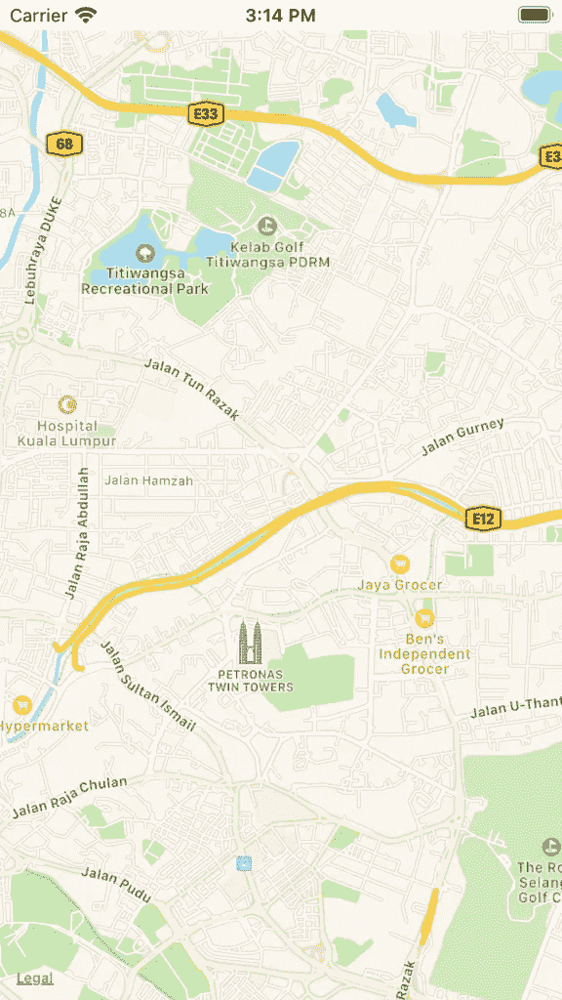
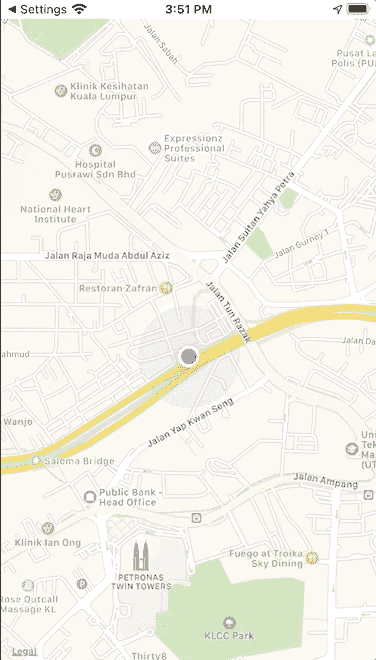
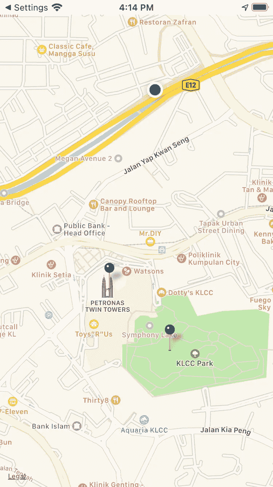

# SwiftUI 中的地图介绍

> 原文：<https://betterprogramming.pub/an-introduction-to-map-in-swiftui-ec3a310fcbbd>

## 苹果终于给了我们一个简单的方法在我们的应用程序中显示地图


[Tabea Damm](https://unsplash.com/@tabeadamm?utm_source=medium&utm_medium=referral) 在 [Unsplash](https://unsplash.com?utm_source=medium&utm_medium=referral) 上拍照。

苹果改进了 iOS 上的`Map`体验，提供了对位置隐私的更多控制。考虑到这一点，当我得知苹果推出了`Map`时，我真的很惊讶。我很确定他们已经发布了它，但是一查，它实际上是`MapView`。

我对比了一下`Map`和`MapView`，发现`MapView`其实是为了 UIKit，而`Map`是为了 SwiftUI。

请记住，如果您使用`Map`，您将支持的操作系统是 iOS 14+。对于`MapView`来说是 iOS 3+。

> *“显示嵌入式地图界面的视图。”——*[*苹果开发者*](https://developer.apple.com/documentation/mapkit/map?language=_1)

# 先决条件

要学习本教程，您需要了解以下方面的一些基本知识:

*   迅速发生的
*   至少 Xcode 12+

# 地图

让我们深入了解一下`Map`的能力。你可以选择一个地点来展示，我正在使用马来西亚的马来西亚国家石油公司双塔——世界上最高的双塔。

您可以通过指示一个位置的纬度和经度来开始创建`MKCoordinateRegion`。`MKCoordinateSpan`被用作地图的缩放级别，较小的值对应较高的缩放级别。

```
@State private var region = MKCoordinateRegion(center: CLLocationCoordinate2D(latitude: 3.164557, longitude: 101.713423), span: MKCoordinateSpan(latitudeDelta: 0.03, longitudeDelta: 0.03))
```

对于创建的区域，您可以将它传递到`Map`:

```
Map(coordinateRegion: $region)
```

这就是你创建地图的方式:



# 当前位置

现在获取用户的当前位置要容易得多，但是有一些需要注意的事项。

`MapInteractionMode`允许用户缩放、平移或缩放和平移。目前，用户只允许缩放，不允许平移。

`MapUserTrackingMode`允许你通过跟随用户的位置进行更新或者根本不更新。正在使用`@State private var trackingMode = MapUserTrackingMode.follow`跟踪用户。

```
Map(coordinateRegion: $region, interactionModes: .zoom, showsUserLocation: true, userTrackingMode: $trackingMode)
```



# 地图注释

包含注释也容易多了。我希望苹果公司能尽快提供更多的指导。

无论如何，你可以创建一个这样的模型。这些是注释的坐标:

现在您只需要获得注释:

```
@State private var locations: [Location] = Location.getLocation()
```

插入注释，获得每个注释的坐标，它们将出现在地图上:

```
Map(coordinateRegion: $region, interactionModes: .all, showsUserLocation: true, userTrackingMode: $trackingMode, annotationItems: locations) { (location) -> MapPin in
    MapPin(coordinate: location.coordinate, tint: .black)
}
```

